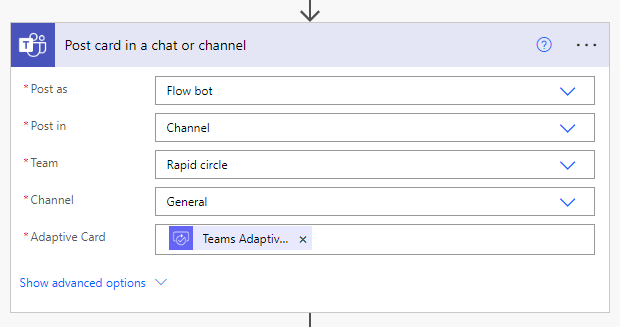
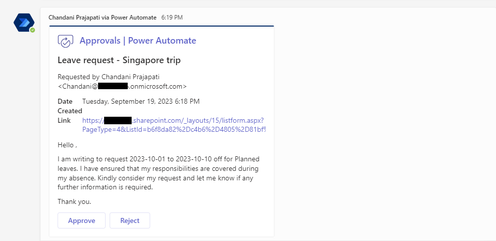

---
title: "Send Approval In Microsoft Teams Using Power Automate"
date: 2023-09-22T12:35:42.254Z
author: "Chandani Prajapati"
githubname: chandaniprajapati
categories: ["Community post"]
images:
- images/output.png
tags: ["Power Automate", "Microsoft Teams", "SharePoint"]
type: "regular"
draft: false
---

## Introduction

Microsoft Teams is like a digital office where teams in different places can talk and work together. But did you know you can make Teams even cooler by adding a super helper called Power Automate? Power Automate helps you do things automatically, which makes your work easier and faster. In this blog, we'll learn how to ask for permission or approval right inside Microsoft Teams using Power Automate. This makes decisions easier and teamwork better.

## Why Use Approval Flows in Microsoft Teams?

- **Simplify Approvals**: Instead of relying on emails or third-party tools to request approvals, you can do it all within the Teams environment, making the process more straightforward for everyone involved.
- **Real-time Collaboration**: With approval requests integrated into Teams, you can foster real-time collaboration. Approvers can discuss, ask questions, or provide feedback directly within the Teams chat, facilitating quicker decision-making.
- **Automation**: Power Automate automates repetitive tasks, ensuring that approval requests are sent, reminders are generated, and actions are taken consistently without manual intervention.
- **Centralized Collaboration**: Keep all your approvals and decision-making processes in one place, eliminating the need to switch between different tools or email clients.
- **Real-Time Notifications**: Receive instant notifications within Teams when an approval request is created or when it's approved or rejected, ensuring timely responses.
- **Easy Tracking**: Track the progress of your approval requests directly within the Teams interface, providing transparency and accountability.
- **Mobile Access**: Access approval requests and provide responses on the go using the Microsoft Teams mobile app.

## Implementation

Let's examine a scenario in which when an employee requests time off, they initiate an entry in a SharePoint list, triggering an approval notification to be sent to their manager via Microsoft Teams.

### 1. Create a SharePoint list (Travel Request)

Construct a SharePoint list that mirrors the layout depicted in the provided image. Additionally, configure the **'Approval Status'** column to include the following choices: **'Pending,' 'Approved,' and 'Rejected'**.

### 2. Create a flow

Move to the **Power Automate > Click on Create a Flow> Select Automated flow**.

Enter a **flow name** and select a trigger **When an item is created of SharePoint** as below,

**Step 1: When an item is created**

- **Site Address**: Choose the site from which you'd like to retrieve the item.
- **List Name**: Choose the list from which you'd like to retrieve the item.

**Step 2: Create an approval**

Customize the approval card to align with your specific requirements.

**Step 3: Post card in a chat or channel**: 

Choose a configuration (including Post in, Post as, Team, and Channel) that best fits your preferences and employ the Teams adaptive card within the adaptive card property.

**Step 4: Wait for an approval** 

Retrieve the approval ID from the 'Create an approval' action.

**Step 5: Condition**

Check the outcome whether it's approved or rejected, and then modify the status in the SharePoint list accordingly.

In the end, our workflow will appear as follows:

**Output:**

**Conclusion:**

Sending approvals in Microsoft Teams using Power Automate is a powerful way to streamline decision-making processes, improve collaboration, and save time. By integrating approvals directly into your Teams environment, you can keep everything in one place and make faster, more informed decisions. Start automating your approval workflows today and experience the benefits of a more efficient and collaborative workplace.
