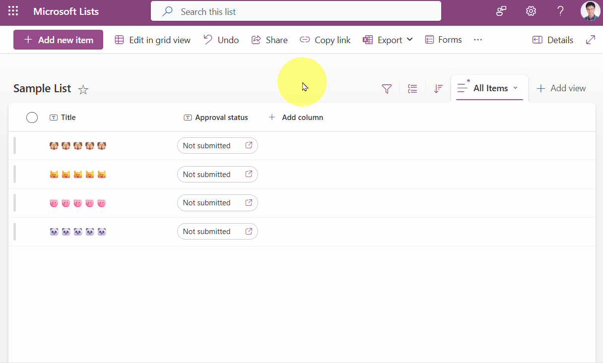
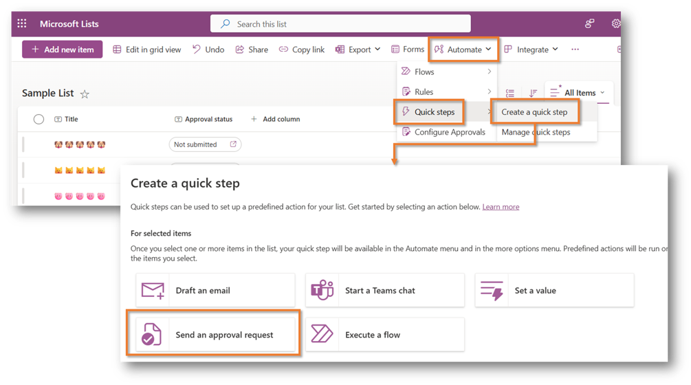
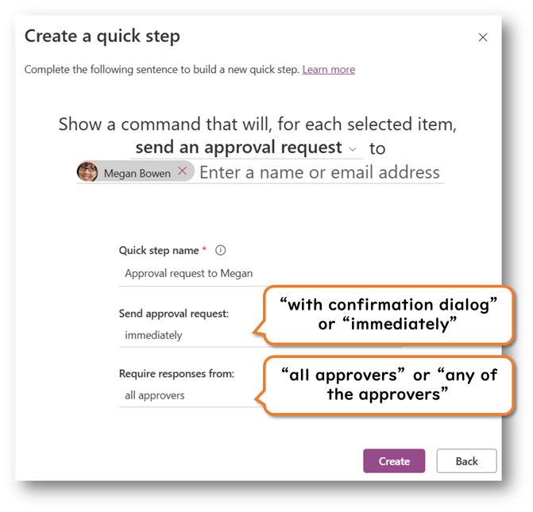
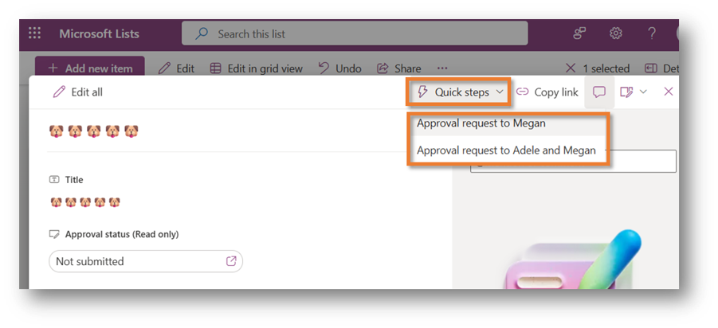
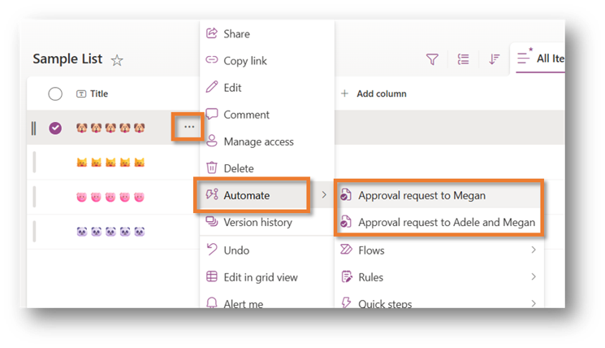
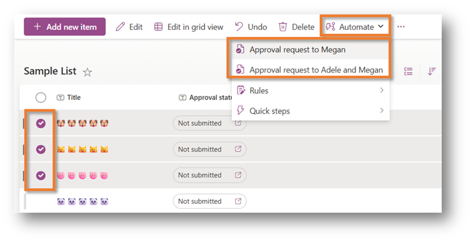
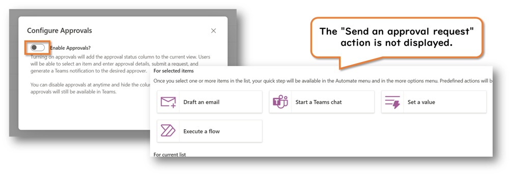
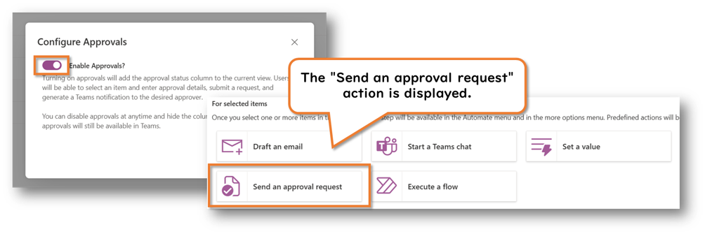

In this article, I will share some insights from the Microsoft 365 Community Conference session titled “Simplifying Business Processes with SharePoint Automation.”

When using the approval feature in SharePoint lists and document libraries, do you often find yourself manually selecting the same approver each time? If so, creating a [Quick Step](https://support.microsoft.com/office/create-a-quick-step-for-your-list-or-library-b37c2c7f-2ae1-49f9-b4b0-a8d501f5f99e) can help. By setting one up in advance, you can quickly send approval requests to a specific approver.

To create a Quick Step, go to the command bar and select **Automate** > **Quick Steps** > **Create a quick step**.

After creating a Quick Step, it can be run from the item’s dialog, the context menu, or the command bar.

However, please note that the **approval feature must be enabled** in order to see the Approve action when creating a Quick Step. (This was something I learned during the session.)

Also, it is currently not possible to configure sequential approvals within a Quick Step.

## Related Links

- [Approvals in Lists & Document Libraries - Microsoft Support](https://support.microsoft.com/office/approvals-in-lists-document-libraries-2bd0954d-5797-4be3-b78a-846f26338e17)
- [Microsoft Lists: How to display approvers on the view when using Approvals in Lists - Microsoft 365 and Power Platform Community Blog](https://pnp.github.io/blog/post/how-to-display-approvers-when-using-approvals-in-lists/)