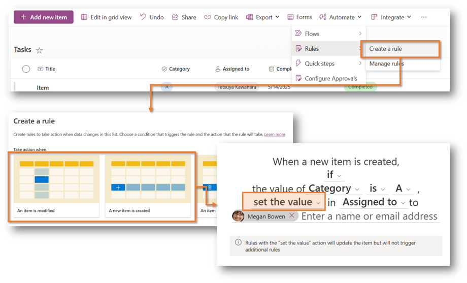
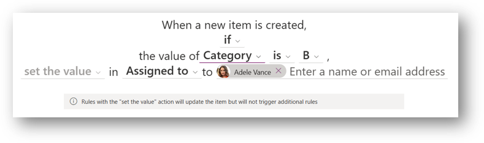
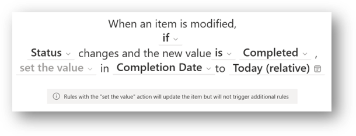

When it comes to the [rules feature](https://support.microsoft.com/office/create-a-rule-to-automate-a-list-or-library-151ea008-7fa6-409b-b0bd-b04a3b3cacd5) in SharePoint lists and document libraries, I initially thought it was primarily for notifications only. However, during the session "Simplifying Business Processes with SharePoint Automation" at the [Microsoft 365 Community Conference](https://m365conf.com/), I learned that the rules feature can **automatically set values** based on specific conditions.

For example, as introduced in the session, it's possible to automatically assign a person in charge based on the category. It can also be used to automatically set today's date as the completion date when the status changes to "Completed". These features seem useful.

However, as of now, it appears that **only one column** can be set per rule.

## Supported Column Types for Setting Values

Whether values can be set may depend on the column type. Based on my testing, the column types that currently support value setting through rules are:

- Single line of text
- Choice (Single select)
- Date and time
- Person or Group (Single select)
- Number
- Yes/No

Unfortunately, columns that allow multiple selections or certain other types are not currently supported for value setting.