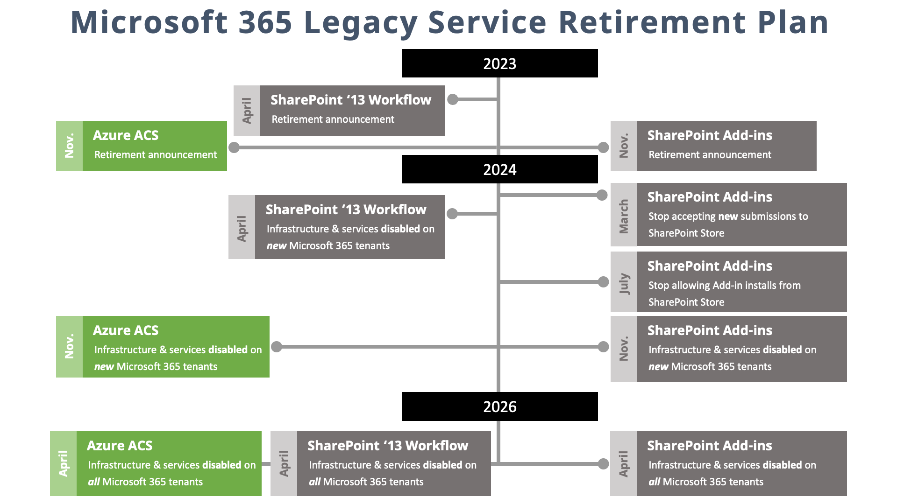

> This article originally appeared on Andrew Connell's site, **[SharePoint Add-in model retirement + other services unpacked](https://www.voitanos.io/blog/sharepoint-add-in-model-retirement-other-services-unpacked/?utm_medium=website&utm_source=pnpblog&utm_campaign=blog&utm_content=SharePoint%20Add-in%20model%20retirement%20+%20other%20services%20unpacked)**, where it's [also available as a video](https://youtu.be/MguYAPaCjdE) and podcast episode.

On November 27th, Microsoft made an important announcement regarding the retirement plan for both **Azure Access Control Services** and the **SharePoint Add-in model**. As a long-time SharePoint developer and customer, I understand that these announcements will have a significant impact on our work.

In this article, I want to provide clarity on why these announcements were made and what the timeline for implementation looks like. It is crucial for us to understand the implications of this retirement and explore different migration patterns to ensure a smooth transition. I'll also discuss the various tools and services available today that can help us customize SharePoint in a more modern way.

## What - SharePoint Add-ins Retirement Notice

The SharePoint Add-in model was introduced in SharePoint 2013 as a replacement for the fully trusted farm-based solutions and partially trusted sandbox solutions that developers would build for SharePoint.

Microsoft's motivation for creating this model was to remove developers' code from the SharePoint runtime and to separate SharePoint from hosting custom solutions. The goal was to move custom solutions for SharePoint outside of the SharePoint process by offering two options:

1. hosting the solutions in the client's browser or
1. hosting them outside of SharePoint.

This change made SharePoint a more cloud-friendly platform, allowing it to be hosted as a SaaS-based service without customers' code affecting the hosting of SharePoint.

Using the SharePoint Add-in model, developers could create two types of SharePoint Add-ins:

1. SharePoint hosted Add-ins
1. Provider hosted Add-ins

*Technically there was a third type: Autohosted Add-ins. These were included in the initial release as a preview program, but in May 2014, Microsoft announced the closing the program and no longer support autohosted Add-ins.*

The SharePoint Add-in model relied on [Azure Access Control Services (ACS)](https://learn.microsoft.com/previous-versions/azure/azure-services/hh147631(v=azure.100)?WT.mc_id=M365-MVP-21083) (not to be confused with [Azure Container Services](https://learn.microsoft.com/azure/containers/?WT.mc_id=M365-MVP-21083)), also known as ACS.

## Why is Microsoft retiring the Add-in model?

This is a little complicated, and one of my motivations for this article. All three Microsoft 365 service retirements this year, including the SharePoint 2013 workflow retirement notice in April earlier this year, as well as the SharePoint Add-in model & Azure ACS, are all related with circular dependencies.

### ... partly because Azure ACS has been replaced by Microsoft Entra ID

The SharePoint Add-in model depended on Azure ACS for security and permissions.

Azure ACS was used as the app authentication solution at the time SharePoint Add-ins were introduced in SharePoint Server 2013 (which is what SharePoint was based on at the time). Azure ACS was used by SharePoint Online provide authentication for provider hosted SharePoint Add-ins and used to grant apps access to SharePoint Online with app permissions and granular scopes.

But just a few years after it was SharePoint Add-ins were introduced, Microsoft publicly stated that **[The Future of Azure ACS was Azure Active Directory](https://techcommunity.microsoft.com/t5/microsoft-entra-blog/the-future-of-azure-acs-is-azure-active-directory/ba-p/243901?WT.mc_id=M365-MVP-21083)**.

Technically, [Azure ACS has been retired since 2018](https://learn.microsoft.com/previous-versions/azure/active-directory/azuread-dev/active-directory-acs-migration?WT.mc_id=M365-MVP-21083), but it didn't affect SharePoint.

### ... partly because SharePoint Add-ins weren't widely adopted

SharePoint Add-ins were not widely adopted by customers initially or in the following years. This was mainly due to the installation of a SharePoint resulted in the creation of an *AppWeb* where the SharePoint Add-in was installed. The AppWeb was essentially a special sub-site in a site collection. The challenge is putting SharePoint Add-ins in this subweb made applying customizations to existing SharePoint sites a less preferred option compared to alternative solutions like farm or sandboxed solutions, or using the Content Editor Web Part.

This meant that customers didn’t rely on SharePoint Add-ins to implement many customer requirements, thus hurting the adoption and sending Microsoft back to the drawing board.

Eventually, Microsoft introduced better ways to customize SharePoint and create apps, particularly through the SharePoint Framework (SPFx). As a result, customers started to abandon the Add-in model for new projects and opted to use the SPFx to address their needs. However, many SharePoint Add-ins still remain, as they continue to function effectively for their specific solutions.

... until the retirement notice was announced and thus, set a finite lifetime for these solutions.

### ... partly because SharePoint 2013 workflows were replaced by Power Automate

Now, maintaining and running the SharePoint Add-in model has become expensive for Microsoft. It seems that Microsoft wanted to transition existing customers to other options that were more suitable for cloud-based customizations. However, customers were limited in their choices as SharePoint Add-ins were the only option for deploying custom SharePoint 2013 workflows and apps using Azure ACS for permissions.

With the deprecation of SharePoint 2013 workflows and the guidance on using Power Automate for their workflow solutions, Microsoft is now phasing out the SharePoint Add-in model along with SharePoint 2013 Workflows and Azure ACS.

## When - SharePoint Add-in Retirement Timeline

What does the timeline look like for SharePoint Add-in retirement?

Microsoft announced the retirement of SharePoint Add-ins in **November 2023**.

In **March 2024, Microsoft will stop accepting new SharePoint Add-in store submissions from customers**. This means that you will no longer be able to create and submit new SharePoint Add-ins for purchase or installation in other customers' tenants.

A few months later, in **July 2024, customers will no longer be able to install SharePoint Add-ins from the store** into their SharePoint online tenants.

Additionally, any **new Microsoft 365 tenants created after November 2024 will not have the SharePoint Add-in infrastructure & services running**, preventing the creation and deployment of custom SharePoint Add-ins directly to the tenant's app catalog or site catalog.

That means, **starting in November 2024, the only way to use SharePoint Add-ins will be if the tenant was created prior to November 2024**. In this case, you can create and install SharePoint Add-ins directly into your tenant catalog, rather than obtaining them from the store.

Finally, approximately a year and a half later, **in April 2026, the SharePoint Add-in infrastructure & services will be shut down across the entire Microsoft 365 platform** including both new & existing tenants in SharePoint Online.

What does this mean? **It means that you must migrate.**

**If you are currently using SharePoint Add-ons, you need to migrate to another solution by April 2026.**

This timeline aligns with the retirement of SharePoint 2013 workflows, which will also be shut down in April 2026.

Additionally, **Azure ACS will be fully shut off in Microsoft 365 in April 2026**.

## Retirement Implications on your SharePoint Add-in Projects

Now that you have a comprehensive understanding of the implications, including the what, why, and timeline (when) of the SharePoint Add-in retirement, let's explore how we can migrate our existing solutions that utilize SharePoint Add-ins to prepare for this transition.

It is important to start planning ahead, as even though there are a couple of years before everything is fully retired and shut off, it is crucial to consider the impact this will have on your environment. First, let's discuss the SharePoint Add-ins themselves, as some of the decisions made will directly affect them.

Next, let's examine the various types of SharePoint Add-ins that can be created. Additionally, we will address specific scenarios you may have questions about and how these retirement notices will be implemented.

### SharePoint Hosted Add-ins

Let's discuss SharePoint hosted Add-ins.

SharePoint hosted Add-ins allowed us to create custom solutions that run entirely in the client's browser. This means that our JavaScript, images, and HTML are all deployed and hosted by SharePoint, and SharePoint simply loads them in the browser when requested.

At a high level, **if you have a SharePoint hosted Add-in, it is recommended to migrate your project to use the SPFx**. Both SharePoint hosted Add-ins and the SPFx deploy their code, including HTML, JavaScript, images, etc., to SharePoint, which serves it to the user's browser.

When a user visits a page where the solution is used, the actual application runs in the user's browser, not on the server.

Since both solutions run exclusively in the browser, they inherit the sign-in credentials of the current user and do not support elevated privileges.

Both SharePoint hosted Add-ins and the SPFx can be installed from the SharePoint store or sideloaded to the various SharePoint app catalogs for deployment, development, and testing purposes.

### Provider Hosted Add-ins

Now, let's discuss SharePoint provider hosted Add-ins. A provider hosted Add-in is registered with your SharePoint deployment and site collection. It requires you to deploy all the code to your own cloud resources. For example, if you are created a web part as a SharePoint provider hosted Add-in, you would set it up as a website solution and deploy it as a cloud resource, such as an Azure Web App.

The important point here is that you, as the developer, are responsible for deploying and hosting the SharePoint provider hosted Add-in separately from SharePoint. If you decide to rebuild your SharePoint provider hosted Add-in as an API, there are various options for deploying the code, such as Azure Functions, Azure Web apps, Azure Container Apps, and many other non-Azure options.

Ideally, you should secure the endpoint where the SharePoint provider hosted Add-in is hosted using Microsoft Entra ID.

If you have a web part that is part of your SharePoint provider hosted Add-in, you will need to port it as a SPFx based solution.

The SPFx can then call your custom API, using the SPFx's `HttpClient` API if the endpoint is anonymous and unsecured, or the SPFx's `AadHttpClient` API if the endpoint is secured with Microsoft Entra ID.

To retrieve data from your SharePoint site within your new SPFx web part or any other SPFx component, you can use the `SpHttpClient` API to make requests to the SharePoint Rest API, or use the `MSGraphClientV3` API from the SPFx to retrieve data from SharePoint using the Microsoft Graph instead of the SharePoint Rest API.

Additionally, there are other options available for retrieving data, such as using the popular open-source library [PnPjs](https://pnp.github.io/pnpjs/), which can use both the SharePoint Rest API and the Microsoft Graph to retrieve the same data. It is just another option for accessing the data.

## Migration Guidance

Now that we have discussed some high-level considerations, let's examine specific scenarios that you may encounter when migrating your SharePoint Add-in based projects. It is important to note that many of these SharePoint Add-ins were built years ago and may utilize older technologies that were available at that time but have since been retired.

### Data Access

Let's start by discussing data access.

Previously, to retrieve data from a SharePoint list or library, you may have used a CAML query, an XML-based language, to submit queries to the SharePoint endpoints. You might have also used the client-side object model (CSOM) or the JavaScript object model (JSON) to issue these requests and queries written in CAML.

Going forward, it is recommended to replace these technologies with REST-based OData queries. You can achieve this using any of the APIs provided with the SPFx as previously discussed in this article.

If you are working with a SharePoint-specific endpoint, you can also use the `MSGraphClientV3` API in the SPFx, which utilizes the Microsoft Graph to access the same data.

### Solutions that Rely on Azure ACS

If you are using Azure ACS for your custom solution and need app-only permissions, you will need to migrate to Microsoft Entra ID. You can learn more about how to do this by following this link for guidance.

For apps that leverage granular permissions using Azure ACS that allowed you to grant read, write, manage, and full control permissions to specific site collections, you’ll have to take a different approach because Microsoft Entra ID, by default, grants these permissions to *all site collections* in the target tenant.

To work around this, you can use something called Resource-Specific Consent (RSC). In this scenario, you register Microsoft Entra ID apps and grant them permissions to specific site collections, similar to what you did with Azure ACS, with the permission **Sites.Selected**.

### SharePoint Add-in App Parts

Now, let's discuss SharePoint app parts.

SharePoint App Parts enable you to create web parts using the SharePoint Add-in model that can be used in the host web. These app parts should be rebuilt as SPFx client-side web parts.

### Ribbon Bar & Context [ECB] Menu Customizations

SharePoint Add-ins also allow you to customize a classic site's list or library ribbon bar by adding buttons or the context (aka: Edit Control Block/ECB) menu.

These customizations should be rebuilt using the SPFx List View Command Set extensions. Unlike SharePoint Add-in, the SPFx supports other types of customizations for lists and libraries, such as creating Field Customizers (replacing the old JSLink technology), and List Form Customizers where you can replace the new edit or view forms with SPFx-based forms.

### Remote Event Receivers

Now, let's discuss a big topic: remote event receivers (RERs). We can break them down into two different categories, but first, let's talk about some common aspects that we need to consider.

RER’s allow us to receive notifications when events occur in list. libraries, and apps, as well as during the application lifecycle within our SharePoint environment.

Furthermore, RER’s provide us with a SharePoint context.

RER’s support both asynchronous and synchronous events. This synchronous capability of some RER events enabled us to block certain items from being added or edited in our registered lists or libraries, using the SharePoint Add-in model.

Although RER’s have not been recommended for a long time, they still function. But, current recommendation is for developers to transition to using webhooks, such as SharePoint webhooks or Microsoft Graph webhooks.

However, there are some differences worth noting between RER’s and webhooks that I’ll cover in the next section.

### Remote Event Receivers - List & Library Events

Let's look at these two different scenarios when it comes to using RER’s in lists & libraries.

We used to have the ability to handle both synchronous and asynchronous events. However, in SharePoint and Microsoft Graph, only asynchronous events are supported today. This means that we can only work with remote event receivers to receive notifications when an item is added to a list. We can then run some logic to determine if the item should be saved or not.

Unfortunately, we can't use RER’s or webhooks for custom data validation requirements, a common use case that the RER synchronous events addressed. Webhooks are inherently asynchronous, meaning they only notify us after something has already happened. There is no synchronous option available for us to migrate our solutions to and thus, you need to explore alternatives.

Another difference is that we don't receive any data or context when an event occurs. Depending on the specific event we're listening for, we're simply informed that something happened. To retrieve the data for an item being added to a list, we can use the [Microsoft Graph’s delta query capability](https://learn.microsoft.com/graph/delta-query-overview?WT.mc_id=M365-MVP-21083) to retrieve the changes since the last query.

If you were previously using RER’s for lists and libraries, you'll need to migrate those solutions to either use [webhooks from SharePoint](https://learn.microsoft.com/sharepoint/dev/apis/webhooks/overview-sharepoint-webhooks?WT.mc_id=M365-MVP-21083) or [webhooks from the Microsoft Graph](https://learn.microsoft.com/graph/api/resources/webhooks?view=graph-rest-1.0&WT.mc_id=M365-MVP-21083) (aka: Microsoft Graph *Change Notifications)*. These webhooks are set up on a subscription basis. You subscribe to specific events and are then notified when those events occur. It's important to note that you need to maintain the subscription, as it will expire and be removed by Microsoft. Make sure to keep track of the subscription's lifetime and renew the registrations accordingly.

### Remote Event Receivers - App Lifecycle Events

Now, let's discuss the other type of event that we had with RERs: app lifecycle events.

The app lifecycle events included app installation, uninstallation, and upgrades. These three events SharePoint could notify a remote endpoint whenever an app was installed, uninstalled, or upgraded. They allowed us to perform various actions and implement different solutions, such as creating a list or library for the app or executing a provisioning process when the app was installed, or a cleanup process when the app was uninstalled.

Unfortunately, there are currently no published app lifecycle events available for Microsoft SharePoint and Microsoft Graph webhooks.

**This is a feature that I have been requesting for a long time! If you want this feature, it is important to let Microsoft know about your interest so that they can prioritize it.**

In the meantime, if your solution requires additional setup after installation or cleanup after uninstallation, you will need to implement a process that checks if the prerequisites are present. For example, if the prerequisites are not present, you can provide an alternative setup experience using client-side code. This code can perform operations if the current user has the necessary permissions, such as creating a list.

Alternatively, you can use client-side code to call a remote API that you create. Within that remote API, you can use Microsoft Entra ID to obtain an access token with elevated permissions and then use that access token to authenticate against the SharePoint Rest API or Microsoft Graph APIs to perform the necessary elevated operations.

## Let me help you with your SharePoint Add-in Migrations!

Let me restate that I have only covered some popular aspects that often arise when people migrate from their existing SharePoint solutions to newer more modern supported patterns and technologies.

There may be many other scenarios that I haven't addressed here.

**What specific scenarios are you interested in?**

**What aspects would you like guidance on as you move forward?**

## Azure Access Control Services (ACS) Retirement

Now, for the sake of completeness, I would like to briefly discuss the retirement of Azure ACS. The retirement of Azure ACS follows a timeline similar to the retirement of the SharePoint Add-in model and the retirement plan for SharePoint 2013 Workflows.

The retirement plan was announced on the same day as the SharePoint Add-in retirement plan: November 27th, 2023.

**In November 2024, any new tenant created in SharePoint Online or Microsoft 365 will not have Azure ACS enabled.** This change only applies to tenants created after November 2024. Existing tenants created prior to November 2024 will still be able to use Azure ACS.

**In April 2016, Azure ACS will stop working across all tenants in Microsoft 365.** Notice this is the exact same time that the infrastructure and services supporting the SharePoint Add-in model and SharePoint 2013 workflows is also shut off.

### Azure ACS Migration Guidance to Microsoft Entra ID

So, what guidance do I have for preparing for the retirement of Azure ACS and how should you migrate these solutions?

We used Azure ACS in two different ways: to obtain tenant-level permissions or site collection-level permissions.

**For app-only based permissions for SharePoint**, such as **Sites.Read.All** or **TermStore.Read.All**, **it is recommended to use the Sites.Selected permission to apply specific permissions to a subset of site collections, instead of deploying it to the entire tenant.**

To obtain permissions for lists or sites, you can use Resource Specific Consent (RSC), which is currently a work in progress. This feature will allow applications to access only a specific SharePoint site or list, instead of entire site collections.

This specific feature is not yet available in production as it is currently under development.

## Conclusion

I hope this article has addressed some of the questions you may have had regarding the retirement notices for the SharePoint Add-in model and Azure ACS in Microsoft 365 published on November 27th, 2023.

Please note that you have until April 2026 to migrate all your solutions that used Azure ACS or the SharePoint Add-in model to an alternative, as discussed in this article.
