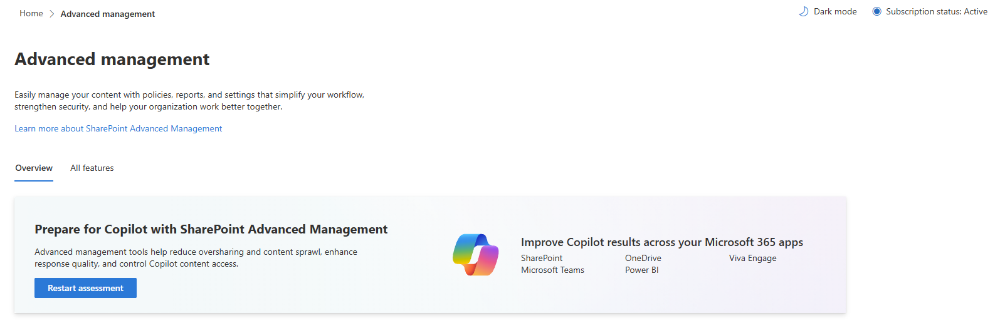

## Why Governance Matters More Now

SharePoint Advanced Management (SAM) is becoming more interesting to me because the conversation around SharePoint governance is changing. For a long time, governance was largely about keeping sites tidy, managing permissions, and understanding who owned what. With Copilot and agents increasingly interacting with organisational content, those same questions have a wider impact.

The technology isn't necessarily the difficult part. The challenge is understanding what we have, who is responsible for it, who can access it, and whether it should still be there.

## The Governance Problem We Already Have

SharePoint and OneDrive can accumulate content, sites, permissions, sharing links, and ownership arrangements over many years. Some content remains useful. Some doesn't. Some may be accessible more broadly than intended.

Consider a project site created five years ago. The project has finished, the original owner has moved on, permissions have changed, but the site remains accessible and contains information that could still be surfaced to users or AI experiences.

Copilot hasn't created that governance problem. It has made understanding the existing problem more important.

Most organisations didn't deliberately design their current SharePoint environment to become complicated. Sites were created for projects, departments, applications, Teams, migrations, and individual requirements.

Over time, ownership changes, projects finish, permissions evolve, and information remains.

## What SAM Actually Helps You Understand

SAM isn't simply a collection of security switches.

Site ownership policies, inactive-site management, attestations, catalog management, change history, and governance reports can support a broader administrative process.

The same applies to oversharing. Permission state reports, user access reports, sharing-link activity, sensitivity-label snapshots, and access reviews can help administrators understand where attention is needed rather than assuming every site requires the same treatment.

The important point is visibility. Before deciding what to change, organisations need evidence about what is actually happening.

## Where Would You Start?

There isn't one governance model that will suit every organisation. A practical starting point could be:

  1. **Ownership** - Do we know who is responsible for our sites?
  2. **Lifecycle** - Which sites or content are inactive or no longer required?
  3. **Access** - Who can access information, and why?
  4. **Oversharing** - Where might information be exposed more broadly than intended?
  5. **Evidence** - What reports and reviews can validate our assumptions?

The goal isn't necessarily to make everything perfect. It is to identify priorities and apply proportionate controls.

## Where SAM Fits into the Wider M365 Picture

SAM brings these capabilities into the SharePoint admin center, with PowerShell available for areas such as Data Access Governance reporting.

There are also related controls involving Microsoft Entra Conditional Access, security groups, restricted access, restricted content discovery, and download policies.

The newer reporting around agents is particularly interesting, including insights into recently created agents and agent interaction with SharePoint and OneDrive content.

## From Governance to AI Readiness

For organisations preparing for Copilot and agents, governance provides an important foundation.

As AI experiences become more capable of finding and using organisational information, understanding the underlying permissions and content becomes increasingly important.

The question isn't simply whether users can access information. It's whether the organisation understands why they can access it, whether that access remains appropriate, and what happens when agents operate across that information.

Better visibility can support governance, security reviews, reporting, audit readiness, and more informed decisions about content.

It can also help shift governance from assumptions towards evidence.

## Resources

- Microsoft documentation: [https://learn.microsoft.com/en-us/sharepoint/advanced-management?WT.mc_id=365AdminCSH_spo]
- Prerequisites for SharePoint Advanced Management: [https://learn.microsoft.com/en-us/sharepoint/sharepoint-advanced-management-prerequisites]

## Community Discussion

- How are you approaching SharePoint governance ahead of Copilot and agents?
- Are you starting with ownership, lifecycle, permissions, or oversharing?
- And perhaps most importantly, do you feel you have enough visibility into your SharePoint and OneDrive environment to make those decisions confidently?
