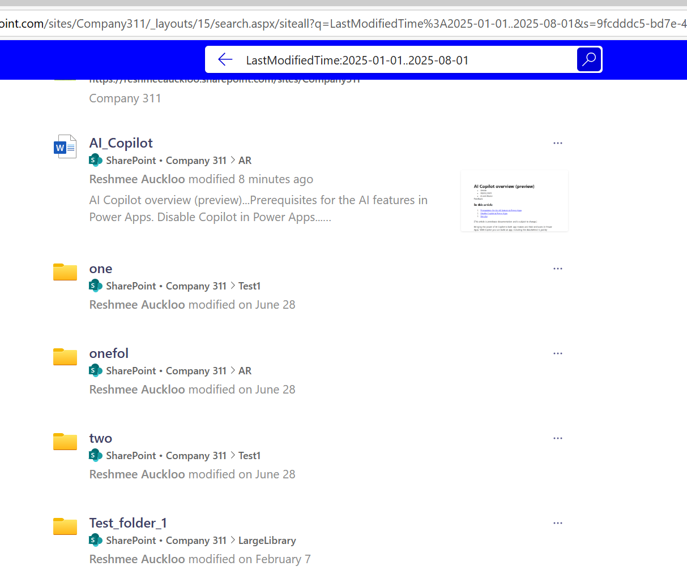
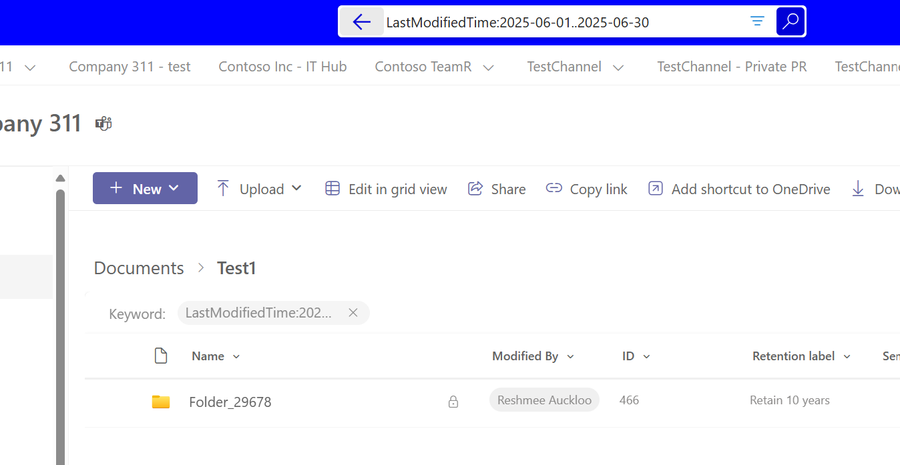
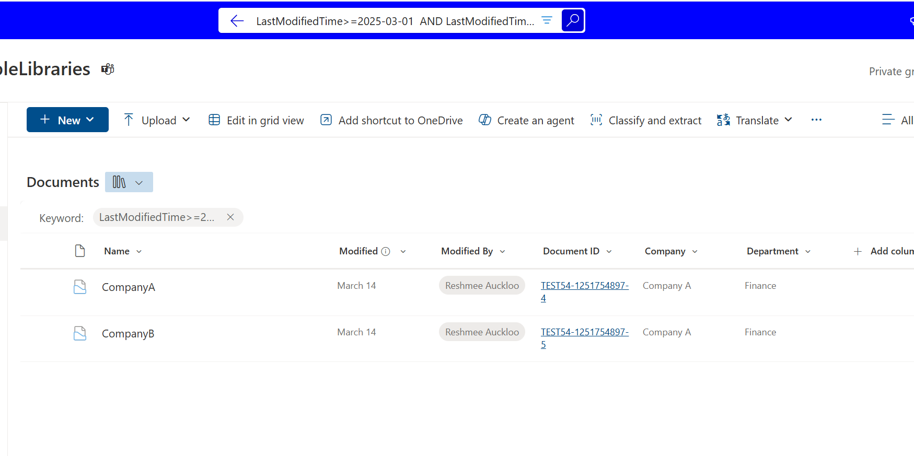
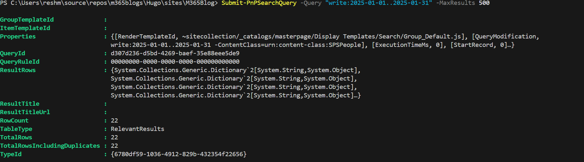

## Introduction

SharePoint search is powerful, but searching by date ranges can be surprisingly tricky. Many users struggle with date-based queries, especially when trying to find documents modified or created within specific timeframes. This guide provides tips to use SharePoint/M365 search capabilities with date fields: write, LastModifiedTime, Created.

## The Challenge with Date Searches

Date searches in SharePoint have several gotchas that can frustrate users:

- **Format requirements** - SharePoint expects specific date formats (American format UTC , i.e. yyyy-MM-dd)
- **Property variations** - Different date properties behave differently
- **Syntax sensitivity** - Small syntax errors can break your queries

---

## Date Search Properties in SharePoint

SharePoint provides several date-related search properties:

| Property | Description | Use Case |
|----------|-------------|----------|
| `LastModifiedTime` | When the item was last/file was last modified | Finding recently updated documents |
| `write` | Alias for LastModifiedTime | Shorter syntax for modification dates |
| `created` | When the item was created | Finding newly added content |

---

## Basic Date Range Syntax

### 1. Date Range Queries

Use the double-dot syntax for date ranges:

```
LastModifiedTime:2025-01-01..2025-08-01
write:2025-01-01..2025-08-01
created:2025-01-01..2025-08-01
```

**Date range search site level**



**Date range search library level**



### 2. Relative Date Queries

SharePoint supports natural language for relative dates:

```
write:"today"
write:"this week"
created:"yesterday"
LastModifiedTime:"last week"
write:"this month"
created:"last month"
write:"this year"
```


### 3. Specific Date Formats

Always use the **American date format (MM/DD/YYYY)** or **ISO format (YYYY-MM-DD)**:

```
✅ Correct:
write:01/27/2025..01/31/2025
write:2025-01-27..2025-01-31

❌ Incorrect (UK format):
write:27/01/2025..31/01/2025
```

### 4. Using `<` and `>` Operators for Date Searches

You can use `<`, `>`, `<=`, and `>=` to filter items before or after a specific date:

```
LastModifiedTime < 2025-01-01      # Items modified before Jan 1, 2025
LastModifiedTime > 2025-01-01      # Items modified after Jan 1, 2025
LastModifiedTime <= 2025-01-01     # Items modified on or before Jan 1, 2025
LastModifiedTime >= 2025-01-01     # Items modified on or after Jan 1, 2025
LastModifiedTime>=2025-03-01  AND LastModifiedTime<=2025-05-01  # Items modified between Mar 1, 2025 and May 1,2025
```

These operators work with `write`, `created`, and `LastModifiedTime` properties.



---

## Working Examples

### Find Documents Modified This Week
```
write:"this week"
```

### Find Documents Modified Between Specific Dates
```
LastModifiedTime:2025-01-01..2025-01-31
```

### Combine Date with Content Search
```
budget AND write:"last week"
project AND created:"today"
```

### Find Documents NOT Modified Recently
```
-write:"last week"
```

---

## Advanced Date Search Techniques

### 1. Using Comparison Operators

```
# Documents modified after a specific date
write:>2025-01-01

# Documents created before a specific date
created:<2025-06-01

# Documents modified on or after a date
LastModifiedTime:>=2025-01-15
```

### 2. Combining Multiple Date Criteria

```
# Documents created this year but modified this week
created:"this year" AND write:"this week"

# Documents created in January but not modified recently
created:2025-01-01..2025-01-31 AND -write:"last week"
```

### 3. File Type with Date Filters

```
# PowerPoint files modified this month
filetype:pptx AND write:"this month"

# Word documents created yesterday
filetype:docx AND created:"yesterday"
```
---

## Troubleshooting Date Searches

### Common Issues and Solutions

**Problem:** Date range not returning expected results
```
# Try different date properties
write:2025-01-01..2025-01-31
LastModifiedTime:2025-01-01..2025-01-31
```

**Problem:** UK date format not working
```
# Always use American format or ISO format
❌ write:31/01/2025
✅ write:01/31/2025 or write:2025-01-31
```

**Problem:** Timezone confusion
```
# Remember SharePoint stores dates in UTC
# Your local time may differ from search results
```

---

## Alternative Approaches

### 1. Use Column Filters
When date search queries fail at the library level:
- Use the Modified/Created column filters
- Apply date ranges through the filter panel
- More reliable for library-specific searches

### 2. Search Web Parts
Configure search web parts with:
- Pre-defined date ranges
- Custom KQL queries
- User-friendly date pickers

### 3. PowerShell for Complex Queries
For advanced scenarios, use PnP PowerShell:

```powershell
# Search for documents modified in date range
$results = Submit-PnPSearchQuery -Query "write:2025-01-01..2025-01-31" -MaxResults 500
```



---

## Best Practices

### 1.Date Format Consistency
- Always use American format (MM/DD/YYYY) or ISO (YYYY-MM-DD)
- Avoid UK format (DD/MM/YYYY)
- Consider timezone differences

### 2. Combine Strategically
- Mix date queries with content keywords
- Use file type filters with date ranges
- Test combinations thoroughly

---

## Conclusion

Mastering SharePoint date searches requires understanding the platform's quirks and limitations. While date range queries can be powerful, they work best with American date formats. When in doubt, start with relative date terms and use column filters as a backup strategy.

Have you discovered other date search tricks in SharePoint? Share your experiences and workarounds in the comments!

---

## References


