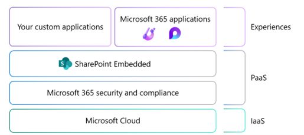
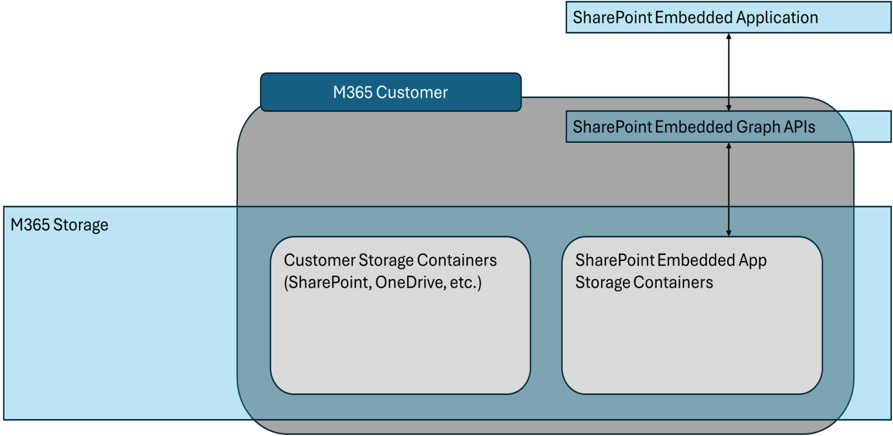

> This article originally appeared on Andrew Connell's site, **[SharePoint Embedded - overview and example scenarios](https://www.voitanos.io/blog/sharepoint-embedded-overview/?utm_medium=website&utm_source=pnpblog&utm_campaign=blog&utm_content=SharePoint%20Embedded%20-%20overview%20and%20example%20scenarios)**, where it's [also available as a video](https://youtu.be/gEU8NxNWLCI) and podcast episode.

In May 2023, [Microsoft announced the private preview of a new product/service at their annual Build conference: Syntex Repository Services](https://devblogs.microsoft.com/microsoft365dev/introducing-syntex-repository-services-microsoft-365-superpowers-for-your-app?WT.mc_id=M365-MVP-21083). Then, in November 2023, [Microsoft announced the public preview and renamed it to SharePoint Embedded](https://techcommunity.microsoft.com/t5/sharepoint-premium-blog/announcing-sharepoint-embedded-public-preview-at-espc23/ba-p/3993428?WT.mc_id=M365-MVP-21083). In the past, it's also been referred to as **Repository as a Service** (RaaS) or SharePoint's headless APIs.

SharePoint Embedded offers a headless, API-only pattern for building content apps that integrate management capabilities like collaboration, security, and compliance into any app by storing content within an enterprise's existing Microsoft 365 tenant.

Enterprises can use SharePoint Embedded to power line-of-business apps, creating a unified and familiar experience for both app users and system administrators responsible for managing these new apps. Independent Software Vendors (ISVs) can also utilize this scalable and high-performance technology to deliver Microsoft 365 content management capabilities as part of every enterprise app they develop. When an ISV adopts SharePoint Embedded, documents are managed within the end customer's tenant, allowing the ISV's customers to leverage a robust and consistent content management system they already trust, including global security and compliance.

I have had the opportunity to work with the SharePoint Embedded team for the past few months leading up to the public preview announcement. As a long-time SharePoint developer, I see great potential in this offering as it addresses a need that app developers have had for years: the ability to use SharePoint to store data while blocking users from accessing the files through the SharePoint web interface.

In this article, you'll learn what SharePoint Embedded is in my own words and share some of the scenarios where I believe it can be beneficial.

## What is SharePoint Embedded?

SharePoint Embedded provides developers with a faster way to create file and document-focused applications. Powered by SharePoint, SharePoint Embedded allows developers to integrate the powerful file and document capabilities that SharePoint offers into their own custom applications. This section explains what SharePoint Embedded is and what it offers to developers creating custom applications.

For many years, users have enjoyed the document management capabilities provided by SharePoint. These features include collaborating on various file types, securing content, managing the content lifecycle, and utilizing enterprise-grade classification and enterprise content management (ECM) capabilities. SharePoint document management has been an industry-leading solution for a long time.

These capabilities have become the industry standard, leading independent software vendors (ISVs) and developers to want to implement them in their own custom solutions. Some organizations have recreated these capabilities in their products, while others have built their products on top of SharePoint.

However, these solutions introduce a dependency on the entire SharePoint product, when all they really want is to leverage the document management features of SharePoint in their own products and projects.

That’s what SharePoint Embedded brings to developers. It provides a faster way for developers to create file and document focused applications. SharePoint Embedded is powered by SharePoint. Developers can integrate the same powerful file and document capabilities that SharePoint has to offer in their own custom applications.

SharePoint Embedded speeds up your content management plan by adding new features to custom content apps:

- Enhance Microsoft 365 **security and compliance** for your app, including audit, eDiscovery, Bring Your Own Key, and more.
- Utilize Microsoft 365 **business continuity** features like autoscaling, high availability, **[Microsoft 365 Backup](https://aka.ms/M365Backup/adoption?WT.mc_id=M365-MVP-21083), [Microsoft 365 Archive](https://aka.ms/M365Archive/adoption?WT.mc_id=M365-MVP-21083)**, and disaster recovery.
- Provide Microsoft 365 **collaboration** to your customers, users, and guest users within your app, such as coauthoring in Word or PowerPoint.
- Incorporate Microsoft's trusted **content management** features into your app, such as search, content preview, and version tracking.
- Design a custom **user experience** that gives your app full control over security, lifecycle, and management.
- Utilize the capabilities of **[SharePoint Premium](https://aka.ms/SharePointPremium/adoption?WT.mc_id=M365-MVP-21083)** (*document processing, eSignature, content assembly*) in your app.
- Make your content searchable in the Microsoft 365 semantic index and available in **[Copilot for Microsoft 365](https://adoption.microsoft.com/copilot/?WT.mc_id=M365-MVP-21083)**.

Another way to look at SharePoint Embedded is your custom application leverages SharePoint for all document storage and collaboration features. This effectively uses SharePoint Embedded as a “headless-API” to SharePoint’s document storage system.

## App documents stay in their Microsoft 365 tenant

When a consumer installs/registers a SharePoint Embedded application in their Microsoft 365 tenant, SharePoint Embedded creates another SharePoint partition. This storage partition does not have a user interface but instead, the documents in the partition is only accessible via APIs. This means that all documents will be accessible to the ISV or developer’s application, but the documents will only reside in the consumer’s Microsoft 365 tenant.

## Consumer Microsoft 365 settings apply to app documents

All documents stored in the SharePoint partition created by the SharePoint Embedded app are in the consumer’s Microsoft 365 tenant and therefore are subject to the consumer’s Microsoft 365 tenant settings.

SharePoint Embedded is fully integrated with the Microsoft 365 Admin Center and Microsoft Purview, allowing administrators to use familiar tools to manage content lifecycle, security, and compliance.

## How it's used (Office Apps, search, etc)

Let's see some of the SharePoint and Microsoft 365 features you can use in your SharePoint Embedded applications.

### Opening Office Documents from SharePoint Embedded Apps

Office documents stored in SharePoint Embedded apps can be opened for viewing and editing in Office Online. This allows your users to work with documents directly on the website or in desktop apps for a better viewing and editing experience. The AutoSave feature automatically saves files as users work, and it is enabled for Word, Excel, and PowerPoint files stored in your SharePoint Embedded Application Apps.

### In-Application Search

You can use the Microsoft Search API to search for content within your application. The search requests run in the context of the signed-in user, and the search results are limited to the items accessible by the user based on their access control settings. For example, the search results will include all content that matches the search criteria and is accessible to the user, regardless of whether the SharePoint Embedded application is authorized to access the content. It is recommended to specify the Container type accessible by the application in the search request body to ensure accurate search results.

### Content Discovery in Microsoft 365

Your users can discover and share content from your SharePoint Embedded applications through their Recommended, Quick Access, or Shared With Me feeds on Microsoft 365 surfaces like [Office.com](https://office.com/?WT.mc_id=M365-MVP-21083), SharePoint Search results, or OneDrive user accounts. This allows your users to easily find content from your applications using familiar Microsoft 365 experiences. In future releases, the option to disable Microsoft 365 Content Discovery across all surfaces can be configured.

## Example scenarios

While I’ve shared what SharePoint Embedded is from a high-level, you still might be asking “ok, I get it, but when would I use this?

Let’s look at a few example scenarios as they might help you better understand why you’d use SharePoint Embedded in your next application.

### Structured user experience

Let’s say you have a very specific path you want your users or customers to follow. Part of this process collects data from the users, requests different files to be uploaded such as forms, pictures, and resources.

Instead of providing your users the flexible SharePoint experience with a series of specific instructions they must follow, you could instead create an application that guides the user through your process. Along the way, all data you collect can be stored as files in a SharePoint Embedded Container along with any files they upload.

**Why use SharePoint Embedded?**

Some advantages of using SharePoint Embedded instead of SharePoint is the user’s only get access to your app’s UX, not your SharePoint environment. In addition, not only are the resources the user provides separate from your Microsoft 365 entitlements which allows for simpler resource management, but they’re all subject to the same sensitive, classification, records management and other features defined in your Microsoft 365 tenant’s settings. This includes settings defined in Microsoft Purview within your Microsoft 365 tenant.

### Controlled collaboration

When building applications on top of SharePoint, it is still possible for a user with permissions to navigate to the underlying site. Depending on their permission level, a user may be able to perform actions in the SharePoint interface that were not intended by your application, such as changing site settings. These actions can have unintended consequences for your application or content.

In contrast, SharePoint Embedded is headless, meaning it does not have a user interface other than what is provided by your custom application. If you do not provide a method to change content or settings through your application, it will not be possible for a user to bypass this limitation through SharePoint. You have the ability to choose which collaborative features are available in your application, such as sharing.

**Why use SharePoint Embedded?**

Some advantages of using SharePoint Embedded instead of SharePoint

If you require the collaborative capabilities of SharePoint but want to have a highly customized user interface, SharePoint Embedded is the solution for you. It allows you to handle high-value content and manage the risk by removing the ability for users to discover or alter the content repository. The application Containers can have separate default sharing settings from your OneDrive and SharePoint settings, ensuring logical separation of content from other Microsoft 365 content.

### Customer facing document upload

Your application targets end customers who need to upload files. You need a simplified user experience and Microsoft 365 document storage capabilities. SharePoint Embedded supports this scenario without requiring access to your Microsoft 365 tenant.For example, if you run an event management organization, you will interact with speakers, vendors, and sponsors/exhibitors. Vendors are required to send you Statements of Work (SOWs) and invoices. Sponsors/exhibitors need to provide marketing collateral and access resources such as booth packages and marketing materials. Speakers are expected to provide bios, session titles, abstracts, as well as slides and resource downloads.

**Why use SharePoint Embedded?**

If you run your business on Microsoft 365 but don't want to give access to non-employees, SharePoint Embedded provides a solution. These users don't require a special license for Microsoft 365 or as external users of SharePoint. This allows you to keep their data separate from your organization while still being managed within your tenant's scope of compliance tools and data compliance requirements.

## Understanding a the Architecture of a SharePoint Embedded App

SharePoint Embedded introduces a new type of storage called **Containers** that helps manage content in a scalable way. These Containers are created and stored within a Microsoft 365 Tenant. The ISV or LOB app can use the Microsoft Graph API to read from and write to the specific Container(s) for that app.

The Containers are always part of the customer's Microsoft 365 tenant, regardless of how or where the app's codebase is deployed.

Containers are associated with a **Container Type**, a property stamped on every Container instance. Each Container Type is owned by one Application; and each Application can own only one Container Type.

Let’s look at these Container Types a bit more…

- Only the app owning a Container type may create instances of a Container.
- A Container instance of a Container must be associated with a Container Type.

Apps can grant permission to other apps to create, read, update, and/or delete Container instances of Container Types of the owning app. For example, to allow backup/restore or DLP apps to operate on content in those Containers and/or create instances of the Container Type.

## Understanding the costs and billing for SharePoint Embedded content

Microsoft 365 customers have different rights for storage, usage, and features depending on the licenses they bought.

The partition created in the customer's Microsoft 365 account by a SharePoint Embedded app doesn't count towards your existing Microsoft 365 entitlements. Instead, the partition in the customer's Microsoft 365 account created by the SharePoint Embedded app is billed separately through an Azure subscription. The billing is based on a pay-as-you-go (PAYG) model, which means you pay for the total storage and the number of API calls. You can find more information about the costs and billing rates in the Microsoft documentation: [Pay-as-you-go billing for SharePoint Embedded](https://learn.microsoft.com/sharepoint/dev/embedded/concepts/admin-exp/billing?WT.mc_id=M365-MVP-21083).

The way it works is you associate a Container Type within a consumer’s Microsoft 365 tenant with an Azure subscription. Therefore all Containers linked to a Container Type will be billed through Azure.

## Setup SharePoint Embedded in your Microsoft 365 Tenant

So how do you create a new SharePoint Embedded application? There are a few steps involved in this process:

1. The app provider and consumer must both enable SharePoint Embedded in their tenants. Technically, these can be the same tenant. For example, an enterprise customer can build their own LOB application and consume it within the same Microsoft 365 Tenant. However, an ISV can act as a provider and create the app in their Microsoft Tenant while their customers can use the app in their own Microsoft 365 tenants as well.
1. Create a new Container Type in the app provider’s Microsoft 365 tenant.
1. Register the Container Type in the app consumer’s Microsoft 365 tenant.
1. The app provider creates and deploy an application (the codebase) which can reside anywhere. It will use the Microsoft Graph APIs to read and write data to the specified consumer’s SharePoint Embedded Containers in the consumer’s Microsoft 365 tenant.

At the time of writing this article, SharePoint Embedded is still in public preview. The steps may change prior to and after SharePoint Embedded reaches the General Availability milestone. I suggest referring to the docs for the latest steps on how to enable SharePoint Embedded in your tenants: [Enable SharePoint Embedded](https://learn.microsoft.com/sharepoint/dev/embedded/getting-started/enable-sharepoint-embedded?WT.mc_id=M365-MVP-21083)
