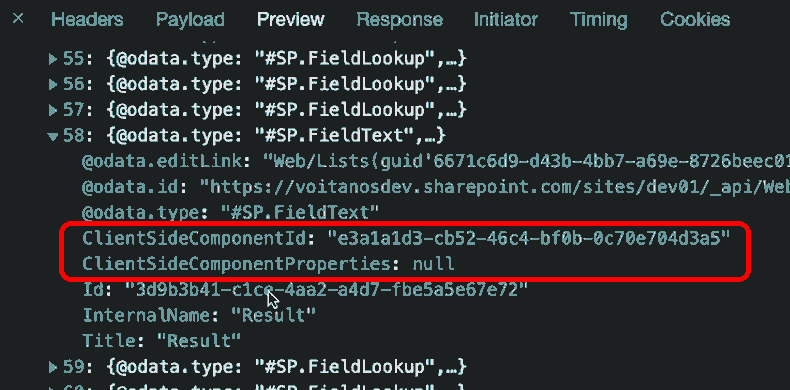

> This article originally appeared on Andrew Connell's site, **[How to register SPFx field customizers with the SharePoint REST API](https://www.voitanos.io/blog/sharepoint-framework-register-field-customizers-rest-api/?utm_medium=website&utm_source=pnpblog&utm_campaign=blog&utm_content=how+to+register+spfx+field+customizers+with+the+sharepoint+rest+api)**, where it's [also available as a video](https://youtu.be/jUW7xkPFjbA) and podcast episode.

The SharePoint Framework enables developers to customize the rendering of data in a SharePoint list’s column. This is done by creating a custom field customizer and associating it with column.

The project template that’s created by the Yeoman generator when you create a field customizer extension only has the necessary things to associate the extension with a new site column created using the legacy Feature schema and XML provisioning.

But that doesn’t help if you want to register your field customizer with an existing site column or a column in an SharePoint list… it only work for new site columns!

To register your field customizer with an existing column you’ll have to write some code and call the SharePoint REST API.

In this article, not only will I show you how to do that, but I’ll also share with you a utility I created that you can use to do the same thing without writing any code!

## Explore the scenario

Let’s define the problem before we look at the solution.

The SharePoint Framework field customizer extension lets developers create custom rendering implementations for columns in SharePoint lists. Like all extensions, there are two parts to getting this working in your SharePoint site:

1. You first create the extension and install it in your SharePoint site, like any component
1. Then, you have to register the field customizer extension with a column. Many developers think this is only done when you install the component because the default project includes the Feature schema XML to create a new site column.

But, like I said in the introduction, this doesn’t help you if you want to register the customizer with an existing site column, or an existing column in a SharePoint list.

Thankfully, you can use the SharePoint REST API to do this!

To demonstrate this, let me show you a little utility I created to show how this works.

This web part I’m going to show you uses the SharePoint REST API to register, change, or deregister a field customizer on an existing list column. This source to this project is included in the student download of my course, [**Mastering the SharePoint Framework**](https://www.voitanos.io/course-master-sharepoint-framework?dst=pnpblog&utm_medium=website&utm_source=pnpblog&utm_campaign=blog&utm_content=How+to+register+SPFx+field+customizers+with+the+SharePoint+REST+API).

### Overview of the list and field customizer

Let’s see how this works.


I have this list I created that has three columns in it: **OperandA**, **OperandB**, and **Result**.

I created a field control that takes the values from OperandA & OperandB, adds them together & writes the result to the **Result** column. Here’s what it looks like when debugging & testing it:


But, I want to register it with the **Result** column on this list

Typically, the way I’d do this is to use the Feature XML to create a new site column than manually add it to the list:

```xml
<?xml version="1.0" encoding="utf-8"?>
<Elements xmlns="http://schemas.microsoft.com/sharepoint/">
    <Field ID="{e5ee7635-3fc7-43ee-a69a-0c69b038f394}"
            Name="SPFxResult"
            DisplayName="Result"
            Type="Number"
            Min="0"
            Required="FALSE"
            Group="SPFx Columns"
            ClientSideComponentId="e3a1a1d3-cb52-46c4-bf0b-0c70e704d3a5">
    </Field>
</Elements>
```

But, like I said, I don’t want to do this, I want to change the existing list column.

So, in my field customizer project, I removed Feature’s **elements.xml** file from the Feature in the **./config/package-solution.json** file so when the package was installed, it didn’t create an unnecessary column.

```diff
{
  "solution": {
    "name": "ext-fieldcust-sum-client-side-solution",
    "id": "98e9c2fa-1c24-4f35-9a04-e6c420a8a5f2",
    "version": "1.0.0.0",
    ..
    "features": [{
        "title": "Application Extension - Deployment of field customizer",
        "description": "Deploys a custom action with ClientSideComponentId association",
        "id": "1ac03231-8418-4f3c-8c4d-afe6999161d6",
        "version": "1.0.0.0",
        "assets": {
          "elementManifests": [
-           "elements.xml"
          ]
        }
    }]
  }
}
```

## SPFx Field Customizer Manager

Let’s register the installed field customizer on our list with my utility web part.

I’ve already installed all the dependencies by running **npm install** and spinning it up to use it on the hosted workbench with **gulp serve**, but refrain from launching the browser.

Once that’s running, let’s use the utility on the hosted workbench for the site where our list exists and add my web part, the **SPFx Field Customizer Manager**, to the workbench.

The way this works is that you first select a list in the current site, and then a column from that list. If a column in the list has a gear next to it, that indicates the column has a field customizer applied to it.


Once the column is selected, set the field customizer’s GUID that’s installed in the site on the **Field customizer ID** property.

You can also optionally set custom properties on the registration if your field customizer expects them. In my case, my field customizer doesn’t, so I’ll leave this blank.

Finally, I’ll click **Save** to save my changes.

Let’s see if it worked by going back to the list and refreshing the page.


Cool, we can see our field customizer is registered on the column!

## How does it work?

Now that you’ve seen the finished version, let’s see how this works. To keep it simple, I’ll use the browser’s NETWORK tab.

After getting the lists, I then got all the columns in the list.

```typescript
public static async GetListColumns(listId: string): Promise<ISpListColumn[]> {

  const endpoint: string = `${SpSiteService._currentSiteUrl}/_api/web/lists(guid'${listId}')/fields
    ?$select=Id,Title,InternalName,ClientSideComponentId,ClientSideComponentProperties
    &$orderby=Title asc`;
  const responseRaw: SPHttpClientResponse = await SpSiteService._spHttpClient.get(endpoint, SPHttpClient.configurations.v1);

  return (await responseRaw.json()).value.map((column: ISpListColumn) => {
    return {
      Id: column.Id,
      Title: column.Title,
      InternalName: column.InternalName,
      ClientSideComponentId: column.ClientSideComponentId,
      ClientSideComponentProperties: column.ClientSideComponentProperties
    } as ISpListColumn
  });
}
```

Notice how when a column doesn’t have a field customizer installed, the `ClientSideComponentId` property is set to a bunch of zero’s to indicate a `null` GUID?


Our utility saves the GUID and component properties as a serialized JSON string to the two `ClientSideComponetId` & `ClientSideComponentProperties` properties by submitting an HTTP POST to that field’s endpoint:

```typescript
public static async UpdateListColumn(listId: string, columnId: string, extensionId: string, extensionProperties: string): Promise<void> {

  const endpoint: string = `${SpSiteService._currentSiteUrl}/_api/web/lists(guid'${listId}')/fields(guid'${columnId}')`;
  const responseRaw: SPHttpClientResponse = await SpSiteService._spHttpClient.post(
    endpoint,
    SPHttpClient.configurations.v1,
    {
      headers: {
        'ACCEPT': 'application/json; odata.metadata=none',
        'CONTENT-TYPE': 'application/json',
        'X-HTTP-Method': 'MERGE'
      },
      body: JSON.stringify({
        ClientSideComponentId: extensionId,
        ClientSideComponentProperties: extensionProperties
      })
    }
  );
```


Now, when you get a list of all the fields using the SharePoint REST API, you can see the `ClientSideComponetId` is set to use our installed SPFx field customizer component.



## Wrapping it up

I much prefer this option than using the XML provisioning. It’s more flexible and it’s also not a black box like XML provisioning is in SharePoint. Sure… XML provisioning works when it works, but when it doesn’t, it’s a black hole and debugging nightmare!

If you want to see this in action, check out the video on our YouTube channel that shows this entire process.



What do you think about about using the REST API to register a field control? Let me know by dropping a tweet or comment in the video above.

## Get the code!

Get the code for my sample **SPFx Field Customizer Manager** web part I used in this article & the associated video from the original post on my blog: **[Voitanos: How to register SPFx field customizers with the SharePoint REST API](https://www.voitanos.io/blog/sharepoint-framework-register-field-customizers-rest-api?dst=pnpblog&utm_medium=website&utm_source=pnpblog&utm_campaign=blog&utm_content=How+to+register+SPFx+field+customizers+with+the+SharePoint+REST+API)**
