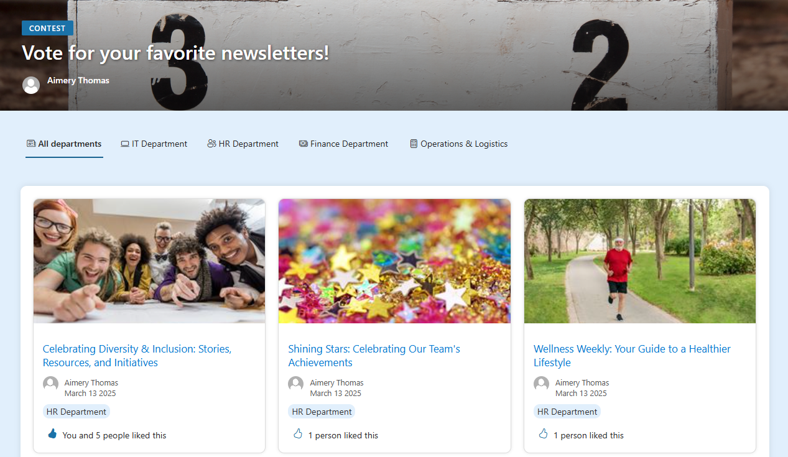
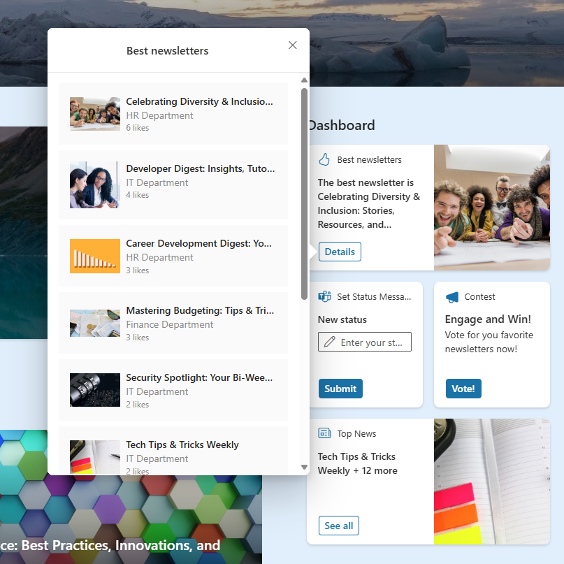

---
# this is the title
title: "SharePoint 2025 Hackathon: Newsletter contest"
# this is the publishing date of your article, usually this should match "now"
date: 2025-04-22T08:40:00-04:00
# This is your name
author: "Aimery Thomas"
# This is your GitHub name
githubname: a1mery
# Don't change
categories: ["Community post"]
# Link to the thumbnail image for the post
images:
- images/home.png
# don't change
tags: []
# don't change
type: "regular"
---

## Covered scenario and project's overview

This project was initially submitted for the SharePoint Hackathon, which took place from March 3 to March 15, 2025.
This scenario involves a company intranet with a SharePoint Hub site (Home site) with 4 department sites (communication sites associated to the hub).
Each department contributor can publish news on their respective department site.

The objective of the project is to create a newsletter contest, allowing any company employee to vote for their favorite news directly from the intranet's main portal (Hub).

## Homepage and hub presentation

### Hub site

The home site of the intranet is a hub site with the following elements:

- A Viva Connections Dashboard with multiple cards to help the business. It also contains a card to display most liked newsletters (this card will be covered in the 'Voting experience' section)
- A home page with an editorial card to announce newsletter contest and the voting page.
- A contest page to introduce the contest with conditions and challenges.
- A voting page where users can vote for their favorite newsletters (this page will be covered in the 'Voting experience' section).

### Department site

There are 4 department sites associated to the hub.
Each department site is a standard SharePoint communication site where contributors can create newsletters (SharePoint news) that will be available  for the voting contest.
It is recommended that the news contains a banner image so it is displayed nicely on the voting page.


## Voting experience

### Voting page

To allow intranet users to vote, a specific voting page is available.
From a technical perspective, this page is using PnP Modern Search Components (5 PnP Search Results and 1 PnP Search Verticals).

- PnP Search Results: 
They are used to display newsletters from all department sites - 1 PnP Search results for all newsletters and 1 PnP Search results for each department.
Each search result web part is using the same custom layout.
A custom web component built with SharePoint Framework is deployed on each PnP Search result web part to add a "like" button to allow users to vote. It is using the built-in "like page" SharePoint feature so there are no specific backend/data tables to store votes.
The web component (`like-result-component`) is inserted in the PnP Modern Search layout results as follows:


```typescript
<div class="grid-container">
    {{#each data.items as |item|}}
    <div class="card">
        
        <div class="card-content">
            <a href="{{item.Path}}" class="card-title">{{item.Title}}</a>
            <div class="author">
                
                <p class="card-meta"><span>{{#with (split (slot item @root.slots.Author) '|')}}
    {{[1]}}
    {{/with}}</span><br>{{getDate item.LastModifiedTime "MMMM DD YYYY"}}</p>
            </div>
            // custom web component
            <like-result-component
                data-tenant-url="https://myTenant.sharepoint.com"
                data-page-url="{{item.Path}}"
                data-page-source-site="{{item.SPSiteURL}}"
                data-context="{{PageContext}}">
            </like-result-component>
        </div>
    </div>
    {{/each}}
</div>
```

Parameters such as tenant URL, page URL etc. are required to implement the like feature.
To have more details about this custom web component, you can watch the following recording: [Viva Connections and SharePoint Framework community call 20th of February 2025](https://youtu.be/e3f-j8uWGSw?list=PLR9nK3mnD-OXdcwfcHGsGr78nHWLRsv1x&t=1717)


- PnP Search Verticals:
They are used to as tabs to "navigate" from one PnP Search results component to another.
Each vertical displays one PnP Search Results web part.



### Viva Connections Dashboard

On the intranet home page, the Viva Connections Dashboard features a custom adaptive card extension developed using the SharePoint Framework. This extension shows newsletters from all department sites and organizes the retrieved pages based on the number of likes.



## Conclusion

This submission provided an nice opportunity to integrate two SPFx samples, effectively addressing a real-world scenario.

## More information?

- [Project: Newsletter contest](https://github.com/SharePoint/sharepoint-hackathon/issues/20)
- [PnP Modern Search](https://microsoft-search.github.io/pnp-modern-search/)
- [Most Liked Pages](https://github.com/pnp/sp-dev-fx-aces/tree/main/samples/ImageCard-MostLikedPages)
- [PnP Modern Search - Like component](https://github.com/a1mery/pnp-modern-search-like-component)
- [PnP Modern Search Layouts - Banner Cards](https://github.com/microsoft-search/pnp-modern-search-layouts/blob/main/Results/Banner%20Cards/README.md)


