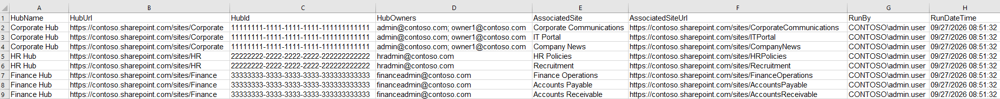

Governance conversations often start with a simple question:

> "Can you give me a list of all our Hub Sites, the connected sites, and who administers them?"

It sounds straightforward, but in larger Microsoft 365 environments, the answer is not always immediately available. Hub Sites can grow over time, ownership can change, new associated sites are created, and administrators move between teams. Without a reliable way to report on that information, it becomes difficult to maintain visibility and demonstrate good governance.

That challenge led me to build a PowerShell-based Hub Site governance report for SharePoint Online.

## When Visibility Becomes the Real Problem

SharePoint Hub Sites play an important role in organising content and connecting related sites across an organisation. From a governance perspective, however, understanding the structure is only part of the picture.

What I was really interested in knowing was:

- Which Hub Sites exist in the tenant?
- Which sites are associated with each Hub?
- Who are the Site Collection Administrators responsible for those sites?
- When was the report generated, and by whom?

While much of this information is available through Microsoft 365 administration tools, gathering it consistently and turning it into an auditable report still requires effort. The process becomes even more challenging when dealing with multiple Hub Sites and a large number of associated sites.

## Building a Repeatable Reporting Process

Rather than manually collecting information whenever it was needed, I wanted a repeatable process that could provide a reliable snapshot of the environment.

The result was a PowerShell script built with PnP.PowerShell and certificate-based app-only authentication. Using app-only authentication means the script can run without requiring interactive sign-in, making it more suitable for scheduled reporting and automation scenarios.

The script connects to the SharePoint Online Admin Centre, retrieves all registered Hub Sites, identifies their associated sites, and gathers Site Collection Administrator information.

To make the output useful for governance and audit purposes, the report also captures:

- The account used to execute the script
- The execution timestamp
- Hub Site details
- Associated site information
- Site Collection Administrator details

The results are exported to a timestamped CSV file for further analysis and record keeping.

## Designing for Real-World Administration

One area I paid particular attention to was error handling.

In many reporting solutions, a single site with permission issues or unexpected configuration can cause the entire script to fail. For governance reporting, that can be frustrating because most of the data may still be available.

To avoid that situation, the script includes error handling that allows processing to continue even if information cannot be retrieved from an individual Hub Site. This approach helps ensure the report completes while still highlighting areas that may require investigation.

## Why This Matters

The value of the report is not the CSV file itself. The value comes from the visibility it provides.

Having a current inventory of Hub Sites, associated sites, and administrators can support:

- Governance reviews
- Audit preparation
- Ownership validation
- Administrative access reviews
- Documentation and knowledge transfer

It also provides a useful baseline when planning wider Microsoft 365 initiatives, where understanding site ownership and accountability becomes increasingly important.

## Looking Ahead

The current solution focuses on reporting, but there are several areas that could be explored further:

- Additional governance metadata
- Ownership validation checks
- Scheduled execution and automated report delivery
- Trend reporting across multiple report runs
- Power BI visualisation of Hub Site relationships

## Resources

- The full script is available on GitHub here: **[https://pnp.github.io/script-samples/spo-hub-site-governance-report/README.html?tabs=pnpps](https://pnp.github.io/script-samples/spo-hub-site-governance-report/README.html?tabs=pnpps)**

## Community Discussion

- How are you currently tracking Hub Site ownership and administration in your SharePoint Online environment?
- Do you rely on manual reviews, custom reporting, third-party tools, or something else entirely?

I'd be interested to hear how others are approaching Hub Site governance and what information you consider most valuable in a governance report.
