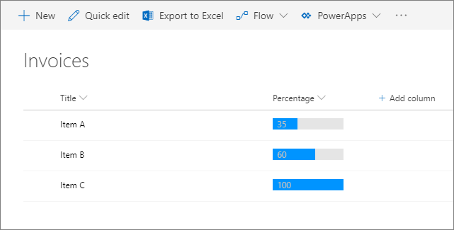
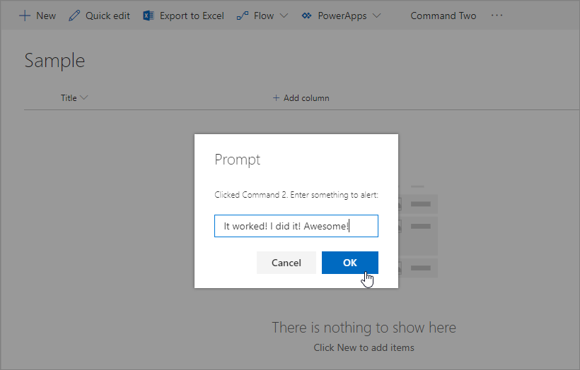
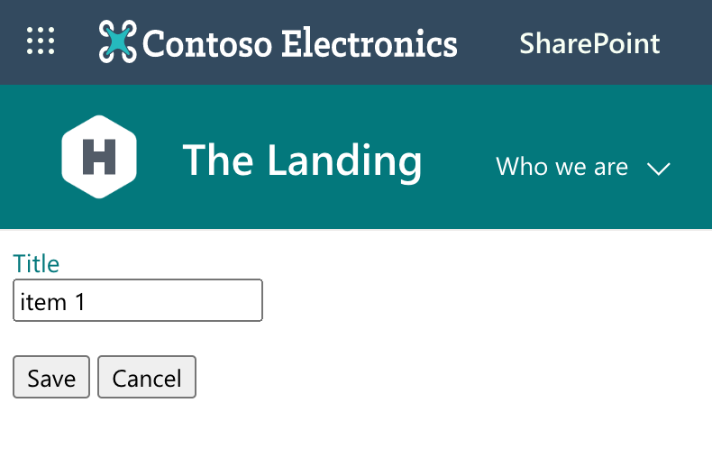

[SharePoint Framework](https://aka.ms/spfx) (SPFx) is an extensibility model for Microsoft 365 enabling developers to build different kinds of extensibility for Microsoft Viva, Microsoft Teams, Outlook, Microsoft 365 app (Office), and SharePoint. SPFx has multiple benefits like automatic Single Sign On, automatic hosting in the customer tenant, reuse same code across the service and industry standard web stack tooling.

-	*I need to customize SharePoint Online UX and not just web parts, what can SPFx provide for me?*
-	That is a great question. Let’s elaborate on the different options which the SPFx extensions can provide on customizing SharePoint Online experiences.


This blog post is part of a month long SPFx series for January 2023. Each business day we'll publish a new blog post covering different aspects of the SPFx.

* Previous blog post in this series - [Getting started with SPFx – Building your first extensibility for Microsoft 365](https://pnp.github.io/blog/post/spfx-02-getting-started-with-spfx/)
* Next blog post in this series - [Using Microsoft Graph with SPFx solutions](https://pnp.github.io/blog/post/spfx-04-using-microsoft-graph-in-spfx-solutions/)


## Introduction to SPFx extensions for SharePoint Online

SPFx extensions provide a safe way to extend and customize SharePoint Online experiences without impacting the improvements which Microsoft provides to the user interface. In classic SharePoint user interface was often modified by fully overriding the out of the box experience. This, however, blocked any new features from being deployed and therefore caused maintenance and operational challenges for customers, which caused significant operational challenges and reduction of the value provided by the platform.

As part of the introduction of SharePoint modern experiences, Microsoft also introduced the SPFx extensions as an option to safely extend SharePoint Online in future proven techniques. There are quite a few different extension options available, enabling significant extensibility options across SharePoint experiences.

Key difference between extensions and web parts in the SharePoint is that the web parts are designed to be added on the pages by the content editors using the web part picker and you can configure them based on your business needs. SPFx extensions however are added on the UX by using the automation in the SPFx packaging and they cannot by default be configured by content editors.

## Different SPFx extensions for SharePoint Online

Here are the different kinds of extensions which are available for building user interface extensibility for SharePoint Online currently.

### Application customizers

Can be used to add custom html to specific content placeholders in the page or even to inject additional html structures to the page. You can for example use the application customizers to add a custom top menu or custom footer which is visible across all the SharePoint pages.

Application customizers is the easiest way to get started on creating your first SPFx extension. Here's an example image with the field customizer rendering

See following getting started series to understand the development and deployment model for them.

**Build your first SharePoint Framework Extension (Hello World part 1)**

- [Tutorial documentation](https://learn.microsoft.com/sharepoint/dev/spfx/extensions/get-started/build-a-hello-world-extension)
- [Tutorial in video format in YouTube](https://www.youtube.com/watch?v=DnfRIl2YN8g&list=PLR9nK3mnD-OXtWO5AIIr7nCR3sWutACpV)



**Build your first SharePoint Framework Extension (Hello World part 1)**

- [Tutorial documentation](https://learn.microsoft.com/sharepoint/dev/spfx/extensions/get-started/using-page-placeholder-with-extensions)
- [Tutorial in video format in YouTube](https://www.youtube.com/watch?v=Wm1PG8U5bSw&list=PLR9nK3mnD-OXtWO5AIIr7nCR3sWutACpV&index=2)



**Deploy your extension to SharePoint (Hello World part 3)**

- [Tutorial documentation](https://learn.microsoft.com/sharepoint/dev/spfx/extensions/get-started/serving-your-extension-from-sharepoint)
- [Tutorial in video format in YouTube](https://www.youtube.com/watch?v=tReoZGtAYB4&list=PLR9nK3mnD-OXtWO5AIIr7nCR3sWutACpV&index=3)



**Host an SPFx extension from the Microsoft 365 CDN (Hello World part 4)**

- [Tutorial documentation](https://learn.microsoft.com/sharepoint/dev/spfx/extensions/get-started/hosting-extension-from-office365-cdn)
- [Tutorial in video format in YouTube](https://www.youtube.com/watch?v=xsZbRliakyM&list=PLR9nK3mnD-OXtWO5AIIr7nCR3sWutACpV&index=4)



**Example solutions on the application customizers**

- [Microsoft Clarity for modern SharePoint](https://adoption.microsoft.com/en-us/sample-solution-gallery/sample/pnp-sp-dev-spfx-extensions-js-application-microsoft-clarity/) by [João Ferreira](https://adoption.microsoft.com/en-us/sample-solution-gallery/joaoferreira/) (Appspace)
- [News Ticker](https://adoption.microsoft.com/en-us/sample-solution-gallery/sample/pnp-sp-dev-spfx-extensions-react-application-news-ticker/) by [Ari Gunawan](https://adoption.microsoft.com/en-us/sample-solution-gallery/AriGunawan/)
- [Machine Translations Extension](https://adoption.microsoft.com/en-us/sample-solution-gallery/sample/pnp-sp-dev-spfx-extensions-react-application-machine-translations/) by [Robin Agten](https://adoption.microsoft.com/en-us/sample-solution-gallery/agtenr/) (Delaware Consulting)
- [Breadcrumb Application Customizer](https://adoption.microsoft.com/en-us/sample-solution-gallery/sample/pnp-sp-dev-spfx-extensions-react-application-breadcrumb/) by [Elio Struyf](https://adoption.microsoft.com/en-us/sample-solution-gallery/estruyf/)
- [Announcements SharePoint Framework Application Customizer](https://adoption.microsoft.com/en-us/sample-solution-gallery/sample/pnp-sp-dev-spfx-extensions-react-application-announcements/) by [Mike Myers](https://adoption.microsoft.com/en-us/sample-solution-gallery/thespooler/)

### Field customizers for lists and libraries

Field customizers can be used to change the default rending logic of a field in SharePoint lists or libraries using JavaScript. They enable complex rendering options of the value – for example showing graphical presentation of the field value rather than simply rendering the numeric value of the field.

Field customizers are only supported in the read-only mode, which means that you cannot override the editing experience of the field with it.

Here's an example image with the field customizer rendering

**Build your first Field Customizer extension**

- [Tutorial documentation](https://learn.microsoft.com/sharepoint/dev/spfx/extensions/get-started/building-simple-field-customizer)
- [Tutorial in video format in YouTube](https://www.youtube.com/watch?v=mBZ7Sq_KfDA&list=PLR9nK3mnD-OXtWO5AIIr7nCR3sWutACpV&index=5)



**Example solutions around field customizers**

- [Displaying the current user permission with PNPJs](https://adoption.microsoft.com/en-us/sample-solution-gallery/sample/pnp-sp-dev-spfx-extensions-react-field-user-permission/) by [Simon Ågren](https://adoption.microsoft.com/en-us/sample-solution-gallery/simonagren/) (Advania)
- [Toggle Field Customizer](https://adoption.microsoft.com/en-us/sample-solution-gallery/sample/pnp-sp-dev-spfx-extensions-react-field-toggle/) by [Giuliano De Luca](https://adoption.microsoft.com/en-us/sample-solution-gallery/giuleon/)
- [File Type Renderer](https://adoption.microsoft.com/en-us/sample-solution-gallery/sample/pnp-sp-dev-spfx-extensions-react-field-pnp-file-type-renderer/) by [Alex Terentiev](https://adoption.microsoft.com/en-us/sample-solution-gallery/AJIXuMuK/) (Microsoft)

### List View Command Sets for lists and libraries

List view command sets can be used to add new buttons and code to be executed in the toolbar or context menu of lists and libraries. They are for example a convenient way to integrate your solution to document management processes with the document libraries.

Here's an example image with the field customizer rendering

- [Tutorial documentation](https://learn.microsoft.com/sharepoint/dev/spfx/set-up-your-developer-tenant)
- [Tutorial in video format in YouTube](https://www.youtube.com/watch?v=uaUGtLrNbRA&list=PLR9nK3mnD-OXtWO5AIIr7nCR3sWutACpV&index=6)



**Example solutions around list view**

- [Send-To-Teams - Command Set](https://adoption.microsoft.com/en-us/sample-solution-gallery/sample/pnp-sp-dev-spfx-extensions-react-send-to-teams/) by [João Mendes](https://adoption.microsoft.com/en-us/sample-solution-gallery/joaojmendes/)
- [Configure a Page as Single App Part page](https://adoption.microsoft.com/en-us/sample-solution-gallery/sample/pnp-sp-dev-spfx-extensions-react-command-singlepartapppage/) by [Luis Mañez](https://adoption.microsoft.com/en-us/sample-solution-gallery/luismanez/) (ClearPeople)
- [Follow Document](https://adoption.microsoft.com/en-us/sample-solution-gallery/sample/pnp-sp-dev-spfx-web-parts-react-follow-document/) by [André Lage](https://adoption.microsoft.com/en-us/sample-solution-gallery/aaclage/) (Datalynx AG)
- [Save and convert as PDF by PnP](https://adoption.microsoft.com/en-us/sample-solution-gallery/sample/pnp-sp-dev-spfx-extensions-react-command-convert-to-pdf/) by [Mikael Svenson](https://adoption.microsoft.com/en-us/sample-solution-gallery/wobba/) (Microsoft)
- [Generate QR Code List Item Command View Set](https://adoption.microsoft.com/en-us/sample-solution-gallery/sample/pnp-sp-dev-spfx-extensions-react-command-qrcode/) by [Hugo Bernier](https://adoption.microsoft.com/en-us/sample-solution-gallery/hugoabernier/) (Microsoft)

### List form customizer

Form customizers are SharePoint Framework components giving you an option to override the form experience in a list or library level by associating the component to the used content type. Form customizer components can be used in SharePoint Online, and you build them using modern JavaScript tools and libraries.

Here's an example image with the field customizer rendering

- [Tutorial documentation](https://learn.microsoft.com/sharepoint/dev/spfx/set-up-your-developer-tenant)
- [Getting started on building custom list form experiences with SharePoint Framework](https://www.youtube.com/watch?v=ihDjrIdfPNA)



**Example solutions around form customizers**

- [SPFx form customizer basics](https://adoption.microsoft.com/en-us/sample-solution-gallery/sample/pnp-spfx-reference-scenarios-spfx-formcustomizer-basics/) by [Waldek Mastykarz](https://adoption.microsoft.com/en-us/sample-solution-gallery/waldekmastykarz/) (Microsoft)
- [React Form Customizer (Customers)](https://adoption.microsoft.com/en-us/sample-solution-gallery/sample/pnp-sp-dev-fx-extensions-react-formcustomizer-customers/) by [Ejaz Hussain](https://adoption.microsoft.com/en-us/sample-solution-gallery/ejazhussain/) (Content & Cloud)

## Frequent questions around SPFx extensions for SharePoint Online

**Can I deploy extension only to be available in specific site?**

Yes. This would mean that you configure the solution to be site specific in the package-solution.json file (set `skipFeatureDeployment` as `false`). This then means that before the solution is available, it will need to be explictly installed on the site where it should be activated. In this scenario any web part would be then avaialble in the site level specifically and for the extensions, you'd use teh feature activation at the site level to activate the feature for example in document libraries.

**Can I deploy extensions to be available across the tenant?**

Yes. You can do this by taking advantage of two options which are available for SPFx solution - tenant scoped deployment and tenant wide deployment of extensions. Tenant scoped deployment means that all components in the SPFx solution are automatically avaialble across the tenant whenever the solution is deployed to tenant app catalog. [Tenant wide deployment of extensions](https://learn.microsoft.com/sharepoint/dev/spfx/extensions/basics/tenant-wide-deployment-extensions) provides you an option to associate the SPFx extensions at the list and library level across the tenant with centralized control at the app catalog level. This way you can for example enable your custom menu items to all document libraries across the tenant.

**How do I configure extensions?**

SPFx extensions are configured using the instance parametrization. This means that you cannot configure them by default from the UX level, but you'd rather configure them as part of the deployment with the instance parameters. This also means that end users cannot configure the extension instances in the same way as web parts. You could though also expose custom UX elements to configure the instances for your extension. This is an advance scenario, but could be done.

**I’m using Application Customizer to inject custom CSS to the page – is this supported?**

This is quite commonly used scenario to for example adjust the suite navigation rendering or other elements in the out of the box experiences. As it's all HTMl and JavaScript, this can be relatively easily achieved and cannot be blocked, but it's not supported. This kind of adjustment of out of the box features can cause issues whenver Microsoft deployes new features and capabilities. Whenever you'd then open a support ticket, you will be asked to demonstrate that the issue also happens without the active SPFx extensions.

## References

Here are some initial references to get started with the SPFx in your development. Please do provide us with feedback and suggestions on what is needed to help you to get started with the SPFx development for Microsoft 365.

-	SPFx documentation – https://aka.ms/spfx
-	Issues and feedback around SPFx - https://aka.ms/spfx/issues
-	Microsoft 365 Platform Community – https://aka.ms/m365/community
-	Public SPFx and other community calls – https://aka.ms/m365/calls
    - These calls are for everyone to take advantage to stay up to date on the art of possible within Microsoft 365 and to provide guidance for beginners and more advance users
-	SPFx samples in the Microsoft 365 Unified Sample gallery – https://aka.ms/m365/samples
- SPFx extension sample gallery - https://aka.ms/spfx-extensions

- - -

We will provide more details on the different options and future direction of the SPFx in upcoming blog posts. This post focused on the getting started steps with SPFx - more details coming up with this series with one post within each business day of January 2023.
