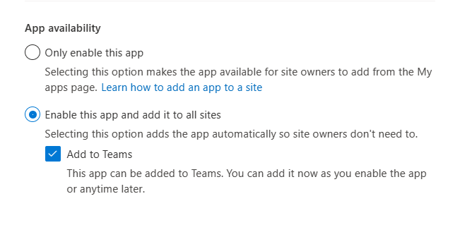

[SharePoint Framework](https://aka.ms/spfx) (SPFx) is an extensibility model for Microsoft 365 enabling developers to build different kinds of extensibility for Microsoft Viva, Microsoft Teams, Outlook, Microsoft 365 app (Office), and SharePoint. SPFx has multiple benefits like automatic Single Sign On, automatic hosting in the customer tenant, reuse same code across the service and industry standard web stack tooling.

-	*Is there away to target SPFx solution or features only for a specific set of users and if so, how would I do that?*
-	That is a great question. You can target the SPFx solution deployment in a site scope, which would enable you to have the solution only available for specific set of people who can access the site.


This blog post is part of a month long SPFx series for January 2023. Each business day we'll publish a new blog post covering different aspects of the SPFx.

* Previous blog post in this series - [Using Microsoft Graph with SPFx solutions](https://pnp.github.io/blog/post/spfx-04-using-microsoft-graph-in-spfx-solutions/)


## Decising the scope of your solution

SPFx solutions can be deployed in two different scopes which determine the scope where the solution is activated as part of the deployment. In both cases the SPFx solution is first deployed to the tenant app catalog as an administrative action.

This feature was introduced as part of the v1.4 version and was later updated as the default option for all new SPFx solutions. When a solution is scoped at the tenant level, it means that all components in the solution are automatically available across the tenant when solution is deployed to app catalog. This for example means that any web part which is in the solution, will be automatically exposed in page level web part picker across the tenant.

Here’s how the scope impacts the solution deployment

-	Site scoped deployment – Components in the solution are only available in the sites where the solution is explicitly installed after it has been deployed to the tenant app catalog
-	Tenant wide deployment - Compoents in the solution are immediately available across the tenant when the solution is deployed to app catalog

In general, most of the SPFx solutions are nowadays deployed using the tenant scoped deployment option as it makes sure that the features and capabilities are immediately available as they are deployed to app catalog by the administrator. 

You can control this setting by using `skipFeatureDeployment setting` in the `package-solution.json`. The name of this setting is quite confusing and has longer historical reason (see FAQ section for details). When the setting is `true`, SPFx solution is scoped at the tenant level with visual indication on this for the administrator as part of the solution deployment.

It’s important to notice that regardless of the deployment scope – if you are using the auto-hosted feature for the SPFx solution, there’s only one version of the component implementation hosted. This means that whenever we deploy a new version of the solution to app catalog, all instances of the SPFx components are updated across the tenant.

See following article for more details on the tenant scope deployment

- [Tenant-scoped solution deployment for SharePoint Framework solutions](https://learn.microsoft.com/en-us/sharepoint/dev/spfx/tenant-scoped-deployment)

Here's a bit [outdated video](https://www.youtube.com/watch?v=pemHOZCSwZI) on using the tenant scoped deployment of the SPFx solutions - User interface elements have evolved a bit, but the basic steps are still exactly the same.



## Frequent questions around tenant scoped deployment

**Why is the setting called skipFeatureDeployment?** 

This is due the historical reasons and has reference to the classic SharePoint feature framework. When a solution is site scoped, it can use [feature framework xml elements to automatically provisioning assets](https://learn.microsoft.com/en-us/sharepoint/dev/spfx/web-parts/get-started/provision-sp-assets-from-package) to the site when solution is being installed. 

So the initial naming was refering to this behaviour - are you looking to skip the feature feature deployment and simply have the solution deployed automatically. Due the backward compatibility reasons, we have not updated the name of this setting, but it's indeed quite confusion.

How about having attribute called `tenant-scoped-deployment` with boolean value... yes. That's how it should be. Maybe we'll update this in future SPFx versions and have support for both.

**Does the scope impact SPFx solution used outside of SharePoint** 

Not really and by default it’s good practice to use the tenant scoped option for these to avoid any scope related issues. This will ensure that SPFx powered extensibility for Microsoft Teams, Microsoft Viva, Outlook and Microsoft 365 app (Office) will work without issues. 

Technically there are options to use site scope option with these scenarios as well, but additional value of that is limited.

**I’d like to get my extensions also available automatically in the tenant – how would this work?** 

You’d combine the tenant scoped deployment and tenant wide deployment of extensions feature. We will cover this option in more detailed for extensions in upcoming blog post. 

**I'm using tenant scope deployment with Microsoft Graph APIs - will components be visible for end users before the API requests are approved?** 

This is an interesting question. It's quite common that you'd combine tenant scope deployment with solutions which are asking API permissions. API permissions are granted for the SPFx solution after the solution has been activated. This does mean that there's a timeframe in the deployment, when the components in the solution are already exposed for example in the web part picker, but if the API approval has not yet happened, they would not work properly.

It's recommended to handle the possible exceptions with the API calls gracefully to avoid issues with this model. We do also recommend administrators to know advance what the solutions contains - so that there's no reason to delay the potential API approval after the deployment.

## References

Here are some initial references to get started with the SPFx in your development. Please do provide us with feedback and suggestions on what is needed to help you to get started with the SPFx development for Microsoft 365.

-	SPFx documentation – https://aka.ms/spfx
-	Issues and feedback around SPFx - https://aka.ms/spfx/issues
-	Microsoft 365 Platform Community – https://aka.ms/m365/community
-	Public SPFx and other community calls – https://aka.ms/m365/calls 
    - These calls are for everyone to take advantage to stay up to date on the art of possible within Microsoft 365 and to provide guidance for beginners and more advance users
-	SPFx samples in the Microsoft 365 Unified Sample gallery – https://aka.ms/m365/samples

- - -

We will provide more details on the different options and future direction of the SPFx in upcoming blog posts. This post focused on the getting started steps with SPFx - more details coming up with this series with one post within each business day of January 2023.
