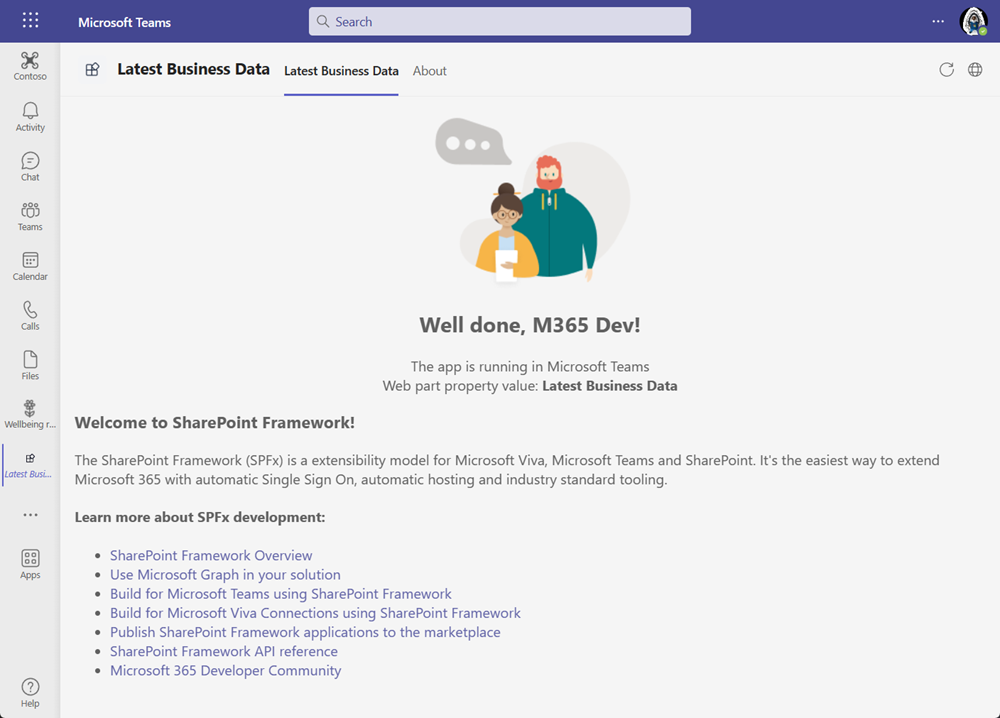
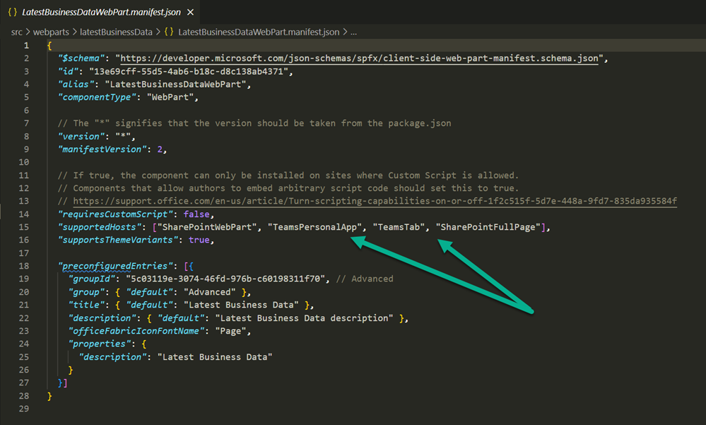
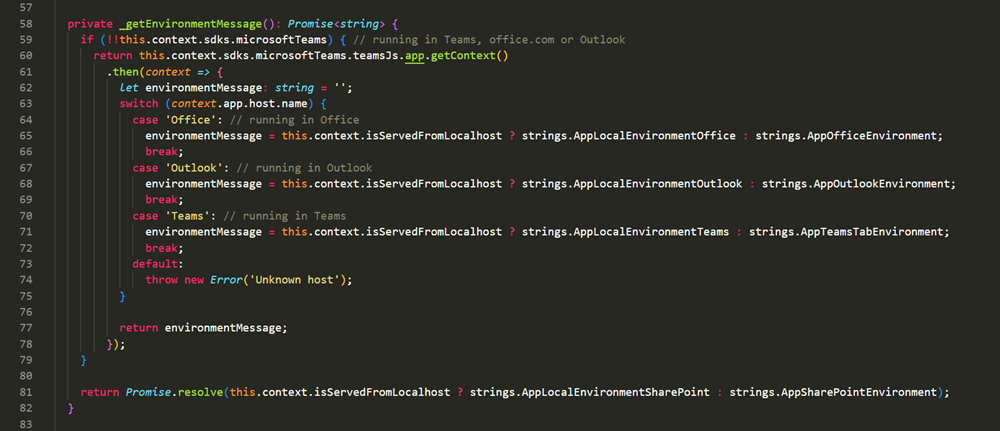
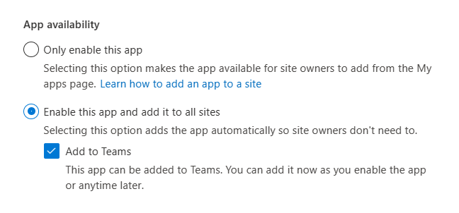
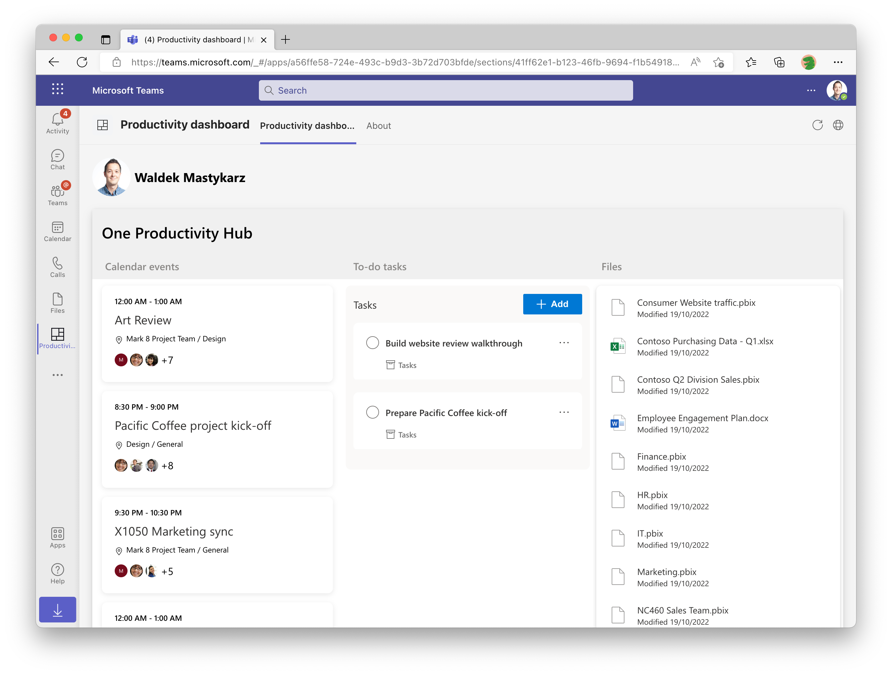

[SharePoint Framework](https://aka.ms/spfx) (SPFx) is an extensibility model for Microsoft 365 enabling developers to build different kinds of extensibility for Microsoft Viva, Microsoft Teams, Outlook, Microsoft 365 app (Office), and SharePoint. SPFx has multiple benefits like automatic Single Sign On, automatic hosting in the customer tenant, reuse same code across the service and industry standard web stack tooling.

-	*How would I use the SPFx for creating Microsoft Teams solutions? Is that difficult?*
-	That is a great question. This is not difficult at all and you can create production ready SPFx solutions for Microsoft Teams in matter of minutes.


This blog post is part of a month long SPFx series for January 2023. Each business day we'll publish a new blog post covering different aspects of the SPFx.

* Previous blog post in this series - [What does tenant or site scoped deployment mean for SPFx solutions?](https://pnp.github.io/blog/post/spfx-05-tenant-or-site-scoped-spfx-solutions/)
* Next blog post in this series - [Automatic hosting of SPFx code in Microsoft 365](https://pnp.github.io/blog/post/spfx-07-automatic-hosting-spfx-solutions/)


## Creating SPFx solutions for Microsoft Teams

SPFx is the easiest and fastest way to build solutions for Microsoft Teams. Any SPFx web part can be also exposed as a personal app or a channel tab just by defining the Teams as a supported host - without actual code changes. This setting is enabled by default for all new SPFx solutions.

Given the single sign on (SSO) and automatic hosting of SPFx solutions also for Microsoft Teams, this means that you can create production ready SPFx solutions for Microsoft Teams in matter of minutes, depending of course on the complexity of your code. Automatic-hosting and default packaging of the solution will ensure that you can package and deploy any SPFx solution in production mode within matter of minutes, even with the Microsoft Graph API access.

SPFx is streamlined for Microsoft Teams development with by default enabling the solution to be also available in the Microsoft Teams. This is simply done by adding the Microsoft Teams as an supported host for the web part – which then enables the solution to be automatically deployed to Microsoft Teams when it’s installed on the SharePoint app catalog.

In the code you can also easily detect where the code is being executed and change the code paths based on that. This is demonstrated on the default project output when you create a new solution.

When you install SPFx solution to the SharePoint app catalog, the content of the solution package is analyzed and the option to publish the solution automatically also in the Microsoft Teams is shown when suitable. This streamlines the deployment process of having the solution easily available across the Microsoft 365.

Documentation

-	[Build Microsoft Teams tab using SharePoint Framework - Tutorial](https://learn.microsoft.com/sharepoint/dev/spfx/web-parts/get-started/using-web-part-as-ms-teams-tab)
-	[Expose SharePoint Framework web parts in Microsoft Teams](https://learn.microsoft.com/sharepoint/dev/spfx/build-for-teams-expose-webparts-teams)
-	[Microsoft Teams platform documentation – Build your first app with SPFx](https://learn.microsoft.com/microsoftteams/platform/sbs-gs-spfx?tabs=vscode%2Cviscode)

Here's a bit [outdated video](https://www.youtube.com/watch?v=JoTAC2i-XeU) on building Microsoft Teams application using SPFx.



Here’s a great sample of a SPFx powered Microsoft Teams solutions. This solution is also using Microsoft Graph Toolkit and contains only a few lines of code but provides a nice scenario for having access to your personal information.

-	[One Productivity Hub powered by SharePoint Framework](https://github.com/pnp/spfx-reference-scenarios/tree/main/samples/spfx-productivity-dashboard)

## Frequent questions on using SPFx for Microsoft Teams solutions

**Is using SPFx for Teams only for SharePoint developers?**

No. SPFx is for any developer who is looking to build using web stack development tooling and with the other benefits. If you have an existing SaaS service (web site), you'd most likely rather use the Microsoft Teams app model, but SPFx is a great option esspecially for enterprise development scenarios.

**Why would I use SPFx for creating my Microsoft Teams app?**

Using SPFx is the easiest and fastest way to build the solution for Microsoft 365. You have automatic single-sing on and your code is automatically hosted in the tenant where it’s being deployed. This provides two main benefits – no reason to host the code externally, for example in Azure and it also creates a security boundary for the customer tenant – no code is loaded from external sources. This provides administrative control and governance of what’s running in the tenant.

**Am I packaging then two solutions to same package for deployment?**

No. The same piece of code or application can be executed within Microsoft Teams or in SharePoint (or in other Micoroft 365 applications). This is not duplicating code or creating two different applications, it’s all about reusing the same code across the different services. Write once and expose the application in Microsoft Teams, Microsoft Viva, Outlook, Microsoft 365 app (office) or SharePoint.

**Why there is not different TypeScript base classes for Teams vs web parts?**

There’s no need for that. You can consider a web part as a widget. It’s not specific for SharePoint. It’s a web widget designed to be created using TypeScript and to access services and APIs within Microsoft 365.

**Is this the same story as publishing SharePoint pages in Microsoft Teams?**

No. Embedding SharePoint sites and pages to Microsoft Teams is also possible and fully supported. SPFx scenario means that you build you solution as a web widget (web part) using TypeScript. This is then packaged and published from the automatic hosting platform as an individual component. Not as a SharePoint page.

## References

Here are some initial references to get started with the SPFx in your development. Please do provide us with feedback and suggestions on what is needed to help you to get started with the SPFx development for Microsoft 365.

-	SPFx documentation – https://aka.ms/spfx
-	Issues and feedback around SPFx - https://aka.ms/spfx/issues
-	Microsoft 365 Platform Community – https://aka.ms/m365/community
-	Public SPFx and other community calls – https://aka.ms/m365/calls
    - These calls are for everyone to take advantage to stay up to date on the art of possible within Microsoft 365 and to provide guidance for beginners and more advance users
-	SPFx samples in the Microsoft 365 Unified Sample gallery – https://aka.ms/m365/samples

- - -

We will provide more details on the different options and future direction of the SPFx in upcoming blog posts. This post focused on the getting started steps with SPFx - more details coming up with this series with one post within each business day of January 2023.
