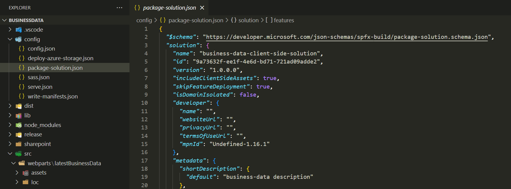
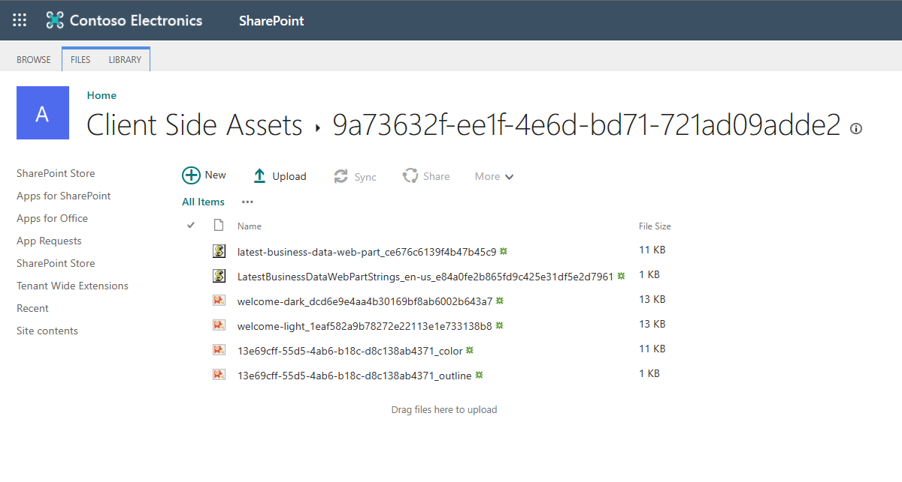

[SharePoint Framework](https://aka.ms/spfx) (SPFx) is an extensibility model for Microsoft 365 enabling developers to build different kinds of extensibility for Microsoft Viva, Microsoft Teams, Outlook, Microsoft 365 app (Office), and SharePoint. SPFx has multiple benefits like automatic Single Sign On, automatic hosting in the customer tenant, reuse same code across the service and industry standard web stack tooling.

-	*What does that automatic hosting of the SPFx solutions in Microsoft 365 means in practice? How does that work?*
-	That is a great question. Let's have a closer look on the internals of how the automatic hosting works in Microsoft 365


This blog post is part of a month long SPFx series for January 2023. Each business day we'll publish a new blog post covering different aspects of the SPFx.

* Previous blog post in this series - [Building SPFx solutions for Microsoft Teams](https://pnp.github.io/blog/post/spfx-06-spfx-for-teams/)
* Next blog post in this series - [How to use SPFx powered Microsoft Teams apps in Outlook and Office](https://pnp.github.io/blog/post/spfx-08-spfx-powered-teams-solutions-outlook-office/)


## Where is the code hosted and how does the packaging works

Pretty early on the SPFx roadmap, we introduced an option to include your SPFx components inside of the SPFx package and to get them automatically hosted in Microsoft 365. This was a great improvement as it meant that the developer or customer would not need to worry about where the code is being hosted, as that’s part of the provided services with the SPFx.

Before introduction of this great capability, you had to setup a web site for example in Azure and configure that to be available for hosting the required code. Depending on the customer, this could be easy, or the process could also be complex with approvals required from the IT organization. Hosting code also externally means extra operational and maintenance overhead, with additional security considerations.

Automatic hosting of the code was designed to reduce the complexity of solution deployment and hosting – as you’d no longer need an externally hosted web site. This feature was introduced with the SPFx v1.4 (December 2017) and is currently the default setting for all new SPFx solutions. Automatic hosting works for all SPFx solution types for Microsoft Viva, Microsoft Teams, Outlook, Microsoft 365 app (office) and SharePoint.

You control the packaging of your solution with `includeClientSideAssets` setting in the `package-solution.json` file. This instructs the solution build and package process either to package the JavaScript assets, images and other assets inside of the sppkg file (it’s a zip file) or alternatively not to include them there.

When SPFx solution is deployed to the app catalog, this setting is automatically detected and solution contains client-side assets, they will be extracted automatically to specific library in the app catalog site called *Client Side Assets* – located in the URL of `/ClientSideAssets` under the app catalog site where the solution are being centrally managed by administrators.

As SPFx components are then being used in Microsoft 365, the JavaScript files and associated assets are automatically referenced from this centralized location without requiring an externally hosted location. Of course, regardless of the chosen packaging model, you can still easily and securely call Microsoft Graph APIs and other assets in Microsoft Azure, so this setting has no impact on other areas.

## Frequent questions around automatic hosting of SPFx solutions

**Will automatic-hosting work for all different hosts where SPFx solutions can be used?**

Yes – This setting works across the different Microsoft 365 services which you can extend using SPFx solution.

**Can someone accidentally delete files from the ClientSideAssets library?**

Yes, but… you’d have to be site collection administrator in the app catalog site to be able to perform this. This is only then a possibility for the administrators of the tenant. Normal end users can only read the files from this folder structure when components are accessed.

**Does the Office 365 CDN configuration impact on this behavior?**

No. Not directly. Microsoft 365 detects automatically if the Office 365 CDN is enabled and servers the SPFx solution files automatically either directly from the library or using the Office 365 CDN with more optimized experience. We do recommend using the Office 365 CDN in general as it improves the performance of the Microsoft 365 experiences.

**Seems that Guest users cannot read the content from the ClientSideAssets library – is this correct?**

Yes. Gues users will not have by default read permission to this library. If you have however enabled the Office 365 CDN, code is automatically served from the CDN URLs which are available for the Guest users. You can potentially also update the permissions on this library as an administrator.

## References

Here are some initial references to get started with the SPFx in your development. Please do provide us with feedback and suggestions on what is needed to help you to get started with the SPFx development for Microsoft 365.

-	SPFx documentation – https://aka.ms/spfx
-	Issues and feedback around SPFx - https://aka.ms/spfx/issues
-	Microsoft 365 Platform Community – https://aka.ms/m365/community
-	Public SPFx and other community calls – https://aka.ms/m365/calls
    - These calls are for everyone to take advantage to stay up to date on the art of possible within Microsoft 365 and to provide guidance for beginners and more advance users
-	SPFx samples in the Microsoft 365 Unified Sample gallery – https://aka.ms/m365/samples

- - -

We will provide more details on the different options and future direction of the SPFx in upcoming blog posts. This post focused on the getting started steps with SPFx - more details coming up with this series with one post within each business day of January 2023.
