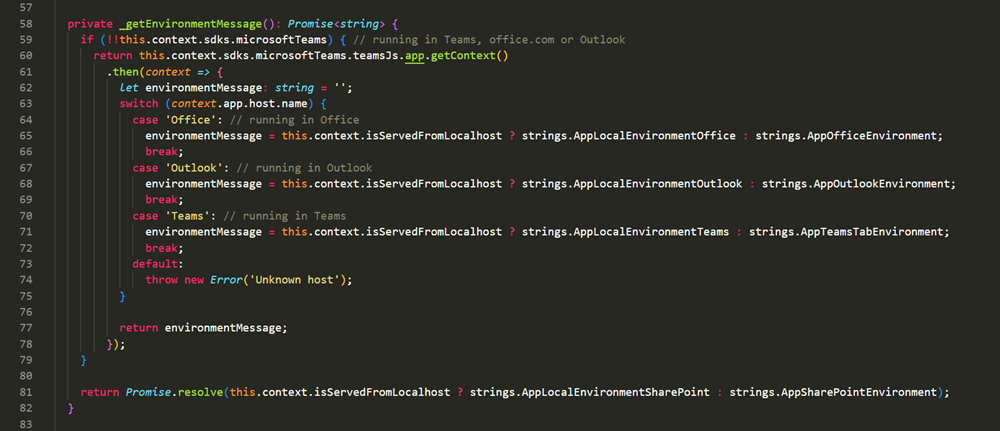
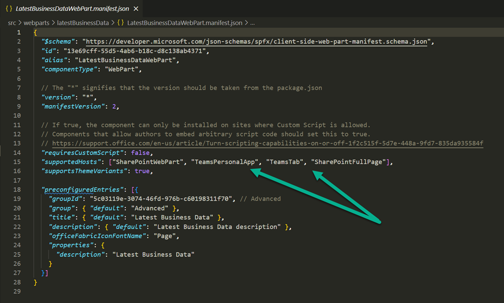
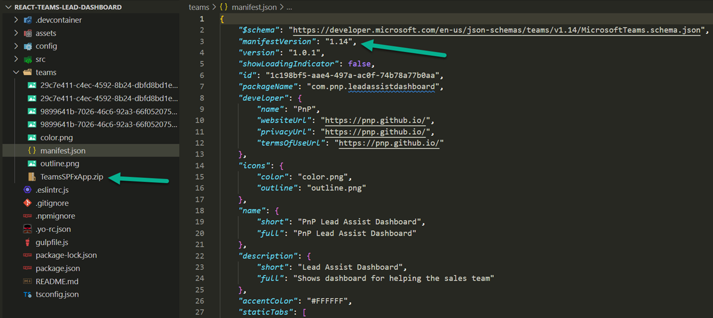

[SharePoint Framework](https://aka.ms/spfx) (SPFx) is an extensibility model for Microsoft 365 enabling developers to build different kinds of extensibility for Microsoft Viva, Microsoft Teams, Outlook, Microsoft 365 app (Office), and SharePoint. SPFx has multiple benefits like automatic Single Sign On, automatic hosting in the customer tenant, reuse same code across the service and industry standard web stack tooling.

-	*How do you target SPFx powerwed Microsoft Teams solutions also to Outlook and Office?*
-	That is a great question. This is actually automatic for all Microsoft Teams apps as long they are using Microsoft Teams JS SDK v2 and a mininim of Teams manifest version of 1.3. This means that any Microsoft Teams app is also available from the Outlook and Office if they are using relatively new versions of the dependencies.


This blog post is part of a month long SPFx series for January 2023. Each business day we'll publish a new blog post covering different aspects of the SPFx.

* Previous blog post in this series - [Automatic hosting of SPFx code in Microsoft 365](https://pnp.github.io/blog/post/spfx-07-automatic-hosting-spfx-solutions/)
* Next blog post in this series - [Building Microsoft Viva extensibility with SPFx](https://pnp.github.io/blog/post/spfx-09-building-microsoft-viva-extensibility-spfx/)


## How do we make the Microsoft Teams apps build with SPFx available in Outlook and Office?

With the SharePoint Framework (SPFx) v1.16 release we added support for the [Microsoft Teams JavaScript client SDK v2](https://devblogs.microsoft.com/microsoft365dev/microsoft-teams-js-sdk-v2-is-now-generally-available/). The Microsoft Teams JavaScript client SDK v2 introduced the ability to enable Microsoft Teams apps to run in Outlook at Office, in addition to Microsoft Teams.

This means that starting from the SPFx v1.16, any SPFx solution which is targeting Microsoft Teams, can be also exposed in Outlook or in Microsot 365 app (Office). You can also natively access the Teams JS SDK v2 in the context of the SPFx solution and detect the actual host running the code as shown in the below picture which is output from the default new project scaffolding.

By default we are also making the new web parts to support Microsof Teams by adding the Teams as supported host in the `supportedHosts` property at the web part manifest as shown in the below picture.

You will also need to consider the solution packaging and to ensure that you are using [Teams manifest](https://learn.microsoft.com/microsoftteams/platform/resources/schema/manifest-schema) version **1.13 or newer**, which will be then detected properly as part the deployment of the package. Notice that this is not currently supported with the automated `Sync to Teams` feature, but you can create used manifest manually and package that as part of your solution package. See the `TeamsSPFxApp.zip` file in the below picture which will be automatically packaged to the solution package and also synced automatically to Microsoft Teams as part of the deployment.

Here's an example solution story for this particular video which we prepared for the Ignite 2022 announcement. You can find this sample from [GitHub](https://github.com/pnp/sp-dev-fx-webparts/tree/main/samples/react-teams-lead-dashboard ). This is a React component which renders a dashboard style sample experience for end users.



We also demonstrated the setup and required steps in a recent [Microsoft 365 Platform Community call](https://aka.ms/m365/calls) and have released following recording from that demo.



Documentation

-	[Extend Outlook and Office with the SharePoint Framework ](https://learn.microsoft.com/sharepoint/dev/spfx/office/overview )
-	[Extend Teams apps across Microsoft 365](https://learn.microsoft.com/microsoftteams/platform/m365-apps/overview)

## Frequent questions around exposing SPFx solutions in Outlook and Office

**I tried this process and can’t get the Teams solutions visible in Outlook or Office - what could be wrong?**

This experience is still in preview for Outlook and Office, so it will not work in a normal production tenant. To enable the preview feature, you will need to configure the tenant to be in preview status for Office. See following article for more details – [Extend Teams apps across Microsoft 365](https://learn.microsoft.com/microsoftteams/platform/m365-apps/overview).

Notice that it can take up to 5 days for this setting to be applied.

**Does this mean that the SPFx support is still in preview?**

Yes and no. Technically SPFx already supports this experiences with the native support of Microsoft Teams v2 JavaScript SDK, but we are still waiting for this to be supported in the web and desktop versions of Outlook and Office. This is planned to happen later during 2023.

**Is there a way for me to target only one of the services – like only Outlook?**

Not currently, but this in the plans for the Teams manifest.

**At some point you were able to build Office add-ins with SPFx – is this the same thing?**

No. We did preview Office add-in model with SPFx few years back, but this is not the same model. This model focuses first on the Microsoft Teams personal app experience and exposing that across the other services. Other scenarios will be provided future.

## References

Here are some initial references to get started with the SPFx in your development. Please do provide us with feedback and suggestions on what is needed to help you to get started with the SPFx development for Microsoft 365.

-	SPFx documentation – https://aka.ms/spfx
-	Issues and feedback around SPFx - https://aka.ms/spfx/issues
-	Microsoft 365 Platform Community – https://aka.ms/m365/community
-	Public SPFx and other community calls – https://aka.ms/m365/calls
    - These calls are for everyone to take advantage to stay up to date on the art of possible within Microsoft 365 and to provide guidance for beginners and more advance users
-	SPFx samples in the Microsoft 365 Unified Sample gallery – https://aka.ms/m365/samples

- - -

We will provide more details on the different options and future direction of the SPFx in upcoming blog posts. This post focused on the getting started steps with SPFx - more details coming up with this series with one post within each business day of January 2023.
