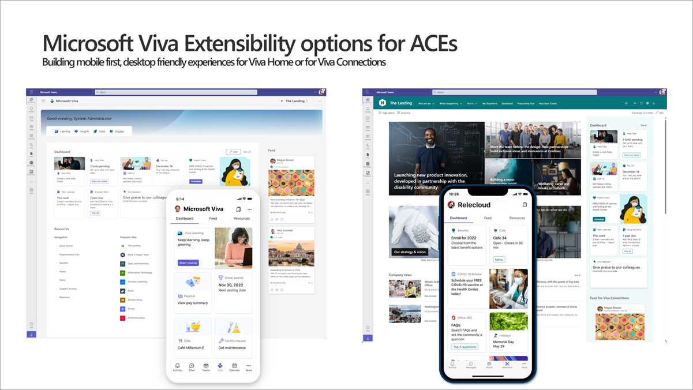

[SharePoint Framework](https://aka.ms/spfx) (SPFx) is an extensibility model for Microsoft 365 enabling developers to build different kinds of extensibility for Microsoft Viva, Microsoft Teams, Outlook, Microsoft 365 app (Office), and SharePoint. SPFx has multiple benefits like automatic Single Sign On, automatic hosting in the customer tenant, reuse same code across the service and industry standard web stack tooling.

-	*What are the extensibility options in the Microsoft Viva with SPFx?*
-	That is a great question. There are two main modules which you can current extend with SPFx in the Microsoft Viva offerings. These are Viva Connections and upcoming Viva Home. Viva Connections have both mobile and desktop experiences with different extensibility options and Viva Home is more aligned on both sides.


This blog post is part of a month long SPFx series for January 2023. Each business day we'll publish a new blog post covering different aspects of the SPFx.

* Previous blog post in this series - [How to use SPFx powered Microsoft Teams apps in Outlook and Office](https://pnp.github.io/blog/post/spfx-08-spfx-powered-teams-solutions-outlook-office/)
* Next blog post in this series - [Creating single part app page for SharePoint Online with SPFx](https://pnp.github.io/blog/post/spfx-10-single-part-app-pages/)


## What are the options for building experiences for Microsoft Viva with SPFx?

As noted, we have two primary options to extend Microsoft Viva with SPFx for now - with potential more options in future, depending on the customer and partner feedback.

- **Viva Connections** - Focuses on embedding corporate portal to the Microsoft Teams with mobile and desktop experiences. Mobile experiences support ACE extensibility and desktop experiences also support web parts and other extensions.
- **Viva Home** - [Announced](https://techcommunity.microsoft.com/t5/microsoft-viva-blog/more-options-coming-soon-for-the-viva-connections-desktop/ba-p/3644419) in October 2022 as an evolution to the Viva Connections. Starting to rollout in January 2023 for Microsoft 365 customers - Aligned experiences for the mobile and desktop users. Supports SPFx ACE style extensibility options.

Mobile first experiences are created using Adaptive Card Extensions (ACEs) which is a component type available from the SharePoint Framework. ACEs are designed as *small widgets* which can be exposed in both mobile and desktop experiences. You can think ACEs and an extension to Microsoft Teams apps or to any other services in Microsoft 365. They are designed to surface the most relevant information for the end users and to provide access to most common operations **without the need to open the full application** with complex options and experiences.

Typical example scenarios for ACEs could be following:

- Top company news and events
- Location specific news and updates
- Show vacation status and provide away to submit vacation request
- Surface latest manager request from Microsoft Teams apps
- Submit working hours for the specific day
- My next meeting
- Today's lunch menu based on the user's current location
- Company quick surveys
- Latest support tickets
- Submit praise to your colleagues
- Team calendar and time in their time zone
- My upcoming work shifts
- Upcoming team events
- Office sign in and status
- Commute traffic information

So - rather than asking users to move to specific Microsoft Teams app or to Microsoft 365 service, we can surface the most common operations directly in the Microsoft Viva dashboard - which will increase the productivity of the employees by reducing complexity and making access to the important company specific information in touch of your fingers. ACEs could be easily personalized based on user profile attributes or even the current location of the user.

Here's a quick **introduction on the Viva Connection developer story**.



Here's a bit older video focusing on the **overall Viva Connections extensibility vision**.



When you start creating experiences for the Microsoft Viva, you might want to take advantage of the **Viva Connections Toolkit**, which makes it easier for developers to build ACE components and it works in any SPFx solution with cool integrated experience directly in the Visual Studio code. See following video as an introduction.



We do recommend start learning by using our Microsoft Learning path focusing on the Microsoft Viva Connections extensibility.

- [Extend Microsoft Viva Connections](https://learn.microsoft.com/training/paths/m365-extend-viva-connections/)

Documentation and references

- [Overview of Viva Connections Extensibility](https://learn.microsoft.com/sharepoint/dev/spfx/viva/overview-viva-connections)
- [Designing Viva Connections custom cards for your dashboard](https://learn.microsoft.com/sharepoint/dev/spfx/viva/design/designing-card)
- [Designing Viva Connections Quick Views](https://learn.microsoft.com/sharepoint/dev/spfx/viva/design/designing-quick-view)
- [Viva samples from the unified Microsoft 365 sample gallery](https://adoption.microsoft.com/en-us/sample-solution-gallery/?product=Viva&sortby=creationDateTime-true)

## Frequent questions around Microsoft Viva extensibility with SPFx

**Can I use simply adaptive cards in Microsoft Viva without SPFx?**

Yes and No. Adaptive Cards are used as the static presentation layer, but if you’d like to show dynamic data or behaviours, you’d use SPFx as the orchestrator for accessing the data using APIs and for reacting to the user actions.

**When will the Adaptive Cards in ACEs be supporting a newer version?**

At time of writing this article, you can only use Adaptive Cards v1.3 when you design your ACE experiences. We are looking to support v1.5 starting from the SPFx v1.17 release currently planned for the first quarter of 2023.

**Will you support using ACEs on any of the other Microsoft Viva modules?**

Not for now. This is an ongoing internal discussion, and we are looking potentially to support ACEs also in other modules. For now, ACEs are supported in the upcoming Microsoft Viva home and in the Microsoft Viva Connections. You can also expose ACEs directly in SharePoint Online as part of the intranet experiences.

**Can I use bot framework for delivering the ACE experiences for Microsoft Viva?**

This is being worked on.

**Have you considered supporting Cards for Power Apps in the Microsoft Viva Dashboard – as an alternative to SPFx ACE components?**

Yes.

## References

Here are some initial references to get started with the SPFx in your development. Please do provide us with feedback and suggestions on what is needed to help you to get started with the SPFx development for Microsoft 365.

-	SPFx documentation – https://aka.ms/spfx
-	Issues and feedback around SPFx - https://aka.ms/spfx/issues
-	Microsoft 365 Platform Community – https://aka.ms/m365/community
-	Public SPFx and other community calls – https://aka.ms/m365/calls
    - These calls are for everyone to take advantage to stay up to date on the art of possible within Microsoft 365 and to provide guidance for beginners and more advance users
-	SPFx samples in the Microsoft 365 Unified Sample gallery – https://aka.ms/m365/samples

- - -

We will provide more details on the different options and future direction of the SPFx in upcoming blog posts. This post focused on the getting started steps with SPFx - more details coming up with this series with one post within each business day of January 2023.
