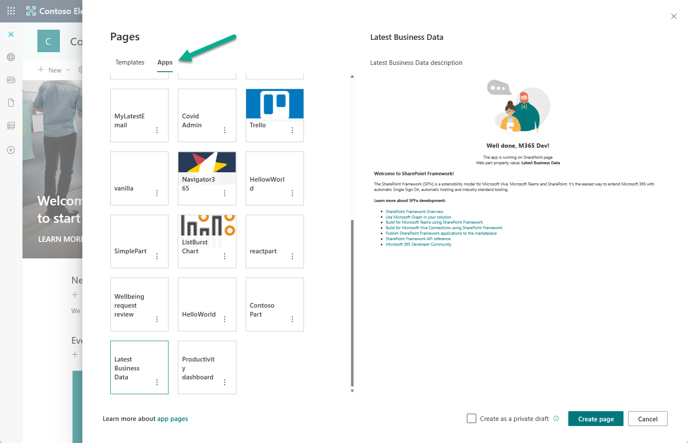
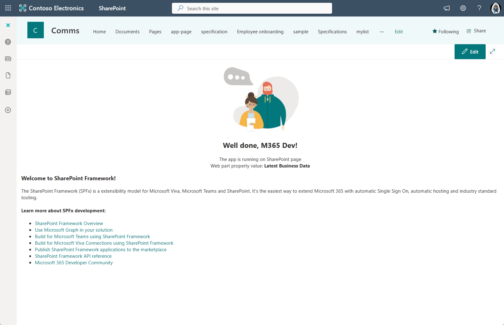
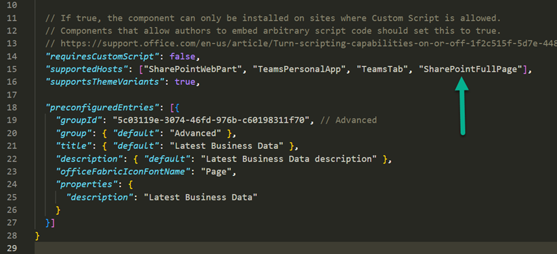

---
title: "Creating single part app page for SharePoint Online with SPFx"
date: 2023-01-13T04:00:00.000Z
author: Vesa Juvonen
githubname: VesaJuvonen
categories:
  - SPFx
images:
  - images/10-single-part-app-pages.png
tags:
  - Microsoft Teams
  - Microsoft Viva  
  - SharePoint
  - SharePoint Framework (SPFx)
type: regular
videos:
- https://www.youtube.com/watch?v=8BATz6LD6tA
draft: false
---

[SharePoint Framework](https://aka.ms/spfx) (SPFx) is an extensibility model for Microsoft 365 enabling developers to build different kinds of extensibility for Microsoft Viva, Microsoft Teams, Outlook, Microsoft 365 app (Office), and SharePoint. SPFx has multiple benefits like automatic Single Sign On, automatic hosting in the customer tenant, reuse same code across the service and industry standard web stack tooling.

-	*What are the single part app pages which you can use for SharePoint Online and how you can create them?*
-	That is a great question. Single part app pages are available in the SharePoint Online. Idea of them is to take the whole available screen size and render the web part (SPFx component) in that. This provides you an option to own the whole layout and whatever is being rendered on the page.


This blog post is part of a month long SPFx series for January 2023. Each business day we'll publish a new blog post covering different aspects of the SPFx.

* Previous blog post in this series - [How to use SPFx powered Microsoft Teams apps in Outlook and Office](https://pnp.github.io/blog/post/spfx-08-spfx-powered-teams-solutions-outlook-office/)


## What are the single part app pages for SharePoint Online?

Single part app pages is another rendering option for the web parts, which is more as a generic name for a web widget which can be used in Microsoft Viva, Microsoft Teams, Outlook, Office or in SharePoint - like in this case. 

So the same piece of code can be also exposed as a full page experience in the SharePoint which gives the developer an option to fully own what's being rendered with the exception of the top navigation and app launcher.

From content editor perspective single part apps are exposed using an **App** tab when you create a new page. This tab is visible if there are any single part app pages deployed to the particular tenant.

Here's how the web part is being rendered on the page. Notice that there are no sections or possibility to have multiple web parts on this same page. Web part is rather rendered in full page mode and owns the whole rendering experience.

From development perspective defining a web part to support this option is super easy. You define this option in the `supportedHosts` setting in the web part manifest. If this array will include `SharePointFullPage`, then the web part is also exposed as a single part app page. This is also the default setting for any new web part created with latest versions of SPFx.

Here's a bit outdated video on how to create a single part app page in SharePoint Online with SPFx. Development process and the deployment models are still the same.



Documentation and references

- [Using single part app pages in SharePoint Online](https://learn.microsoft.com/en-us/sharepoint/dev/spfx/web-parts/single-part-app-pages)

## Frequent questions around single part app pages

**Can I hide the top/suite navigation from the page as well?** 

No. There's no supported way to do this for the single part pages.

**What if I used CSS to hide the app launcher and the top navigation?** 

As SharePoint is build with html, this is indeed technically possible, but it's not supported. This means that if the experience will have any issues, you'll not be able to get support for your issues from Microsoft channels.

## References

Here are some initial references to get started with the SPFx in your development. Please do provide us with feedback and suggestions on what is needed to help you to get started with the SPFx development for Microsoft 365.

-	SPFx documentation – https://aka.ms/spfx
-	Issues and feedback around SPFx - https://aka.ms/spfx/issues
-	Microsoft 365 Platform Community – https://aka.ms/m365/community
-	Public SPFx and other community calls – https://aka.ms/m365/calls 
    - These calls are for everyone to take advantage to stay up to date on the art of possible within Microsoft 365 and to provide guidance for beginners and more advance users
-	SPFx samples in the Microsoft 365 Unified Sample gallery – https://aka.ms/m365/samples

- - -

We will provide more details on the different options and future direction of the SPFx in upcoming blog posts. This post focused on the getting started steps with SPFx - more details coming up with this series with one post within each business day of January 2023.