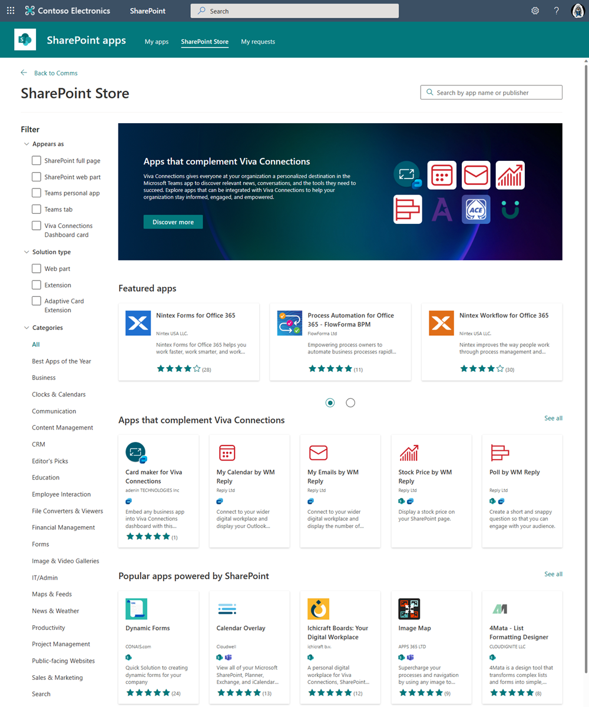

[SharePoint Framework](https://aka.ms/spfx) (SPFx) is an extensibility model for Microsoft 365 enabling developers to build different kinds of extensibility for Microsoft Viva, Microsoft Teams, Outlook, Microsoft 365 app (Office), and SharePoint. SPFx has multiple benefits like automatic Single Sign On, automatic hosting in the customer tenant, reuse same code across the service and industry standard web stack tooling.

-	*We've created a great SPFx solution, can it be submitted to Microsoft store?*
-	That is a great question. You can absolutely submit your SPFx solution to the [Microsoft app source](https://appsource.microsoft.com/en-US/marketplace/apps?exp=ubp8&product=office%3Bsharepoint&page=1) and to the SharePoint store.


This blog post is part of a month long SPFx series for January 2023. Each business day we'll publish a new blog post covering different aspects of the SPFx.

* Previous blog post in this series - [Transforming SharePoint add-ins to SPFx solutions](https://pnp.github.io/blog/post/spfx-11-transform-add-ins-to-spfx/)
* Next blog post in this series - [Design guidance and assets on building Microsoft Viva extensions with SPFx](https://pnp.github.io/blog/post/spfx-13-design-guidance-for-building-viva-extensions-spfx/)


## Submitting your SPFX solution to store

Support on publishing SPFx solutions to the store was introduced with the version 1.11 and we started accepting SPFx solution sin store since August 2020. There are currently hundreds of partner offerings in the app source and in the SharePoint store based as SPFx solutions and the submission numbers are growing rapidly. App source and the SharePoint store are a great ways to expose the solutions for customers using the native experiences.

We did also introduced completely new SharePoint store experience relatively recently which is demonstrated in the following video from the [Microsoft 365 Platform community calls](). 



Submitting the solutions to the store is quite straight forward with following steps:

* You will need to use the Partner Center for the submission
* Select new offering and use the **SharePoint Solution** as the offering type for SPFx solutions
* Submit the solution to the validation

After the initial submission, Microsoft's validation team will verify the solution behaviour and the submitted information which will be shown in the store. After the validation team is completed the validation with potential adjustments from your side, solution will be available in the app source and in the SharePoint store. As part of this submission pipeline, the system will automatically detect what's included in the solution and different component types are exposed as an option in the SharePoint store.

This submission process is currently needed even though your SPFx solution would be targeting Microsoft Viva or Microsoft Teams. We are working on hopefully getting this updated soon.

Documentation and references

- [Publish SharePoint Framework applications to the marketplace](https://learn.microsoft.com/en-us/sharepoint/dev/spfx/publish-to-marketplace-overview)
- [Prepare your SharePoint Framework application for publishing to the Marketplace](https://learn.microsoft.com/en-us/sharepoint/dev/spfx/publish-to-marketplace-checklist)
- [Maintain and support your published app](https://learn.microsoft.com/en-us/sharepoint/dev/spfx/publish-to-marketplace-after-publishing)
- [Most used SharePoint Framework solutions from the Store - October 2022](https://techcommunity.microsoft.com/t5/microsoft-sharepoint-blog/most-used-sharepoint-framework-solutions-from-the-store-october/ba-p/3681768)

## Frequent questions around SPFx solutions in store

**Can I submit SPFx solutions to store which are for Microsoft Viva and Microsoft Teams?**

Yes. Partner Center experience is not quite optimal on this, but any solution which is build with SPFx should be submitted with **SharePoint solution** option. We are working on providing more clarity on this one step at the time within upcoming semesters.

**Can my SPFx solution use Graph APIs and my custom APIs?**

Yes. Your solution can ask permissions on the API level, so this is absolutely supported for the SPFx solutions also in store.

**Can I submit any SPFx component types to the store?**

Yes. There are no limitations based on the component types which SPFx supports. You can submit also Library Components and also any other component types which SPFx supports.

**Can I submit SPFx solutions to the Microsoft Teams store?**

Unfortunately this is not currently supported. As SPFx solutions can target also Microsoft Teams, Outlook and Microsoft 365 apps (Office) - so it would certainly make sense to support this option also in the Microsoft Teams store. There are no timelines to share currently, but hopefully we can get this sorted out soon.

## References

Here are some initial references to get started with the SPFx in your development. Please do provide us with feedback and suggestions on what is needed to help you to get started with the SPFx development for Microsoft 365.

-	SPFx documentation – https://aka.ms/spfx
-	Issues and feedback around SPFx - https://aka.ms/spfx/issues
-	Microsoft 365 Platform Community – https://aka.ms/m365/community
-	Public SPFx and other community calls – https://aka.ms/m365/calls 
    - These calls are for everyone to take advantage to stay up to date on the art of possible within Microsoft 365 and to provide guidance for beginners and more advance users
-	SPFx samples in the Microsoft 365 Unified Sample gallery – https://aka.ms/m365/samples

- - -

We will provide more details on the different options and future direction of the SPFx in upcoming blog posts. This post focused on the getting started steps with SPFx - more details coming up with this series with one post within each business day of January 2023.