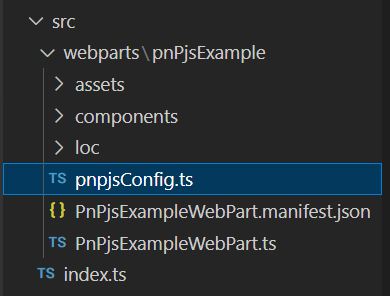
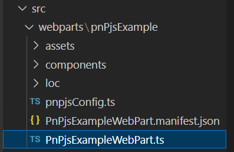
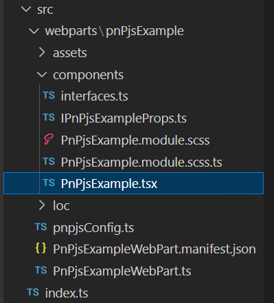

[SharePoint Framework](https://aka.ms/spfx) (SPFx) is an extensibility model for Microsoft 365 enabling developers to build different kinds of extensibility for Microsoft Viva, Microsoft Teams, Outlook, Microsoft 365 app (Office), and SharePoint. SPFx has multiple benefits like automatic Single Sign On, automatic hosting in the customer tenant, reuse same code across the service and industry standard web stack tooling.

-	*We have heard that using PnPjs library helps on implementing SPFx solutions - can you share details on that?*
-	That is a great question. [PnPjs library](https://aka.ms/pnpjs) is an awesome community driver wrapper simplifying access to the SharePoint APIs and to Microsoft Graph APIs. You can use it also outside of the SPFx context, but it's widely indeed adopted and used in the SPFx solutions. I'll let the incredible co-maintainer [Julie Turner](https://twitter.com/jfj1997) (Sympraxis Consulting) to share the details on the PnPjs - Vesa Juvonen, Microsoft


This blog post is part of a month long SPFx series for January 2023. Each business day we'll publish a new blog post covering different aspects of the SPFx.

* Previous blog post in this series - [Design guidance and assets on building Microsoft Viva extensions with SPFx](https://pnp.github.io/blog/post/spfx-13-design-guidance-for-building-viva-extensions-spfx/)
* Next blog post in this series - [Building a shared map solution for Microsoft Teams with SPFx](https://pnp.github.io/blog/post/spfx-15-building-a-shared-map-teams-solution-spfx/)



## Introduction

As a co-maintainer of the PnPjs library I know it can be difficult for those just starting out with the library. I wanted to introduce a blog post that goes into more depth about how to start your journey.

## What is PnPjs

PnPjs is a collection of fluent libraries for consuming SharePoint, Graph, and Office 365 REST APIs. So what is a fluent library. Essentially it just means that instead of creating a URL as a string, and then using the fetch api to make a get/post/put/patch call to the API directly, the library allows you to chain method names together to let the underlying code build the fetch call for you. This significantly simplify and streamlines your code since all the boilerplate code for creating the call, modifying headers, deserializing responses, error handling, and throttling is done for you. Further, to clarify the library does very little manipulation of the results (only parsing) and is essentially a pass through for those API endpoints. That said we do also offer some helper functions that make more than one call to make some complicated tasks simpler, but these are fairly rare, [Taxonomy - getAllChildrenAsOrderedTree](https://pnp.github.io/pnpjs/sp/taxonomy/#getallchildrenasorderedtree) is a popular example.

## How to know where to start

So the first thing you need to do is identify what type of project is you're building. For obvious reasons, getting started with the SharePoint Framework is one of the most popular project types but certainly not the only one we support. You can also build a server-based project using NodeJS or a stand alone web project that is hosted somewhere publicly or behind a firewall. In the latter instances authentication will be a bigger part of your scenario because you'll have to make sure you've picked the authentication method that matches your projects and set up the external requirements for getting a token. For more detailed instructions on the different authentication methods we support please take a look at our [Authentication documentation](https://pnp.github.io/pnpjs/concepts/authentication/). There is also more documentation on [getting started](https://pnp.github.io/pnpjs/getting-started/) in that section. You can, of course, roll your own authentication solution by creating your own [behaviour](https://pnp.github.io/pnpjs/core/behaviors/) instead of using the built in ones, but that is a more advanced topic. I won't go into behaviours, as it's not a getting started topic, but the entire library is extremely extensible so if you find yourself wanting to adjust the way the fetch call is composed or handled or build your own additional methods to augment the library, there is a way to do that and I encourage you to review the documentation in further detail as we've tried to provide that level of advanced documentation.

## Getting started with SharePoint Framework

> This article is written as of 1.16.1 version of the SharePoint Framework being the latest. If you are using a different version please make sure to check the [getting started](https://pnp.github.io/pnpjs/getting-started/) section to make sure there are no other requirements.

As I mentioned, the most popular use of this library is with those accessing it from the SharePoint Framework (SPFx). Although SPFx has it's own HTTP client class built in for both the SharePoint REST APIs and the Microsoft Graph APIs you still need to build your calls and parse them manually which is fine if you like that type of thing, personally I prefer the intellisense I get from the fluent methods.

### Establishing a configuration file

So to get started let's assume that you have used `yo @microsoft/sharepoint` to spin up a SPFx web part. Let's also be a little more complicated than the online sample and assume you want to make calls to both the SharePoint REST APIs and the Microsoft Graph APIs. You next step would be to install the modules for graph and sp by using the following command line command which will add both of these packages to your package.json.

```cmd
npm i @pnp/sp @pnp/graph --save
```

Now that we have the packages installed we'll make use of them by creating a set of functions or service to consolidate our calls and centralize creating the SharePoint Factory Interface (SPFI) and the Graph Factory Interface (GraphFI). In the example below I'm going to walk you through creating a set of functions that will allow you to isolate your api requests. You could also do a more advanced service implementation (which is essentially building a specific type of class) that amounts to the same thing but allows some architectural differences that may be beneficial to a more advanced implementation.

In the root `src` directory of you SPFx web part, create a new file with a `.ts` extension to create your data class. I'll call mine `pnpjsConfig.ts`.



Now we'll populate that class by adding the following imports:

```ts
// import for WebPartContext which we will use to configure our SPFI/GraphFI interfaces.
/* eslint-disable no-var */
import { WebPartContext } from "@microsoft/sp-webpart-base";

// import pnp and pnp logging system
import { spfi, SPFI, SPFx as spSPFx } from "@pnp/sp";
import { graphfi, GraphFI, SPFx as graphSPFx } from "@pnp/graph";
import { LogLevel, PnPLogging } from "@pnp/logging";

// imports for modules you want to use
import "@pnp/sp/webs";
import "@pnp/sp/lists";
import "@pnp/sp/items";
import "@pnp/sp/batching";
import "@pnp/graph/users";
```

First we're importing the WebPartContext from the sp-webpart-base module so that we can pass that into our factory interfaces. Next we need to import both the SPFI and GraphFI interfaces and factories as well as the SPFx behaviour for both modules. Note that we're using the `as` keyword so that we can make the names of the behaviours unique; SPFx becomes spSPFx and graphSPFx. After that we just want to add imports for the individual modules we're going to be using in our project. By limiting the imports that we use (vs importing @pnp/sp in it's entirety for example) we reduce the build size of our finished solution. My list of imports is an example you should add to and remove as is appropriate.

Next we're going to create some global variables for storing the instances of the SPFI and GraphFI interfaces. After that we're going to create two functions one to get the SharePoint factory interface and one to get the Graph factory interface. Note that they both take the WebPartContext as an optional parameter. When it's passed in we assume we're creating the factory interfaces and create it assigning it to the global variables we've declared in the same file. As long as the page doesn't refresh those global variables will have an valid object. Either way the function returns the current interface that can then be acted upon.

>Please also note that we're exporting a const that is the getSP and getGraph methods, this makes those methods global on the page so there is only one instance. This may or may not be a problem if you intend to have multiple instances of web parts on the page that implement these same methods.

```ts
// eslint-disable-next-line no-var
var _sp: SPFI = null;
var _graph: GraphFI = null;

export const getSP = (context?: WebPartContext): SPFI => {
  if (context != null) {
    //You must add the @pnp/logging package to include the PnPLogging behaviour it is no longer a peer dependency
    // The LogLevel set's at what level a message will be written to the console
    _sp = spfi().using(spSPFx(context)).using(PnPLogging(LogLevel.Warning));
  }
  return _sp;
};

export const getGraph = (context?: WebPartContext): GraphFI => {
  if (context != null) {
    //You must add the @pnp/logging package to include the PnPLogging behaviour it is no longer a peer dependency
    // The LogLevel set's at what level a message will be written to the console
    _graph = graphfi().using(graphSPFx(context)).using(PnPLogging(LogLevel.Warning));
  }
  return _graph;
};
```

### Initializing the config file

The next step is to add calls from the SPFx onInit method to create the interfaces. We'll start with the root TS file for the web part that implements the `BaseClientSideWebPart` interface.



In the `onInit` method we're going to make calls to our `getSP` and `getGraph` functions passing in the this.context property which is a `WebPartContext`. Once that's done those getSPand getGraph functions will return a valid factory interfaces for PnPjs that can then be use to make calls for get and retrieve data as needed.

```ts
// Import the getGraph and getSP functions from pnpjsConfig.ts file.
import { getGraph, getSP } from './pnpjsConfig';

...

export default class PnPjsExampleWebPart extends BaseClientSideWebPart<IPnPjsExampleWebPartProps> {

  private _isDarkTheme = false;
  private _environmentMessage = '';

  protected async onInit(): Promise<void> {
    this._environmentMessage = this._getEnvironmentMessage();

    // Initialize our _sp object that we can then use in other packages without having to pass around the context.
    // Check out pnpjsConfig.ts for an example of a project setup file.
    getSP(this.context);
    getGraph(this.context);
  }

  ...
}
```

### Get some data

You now have essentially two options for how to implement your data retrieval methods. The first is that you can retrieve data right inside your ReactJS components or hooks (or framework du jour components). Although this is entirely valid, it makes for harder to read code and less reusability.

The second method would be to implement more global functions in your `pnpjsConfig.ts` file. While this is, to me preferable, it does somewhat pollute your global namespace. In the end this is why I always create a service class to encapsulate my data manipulation methods. Since we're just getting started and we're assuming this is a very simple example, we'll move forward instead of complicating the process by adding more layers that are, in the end, only architectural choices.

Let's start by opening our root web part component file, in this case `PnPjsExample.tsx`. This is the component that is mounted when our root class calls the render method.



We'll make sure in our components constructor we're making calls to set local, private, variables to instances of our factory function. That way the component can make use of them to get/put data to SharePoint or the Graph APIs.

```ts
export default class PnPjsExample extends React.Component<IPnPjsExampleProps, IIPnPjsExampleState> {
  private _sp: SPFI;
  private _graph: GraphFI;

  constructor(props: IPnPjsExampleProps) {
    ...

    this._sp = getSP();
    this._graph = getGraph();
  }

  ...
}
```

Now I can add a private method to this component to go retrieve some data. For instance let's add a method that will read the items from the default document library in a SharePoint site.

```ts
private _readAllFilesSize = async (): Promise<void> => {
    try {
      const response: IResponseItem[] = await this._sp.web.lists
        .getByTitle("Documents")
        .items.select("Id", "Title", "FileLeafRef", "File/Length").expand("File/Length")();

      // use map to convert IResponseItem[] into our internal object IFile[]
      const items: IFile[] = response.map((item: IResponseItem) => {
        return {
          Id: item.Id,
          Title: item.Title || "Unknown",
          Size: item.File?.Length || 0,
          Name: item.FileLeafRef
        };
      });

      // Add the items to the state
      this.setState({ items });
    } catch (err) {
      Logger.write(`${this.LOG_SOURCE} (_readAllFilesSize) - ${JSON.stringify(err)} - `, LogLevel.Error);
    }
  }
```

Note that the example above uses the `this._sp` factory interface and then chains the methods together to retrieve the data we need. It uses the await keyword because for the most part all methods that return data return `promises` so using await makes sure the resulting variable is the resolved promise. For example:

- .web [start at the current web]
- .lists [all the lists in the web]
- .getByTitle("Documents) [the list/library with the title Documents]
- .items [all the items in the list/library]
- .select [limit the columns returned in the payload]
- .expand("File/Length) [knowing that File is a lookup field also get the Length property for each file in this library]
- () [Invoke the method to retrieve the data]

Another important point to make is that in our pnpjsConfig.ts file we imported methods to support all the methods we were going to use to make this call. This example specifically requires the following imports:

```ts
import "@pnp/sp/webs"; // <- .web
import "@pnp/sp/lists"; // <- .lists; .getByTitle
import "@pnp/sp/items"; // <- .items
```

> Both .select and .expand are part of the root `SPQueryable` class that all the other methods inherit from.

## Next Steps

After that we can manipulate the dataset however we like. Because the method above puts the resulting data in the state of the web part we can then render it to the UI during the render method. Essentially at this point the sky is the limit for what you can do with the various APIs to solve business problems in your organization or for the community at large.

For a more extensive example please see the [sample project](https://github.com/pnp/sp-dev-fx-webparts/tree/main/samples/react-pnp-js-sample) that extends this example in more depth and look to see more articles on more advanced topics in the future.

Happy Coding!

## References

Here are some initial references to get started with the SPFx in your development. Please do provide us with feedback and suggestions on what is needed to help you to get started with the SPFx development for Microsoft 365.

- PnPjs documentation - https://aka.ms/pnpjs
-	SPFx documentation – https://aka.ms/spfx
-	Issues and feedback around SPFx - https://aka.ms/spfx/issues
-	Microsoft 365 Platform Community – https://aka.ms/m365/community
-	Public SPFx and other community calls – https://aka.ms/m365/calls
    - These calls are for everyone to take advantage to stay up to date on the art of possible within Microsoft 365 and to provide guidance for beginners and more advance users
-	SPFx samples in the Microsoft 365 Unified Sample gallery – https://aka.ms/m365/samples

- - -

We will provide more details on the different options and future direction of the SPFx in upcoming blog posts. This post focused on the getting started steps with SPFx - more details coming up with this series with one post within each business day of January 2023.
