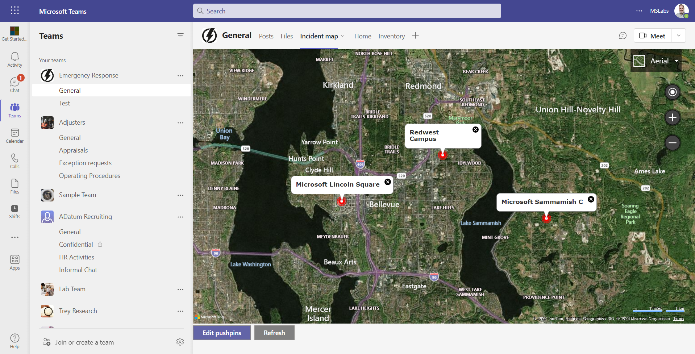
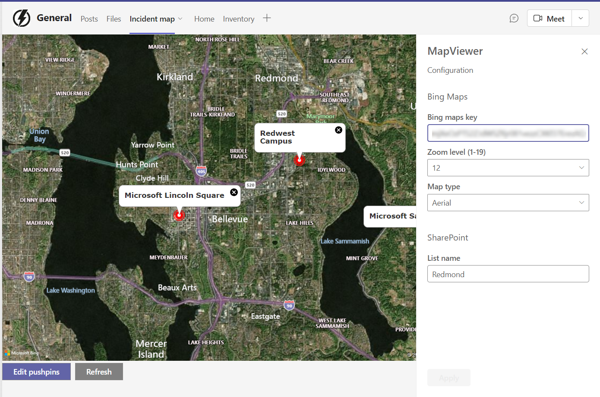
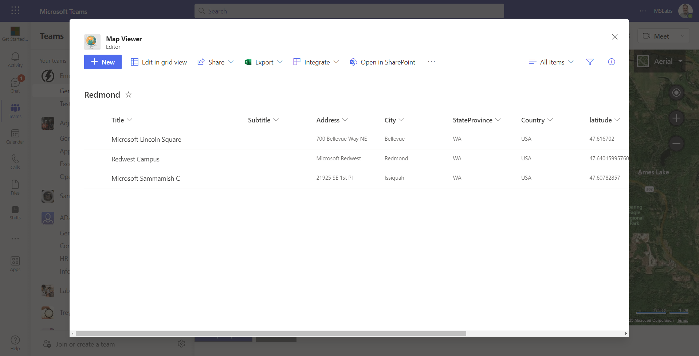

[SharePoint Framework](https://aka.ms/spfx) (SPFx) is an extensibility model for Microsoft 365 enabling developers to build different kinds of extensibility for Microsoft Viva, Microsoft Teams, Outlook, Microsoft 365 app (Office), and SharePoint. SPFx has multiple benefits like automatic Single Sign On, automatic hosting in the customer tenant, reuse same code across the service and industry standard web stack tooling.

-	*We are looking to build Microsoft Teams solutions with SPFx - would you have good step-by-step guidance for this?*
-	That is a great question. SPFx is great for Microsoft Teams as it has the automatic hosting feature which means that the deployment and operations is super easy and efficient, as there's no extra requirements on the code hosting. There are countless of samples for this, but having a nice step-by-step tutorials are for sure great for understanding the required steps. I'll let my awesome colleague [Bob German](https://twitter.com/Bob1German) (Microsoft) to share the following tutorial and sample details. - Vesa Juvonen, Microsoft


This blog post is part of a month long SPFx series for January 2023. Each business day we'll publish a new blog post covering different aspects of the SPFx.

* Previous blog post in this series - [Getting Started with using PnPjs in your SPFx solutions](https://pnp.github.io/blog/post/spfx-14-getting-started-with-pnpjs-spfx/)



## Build a Shared Map for Teams with SPFx

A map is a powerful tool that allows people to navigate and explore the world around them. Whether it's planning a hike through the mountains, coordinating a search and rescue operation, or designing a new neighborhood, maps play a crucial role in many shared activities.

In this article, you'll learn to use the SharePoint Framework to build a map application for use in Microsoft Teams. Using the application allows teams to share points of interest on a map. You can find a [step-by-step tutorial for building the application here](https://aka.ms/emergency-response).



By hosting in SharePoint and using a [free Bing Maps key](https://www.microsoft.com/maps/create-a-bing-maps-key), this solution can be used without additional cost in any Microsoft 365 tenant.

Earlier in the series, [Vesa Juvonen](https://github.com/VesaJuvonen)'s article, [Building SPFx solutions for Microsoft Teams](../spfx-06-spfx-for-teams/index.md), explains how to get started. Like all SPFx, projects, this one began using the `yo @microsoft/sharepoint` command, however you can save steps by downloading the completed code [here](https://github.com/OfficeDev/M365Bootcamp-TeamsEmergencyResponse/tree/main/Solution/MapViewer).

### Managing tab settings

Tabs in Microsoft Teams have settings which an be edited by clicking the drop-down arrow to the right of the tab name. Conveniently in SharePoint Framework based tabs, the normal SharePoint web part property mechanism is used so developers don't need to build a configuration page. In this case, the settings page allows configuration of the Bing maps key, a zoom level, map type, and the SharePoint list name that will hold the points of interest.



### Storing points of interest

Since this tab is used in a Teams channel, it's possible to take advantage of the Team's underlying SharePoint site for storing map data. A SharePoint list fits the bill nicely. 

The Microsoft Graph makes it easy to access the SharePoint list. The code begins by obtaining a Graph client from SPFx.

```typescript
const graphClient = await context.msGraphClientFactory
    .getClient();
```

Each row of the list is a point on the map. The list contains columns for an address and for the geolocation of each point. When the list is edited, the code obtains the geolocation of each point and saves it back to the list, eliminating the need to look up the location of each map point every time the map is viewed.

The project includes a client-side service for accessing the Graph in [GraphService.ts](https://github.com/OfficeDev/M365Bootcamp-TeamsEmergencyResponse/blob/main/Solution/MapViewer/src/webparts/mapViewer/services/GraphService/GraphService.ts). The code includes functions to:

 * Get the SharePoint list ID (if the list exists)
 * Create the SharePoint list (if it doesn't)
 * Read the map locations in the list
 * Update a list item after looking up its geolocation

### Editing the map points

One of the nice things about SharePoint is you don't have to write code to update a List; the user interface to do that is built into SharePoint. So, rather than reinventing that wheel, the solution displays the list in a Teams _Dialog_ (formerly called a _Task Module_).


 
To do this, [the code](https://github.com/OfficeDev/M365Bootcamp-TeamsEmergencyResponse/blob/main/Solution/MapViewer/src/webparts/mapViewer/components/MessagePanel.tsx) uses the Microsoft Teams JavaScript API to open the dialog and pass in the URL of the SharePoint list view.

```typescript
const taskModuleInfo = {
    title: "Editor",
    url: url,
    // Show it as large as Teams will allow
    width: Number.MAX_VALUE,
    height: Number.MAX_VALUE
};
microsoftTeams.tasks.startTask(taskModuleInfo,
    (() => { this.refresh(); }));
```

The `startTask` function here out of date - the new version supports a Promise - but it's backward compatible so the callback still works. In this case, the callback refreshes the web part so the updated points are displayed on the map.

### Try it out!

As you can see, the SharePoint Framework is a powerful tool that allows developers to build tabs for Microsoft Teams that utilize SharePoint to store data and settings. A full tutorial including this and other scenarios for SharePoint in Teams is available [here](https://aka.ms/emergency-response).

## References

Here are some initial references to get started with the SPFx in your development. Please do provide us with feedback and suggestions on what is needed to help you to get started with the SPFx development for Microsoft 365.

-	SPFx documentation – https://aka.ms/spfx
-	Issues and feedback around SPFx - https://aka.ms/spfx/issues
-	Microsoft 365 Platform Community – https://aka.ms/m365/community
-	Public SPFx and other community calls – https://aka.ms/m365/calls 
    - These calls are for everyone to take advantage to stay up to date on the art of possible within Microsoft 365 and to provide guidance for beginners and more advance users
-	SPFx samples in the Microsoft 365 Unified Sample gallery – https://aka.ms/m365/samples

- - -

We will provide more details on the different options and future direction of the SPFx in upcoming blog posts. This post focused on the getting started steps with SPFx - more details coming up with this series with one post within each business day of January 2023.