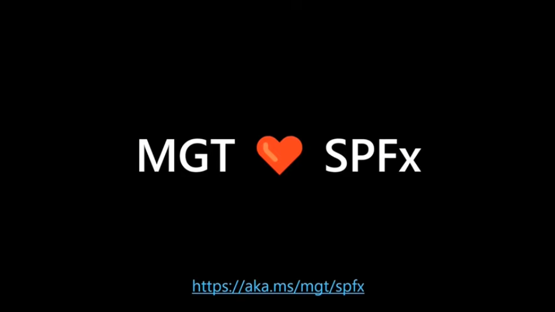

[SharePoint Framework](https://aka.ms/spfx) (SPFx) is an extensibility model for Microsoft 365 enabling developers to build different kinds of extensibility for Microsoft Viva, Microsoft Teams, Outlook, Microsoft 365 app (Office), and SharePoint. SPFx has multiple benefits like automatic Single Sign On, automatic hosting in the customer tenant, reuse same code across the service and industry standard web stack tooling.

-	*I'd like to use the awesome Microsoft Graph Toolkit with my SPFx solutions. Is this possible?*
-	That is a great question. You can absolutely use the [Microsoft Graph Toolkit](https://aka.ms/mgt) (MGT) within your SPFx solutions. MGT is an awesome set of controls which increase the productivity of the developers and helps you to implement polished UX which is connected to the Microsoft Graph APIs with few lines of code.


This blog post is part of a month long SPFx series for January 2023. Each business day we'll publish a new blog post covering different aspects of the SPFx.

* Previous blog post in this series - [Building partner offerings for Microsoft Viva Connections & Viva Home with SPFx](https://pnp.github.io/blog/post/spfx-16-building-partner-offerings-for-viva-spfx/)
* Next blog post in this series - [Using reusable open-source controls within your SPFx solution](https://pnp.github.io/blog/post/spfx-18-reusable-open-source-controls-spfx/)


## Using Microsoft Graph Toolkit with SPFx solutions

Using Microsoft Graph Toolkit (MGT) within the SPFx solutions is really straightforward and can be done easily as the MGT takes advantage of the fully automatic single-sign. This means that the token handling is completely automatic, and you can focus on building your custom experience.

With MGT you can create engaging solutions with only a few lines of code and with SPFx – your solution is automatically hosted and available for production usage with few simple steps.

The process to get started on using the MGT within your SPFx solution is as follows:

1. Set up your development environment and create a SPFx solution
2. Install the Microsoft Graph Toolkit SharePoint Framework package to solution project
3. Import the SharePoint Provider in your code
4. Use MGT components based on your business requirements
5. Configure permissions for the SPFx solution in `package-solution.json` file
6. Deploy the [Microsoft Graph Toolkit SharePoint Framework package](https://learn.microsoft.com/graph/toolkit/get-started/mgt-spfx) to tenant app catalog – this package contains MGT SPFx provider as a library component which is then used by all SPFx solutions in the tenant
7. Build and deploy your solution to the tenant - remember to grant the required API permissions
8. Test your solution and start using it in the production

Here’s a great video by [Sébastien Levert](https://twitter.com/sebastienlevert) (Microsoft) on the required steps.



Documentation and references for the Microsoft Graph Toolkit usage within SPFx solutions

- [Microsoft Graph Toolkit: UI Components and Authentication Providers for Microsoft Graph ](https://aka.ms/mgt/docs)
- [Build a SharePoint web part with the Microsoft Graph Toolkit](https://learn.microsoft.com/sharepoint/dev/spfx/web-parts/get-started/build-web-part-microsoft-graph-toolkit)
- [Use Microsoft Graph Toolkit to connect your solution to Microsoft Graph](https://learn.microsoft.com/sharepoint/dev/spfx/use-microsoft-graph-toolkit)
- [SharePoint Framework library for Microsoft Graph Toolkit ](https://learn.microsoft.com/graph/toolkit/get-started/mgt-spfx)

## Frequently asked questions on MGT usage within SPFx solutions

**Do I need to use MSAL in my code to make this work?**

No. MSAL and auth is completely automatic with the SPFx and you do not need to perform any additional tricks to get the access token for the used APIs. All of this is abstracted from your code.

**Can I use any Microsoft Graph Toolkit Control?**

Yes. As long as you grant the permissions for the SPFx solution for them. This really comes back to ensure that you have requested and granted the right permissions for the controls using the permission request model from the `package-solution.json` file.

## References

Here are some initial references to get started with the SPFx in your development. Please do provide us with feedback and suggestions on what is needed to help you to get started with the SPFx development for Microsoft 365.

-	SPFx documentation – https://aka.ms/spfx
-	Issues and feedback around SPFx - https://aka.ms/spfx/issues
-	Microsoft 365 Platform Community – https://aka.ms/m365/community
-	Public SPFx and other Microsoft 365 platform community calls – https://aka.ms/m365/calls
    - These calls are for everyone to take advantage to stay up to date on the art of possible within Microsoft 365 and to provide guidance for beginners and more advance users.
-	SPFx samples in the Microsoft 365 Unified Sample gallery – https://aka.ms/m365/samples

- - -

We will provide more details on the different options and future direction of the SPFx in upcoming blog posts. This post focused on the getting started steps with SPFx - more details coming up with this series with one post within each business day of January 2023.
