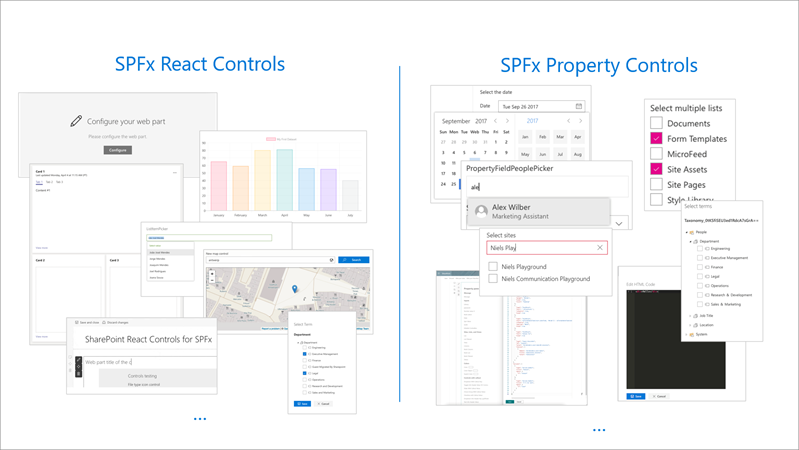

[SharePoint Framework](https://aka.ms/spfx) (SPFx) is an extensibility model for Microsoft 365 enabling developers to build different kinds of extensibility for Microsoft Viva, Microsoft Teams, Outlook, Microsoft 365 app (Office), and SharePoint. SPFx has multiple benefits like automatic Single Sign On, automatic hosting in the customer tenant, reuse same code across the service and industry standard web stack tooling.

-	*I can see pretty cool controls in the out of the box SPFx experiences, can I get access on those controls or increase my productivity otherwise?*
-	That is a great question. There are no out of the box controls provided as such from the Microoft engineering, except for the [Microsoft Graph Toolkit](https://pnp.github.io/blog/post/spfx-17-microsoft-graph-toolkit-spfx), but engineering has partnered with our commnity to provide tens of open-sourced community led controls for SPFx solutions.


This blog post is part of a month long SPFx series for January 2023. Each business day we'll publish a new blog post covering different aspects of the SPFx.

* Previous blog post in this series - [Using Microsoft Graph Toolkit with SPFx solutions](https://pnp.github.io/blog/post/spfx-17-microsoft-graph-toolkit-spfx/)


## Increase your productivity with community provided controls for SPFx solutions

To increase the productivity of developers who are building SPFx solutions, Microsoft engineering closely partners with the open-source community to provide reusable controls for SPFx solutions. 

These controls are provided to make the custom solutions more aligned with the 1st party experiences and to even adopt some 1st party controls to be available for the partners and customers. A great example being the Web Part title control, which is direct adoption of the same control which Microsoft uses in out of the box engineering work.

Some of these controls are also automatically context aware, which means that they adopt automatically to the underlaying APIs for example for detecting lists or taxonomy information, meaning that you do not need to worry how to get the data, controls have the needed connectivity in them.

There are two kind of controls which are available depending on the use case

- [SPFx property controls]( https://pnp.github.io/sp-dev-fx-property-controls/) – Web part and tab property controls for the SharePoint Framework solutions
- [SPFx react controls]( https://pnp.github.io/sp-dev-fx-controls-react/) – reusable React control that can be used in your SharePoint Framework solutions

You can find overall tens and tens of controls which will help you to be more productive as you build your experiences for Microsoft Teams, Microsoft Viva, Outlook, Office or SharePoint.

The process to get started on using the MGT within your SPFx solution is as follows:

1. Set up your development environment and create a SPFx solution
2. Include the needed control package(s) based on your business needs using npm install command
3. Implement your custom experience as needed
4. Build and deploy your solution to the tenant
5. Test your solution and start using it in the production

Here’s a great intro from [Alex Terentiv](https://twitter.com/alexaterentiev) (Microsoft) on the control usage



Here’s another great video from [Joel Rodrigues](https://twitter.com/JoelFMRodrigues) (Storm Technology) | @JoelFMRodrigues. 



## Frequently asked questions on the reusable SPFx controls

**Are these controls provided by Microsoft engineering?** 

No. These are community provided and Microsoft employees are part of this community, but they are not Microsoft owned or Microsoft supported set of controls.

**Can I contribute on these controls if I see something which could improve?**

Absolutely. These are open-source controls provided by the community and both projects welcome contributions.

## References

Here are some initial references to get started with the SPFx in your development. Please do provide us with feedback and suggestions on what is needed to help you to get started with the SPFx development for Microsoft 365.

-	SPFx documentation – https://aka.ms/spfx
-	Issues and feedback around SPFx - https://aka.ms/spfx/issues
-	Microsoft 365 Platform Community – https://aka.ms/m365/community
-	Public SPFx and other Microsoft 365 platform community calls – https://aka.ms/m365/calls 
    - These calls are for everyone to take advantage to stay up to date on the art of possible within Microsoft 365 and to provide guidance for beginners and more advance users.
-	SPFx samples in the Microsoft 365 Unified Sample gallery – https://aka.ms/m365/samples

- - -

We will provide more details on the different options and future direction of the SPFx in upcoming blog posts. This post focused on the getting started steps with SPFx - more details coming up with this series with one post within each business day of January 2023.