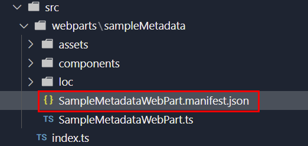
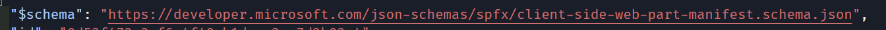
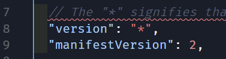
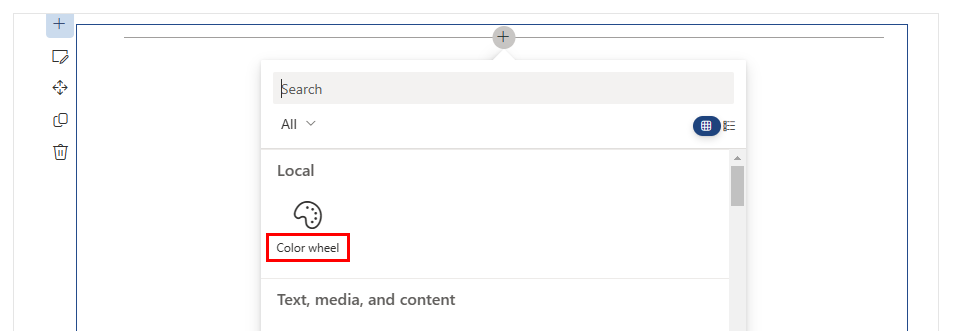
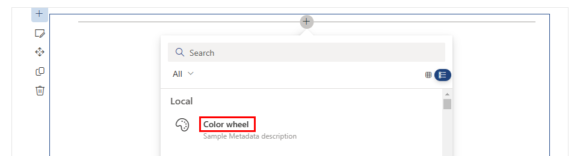
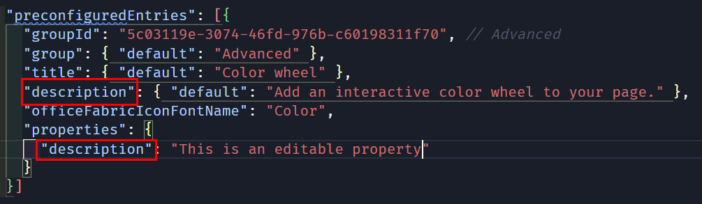
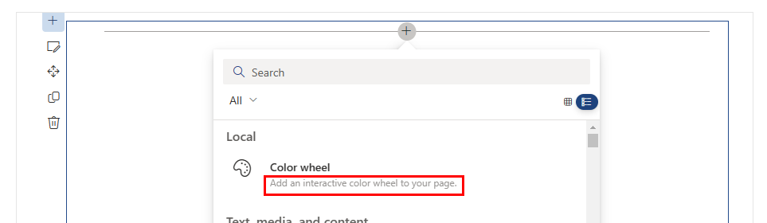
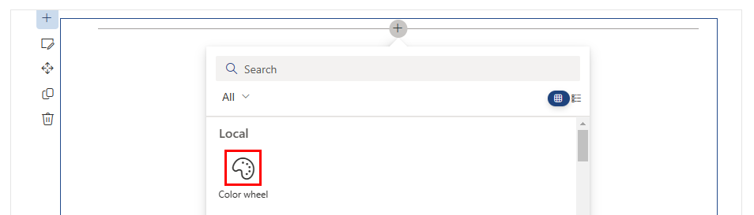
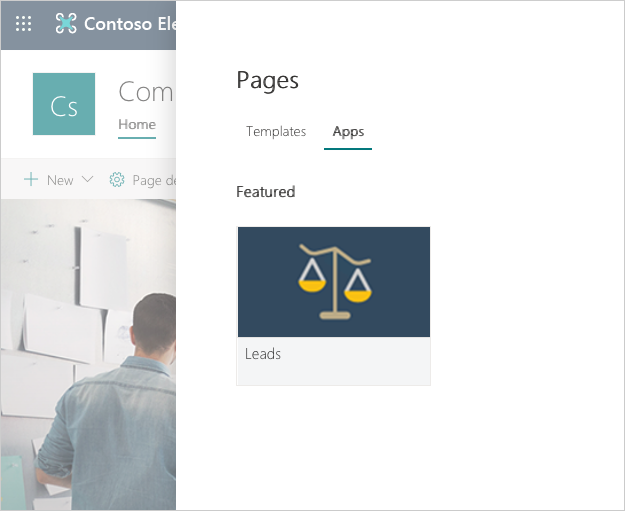
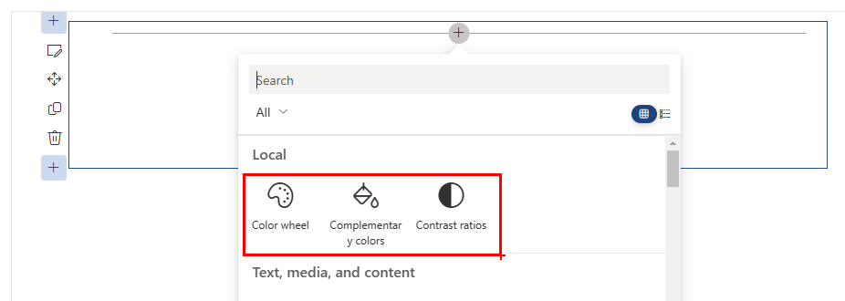

[SharePoint Framework](https://aka.ms/spfx) (SPFx) is an extensibility model for Microsoft 365 enabling developers to build different kinds of extensibility for Microsoft Viva, Microsoft Teams, Outlook, Microsoft 365 app (Office), and SharePoint. SPFx has multiple benefits like automatic Single Sign On, automatic hosting in the customer tenant, reuse same code across the service and industry standard web stack tooling.

-	*I prefer to use SVG images to create scalable assets that look good at any resolution. Is it possible to use SVG icons for my web parts?*
- *How can I build web parts that look less "custom", and more professional to encourage people in my organization to use my web parts?*
- *How can I prepare my web part to publish it to the marketplace?* 
- *How do I control how my web parts show in the **Add a new web part** toolbox?*  

Great questions! You can use your web part's manifest to control how your web part appears (or doesn't appear, in some cases) in the web part toolbox.


This blog post is part of a month long SPFx series for January 2023. Each business day we'll publish a new blog post covering different aspects of the SPFx.

- Previous blog post in this series - [Using reusable open-source controls within your SPFx solution](https://pnp.github.io/blog/post/spfx-18-reusable-open-source-controls-spfx/)


## What is the web part manifest?

Web part manifests are **.json** files that describe the web part, its capabilities, its default configuration, and how it should appear in the **Add a web part** toolbox. 

Every web part in your SPFx solution has manifest file called **[YourWebPartName].manifest.json** next to the **[YourWebPartName].ts** file (where the code for your web part resides).



A web part manifest must follow the [client-side web part manifest schema](https://developer.microsoft.com/json-schemas/spfx/client-side-web-part-manifest.schema.json); if you ever wonder what values are allowed within the **.json** file, you can open your manifest and click the URL in the `$schema` node to find out the rules that your **.json** file must follow.



The first time you open the manifest file with VSCode, you may notice that there are a few comments to help you out, but they are highlighted as errors. Don't worry, you didn't do anything wrong: technically, **.json** aren't supposed to have comments, and VSCode likes to remind you of that fact... but you can safely ignore errors related to comments.



> If you don't want VSCode to highlight comments as errors in your manifest, you can [follow this simple trick](https://tahoeninja.blog/posts/getting-rid-of-json-validation-errors-on-comments/)

## A word about testing changes to your web part manifest

If you want to try any of the changes described in this post while you're running `gulp serve`, just remember that some changes require you to refresh the workbench page, while other changes will not appear until you start and stop `gulp serve` again.

Some other parts of your manifest 
(for example, the `properties` in the `preconfiguredEntries` node), require you to remove the web part from the page, refresh the page, and re-add the web part before your changes take effect.

## Controlling how a web part appears in the toolbox

Web parts can have pre-configured properties such as title, description, toolbox group name and icons, which all affect *how* a web part appears in the toolbox.

You'll find these properties in the `preconfiguredEntries` section of your manifest -- because page authors and/or organization admins will have the ability to change the values you provide here as needed.


### `title`

- The `title` property controls the name of your web part in the toolbox.
- Required
- It should clearly describe the information the web part presents, instead of *what* it does.
- Avoid including the words "web part" -- they're all web parts!
- `title` is a localizable string: you can have a different title value for every locale you wish to support, but you *must* have a `default` value. For example:

    ```json
      "preconfiguredEntries": [{
        ...
        "title": { 
            "default": "Color wheel",
            "en-ca": "Colour wheel",
            "fr-fr": "Roue chromatique"
          },
        ...
      }]
    ```

  

  

- You should consider making the `title` property configurable through the web part's property page; even better, you should use the [WebPartTitle](https://pnp.github.io/sp-dev-fx-controls-react/controls/WebPartTitle/) PnP Reusable React control to allow page authors to easily change the web part title.

### `description`

- The `description` property is another localizable string that briefly describes the web part's functionality and value description. For example, here are some descriptions of the standard SharePoint web parts:
    Web part | description
    --- | --- 
    Call to action | Add call to action text and an image paired with a clickable button.
    Divider | Add a line to divide areas on your change.
    Image | Add an image, picture or photo to your page including text overlays and ability to crop and resize images.
    Spacer | Add vertical space between areas on the page.
- Required
- This value will be displayed to the user in the toolbox. 
- This value will be searchable, even if it is not displayed in the toolbox grid view.
- A dictionary must contain a `default` key, but can support more locales, as needed. 

    ```json
    "preconfiguredEntries": [{
    ...
    "description": { "default": "Add an interactive color wheel to your page." },
    ...
  }]
    ```

- This description should be used in the Toolbox tooltip and other display areas. 
- The organization admin and page author will have the ability to change this description as to suit their needs.
- Don't confuse the `description` field with the `description` under `properties`; one is the web part's description, the other is a sample property that is created when scaffolding your web part.
  
    



### `groupId`

- The `groupId` is a GUID that determines which modern group to place the web part in the toolbox. 
- Required
- The SharePoint Framework reserves group ids for predefined groups:

  Group Id | Group Name | Description
  ---|---|---
  cf066440-0614-43d6-98ae-0b31cf14c7c3 | Text, media, and content | Includes web parts that display text, multi-media, documents, information from the web, and other rich content.
  1edbd9a8-0bfb-4aa2-9afd-14b8c45dd489 | Documents, lists, and libraries | Includes web parts that organize, group, and filter content to help users discover information.
  75e22ed5-fa14-4829-850a-c890608aca2d | Feeds | Includes web parts that facilitate information sharing, team work, and social interactions.
  1bc7927e-4a5e-4520-b540-71305c79c20a | News, people and events | Includes web parts that empower team productivity with the use of planning and process tools.
  4aca9e90-eff5-4fa1-bac7-728f5f157b66 | Data Analysis | Includes web parts for tracking and analyzing data, and for integrating business flow with pages.
  cfc8bda5-cb9b-49e3-8526-2ee6e52b256a | Regional information | Includes web parts that display information based on current region and geographical location.
  5c03119e-3074-46fd-976b-c60198311f70 | Advanced | Includes web parts not in other categories.

- You can use any of the predefined groups, or specify your own.
- If you specify an id that is not in the predefined groups, your web part will appear in the **Advanced** group.

> If you want to support hosting your web part in a classic page, remember to also set the `group` property. If you do not provide one, your web part will appear in the miscellaneous group.

### `tags`

- This field is used to tag a web part with keywords that are different from the web part group name, title and description. Tags can be used when searching of web parts. 
- It is an array that can contain up to 10 string values:

    ```json
      "preconfiguredEntries": [{
        ...
        "tags": [
          "Hue",
          "Saturation",
          "Pantone",
          "Grayscale",
          "RGB"
        ],
        ...
      }]
    ```

### `officeFabricIconFontName`, `iconImageUrl`, and `fullPageAppIconImageUrl`

There are two types of icons: 

- **Web part icon:** displayed in the Toolbox, defined by `officeFabricIconFontName` or `iconImageUrl`.

  
- **App page icon:** Displayed when users created a single part app page. Defined by `fullPageAppIconImageUrl`.

  

Here is how to use each of the `officeFabricIconFontName`, `iconImageUrl`, and `fullPageAppIconImageUrl` icon attributes:

Attribute | Description | Accepted values | Dimensions
---|---|---|---
`officeFabricIconFontName`|The icon for the Web Part, to be displayed in the toolbox, represented as a character name in the Microsoft 365 icon font file. If this field has a value, the `iconImageUrl` field will be ignored.|The icon font is specified at <https://aka.ms/uifabric-icons> (but you can also use <https://flicon.io>)|N/A
`iconImageUrl`| The icon for the WebPart, to be displayed in the toolbox, represented an image URL. | Absolute URL or base64-encoded data URL|64x64px
`fullPageAppIconImageUrl`|The icon for the Application pages, to be displayed in the single part app page experience, represented an image URL. The image at the URL should be approximately . If this field is not defined then the `iconimageUrl` is used instead|Absolute URL|195x110px

- To avoid quality loss, you may want to use vector-based SVG images. 
- Keep in mind that you have to deploy your web part icon images separately (or host them on a CDS somewhere). However, if you use base64-encoded images, you don't need to deploy them separately. 
- To encode PNG images, you can use one of the many online resources (like [this one](https://www.base64-image.de/)).
- If you choose to use a base64-encoded SVG for the `iconImageUrl` property, you may want to use this [handy interactive blog post](https://tahoeninja.blog/posts/fixing-base64-svg-icons-in-spfx/) to do the hard work for you.
- At least one of `officeFabricIconFontName`, `iconImageUrl`, or `fullPageAppIconImageUrl` is required.

You may see conflicting information about the `fullPageAppIconImageUrl` recommended image sizes. The placeholder for the image is actually 193x158px, but the bottom 48px will be partially covered by a label with the web part's name, hence the suggest 195x110px.


### `properties`

Every Web Part is expected to have some custom properties. For example, an image web part may have the image URL and caption text as custom properties, while a list web part may have the list id and list title as custom properties, and so on.

The image web part would have the following `properties`:

```json
"preconfiguredEntries: [{
        "properties": {
            "imageUrl": "https:\/\/somerandomurl.com",
            "caption": "This is a sample image"
        }
    },
]
```

While the list web part would have the following `properties`:


```json
"preconfiguredEntries: [{
        "properties": {
            "listId": "{3032A5BFC8E14DF88724104FD84890AB}",
            "title": "My events"
        }
    },
]
```

You can create properties of the following types:

- Array
- Boolean
- Integer
- Number
- Object (in the form of a JSON structure)
- string

> Remember: these values are "pre-configured" values. Your page authors and admins may want to change the values. You may want to use default values that will improve the "first run experience", or leave the `properties` blank and handle blank values in your code, and use the [Placeholder](https://pnp.github.io/sp-dev-fx-controls-react/controls/Placeholder/) PnP Reusable React control to encourage the page authors to configure the web part.


## Having more than one entry in `preconfiguredEntries`

By default, there is only one `preconfiguredEntries`, but you can have more than one!

For example, let's pretend that the same code for my Color wheel web part also allows me to find complementary colors and calculate contrast ratios, depending on a custom property called "mode". I could use the following `preconfiguredEntries` values in my manifest:

```json
"preconfiguredEntries": [
    {
      "groupId": "5c03119e-3074-46fd-976b-c60198311f70", // Advanced
      "group": {
        "default": "Advanced"
      },
      "title": {
        "default": "Color wheel"
      },
      "description": {
        "default": "Add an interactive color wheel to your page."
      },
      "officeFabricIconFontName": "Color",
      "tags": [
        "Hue",
        "Saturation",
        "Pantone",
        "Grayscale"
      ],
      "properties": {
        "mode": "ColorWheel"
      }
    },
    {
      "groupId": "5c03119e-3074-46fd-976b-c60198311f70", // Advanced
      "group": {
        "default": "Advanced"
      },
      "title": {
        "default": "Complementary colors"
      },
      "description": {
        "default": "Add an interactive tool to find complementary colors."
      },
      "officeFabricIconFontName": "BucketColor",
      "properties": {
        "mode": "Complementary"
      }
    },
    {
      "groupId": "5c03119e-3074-46fd-976b-c60198311f70", // Advanced
      "group": {
        "default": "Advanced"
      },
      "title": {
        "default": "Contrast ratios"
      },
      "description": {
        "default": "Add an interactive tool to calculate contrast ratios between two colors."
      },
      "officeFabricIconFontName": "Contrast",
      "properties": {
        "mode": "Accessibility"
      }
    }
  ]
```

Which would produce three web parts in the toolbox:
  

## There's more...

I hope that you learned a few things about the web part manifest that will help you build more "professional"-looking web parts.

We only covered the `preconfiguredEntries` today, but we still need to cover the attributes that describe the web part's behaviors and capabilities -- which we'll discuss in tomorrow's post.

## References

Here are some initial references to get started with the SPFx in your development. Please do provide us with feedback and suggestions on what is needed to help you to get started with the SPFx development for Microsoft 365.

-	SPFx documentation – <https://aka.ms/spfx>
-	Issues and feedback around SPFx - <https://aka.ms/spfx/issues>
-	Microsoft 365 Platform Community – <https://aka.ms/m365/community>
-	Public SPFx and other Microsoft 365 platform community calls – <https://aka.ms/m365/calls> 
    - These calls are for everyone to take advantage to stay up to date on the art of possible within Microsoft 365 and to provide guidance for beginners and more advance users.
-	SPFx samples in the Microsoft 365 Unified Sample gallery – <https://aka.ms/m365/samples>

- - -

We will provide more details on the different options and future direction of the SPFx in upcoming blog posts. This post focused on the getting started steps with SPFx - more details coming up with this series with one post within each business day of January 2023.
