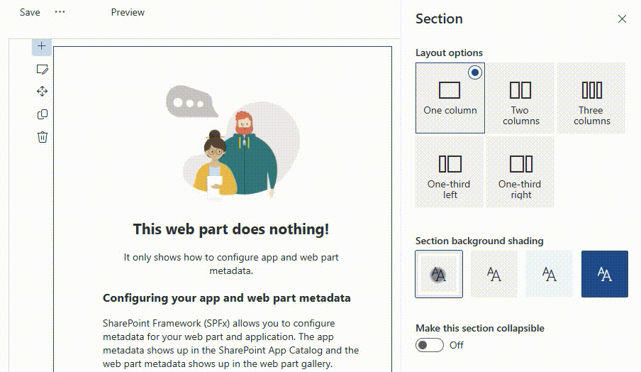
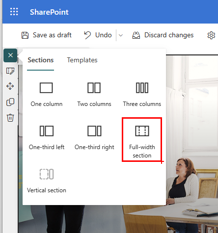
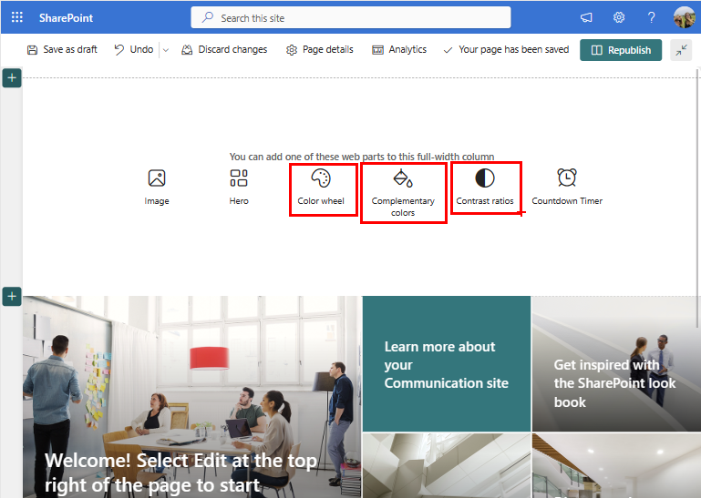
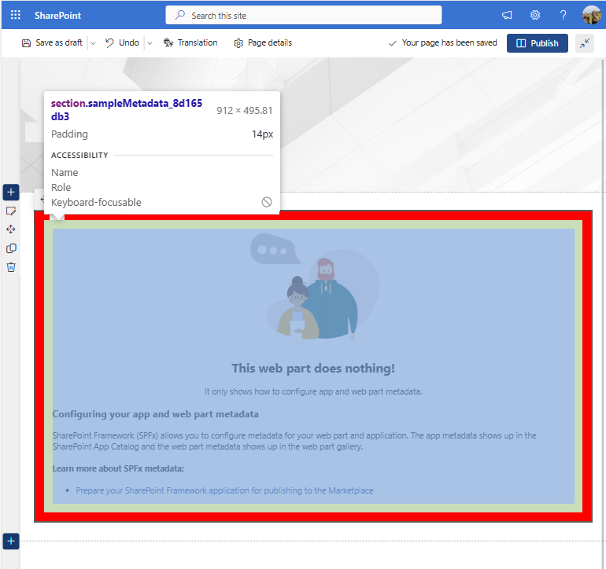
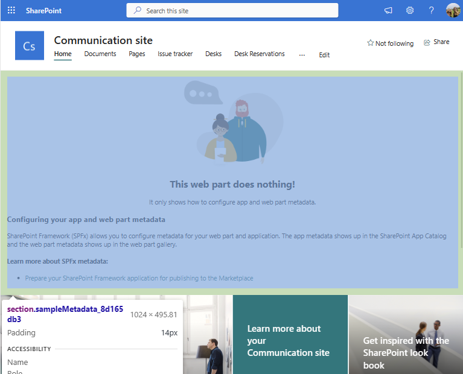

[SharePoint Framework](https://aka.ms/spfx) (SPFx) is an extensibility model for Microsoft 365 enabling developers to build different kinds of extensibility for Microsoft Viva, Microsoft Teams, Outlook, Microsoft 365 app (Office), and SharePoint. SPFx has multiple benefits like automatic Single Sign On, automatic hosting in the customer tenant, reuse same code across the service and industry standard web stack tooling.

-	*How do I make my web part span the whole width of the page?*
- *Can I hide a web part from the toolbox?*
- *How can I make my web parts theme-aware?*
- *Can I make my custom properties searchable?*
- *Where do I control whether a web part shows up in Teams tabs, personal apps, full page apps, and Teams meeting apps?*

Great questions! Luckily, the answers to all your questions are the same: you can use your web part's manifest to control your web part behaviors.


This blog post is part of a month long SPFx series for January 2023. Each business day we'll publish a new blog post covering different aspects of the SPFx.

- Previous blog post in this series - [Professional SPFx Solutions: Unlocking the secrets of your web part manifest](https://pnp.github.io/blog/post/spfx-19-professional-solutions-web-part-manifest/)
* Next blog post in this series - [Professional SPFx Solutions: Superb solution packages](https://pnp.github.io/blog/post/spfx-21-professional-solutions-superb-solution-packages/)


## What's this "manifest" thing you're talking about, again?

Every web part **.ts** file in your SPFx solution has a matching **.manifest.json** file, which describe your web part and its capabilities.

In our [previous post](https://pnp.github.io/blog/post/spfx-19-professional-solutions-web-part-manifest/), we discussed how to use the web part manifest to control how your web part will appear in the **Add a new web part** toolbox; in today's post, we'll discuss how to use the manifest to control your web part's capabilities and behavior.

> Remember: if you decide to test some of the settings discussed in this post on your own web parts, you may have to stop and restart `gulp serve`, and refresh the workbench page before the changes take effect. In some cases, you may need to remove the web part from your workbench and add it again after refreshing the workbench page.

## Defining your web part capabilities

Unless otherwise specified, all the properties discussed here should be added (if they don't already exist) to the root of your **.manifest.json**, as indicated in this sample **.json**

```json
{
  "$schema": "https://developer.microsoft.com/json-schemas/spfx/client-side-web-part-manifest.schema.json",
  "id": "0d53f472-3cf6-4f40-b1de-a2ec7d2b03c4",
  "alias": "SampleMetadataWebPart",
  "componentType": "WebPart",

  "version": "*",
  "manifestVersion": 2,

  // Add properties here
  ...
}
```

### `supportedHosts`

- Indicates which "hosts" your web part supports.
- Should be an array of the following possible values:

  Value | Host type
  ---|---
  `SharePointFullPage`| [Single Part App Page](https://learn.microsoft.com/sharepoint/dev/spfx/web-parts/single-part-app-pages?tabs=pnpposh)
  `SharePointWebPart`| SharePoint Page
  `TeamsTab`| [Microsoft Teams Tab](https://learn.microsoft.com/sharepoint/dev/spfx/build-for-teams-expose-webparts-teams#expose-web-part-as-microsoft-teams-tab)
  `TeamsPersonalApp`| [Microsoft Teams Personal App](https://learn.microsoft.com/sharepoint/dev/spfx/build-for-teams-expose-webparts-teams#expose-web-part-as-microsoft-teams-personal-app)
  `TeamsMeetingApp`| [Teams Meeting App](https://learn.microsoft.com/sharepoint/dev/spfx/build-for-teams-meeting-app)

- If not provided, the default will be `SharePointFullPage`
- This value controls which hosts will show your web part in the web part toolbox. It does not automatically make you web part work with the host types. Depending on what `supportedHosts` values you provide, you may have to add some code to your web part to make it work. For example, if your web part supports `TeamsMeetingsApp`, `TeamsTab`, and `SharePointWebPart` you may want to add code to your web part's `render` method to act differently depending on where it is running:

  ```typescript
  if (this.context.sdks.microsoftTeams) {
    if (this.context.sdks.microsoftTeams.context.meetingId) {
      // We are running in the context of a meeting
    } else {
      // We are running in the context of a Teams tab
    }
  } else {
    // We are running it a SharePoint page
  }
  ```

### `supportsThemeVariants`



- Indicates if your web part supports the theme variant experience.
- `true` means that your web part should be aware of the section background where it sits, and will notify your web part when colors change.

    ```json
    {
      // ...

      "supportsThemeVariants": true,

      "version": "*",
      "manifestVersion": 2,

      "requiresCustomScript": false,

      "preconfiguredEntries": [{
        // ...
      }]
    }
    ```

- Does not take effect until you restart `gulp serve` and reload the page (trust me, I learned this the hard way!)
- Don't forget that, depending on which template you used when scaffolding your web part, you may need to add code to your web parts ([React](https://learn.microsoft.com/sharepoint/dev/spfx/web-parts/guidance/supporting-section-backgrounds#use-the-background-color-awareness-in-react-based-web-parts) and [non-React](https://learn.microsoft.com/sharepoint/dev/spfx/web-parts/guidance/supporting-section-backgrounds#use-the-background-color-awareness-in-non-react-web-parts)) to make your web part adjust when the background color changes.

### `supportsFullBleed`

- Communication site pages offer an additional section layout named Full-width section. This layout spans the full width of the page without any horizontal margin or padding.
  
- When you set `supportsFullBleed` to `true`, you enable your web part to support  full-width section, and it will show up in the toolbox for full width sections.

    ```json
    {
      // ...

      "supportsFullBleed": true,

      "version": "*",
      "manifestVersion": 2,

      "requiresCustomScript": false,

      "preconfiguredEntries": [{
        // ...
      }]
    }
    ```

  
- Without `supportsFullBleed`, your web part will add extra padding around the content (highlighted in red in the picture below):
  
- With `"supportsFullBleed": true`, your web part will reduce the padding:
  

### `hiddenFromToolbox`

- If you ever want to deploy a web part, but you don't want page authors to add them to a page (for example, when you have a series of web parts that are connected via dynamic properties), you can set `hiddenFromToolbox` to `true` to hide your web part from the toolbox.

    ```json
    {
      // ...

      "hiddenFromToolbox": true,

      "version": "*",
      "manifestVersion": 2,

      "requiresCustomScript": false,

      "preconfiguredEntries": [{
        // ...
      }]
    }
    ```

- You can still add the web part to a page (for example, by using the fantastic [CLI for Microsoft 365](https://pnp.github.io/cli-microsoft365/sample-scripts/spo/add-custom-clientside-webpart-to-modern-page/)) even if the web part is hidden from the toolbox.

### `requiresCustomScript`

- You may create web parts that allows users to upload files that potentially include scripts, or that allow users to write scripts that may execute when the web part is rendered.
- By default, script is allowed on most sites that admins create, but it is not allowed on OneDrive, users-created sites, modern team and communication sites, and on the root site for your organization.
- For security reasons, Global Administrators or Microsoft 365 SharePoint Administrators can [disable or enable custom scripts](https://learn.microsoft.com/sharepoint/allow-or-prevent-custom-script)
- If your web part requires the ability to execute custom scripts, you can set the `requiresCustomScript` property to `true`; this will hide your web part from the toolbox on sites where custom scripts are disabled.

    ```json
    {
      // ...

      "requiresCustomScript": true,

      "version": "*",
      "manifestVersion": 2,

      "preconfiguredEntries": [{
        // ...
      }]
    }
    ```

### `disabledOnClassicSharepoint`

- SPFx web parts can also work on classic SharePoint pages (I know, right?!)
- If you ever want to prevent page authors from adding your web part on classic pages, set `disabledOnClassicSharepoint` to `true`:

    ```json
    {
      // ...

      "disabledOnClassicSharepoint": true,

      "version": "*",
      "manifestVersion": 2,

      "preconfiguredEntries": [{
        // ...
      }]
    }
    ```

## Integrating web part properties with SharePoint

Imagine this scenario: your web part allows authors to set the web part title and the content of the web part, which renders as a beautiful process diagram; Your web part stores the configurable values in the `title` and `process` properties.

An author uses your web part to create an employee onboarding process diagram -- which is frequently used by everyone in your organization.

One day, a manager needs to find the onboarding process, but can't remember where that fancy diagram web part is. And searching for the title of the web part, or any of the content listed in the body of the web part yields no results. And they are *frustrated*.

Users of your web part see a pretty diagram. They don't know that it isn't content directly added to the page, or that it isn't something that's stored in a Visio diagram, or a PowerPoint document -- they just want to find your web part by the content of the custom properties in your web part.

Luckily, you can set some manifest properties to help SharePoint understand your custom web part properties, and integrate with it.

Here are some useful properties you should consider:

### `searchablePropertyNames`

- Contains a list of custom property names that need to be indexed for search.
- For example, our `title` and `process` properties would be listed as follows:

    ```json
    {
      // ...

      "searchablePropertyNames": ["title", "process"],

      "version": "*",
      "manifestVersion": 2,

      "preconfiguredEntries": [{
        "title": "title goes here",
        "process": "Enter your process markup here"
      }]
    }
    ```

- By default, properties are not indexed for search unless you add them to `searchablePropertyNames`
- Try to only list the human readable properties. For example, let's say that your property contains HTML content and you make it searchable; users working in a furniture company may search for the word **table**, but may find results where your web part contains `<table>` tags -- which would be very frustrating. Instead, you may want to store the HTML in a `content` property, parse out the HTML and extract the plain text, and store it in a `contentplaintext` property (but you would never display it). You would make the `contentplaintext` searchable instead of the `content` property.

### `linkPropertyNames`

- When you use properties that contain hyperlinks (for example, where you store a link to a document stored in SharePoint), you can tell SharePoint the properties that contain links so that -- if you move the document (or your web part) to a different location -- SharePoint will attempt to fix up the links automatically.
- Contains an array of strings with the property names of custom properties containing hyperlinks.
- Link fixup is a SharePoint feature to help make sure SharePoint internal links in the content are correct. Pages and content can be moved around within SharePoint site hierarchy.

    ```json
    {
      // ...

      "linkPropertyNames": ["documentUrl", "learnMoreLink"],

      "version": "*",
      "manifestVersion": 2,

      "preconfiguredEntries": [{
        "documentUrl": "Shared documents/process.docx",
        "learnMoreLink: "https://yourprocessgoeshere.com"
      }]
    }
    ```

### `imageLinkPropertyNames`

- Stores an array of property names that contain URLs to images.
- When images are moved, or your web part is moved, link fixup can automatically repair the URLs.
- SharePoint will also automatically generate scaled and optimized images, and CDN URL of the images stored in the properties listed in `imageLinkPropertyNames`.

    ```json
    {
      // ...

      "imageLinkPropertyNames": ["profileImage", "logoImage"],

      "version": "*",
      "manifestVersion": 2,

      "preconfiguredEntries": [{
        "profileImage": "assets/defaultprofile.png",
        "logoImage": "/sites/contoso/assets/logo.png"
      }]
    }
    ```

## Conclusion

The web part manifest is very powerful. You can control many aspects of your web part by setting various properties.

 There are a few other settings that we didn't get to cover; Don't be afraid to explore the settings!

## References

Here are some initial references to get started with the SPFx in your development. Please do provide us with feedback and suggestions on what is needed to help you to get started with the SPFx development for Microsoft 365.

-	SPFx documentation – <https://aka.ms/spfx>
-	Issues and feedback around SPFx - <https://aka.ms/spfx/issues>
-	Microsoft 365 Platform Community – <https://aka.ms/m365/community>
-	Public SPFx and other Microsoft 365 platform community calls – <https://aka.ms/m365/calls>
    - These calls are for everyone to take advantage to stay up to date on the art of possible within Microsoft 365 and to provide guidance for beginners and more advance users.
-	SPFx samples in the Microsoft 365 Unified Sample gallery – <https://aka.ms/m365/samples>

- - -

We will provide more details on the different options and future direction of the SPFx in upcoming blog posts in this series.
