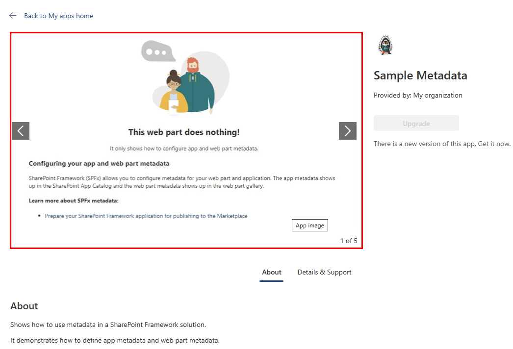

[SharePoint Framework](https://aka.ms/spfx) (SPFx) is an extensibility model for Microsoft 365 enabling developers to build different kinds of extensibility for Microsoft Viva, Microsoft Teams, Outlook, Microsoft 365 app (Office), and SharePoint. SPFx has multiple benefits like automatic Single Sign On, automatic hosting in the customer tenant, reuse same code across the service and industry standard web stack tooling.

-	*How do I change the name of my app in the app store?*
- *How do I provide an app icon?*
- *Where do I add screenshots and videos of my apps?* 
- *How do I control whether my app gets deployed automatically to every site?*  

Great questions! You can control how your application appears in the app store by configuring your **package-solution.json**.


This blog post is part of a month long SPFx series for January 2023. Each business day we'll publish a new blog post covering different aspects of the SPFx.

- Previous blog post in this series - [Professional SPFx Solutions: More web part manifest secrets](https://pnp.github.io/blog/post/spfx-20-professional-solutions-more-web-part-manifest-secrets/)


Unless you publish your SPFx solutions to the SharePoint Store for others to purchase, you may have never paid much attention to the **package-solution.json** file in your solution. But, just like the web part **.manifest.json**, the **package-solution.json** is full of cool configuration options that you should be aware of.

In today's post, I hope to convince you to spend a little bit more time with your **package-solution.json** to make your solutions appear more professional, and to change how your solutions behave when deployed.


## What is the **package-solution.json** and what does it do?

Located in your SPFx solution's **config** folder, the **package-solution.json** defines the parameters for the tasks that create your SharePoint package for deployment.

When you run `gulp package-solution --ship`, your **package-solution.json** determines how your solution will be packaged and how it will appear in the SharePoint App Catalog. It will also control how the app will get deployed, and what permission requests and isolation your app will need.

By default, the **package-solution.json** is automatically generated for you when you scaffold your SPFx solution with the bare minimum required; there is no user-friendly title, description, or any app icons; there aren't any screen shots, videos, or information about who created this cool app.

Let's change all that, shall we?

## A word about terminology and testing your changes to the **package-solution.json**

Throughout this article, I seem to use the words "solution", "package", and "app" interchangeably.

Let's agree on the following terms:

- **Solution:** The collection of source files that make your SPFx project. It contains **.ts**, **.tsx**, **.css**, and **.json** files, to name a few.
- **Package:** The built, bundled, and packed output of your solution into a single **.sppkg** file; the thing that you upload to your App Catalog to deploy your code and make your solution components available for others to consume.
- **App:** The ready-to-install instance of your solution as available via the App Catalog. It is what site administrators deploy to their sites in order to use the individual components (e.g. web parts) on their pages.

### To deploy your package for the first time

If you decide to test some of the configurations described in this post, you'll need to perform the following steps:

1. From the root of your solution, run the following command:
   
   ```bash
   gulp bundle --ship
   ```

   > You only need to run this command once after you change your code. If you're testing **package-solution.json** changes, you can skip this step after the first time.
1. Run the following command:
  
   ```bash
   gulp package-solution --ship
   ```

   > You may object to my using `--ship` for both the `bundle` and `package-solution` commands while testing, but I always want to identify deployment issues as early as possible when I am preparing to deploy to the App Catalog. By using `--ship`, I make sure that I am testing my app in the same conditions that my users will be using it. Feel free to skip `--ship` if you wish.
1. Find the generated `.sppkg` file with your file explorer (I usually navigate to the **sharepoint/solution** folder within VSCode, select the **.sppkg** and select **Reveal in File Explorer** in the context menu )
     
1. Go to your Tenant's App Catalog
1. In the **Manage apps** page, drag your **.sppkg** file onto the **Apps for SharePoint** list.
1. When prompted to **Enable app**, under **App availability**, select **Only enable this app**, followed by **Enable app** at the bottom of the pane.(there will be plenty of time later to automatically enable and deploy to all sites if that's what you wish to do, but please don't do this when you're testing your **package-solution.json** changes)
  
1. When you see **This app has been enabled**, select **Close** at the bottom of the pane.
     
1. Test as you wish!

### To deploy your package after the first time

1. In your **package-solution.json**, increment the `version` value. I like to increase by `0.0.0.1` every time I deploy. For example, if `version` is `1.0.0.0`, I'll change it to `1.0.0.1`, `1.0.0.2` the next time, `1.0.0.3` after that, and so on.
1. Run the following command:
  
   ```bash
   gulp package-solution --ship
   ```

1. Go to your Tenant's App Catalog
1. In the **Manage apps** page, drag your newly-updated **.sppkg** file onto the **Apps for SharePoint** list.
1. This time, it should say that your package wasn't uploaded because a file with the same name already exists. Select **Replace**.
     
1. As before, when prompted to **Enable app**, under **App availability**, select **Only enable this app**, followed by **Enable app** at the bottom of the pane.
1. When you see **This app has been enabled**, select **Close** at the bottom of the pane.
1. Make sure that the **App version** column has updated for your app.
     
1. Test your updated app!

### Updated your site-deployed app

If, in the process of testing your app, you deployed the app to a site, you may want to update the deployed instance by following these steps:

1. Go to the site where you deployed your app.
1. From the **Settings gear**, select **Add an app**
1. On the **My apps** page, find your app under **Added apps** and select it.
     
1. From the app details page, select **Upgrade**
     

## package-solution.json contents

Ok, enough pre-amble! Let's look at the contents of the **package-solution.json** file. 

Like the **.manifest.json**, the **package-solution.json** adheres to a [JSON schema](https://developer.microsoft.com/json-schemas/spfx-build/package-solution.schema.json) which determines the valid options that you can use. Withing VSCode, you can always Ctrl-Click on the schema URL to view the schema.

  

Here are some configurations you can find here:

### `name`

- By default, the name will be **[Your Solution Name]-client-side-solution**
- The name should be the non-localized name to identify your app.
- Don't use words matching features in Microsoft Teams or SharePoint, such as **Chat**, **Contacts**, **Calendar**, **Calls**, **Files**, **Meeting**, **Activity**, **Teams**, **Apps**, **Help**, **SharePoint**, **List**, **Page**, etc. as these names could be confused with the standard functionality in Teams and SharePoint.
- If your app is named after a common word, such as **Orders**, you should include your company name as well to clearly differentiate it from other apps, for example, **Contoso Orders**.
- Don't use names of other Microsoft's products in your app name, such as **Outlook**, **Word**, **Teams**, **Excel**, **PowerPoint**, **Visio**, etc.
- Don't use keywords that are related to Microsoft's products. Your name should not use Microsoft Teams or SharePoint feature-specific keywords like - **Start meeting**, **Make call**, **Upload file**, **Start chat**, etc. These keywords are used in Microsoft's products and using them in your application could confuse users. If your application offers similar functionality, include the name of your name in the action, for example: **Start a Zoom Meeting**, **Upload file to Dropbox**,**Start Freshdesk chat**, etc.

```json
{
  "$schema": "https://developer.microsoft.com/json-schemas/spfx-build/package-solution.schema.json",
  "solution": {
    "id": "74116799-8800-4c3f-abfe-fb72bdcb551c",
    "name": "Sample Metadata",
    // ...
  }
}
```

### `title`

- If you want to localize how your app will be listed in other language, you  can use a localizable string for the title of the package. 
- Can either be a non-localized string, or `$Resources:<stringId>;` if localized resources are provided for the package through a **.resx** file
- If your organization does not need to localize, you can skip this one.

```json
{
  "$schema": "https://developer.microsoft.com/json-schemas/spfx-build/package-solution.schema.json",
  "solution": {
    "id": "74116799-8800-4c3f-abfe-fb72bdcb551c",
    "name": "Sample Metadata",
    "title": "Sample Metadata",
    //...
  }
}
```

### `version`

- Helps SharePoint make sure that sites where your app is deployed are notified when you change your app.
- Recommend that you use one of the following versioning number schemes:
    - **major**.**minor**.**build**.**revision**, or 
    - **major**.**minor**.**maintenance**.**build**.
- Each build the version number is incremented at the last digit.
- Updating the major / minor version indicates changes of the functionality contracts:
    - **Major Version:** A breaking change
    - **Minor Version:** A backwards-compatible minor change
    - **Build / Revision:** No functionality change, just a different build.
- Example of the versioning scheme:

    Type of change|Stage|Versioning rule|Example version
    ---|---|---|---
    First release|New solution|Start with 1.0.0.0|1.0.0.0
    Subsequent build|Testing|Increment the last digit|1.0.0.1
    Backward compatible bug fixes|Patch release|Increment the third digit and reset the last digit to zero|1.0.1.0
    Backward compatible new features|Minor release|Increment the middle digit and reset third and fourth digits to zero|1.1.0.0
    Changes that break backward compatibility|Major release|Increment the first digit and reset remaining digits to zero|2.0.0.0

- Of course, feel free to use whichever convention you or your organization may already have in place.

```json
{
  "$schema": "https://developer.microsoft.com/json-schemas/spfx-build/package-solution.schema.json",
  "solution": {
    "name": "Sample Metadata",
    "id": "74116799-8800-4c3f-abfe-fb72bdcb551c",
    "version": "1.0.0.3",
  }
}
```

- Appears in the app details page, under **Details & Support**
    

### `supportedLocales`

- If you localized your solution (i.e.: you support more than one language), you should list the cultures which this package can be used with. 
- Follows LL-CC for each locale, where:
    - **LL:** Is the 2-character [language code](https://support.microsoft.com/topic/country-region-and-language-codes-add36afe-804a-44f1-ae68-cfb9c9b72f8b#ID0EDH) (e.g.: `en` for English, `fr` for France)
    - **CC:** Is the 2-character [region code](https://support.microsoft.com/topic/country-region-and-language-codes-add36afe-804a-44f1-ae68-cfb9c9b72f8b#ID0EDF) (e.g.: `us` for United States, `ca` for Canada)
- For example, if your app is localized for English (US) and French (France), you would use the following `supportedLocales`:

   ```json
   {
      "$schema": "https://developer.microsoft.com/json-schemas/spfx-build/package-solution.schema.json",
      "solution": {
        "name": "Sample Metadata",
        "id": "74116799-8800-4c3f-abfe-fb72bdcb551c",
        "version": "1.0.0.3",
        "supportedLocales": [
          "en-us",
          "fr-fr"
        ],
        //...
      }
   }
   ```

- Appears under **Details & Support** on your app details page:
    

## `iconPath`

- The path to an icon for your app.
- Path is relative to the base package directory (i.e.: the **sharepoint** folder in your solution).
- Image must be **96x96 pixels**.
- Appears in the **My apps** page, app details, and **Manage apps**
  
    
    
- Your browser will cache the image. If you change the image in your solution, make sure to rename the file, or you'll spend many frustrating hours trying to figure out why your new icon is not reflected. (I speak from experience, here)
- To add in icon to your app, follow these steps (inspired by [these great instructions](https://thechriskent.com/2017/06/19/sharepoint-framework-app-icon/) by Chris Kent -- but don't tell him I said anything nice about him, or it'll get to his head)
    1. In your SPFx solution's **sharepoint** folder, create an **assets** folder. You don't need to create a folder, and the folder does not need to be called **assets**, it's just a common convention. You do you.
    1. Save a 96px by 96px **.png** file that you wish to use as your app icon in your **assets** folder. For these instructions, we'll name the file **appicon.png**, but you can use whatever name you'd like.
    1. In your **package-solution.json**, add a new line in the `solution` node as follows:
    
       ```json
       "iconPath": "assets/appicon.png",
       ```
    
    > Remember: the path to the image must be relative to the **sharepoint** folder.

    Your **.json** file should look as follows:

    ```json
    {
      "$schema": "https://developer.microsoft.com/json-schemas/spfx-build/package-solution.schema.json",
      "solution": {
        "name": "Sample Metadata",
        "iconPath": "assets/appicon.png",
        "id": "74116799-8800-4c3f-abfe-fb72bdcb551c",
        "version": "1.0.0.6",
        //...
      }
    }
    ```

### `skipFeatureDeployment`

- If set to `true`, it will give the tenant admin the choice of being able to deploy the components to all sites immediately without running any feature deployment or adding apps in sites.

### `developer`

- The properties about the author (or developer) of this app.
- Contains the following properties:
  Property|Description|Required
  ---|---|---
  `name`|The developer name or company name|Yes
  `websiteUrl`|Your company's web site URL, including `https://` or `http://` |Yes
  `privacyUrl`|Your company's privacy policy URL, including `https://` or `http://` | Yes (but can be an empty string `""`)
  `termsOfUseUrl`|Your company's terms of use URL, including `https://` or `http://` | Yes (but can be an empty string `""`)
  `mpnId`|Your [Microsoft Partner Network ID](https://partner.microsoft.com/mpn/partner), or `Undefined-1.16.1` if you aren't a partner | Yes

- Your **.json** should look as follows: 

  ```json
  {
  "$schema": "https://developer.microsoft.com/json-schemas/spfx-build/package-solution.schema.json",
  "solution": {
    "name": "Sample Metadata",
    "id": "74116799-8800-4c3f-abfe-fb72bdcb551c",
    "developer": {
      "name": "PnP",
      "websiteUrl": "https://pnp.github.io/",
      "privacyUrl": "",
      "termsOfUseUrl": "",
      "mpnId": "Undefined-1.16.1"
    },
  }
  ```

## The `metadata` node

So far, everything we have discussed was within the `solution` node of your **package-solution.json**. These next configuration options can be found under the `metadata` node, within the `solution` node:

### `shortDescription`

- Short description of the app. This value will be displayed on legacy **Add an app** page. 
- It is a localized dictionary, which means that it should contain a locale, and a localized string, as follows:

  ```json
  "shortDescription": {
        "default": "Shows how to use metadata in a SharePoint Framework solution.",
        "fr-fr": "Montre comment utiliser les métadonnées dans une solution SharePoint Framework."
      }
  ```

- It must contain a "default" key.
- The description should always clearly describe what different components (web parts, application customizers, etc.) are included in the package to manage user expectations and help them understand the impact of using your application.

```json
{
  "$schema": "https://developer.microsoft.com/json-schemas/spfx-build/package-solution.schema.json",
  "solution": {
    "name": "Sample Metadata",
    "iconPath": "assets/appicon.png",
    "id": "74116799-8800-4c3f-abfe-fb72bdcb551c",
    "version": "1.0.0.6",
    "supportedLocales": [
      "en-us",
      "fr-fr"
    ],
    "developer": {
      "name": "PnP",
      "websiteUrl": "https://pnp.github.io/",
      "privacyUrl": "",
      "termsOfUseUrl": "",
      "mpnId": "Undefined-1.16.1"
    },
    "metadata": {
      "shortDescription": {
        "default": "Shows how to use metadata in a SharePoint Framework solution.",
        "fr-fr": "Montre comment utiliser les métadonnées dans une solution SharePoint Framework."
      },
      //...
    },
  }
}
```

### `longDescription`

- Long description of the app, with (supposedly) HTML support. This value will be displayed on the app details page. 
- Although the schema says that it supports HTML, I have only been able to add newline characters (`\n`), no other HTML.
- Just like the `shortDescription`, it is a localized dictionary. 
- You should have a "default" key.
- Here is an example of using a newline character in a `longDescription`:
  ```json
  {
  "$schema": "https://developer.microsoft.com/json-schemas/spfx-build/package-solution.schema.json",
      "solution": {
        "name": "Sample Metadata",
        "iconPath": "assets/appicon.png",
        "id": "74116799-8800-4c3f-abfe-fb72bdcb551c",
        "version": "1.0.0.7",
        "supportedLocales": [
          "en-us",
          "fr-fr"
        ],
        "developer": {
          "name": "PnP",
          "websiteUrl": "https://pnp.github.io/",
          "privacyUrl": "",
          "termsOfUseUrl": "",
          "mpnId": "Undefined-1.16.1"
        },
        "metadata": {
          "shortDescription": {
            "default": "Shows how to use metadata in a SharePoint Framework solution.",
            "fr-fr": "Montre comment utiliser les métadonnées dans une solution SharePoint Framework."
          },
          "longDescription": {
            "default": "Shows how to use metadata in a SharePoint Framework solution.\n\nIt demonstrates how to define app metadata and web part metadata."
          },
          //...
        },
      }
  }
  ```

  

### `screenshotPaths`

- Relative paths or absolute external URLs to the screenshots.
- Like the `iconPath`, the base for relative paths is the base package directory (i.e.: **sharepoint**). 
- You can add them to the **assets** folder you created under **sharepoint**
- Unlike `iconPath`, you can include a link to an external image.
- The screenshots will be displayed on the App's About page. 
- You can add up to 5 screenshots.
- The recommended screenshot dimensions aren't explicitly listed, but the placeholder is 706 pixels wide by 397 pixels high -- which is a 16:9 aspect ratio.
- Make sure that your app's screenshots describe only the app and don't contain any additional advertising. It isn't cool.
- You can include **.gif** files
- Here is an example of a including relative and absolute screenshots, with an animated **.gif**:

    ```json
    {
  "$schema": "https://developer.microsoft.com/json-schemas/spfx-build/package-solution.schema.json",
      "solution": {
        "name": "Sample Metadata",
        "iconPath": "assets/appicon.png",
        "id": "74116799-8800-4c3f-abfe-fb72bdcb551c",
        "version": "1.0.0.8",
        "metadata": {
          "screenshotPaths": [
            "assets/screenshot1.png",
            "assets/screenshot2.png",
            "assets/screenshot3.png",
            "assets/screenshot4.png",
            "https://github.com/hugoabernier/hugoabernier/raw/master/assets/HomerSharePoint.gif"
          ],
          //...
        }
      }
    }
    ```

      

### `videoUrl`

- Add a URL to a YouTube or Vimeo video of your app.
- Recommended length: 60-90 seconds. 
- Your video should communicate the value of your product in narrative form and/or demonstrate how the product works.
- Appears on the about app page
- If you have screenshots and a video, the video will appear as the first slide on the carousel
    
- Here is an example of a **package-solution.json** with a video:
  
  ```json
  {
  "$schema": "https://developer.microsoft.com/json-schemas/spfx-build/package-solution.schema.json",
      "solution": {
        "name": "Sample Metadata",
        "iconPath": "assets/appicon.png",
        "id": "74116799-8800-4c3f-abfe-fb72bdcb551c",
        "version": "1.0.0.9",

        "metadata": {
          "videoUrl": "https://youtu.be/xfr64zoBTAQ",
        }
        //...
      }
    }
  ```

### `categories`

- Indicates which categories you want your app to appear in the SharePoint store.
- Pretty much only useful if you plan to publish on the SharePoint store. Otherwise, it is of little use.
- Your product description should show how these categories apply to your app.
- You can pick up to 3 choices from this list:
    - Accounting + Finance
    - Collaboration
    - Content management
    - CRM
    - Data + analytics
    - File managers
    - IT/admin
    - Legal + HR
    - News + weather
    - Productivity
    - Project management
    - Reference
    - Sales + marketing
    - Site Design
    - Social
    - Workflow & Process Management
- Appears in your app details page, under **Details & Support**
  

## Conclusion

Whew! That was a lot of settings to look at! I hope that you learned a few useful tips to make your SPFx solutions look as good as the professionals!

There are a few other settings that we didn't cover, so make sure to explore your **package-solution.json**, and let us know how you did!

## References

Here are some initial references to get started with the SPFx in your development. Please do provide us with feedback and suggestions on what is needed to help you to get started with the SPFx development for Microsoft 365.

-	SPFx documentation – <https://aka.ms/spfx>
-	Issues and feedback around SPFx - <https://aka.ms/spfx/issues>
-	Microsoft 365 Platform Community – <https://aka.ms/m365/community>
-	Public SPFx and other Microsoft 365 platform community calls – <https://aka.ms/m365/calls> 
    - These calls are for everyone to take advantage to stay up to date on the art of possible within Microsoft 365 and to provide guidance for beginners and more advance users.
-	SPFx samples in the Microsoft 365 Unified Sample gallery – <https://aka.ms/m365/samples>

- - -

We will provide more details on the different options and future direction of the SPFx in [our next post](https://pnp.github.io/blog/post/spfx-20-professional-solutions-more-web-part-manifest-secrets/). This post focused on the getting started steps with SPFx - more details coming up with this series with one post within each business day of January 2023.
