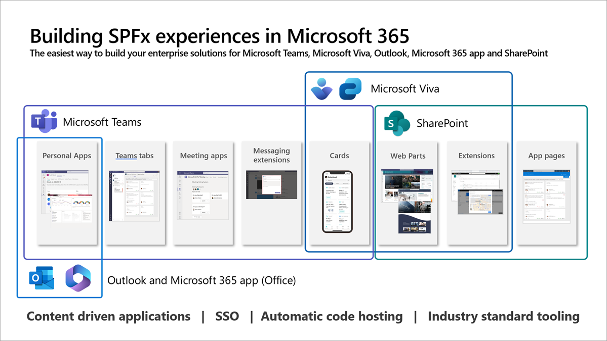

[SharePoint Framework](https://aka.ms/spfx) (SPFx) is an extensibility model for Microsoft 365 enabling developers to build different kinds of extensibility for Microsoft Viva, Microsoft Teams, Outlook, Microsoft 365 app (Office), and SharePoint. SPFx has multiple benefits like automatic Single Sign On, automatic hosting in the customer tenant, reuse same code across the service and industry standard web stack tooling.

-	*I've been reading this series and there's a lot of thigs what SPFx cand do. Had no idea. How would you summarize this series?*
-	That is a great question. SPFx aligns on the great messaging from [Satya Nadella](https://www.linkedin.com/pulse/doing-more-less-microsoft-cloud-satya-nadella) (Microsoft) on enabling our customers to more with less. We want to ensure that you will get the maximium return of investment on building on top of the Microsoft 365 with SPFx.


This blog post is part of a month long SPFx series for January 2023. Each business day we'll publish a new blog post covering different aspects of the SPFx.

- Previous blog post in this series - [Professional SPFx Solutions: Superb solution packages](https://pnp.github.io/blog/post/spfx-21-professional-solutions-superb-solution-packages/)
- **First blog post** in this series - [What is SPFx? – An extensibility model for Microsoft 365](https://pnp.github.io/blog/post/01-what-is-spfx/)


## Do more with less in Microsoft 365 by using SPFx

SPFx is a great example of the investments we do in Microsoft enabling you to [do more with less](https://www.linkedin.com/pulse/doing-more-less-microsoft-cloud-satya-nadella/-nadella/). Write the solution once and **use the same component** without any code changes within Microsoft Teams, Microsoft Viva, Outlook, Microsoft 365 app (Office) and SharePoint.

We want to ensure that you can **maximize the value of your existing investments within Microsoft 365** and easily integrate them with business systems hosted in Azure. Microsoft Cloud (Azure and Microsoft 365) provides an awesome combination for your business applications and supports to build solutions for your day-to-day work which improve communications and collaboration between your employees.

SPFx is designed to make it as easy as possible for building business applications which are surfaced in the Microsoft 365 across the Microsoft Viva, Microsoft Teams, Outlook, Microsoft 365 app (Office) and SharePoint. The name of the SPFx can sound misleading, given the updated focus across Microsoft 365, but do not get stuck on the definition, rather see the huge possibilities the SPFx provides for you to **maximize the value of your investments**. As Microsoft Teams apps [are extending across Microsoft 365](https://learn.microsoft.com/microsoftteams/platform/m365-apps/overview), you can also start using **SPFx powered Microsoft Teams solutions** in Outlook and in Microsoft 365 app (Office).

SPFx is based on **industry standard tooling**, so you can **achieve more with your existing skills**. There are no SharePoint specific knowledge or skills needed to build your solutions with SPFx for Microsoft 365.

Key capabilities of the SPFx for Microsoft 365 are following:

- **Content Driven Applications** – SPFx can be used to build content driven applications on surfacing information easily from Microsoft 365 with Microsoft Graph or to integrate with externally hosted content and APIs.
- **Automatic Single Sign On** – SPFx components have automatic and seamless SSO included for all platforms they are hosted. No specific consents needed from Microsoft 365 end users.
- **Automatic and secure hosting** – SPFx components are automatically hosted in Microsoft 365 without additional maintenance or operational costs. Hosting happens automatically within the security boundary of the tenant where they are deployed.
- **Industry standard web stack tooling** – SPFx is using standard web stack tooling with node, npm, TypeScript and any JavaScript framework of your preference. Just standard web development skill to succeed without any proprietary tooling.

SPFx integrates securely and seamlessly into your business APIs hosted in Azure and of course to [Microsoft Graph](https://learn.microsoft.com/graph/overview), which is THE API to access relevant information in Microsoft Cloud.

## Getting started with SPFx blog post series

During January 2023, we worked with our community members to provide you a 22 blog post articles, showcasing the opportunities and possibilities with SPFx. See the full list of released blog posts below.

1. [What is SPFx? – An extensibility model for Microsoft 365](https://pnp.github.io/blog/post/01-what-is-spfx/)
1. [Getting started with SPFx – Building your first extensibility for Microsoft 365](https://pnp.github.io/blog/post/spfx-02-getting-started-with-spfx/)
1. [Getting started with SPFx extensions for SharePoint Online](https://pnp.github.io/blog/post/spfx-03-getting-started-with-spfx-extensions-for-spo/)
1. [Using Microsoft Graph with SPFx solutions](https://pnp.github.io/blog/post/spfx-04-using-microsoft-graph-in-spfx-solutions/)
1. [What does tenant or site scoped deployment mean for SPFx solutions?](https://pnp.github.io/blog/post/spfx-05-tenant-or-site-scoped-spfx-solutions/)
1. [Building SPFx solutions for Microsoft Teams](https://pnp.github.io/blog/post/spfx-06-spfx-for-teams/)
1. [Automatic hosting of SPFx code in Microsoft 365](https://pnp.github.io/blog/post/spfx-07-automatic-hosting-spfx-solutions/)
1. [How to use SPFx powered Microsoft Teams apps in Outlook and Office](https://pnp.github.io/blog/post/spfx-08-spfx-powered-teams-solutions-outlook-office/)
1. [Building Microsoft Viva extensibility with SPFx](https://pnp.github.io/blog/post/spfx-09-building-microsoft-viva-extensibility-spfx/)
1. [Creating single part app page for SharePoint Online with SPFx](https://pnp.github.io/blog/post/spfx-10-single-part-app-pages/)
1. [Transforming SharePoint add-ins to SPFx solutions](https://pnp.github.io/blog/post/spfx-11-transform-add-ins-to-spfx/)
1. [Publishing SPFx solution offerings to app source and SharePoint store](https://pnp.github.io/blog/post/spfx-12-publishing-spfx-solutions-store/)
1. [Design guidance and assets on building Microsoft Viva extensions with SPFx](https://pnp.github.io/blog/post/spfx-13-design-guidance-for-building-viva-extensions-spfx/)
1. [Getting Started with using PnPjs in your SPFx solutions](https://pnp.github.io/blog/post/spfx-14-getting-started-with-pnpjs-spfx/)
1. [Building a shared map solution for Microsoft Teams with SPFx](https://pnp.github.io/blog/post/spfx-15-building-a-shared-map-teams-solution-spfx/)
1. [Building partner offerings for Microsoft Viva Connections & Viva Home with SPFx](https://pnp.github.io/blog/post/spfx-16-building-partner-offerings-for-viva-spfx/)
1. [Using Microsoft Graph Toolkit with SPFx solutions](https://pnp.github.io/blog/post/spfx-17-microsoft-graph-toolkit-spfx/)
1. [Using reusable open-source controls within your SPFx solution](https://pnp.github.io/blog/post/spfx-18-reusable-open-source-controls-spfx/)
1. [Professional SPFx Solutions: Unlocking the secrets of your web part manifest](https://pnp.github.io/blog/post/spfx-19-professional-solutions-web-part-manifest/)
1. [Professional SPFx Solutions: More web part manifest secrets](https://pnp.github.io/blog/post/spfx-20-professional-solutions-more-web-part-manifest-secrets/)
1. [Professional SPFx Solutions: Superb solution packages](https://pnp.github.io/blog/post/spfx-21-professional-solutions-superb-solution-packages/)
1. Do more with less in Microsoft 365 by using SPFx - *this article*

Thanks for [Julie Turner](https://twitter.com/jfj1997) (Sympraxis Consulting), [Bob German](https://twitter.com/Bob1German) (Microsoft) and [Hugo Bernier](https://twitter.com/bernierh) (Microsoft) on partnering on creating these articles during January 2023 👏

Thank you all for your high interest in these blog posts across social media. Please do let us know what kind of guidance and information you’d also like to see in future 📝

## References

Here are some initial references to get started with the SPFx in your development. Please do provide us with feedback and suggestions on what is needed to help you to get started with the SPFx development for Microsoft 365.

-	SPFx documentation – <https://aka.ms/spfx>
-	Issues and feedback around SPFx - <https://aka.ms/spfx/issues>
-	Microsoft 365 Platform Community – <https://aka.ms/m365/community>
-	Public SPFx and other Microsoft 365 platform community calls – <https://aka.ms/m365/calls>
    - These calls are for everyone to take advantage to stay up to date on the art of possible within Microsoft 365 and to provide guidance for beginners and more advance users.
-	SPFx samples in the Microsoft 365 Unified Sample gallery – <https://aka.ms/m365/samples>

- - -

*"If you're coding bad, stop coding bad and code awesome instead!"* - Sharing is caring! 🧡
