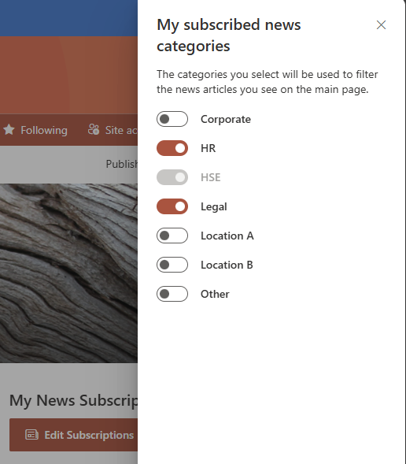
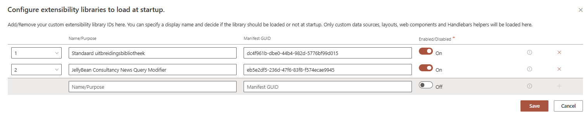
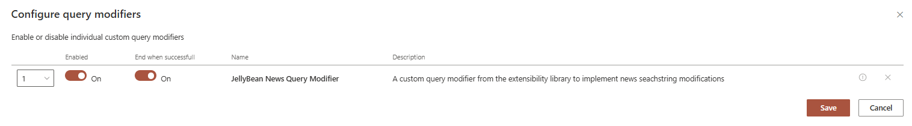

---
# this is the title
title: "Introducing the 'My News Subscriptions' Solution by JellyBean Consultancy"
# this is the publishing date of your article, usually this should match "now"
date: 2025-04-21T12:00:00
# This is your name
author: "Roel Adams"
# This is your GitHub name
githubname: roeladams21
# Don't change
categories: ["Community post"]
# Link to the thumbnail image for the post
images:
- images/JBC_MyNewsSubscriptions_Overview.png
# don't change
tags: []
# don't change
type: "regular"
---

One of the standout solutions in our portfolio is My News Subscriptions — a powerful, search-based intranet tool designed to provide users with a personalized view of corporate news within a SharePoint intranet environment.

## What is 'My News Subscriptions'?

The My News Subscriptions solution enhances employee engagement by allowing users to curate their own news feed based on topics they care about. Leveraging the power of SharePoint Search and the excellent PnP Modern Search V4 Results webpart (shout out to all contributors!), this solution brings dynamic, personalized news content front and center.

It works by utilizing managed metadata as tags on news pages within a SharePoint site. Users can subscribe to tags they’re interested in via an on-page interface, creating a highly customized news experience. Site owners/editors can control which news tags are mandatory, so the delivery of important corporate information is always ensured, whilst maintaining the flexibility for the users of selecting optional new tags to streamline their own news feed. This approach not only enhances the user experience but also keeps the solution lightweight, search-driven, and highly configurable. 

## Key Technical Components

- A dedicated SPFx webpart that enables users to manage their news tag subscriptions, connected to the same Managed Metadata set as the news items and storing preferences (subscribed news tags) in their OneDrive AppData folder
- PnP Modern Search V4 Results webpart with a custom Handlebars template for rendering news item results
- SPFx custom query modifier, configured in the Search Results webpart to dynamically alter the query based on user preferences
- Managed Metadata set used as an extra column in the SitePages library to tag news content
- Custom Handlebars template that displays these tags in the frontend (after configuring the news tags column as a Managed Property in the SharePoint Search Schema)

## Prerequisites of the solution

- Install the PnP Modern Search V4 webparts to your site
- Define a Managed Metadata termset to be used as categories (news tags), add this set to the SitePages library of your site and add it to the Search Schema.

What we now add to the mix are our custom webpart and query customizer.

### SPFx webpart 'My News Subscriptions'

At the center of our solution is the custom webpart which renders as a button on a SharePoint page and when clicked opens a panel showing a number of predefined news categories (tags) based on a Managed Metadata set. The user can select or deselect these categories (mandatory categories cannot be unselected - this is controlled by site editors through the webpart settings) and save them. The webpart then leverages the AppData folder in the user's OneDrive and saves the current selection of categories in a json file there. If the file doesn't exist yet, it will of course be created. 

### PnP Modern Search V4 Results webpart + SPFx custom query modifier: a golden combo

The PnP Modern Search V4 Results webpart replaces your traditional out-of-the-box SharePoint news webpart. This gives us the maximum amount of control concerning the look and feel of the news items, as well as the possibility to extend its capabilities by using a SPFx custom query modifier. The details on implementing a custom query modifier are available on the PnP Modern Search site (https://microsoft-search.github.io/pnp-modern-search) so we will not delve into that here, but we will explain the internal workings of the query modifier and how to configure it correctly.

The custom query modifier taps directly into the query that is being delivered to the SharePoint search by adding query text into the **{searchTerms}** part of the query template. It reads the user's news tag subscription file from their OneDrive's AppData folder and for each subscribed tag it strings it together with the managed property name of the news tags column mapped to the search and the value of the property and adds an 'OR' to combine it all. The resulting string will look something like this when the user has selected news tags 'HR', 'HSE' and 'Legal': 

*(NewsTags:\"HR\" OR NewsTags:\"HSE\" OR NewsTags:\"Legal\")*

When you configure the query template to be "**{searchTerms}** *path:https://tenantname.sharepoint.com\* PromotedState=2 SPTranslationLanguage:en-us*", the combined query string delivered to the SharePoint Search will then look like this:

*(NewsTags:\"HR\" OR NewsTags:\"HSE\" OR NewsTags:\"Legal\") path:https://tenantname.sharepoint.com\* PromotedState=2 SPTranslationLanguage:en-us*

thus returning all news items that have been published, with SPTranslationLanguage 'en-us' within the rootsite of this tenant, having a NewsTags value of 'HR', 'HSE' or 'Legal'. This also works when using the managed metadata column to use multiple selections.

Because this part might not be immediately obvious, we will include the configuration steps to correctly configure your custom query modifier:
1) upload your custom query modifier to the App Catalog of your tenant
2) install the custom query modifier in the site where you also installed the PnP Modern Search V4 webpart solution
3) put the PnP Modern Search V4 Results webpart on a page and edit its properties
4) on page 4 of the settings, under Extensibility Configuration, click configure, then add your custom query modifier's name (choose as you wish) plus its manifest Guid and enable it. Click save!
5) go back to page 3 and make sure to toggle 'Use input query text' to 'On', and click on 'Configure Query Modifiers': enable your query modifier by toggling both switches to 'On'. Click save!

You have now configured your custom query modifier to be used in the Search Results webpart!

What we did on top of that was ensure that our News Subscriptions webpart could also be added as a dynamic query source to the Search Results webpart, so that changing our selected news tags in the news subscription panel immediately triggers a new search, so you don't have to wait for the panel to close to see the changes in your newsfeed.
