## Intro

When starting your journey with SharePoint Framework (SPFx) development, you always start with a basic setup of your development environment. In this post series, I would like to introduce you to different ways to prepare for SPFx development. Over the next few posts, I will try to briefly explain how to:

- [perform local setup using Node Version Manager (NVM) or Node Version Switcher (NVS)](https://pnp.github.io/blog/post/spfx-setup-part1-nvm-nvs/) 
- boost local setup using WSL (which is this post)
- use Docker for SPFx development
- code in the cloud using GitHub Codespaces

## What is WSL?

What if I told you that you can run Linux on Windows without the need to setup any virtual machine using Virtualbox or VMWare or separate booting or anything like that? That's right! Windows Subsystem for Linux (WSL) allows you to install and run a Linux Distribution (such as Ubuntu, Kali, Debian, or others) and use Linux applications, utilities, and Bash command-line tools directly on Windows. Yep just like that!

## Why use WSL for your SPFx workspace setup and development?

But why would you use WSL for your SPFx workspace setup and development? Well, I may name a few reasons:

- performance is a big one. WSL2 uses a full Linux kernel, which means it can handle system calls more efficiently. This results in better performance for applications like Node.js that rely heavily on system calls. WSL2 also offers faster file system performance, BUT only if the project files are stored within the Linux file system rather than the Windows file system. This reduces the overhead associated with file I/O operations. 
- export/import your WSL environment. After you set up your dev environment and install all global dependencies and tooling, you can easily export your WSL environment as a backup and import it when needed. This is very useful when you need to switch between machines when you need to share your environment with others or simply if you would like to start from scratch. 

## How to set up WSL for SPFx development?

Let's start with the basic installation of WSL. You may install WSL2 on Windows 10 (build higher than 18362, for a lower build number it is possible to install WSL 1 but the setup steps are a lot more complex). If you are using Windows 11 then you are pretty much ready to go! The installation process is very simple and straightforward. Simply run:

```sh
wsl --install
```

After that simply restart your terminal and you are ready to go. Run `wsl --help` to confirm that WSL is installed and running.

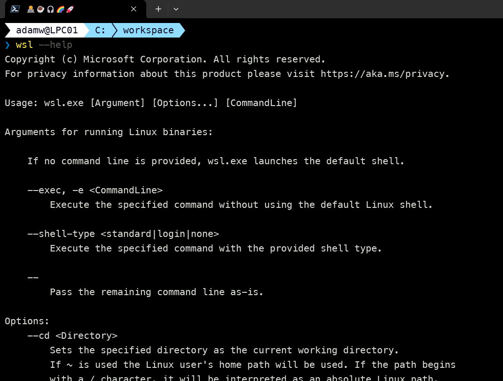

The next step is to install a Linux distribution. You may install Ubuntu, Debian, Kali, or any other distribution available. What is cool is that you may install a distribution you prefer on the Microsoft Store and then get it with a single click.

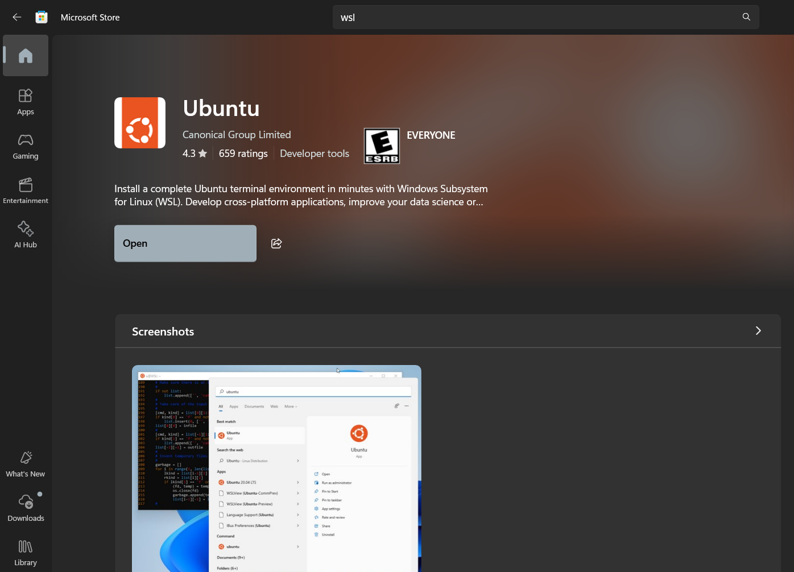

Of course, you may install it using the command line as well. For example, to install Ubuntu you may run:

```sh
wsl --install Ubuntu
```

To get the list of available distributions that may be installed you may run:

```sh
wsl --list --online
```

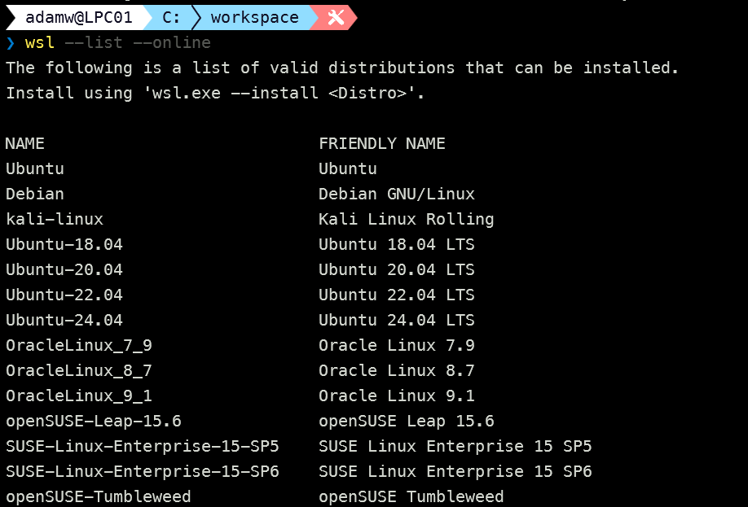

And to list the Linux distributions you have installed you may run:

```sh
wsl --list
```

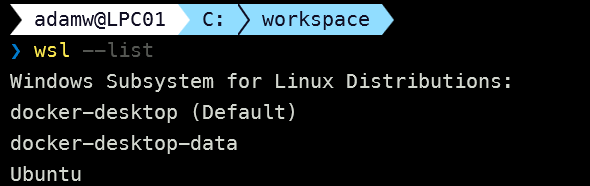

To start the installed distribution, like the Ubuntu we installed just a few steps above, you may run:

```sh
wsl --distribution Ubuntu
```

You may also set the default distribution to start when you run `wsl` command. And that's it! You have WSL2 installed and running Ubuntu on your Windows machine.

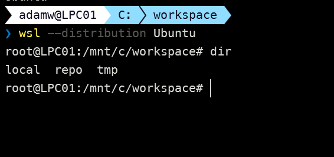

Now let's do some basic setup for SharePoint Framework development. Before we start installing Node.js and other dependencies, let's first create a new user for our Ubuntu machine and use it for our development. It's always a good practice to avoid using the root user for development purposes when running Linux. To create a new user, for example, 'adam', you may run:

```sh
useradd --create-home --shell /usr/bin/bash --user-group --groups  adm,dialout,cdrom,floppy,sudo,audio,dip,video,plugdev,netdev --password $(read -sp Password: pw ; echo $pw | openssl passwd -1 -stdin) adam
```

Of course, you need to run the above when running Ubuntu on WSL as the root user. After that simply log out by running `exit` and then connect again as the user you just created.

BTW when you logout using the `exit` command, the Ubuntu will be still running in the background for some time. You may check that by running:

```sh
wsl --list --running
```

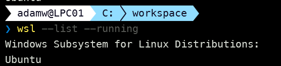

if you want to stop all running distributions you may run:

```sh
wsl --shutdown
```

Ok but now let's get back to setting up our Ubuntu environment for SPFx development. First, let's log in again as the user we created:

```sh
wsl --distribution Ubuntu --user adam
```

Now we of course need to install Node.js and you may do it directly or you may use NVM or NVS for that. I will of course use a Node Version Manager (in this case NVM) to install Node.js, and if you are curious why please read the [previous part of this series](https://pnp.github.io/blog/post/spfx-setup-part1-nvm-nvs/). To install NVM you may run:

```sh
curl -o- https://raw.githubusercontent.com/nvm-sh/nvm/v0.40.1/install.sh | bash
```

After that, we may install Node.js using NVM. For the currently latest version of SPFx which is 1.20 we need Node v18 so let's run:

```sh
nvm install 18.20.3
```

After that gets installed let's switch to that version by running: 

```sh
nvm use 18.20.3
```

Now we need to install the global dependencies for SPFx development, meaning Yeoman, Gulp, and the SharePoint Framework Yeoman generator. To do that you may run:

```sh
npm install gulp-cli yo @microsoft/generator-sharepoint --global
```

And that's it! You are ready to start your SPFx development using WSL2. Remember that you may export your WSL environment at any time and import it when needed. That way you may back up your setup, and share it with others or simply start from scratch when needed.

To perform a backup/export you may run:

```sh
wsl --export <Distro name> <File name.tar>
```

And then to import it you may run:

```sh
wsl --import <Distro name> <Directory where you want to store the imported image> <Exported file name.tar>
```

## Let's compare the performance between WSL and Windows local setup on a sample solution

Ok so let's do a bit of comparing between WSL and Windows local setup. Starting from the very beginning, let's create a simple, no framework, SPFx solution using the good old approach with Yeoman generator.

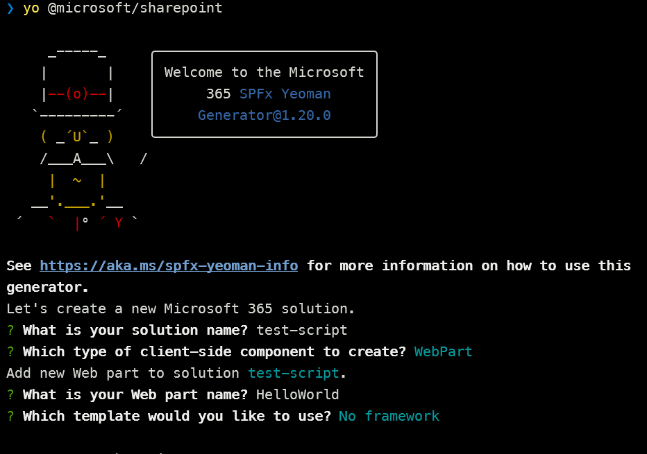

And let's see how long will take the scaffolding together with npm install.

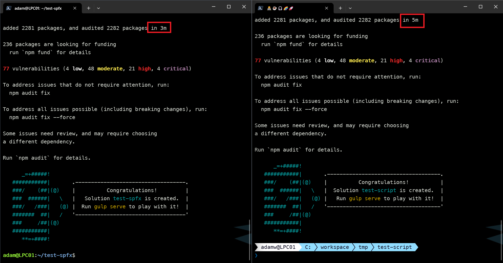

Now let's see the results. On the left side, we have Ubuntu running on WSL2 and on the right side, we have Windows. As you can see the npm install is a bit better on WSL2 than on Windows.
Now let's go a bit further and let's run the `gulp bundle` command on both setups and see how long it will take to bundle the solution for the very first time.

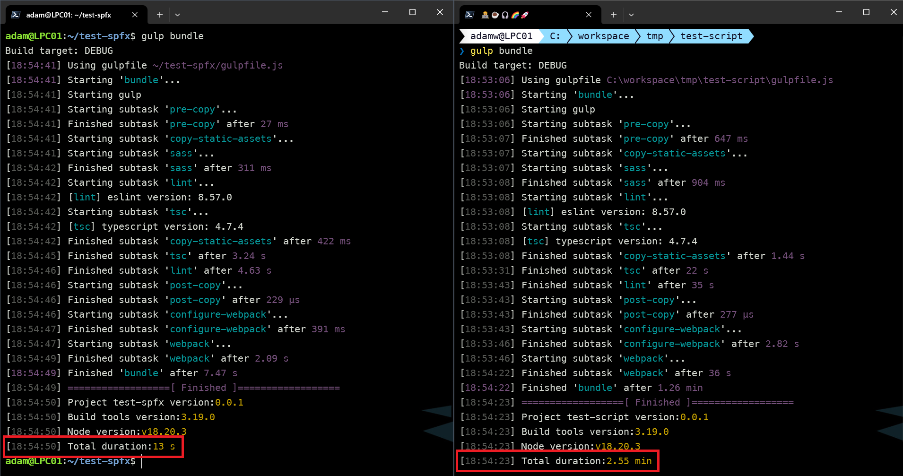

Now the result is significantly better on WSL2 than on Windows. I would say it is incomparable as in the case of Ubuntu on WSL2 we are working in seconds and in the case of Windows we are working in minutes. When we would run the `gulp bundle` command again, the result would be similar on both setups.
Now let's run the `gulp package-solution` command on both setups and see how long it will take to package the solution.

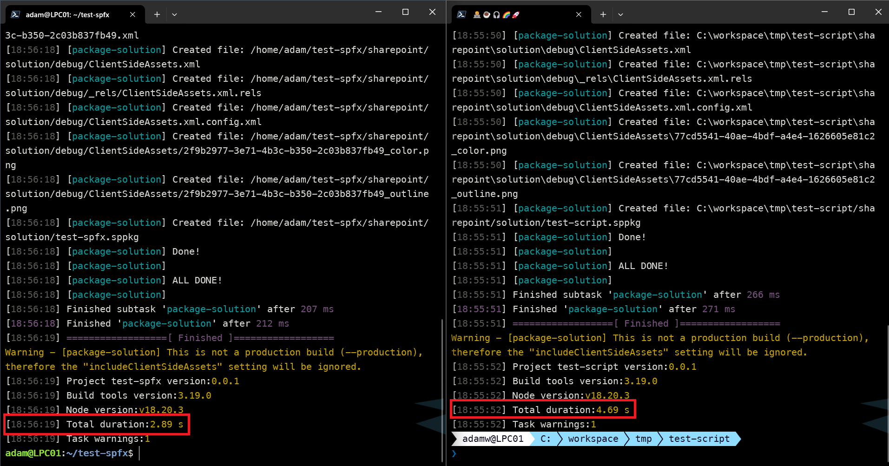

In this case, the result is quite similar but still slightly better on WSL2 than on Windows.

## Serve SPFx solution on WSL

As in any SPFx development the most used commands will be the `gulp bundle`, `gulp package-solution`, and `gulp serve`. Also, as for any first time setup you will need install the developer certificate into your Windows Certificate Manager and thats where it's a bit tricky when you are using WSL. Luckly for us [Don Kirkham already wrote a great blog post](https://donkirkham.com/blog/spfx-wsl/) on how to do that. 
On Windows machines running `gulp trust-dev-cert` will do everything for you but this approach will not work in WSL because the command runs on Linux but when you are debugging your solution you will be using the web browser which runs in Windows. So you need to install the developer certificate that was generated for WSL manually into the Windows Certificate Manager. If you wont do that your SPFx solution will always show a notification to run `gulp serve` as SharePoint will be asking for your solution manifest file which should be present `localhost:4321` but if you don't install a valid certificate the browser will block the request.
So lets go over the process to setup your developer certificate for SPFx solution running on WSL. First run the `gulp trust-dev-cert` command in your SPFx solution directory. This will generate a developer certificate for you. Now we need to convert the certificate to the correct filetype for Windows and place the certificate in the root folder of our project with the following command:

```sh
openssl x509 -inform PEM -in ~/.rushstack/rushstack-serve.pem -outform DER -out ./spfx-dev-cert.cer
```

Now you should see the `spfx-dev-cert.cer` file in the root folder of your project. Right click and select `download` and save the file to any location on your Windows machine. After that install it by importing the Certificate to the Current User store. It's very important to pick the Trusted Root Certificate Authorities store when importing the certificate, otherwise it will not work. 
After that you should be able to run `gulp serve` and debug your SPFx solution running on WSL in your web browser.

## VS Code support

VS Code has some pretty nice integrations when it comes to WSL. 

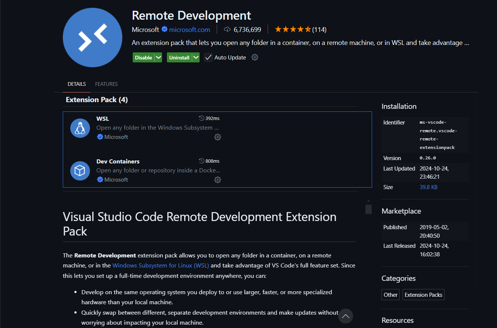

By installing the Remote Development extension pack you may easily browse your WSL distros, open a terminal, and even open a full VS Code window in WSL. This is very useful when you want to work on your project in WSL but still use the full power of VS Code.

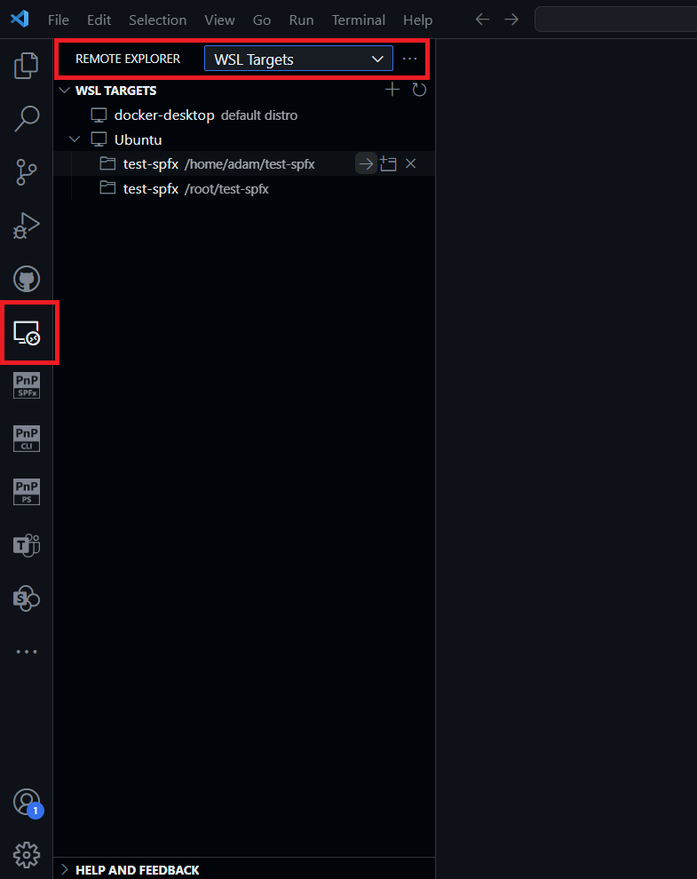

Also after you connect, VS Code has a remote indicator that is presenting you as being connected to WSL which all brings a quite smooth experience.

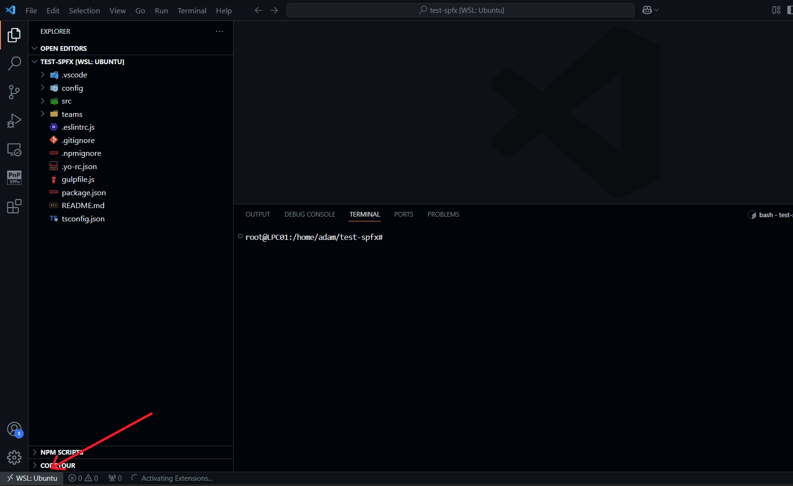

Of course, when you just use the `code .` command from the  terminal in WSL, VS Code will open the project in WSL as well.

## SPFx Toolkit for Visual Studio Code

When you are working on SPFx projects in VS Code, you may use the [SharePoint Framework Toolkit extension](https://marketplace.visualstudio.com/items?itemName=m365pnp.viva-connections-toolkit). This extension will help you at every stage of SharePoint Framework development. Doesn't matter if you are just starting your journey with SPFx or you are an experienced developer, this extension will help you from learning to boosting code, managing your solutions, and even deploying them to SharePoint. And now it comes along with an AI assistant dedicated to SharePoint Framework development. 

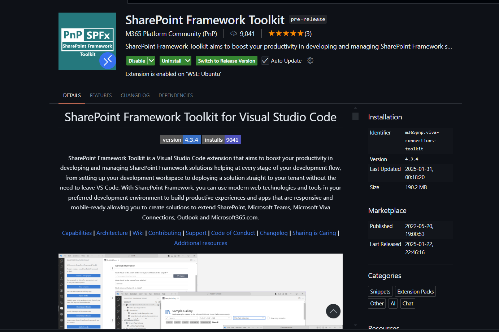

The coolest part is that it works with WSL as well without any additional setup.

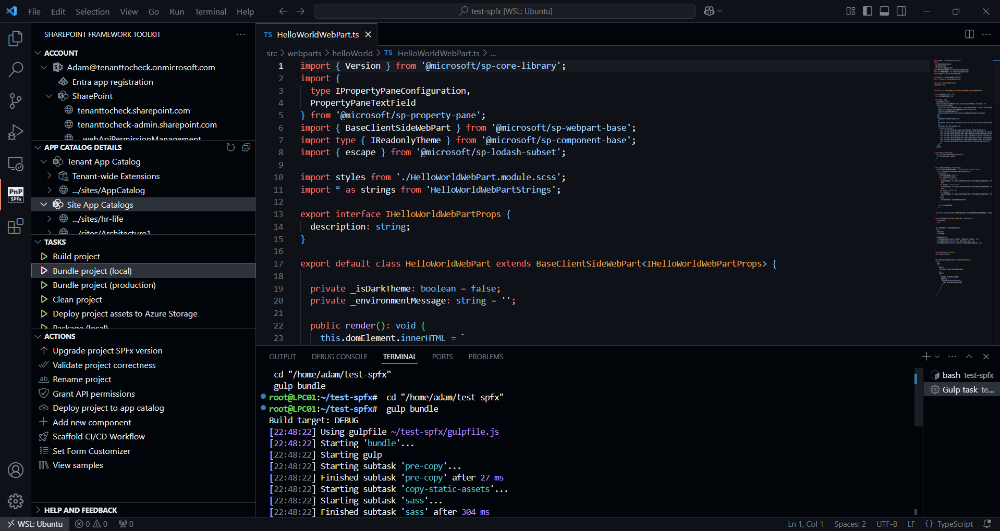

## Summary

Every setup has its pros and cons. When it comes to WSL, the performance is a big pro. The performance is better than on Windows, especially when it comes to file system operations. The export/import feature is also a big benefit. You may easily back up your setup, share it with others, or simply start from scratch when needed. In the end, it is up to you which setup you will choose. I hope this post will help you to make a decision and start your journey with SPFx development using WSL2 and Ubuntu on Windows to combine the best of both worlds. 

## Resources

- [Overview of the SharePoint Framework](https://learn.microsoft.com/en-us/sharepoint/dev/spfx/sharepoint-framework-overview)
- [WSL documentation](https://learn.microsoft.com/en-us/windows/wsl/about)
- [Developing SPFx solutions using WSL](https://donkirkham.com/blog/spfx-wsl/)
- [SharePoint Framework Toolkit](https://marketplace.visualstudio.com/items?itemName=m365pnp.viva-connections-toolkit)
- [Join the Microsoft 365 Developer Program]( https://developer.microsoft.com/en-us/microsoft-365/dev-program)
