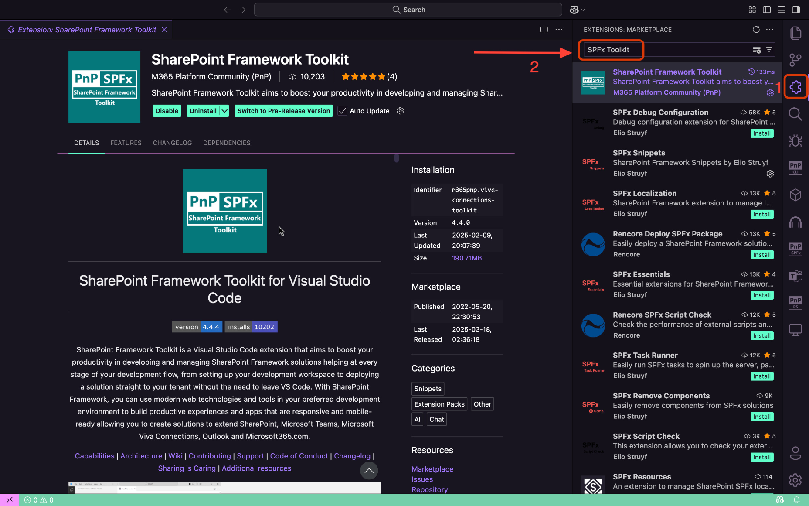
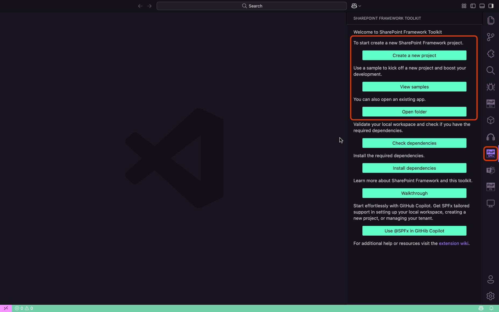
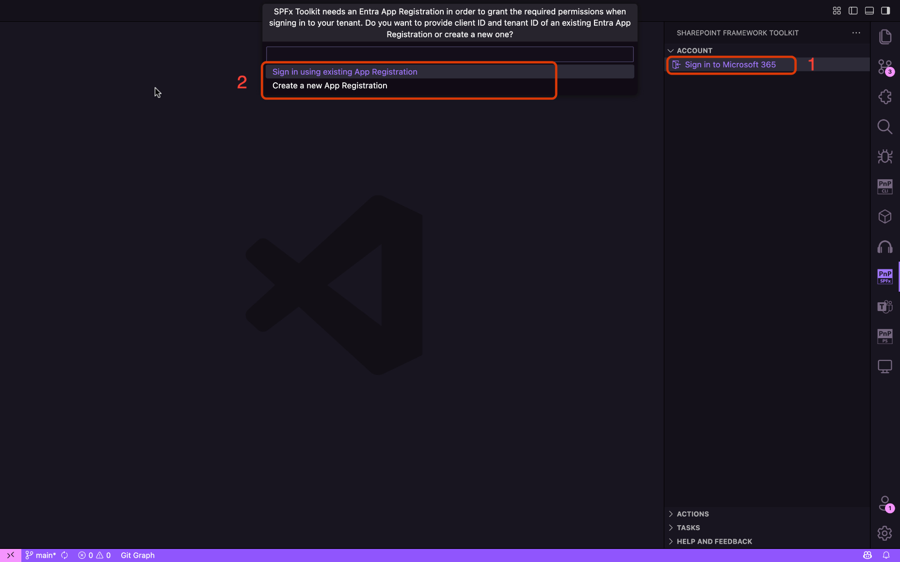
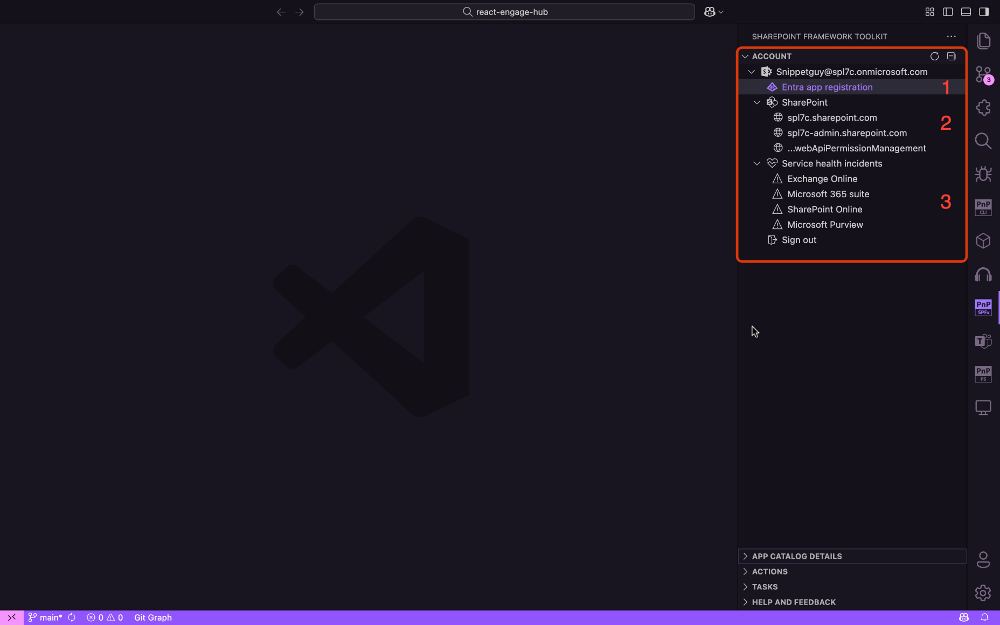
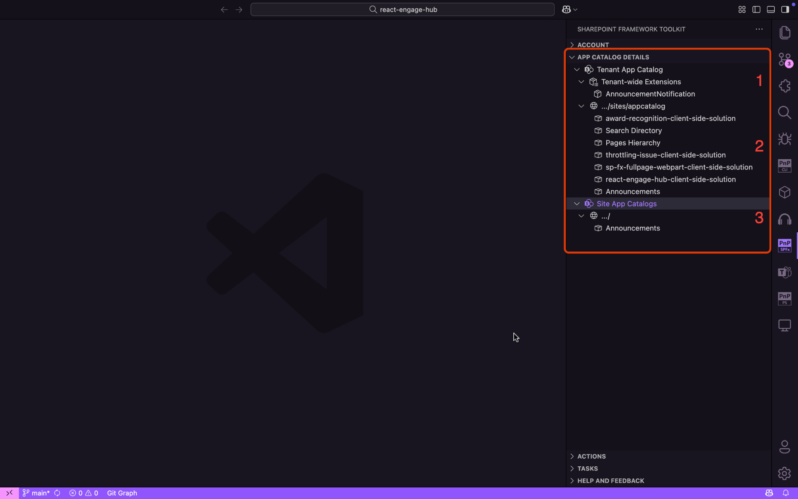
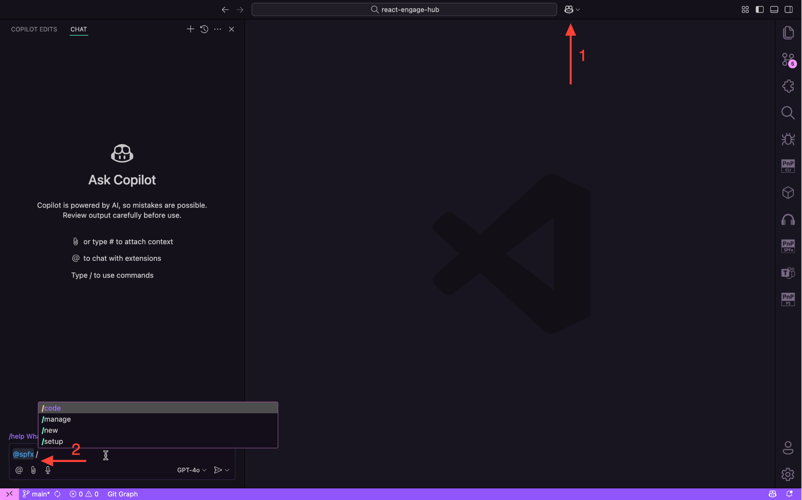

## 🗒️ Intro

Are you still using the traditional method of creating SPFx projects with the Yeoman Generator, or have you started evolving into the SharePoint Framework Toolkit for VSCode?

Either way, this blog is perfect for you because I'll walk you through the various management capabilities of the SharePoint Framework Toolkit. If you're not using it yet, this blog will encourage you to give the SharePoint Framework Toolkit a try.

[SharePoint Framework Toolkit](https://marketplace.visualstudio.com/items?itemName=m365pnp.viva-connections-toolkit) is a Visual Studio Code extension that aims to boost your productivity in developing and managing [SharePoint Framework solutions ](https://learn.microsoft.com/sharepoint/dev/spfx/sharepoint-framework-overview?WT.mc_id=m365-15744-cxa) helping at every stage of your development flow, from setting up your development workspace to deploying a solution straight to your tenant without the need to leave VS Code, it even allows you to create a CI/CD pipeline to introduce automate deployment of your app and also comes along with a dedicated @spfx Copilot Chat participant who is your AI assistant grounded for SharePoint Framework development and now even has a new `/manage` chat command that will allow you to retrieve data from you SharePoint Online tenant using natural language.

## 🛠️ Prerequisites:

It's already clear that you need the SharePoint Framework Toolkit for VSCode. Download it from VSCode by searching SharePoint Framework Toolkit or using the below link:

> [Download SharePoint Framework Toolkit at VS Code Marketplace](https://marketplace.visualstudio.com/items?itemName=m365pnp.viva-connections-toolkit)

## 

Once you're ready with the extension, let's unlock its power 💪.

Let's see how easy the login process is. Before that, make sure you're inside an SPFx project. If you don't have any existing code base, SharePoint Framework Toolkit extension got you covered. Select the **SharePoint Framework Toolkit** icon from the side pane of VSCode. You can start creating a new project, work on the samples already available to you from the Community, or choose the third option if you have an existing project.

So now you have entered into the SharePoint Framework Toolkit world, if you select the **SharePoint Framework Toolkit** icon from the side pane. You will see a whole different set of views in the side pane. Lets explore one by one before that...

### Lets sign in with your M365 Account:

1. Select **Sign in to Microsoft 365** from the side pane in Account View.
2. You may either use an existing app registration or create a new one by using a dedicated form.

Did you see the new views available in the side pane? Let’s understand each one of them.

## 🔐 Account View:

Most of the time, we struggle to find all the necessary quick links in one place, right? This view primarily focuses on consolidating all the essential quick links under one umbrella. If you see the below Account view it is divided into sub sections as follows:

1. Entra app registration:
This is the app registration that was created during the sign-in process. By clicking on it, you will be able to see the Azure portal app registration and review its details.

2. SharePoint: Let’s say you want to access your root SharePoint site, admin site, or even the API Access Page. You no longer need to bookmark or manually note these URLs you can access them directly from here.

3. Service Health Incidents: Most of us encounter service incidents or failures while working on SPFx projects. This capability displays only the list of products currently experiencing service incidents, ensuring you won’t miss any and keeping you informed. Clicking on each of these incidents takes you to the respective health incident pages in the Admin Center.

## 📦 App Catalog Details View:

As the name suggests, this view has app catalog management capabilities for tenant app catalog.

If you select the **App Catalog Details** view, you will be able to see a bunch of subsections, including:

1. Tenant-wide Extensions: Shows a list of extensions that are deployed across the entire tenant.

2. Tenant App catalog: A list of apps, including web parts and extensions, deployed in the tenant for various sites.

3. Site App Catalogs: A list of apps that are deployed under site collection app catalogs.

This not only lists the apps in the catalog, but you can also able to perform different operations.

> 📝 As of now, tenant-wide extensions don’t have management options available, but they might be introduced in future releases.

Lets look into each of the manage options available to app catalogs:

1. Deploy & Retract:
   The Deploy and Retract commands are used for managing app availability. Deploy makes the app available for installation, whereas Retract reverts the deployed app to a disabled state, preventing users from installing it on sites.

   <video src="images/App_Deploy_Retract.mp4" controls="controls" style="width: 100%;"></video>

2. Remove:
   The remove action helps you to completely removes the app from app catalog site.

   

3. Enable & Disable:
   The Enable action makes the app available to your site, allowing users to add the app from the SharePoint Store, whereas Disable removes the app from the SharePoint Store, preventing users from adding it to the site.

   <video src="images/App_Enable_Disable.mp4" controls="controls" style="width: 100%;"></video>

4. Install & Uninstall:
   Once the app is deployed to the app catalog, you might want to use it on one or more sites.

   Using the Install action, you can install the app by simply passing the site URL, whereas the Uninstall action removes the app from your site in case you no longer need it.

   <video src="images/App_Install_Uninstall.mp4" controls="controls" style="width: 100%;"></video>

5. Upgrade:
   The Upgrade action is used to upgrade the app in the selected site collection when you have already pushed an update to the existing package in the app catalog.

   When you deploy an updated version of the existing package, the app in the site collection does not upgrade automatically; so this action performs the upgrade for you.

   <video src="images/App_Upgrade.mp4" controls="controls" style="width: 100%;">
   </video>

Now we have seen the different management capabilities of SharePoint Framework Toolkit available in the views. But we are not yet seen the /manage participant in GitHub Copilot Chat, right? lets jump into it.

## @SPFx Extension in GitHub Copilot:

Once you install the SharePoint Framework Toolkit, you will gain access to a new extension: @spfx in GitHub Copilot, which provides answers to all your queries related to SharePoint and SPFx. If you don’t use this extension, you will get generic responses. However, with this extension, the AI responses are now more grounded in SharePoint Framework knowledge.

Let’s see what the @spfx extension offers! With @spfx, you can now achieve more ⚡ in less time with the SharePoint Framework Toolkit.

### How can you access and use it effectively?

1. Select the **GitHub Copilot** icon in VSCode, located next to the search bar.

2. Then, start typing @spfx, and you will see four different commands available for the @spfx extension.

Let’s understand the capabilities of each of these commands:

1. #### `/code` command:

This command is in beta and is fine-tuned to provide help in coding your SharePoint Framework project and provides additional boosters like validating the correctness of your SPFx project, scaffolding a CI/CD workflow, or renaming your project, and many more.

Example in action:
Let’s ask Copilot for help in providing a code snippet to retrieve items from a list.

<video src="images/Extension_Code_Command.mp4" controls="controls" style="width: 100%;">
</video>

2. #### `/manage` command:

This command is in beta and will allow you to ask for and retrieve any kind of data from your SharePoint Online tenant. This command will only work if you are signed in to your tenant. It uses CLI for Microsoft 365 commands under the hood to retrieve and describe data and assets from your SharePoint Online tenant. Currently, it only supports retrieving information; it does not support creating, updating, or removing any resources.

Example in action:
Let’s ask Copilot to check whether there is any files available in the document library without opening a browser or navigating to the document library in SharePoint.

<video src="images/Extension_Manage_Command.mp4" controls="controls" style="width: 100%;">
</video>

3. #### `/new` command:

If you’re new to SPFx and unsure where to start or what extensibilities are available, you can use this command to get started. It creates projects by interpreting the natural language you provide and constructing the Yeoman command with the help of AI.

Example in action:
Let’s ask Copilot to create a new project by finding out if there’s a way to customize a SharePoint list using SPFx extensibility.

<video src="images/Extension_Command_New.mp4" controls="controls" style="width: 100%;">
</video>

4. #### `/setup` command:

Dedicated to providing information on how to set up your local workspace for SharePoint Framework development.

<video src="images/Extension_Setup_Command.mp4" controls="controls" style="width: 100%;">
</video>

## ✅ Conclusion

For SPFx developers, the SharePoint Framework Toolkit for VSCode is a true game-changer, providing a smooth and effective development environment. This toolkit streamlines every stage of your SPFx journey, from maintaining app catalogs to utilizing GitHub Copilot's capability with the @spfx extension. With features like `/manage` commands, app deployment choices, and CI/CD scaffolding, the toolkit is a must-have for any developer, regardless of experience level.

What're you waiting for, then? To advance your SPFx development, install the SharePoint Framework Toolkit now.

Cheers to coding! 🚀

## 🔗 Resources

- [Download SharePoint Framework Toolkit at VS Code Marketplace](https://marketplace.visualstudio.com/items?itemName=m365pnp.viva-connections-toolkit)
- [SharePoint Framework Toolkit GitHub repo](https://github.com/pnp/vscode-viva)
- [Microsoft 365 & Power Platform Community](https://pnp.github.io/#home)
- [Join the Microsoft 365 & Power Platform Community Discord Server](https://discord.gg/YtYrav2VGW)
- [Wiki](https://github.com/pnp/vscode-viva/wiki)
- [Join the Microsoft 365 Developer Program](https://developer.microsoft.com/en-us/microsoft-365/dev-program)
- [CLI for Microsoft 365](https://pnp.github.io/cli-microsoft365/)
- [Sample Solution Gallery](https://adoption.microsoft.com/en-us/sample-solution-gallery/)
