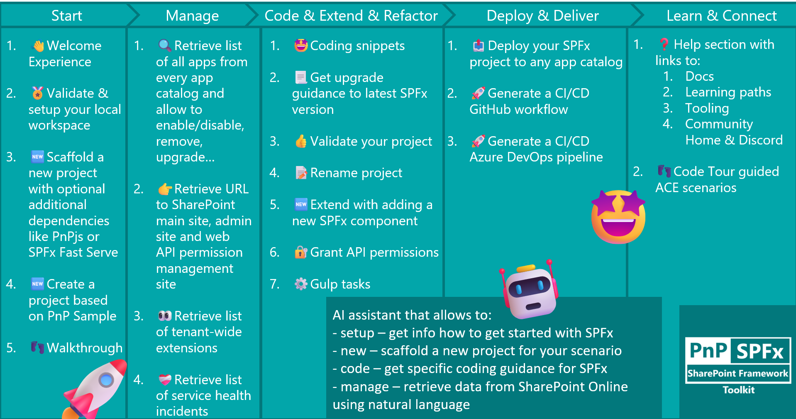
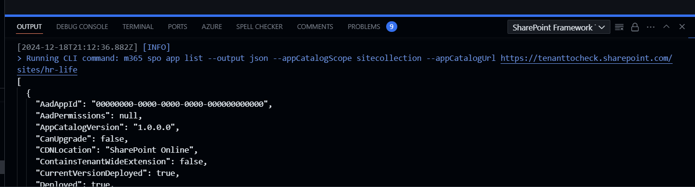

## 🗒️ Quick intro

[SharePoint Framework Toolkit](https://marketplace.visualstudio.com/items?itemName=m365pnp.viva-connections-toolkit) is a Visual Studio Code extension that aims to boost your productivity in developing and managing [SharePoint Framework solutions](https://learn.microsoft.com/sharepoint/dev/spfx/sharepoint-framework-overview) helping at every stage of your development flow, from setting up your development workspace to deploying a solution straight to your tenant without the need to leave VS Code, it even allows you to create a CI/CD pipeline to introduce automate deployment of your app and also comes along with a dedicated @spfx Copilot Chat participant who is your AI assistant grounded for SharePoint Framework development and now even has a new `/manage` chat command that will allow you to retrieve data from you SharePoint Online tenant using natural language.

Just check out the features list 👇 it's a looot 🤯.

Let's have a closer look at what was done this year.

## Two major releases

In 2024 we had two product major releases each bringing significant changes to the extension. The first one was the [3.0 release](https://pnp.github.io/blog/post/spfx-toolkit-vscode-v-3-0-release/) which was connected to the product renaming of the extension from Viva Connections Toolkit to SPFx Toolkit. This also brought significant changes to the extension, and the support was now not only for Viva Connections but also for SharePoint Framework solutions that are used to extend SharePoint, Microsoft Teams, Outlook, and Microsoft365.com. Together with this release, we introduced new or refactored functionalities like an enhanced sample gallery or scaffolding form, but those will also be described in more detail in the next sections. You may also check out the release [video here](https://www.youtube.com/watch?v=cnSJ7xF9dzE).

The second one was the [4.0 release](https://pnp.github.io/blog/post/spfx-toolkit-vscode-v-4-0-release/) which was connected to refactored the default sign-in process to not use the PnP Management Shell multi-tenant app registration which was maintained and distributed from the PnP tenant but from 9 of September was removed. This change was done to simplify the sign-in process and make it more user-friendly and, what is most important, more secure as now the app registration created for SPFx Toolkit had only the scopes that are required for this product. If you would like to know more about this release you may check out the release [video here](https://www.youtube.com/watch?v=nuCF_pTtIfI).

## Enhanced sample gallery

Using the embedded sample gallery you may browse and pick a sample you are interested in and create a new project based on it. After you select the sample you will be asked to select the location where it will be downloaded and to give a new name for the project. After downloading and renaming VS Code will automatically open this project and run `npm install`. This functionality is very useful when you are looking for a sample that is similar to what you are trying to achieve and you would like to start from a working solution that may give you a significant boost in your development process.

This year we managed to significantly enhance the sample gallery by adding new filter optionw that allows you to filter by author, title, description, SPFx version, and component type. It is also possible to browse sample details view directly from VS Code checking all sample details before you create a new project based on the selected sample. The detail page is populated based on the sample readme coming directly from the PnP SPFx sample gallery. 

Check it out in action 👇.

## Azure DevOps support in CI/CD workflow action

CI/CD workflow action allows you to scaffold a production ready workflow that will build your SPFx solution and deploy it to your tenant. When this feature was introduced we started only with GitHub Actions/Workflows but this year we managed to add support for Azure DevOps. This allows you to easily create a CI/CD pipeline for Azure DevOps that will build and deploy your SPFx solution to your tenant. This is a great feature that will allow you to automate the deployment of your app. 

Besides the above, this year we also managed to improve the scaffolding process of the CI/CD workflow which will now not only create a .yml file with your flow but will also generate the Entra app registration and certificate needed for the authentication. This is required to setup the authentication between Azure DevOps or GitHub and your SharePoint Online tenant so that those flows will be allowed to deploy your app to the app catalog. 

All this allows you to simply create a perfectly working production ready CI/CD pipeline for either GitHub workflows or Azure DevOps in just a few clicks 🚀.

Check it out in action 👇.

## Manage your SPFx apps from any app catalog directly in VS Code

SPFx Toolkit is not only about developing your SPFx solutions but also about managing them. This year we enhanced this capability by 

- presenting you the the list of health incidents that are currently active on your tenant which allows you to get a quick glance at your tenant condition.

- showing you the list of tenant-wide extensions that are currently installed on your tenant
- last but not least, we now show all apps deployed to every app catalog, either tenant-wide or site collection scoped, that are available in your tenant. You may also perform actions like installing, enabling, disabling, upgrading, or removing an app directly from VS Code. This feature will allow you to have a quick glance of all your apps and perform simple management without the need to constantly switch between your browser and different app catalog pages as now you may do it all directly from a single view in VS Code.

## @spfx GitHub Copilot Chat participant

SPFx Toolkit is all about delivering best-in-class functionalities and features that will boost your productivity when it comes to everything around developing and learning and managing SharePoint Framework solutions. That is why we were closely monitoring the capabilities of GitHub Copilot Chat in VS Code checking every pre-release and beta feature. Just after developing your own GitHub Copilot Chat participants went GA at Microsoft Build on the 23rd of May, on the 25th of May, so only 2 days later, we released the [first version of the @spfx GitHub Copilot Chat participant](https://pnp.github.io/blog/post/spfx-toolkit-vscode-chat-pre-release/). This AI assistant is grounded for SharePoint Framework development and will help you with your development process. Initially we experimented with a couple of chat commands which are additional specialized capabilities of the chat participant for a specific scenario but after a couple of months of constant improvements we ended up with 4 chat commands that are available for you to use:

- `/setup` - that is dedicated to providing information on how to setup your local workspace for SharePoint Framework development.

- `/new` - that may be used to get guidance on how to create a new solution or find and reuse an existing sample from the PnP SPFx sample gallery.

- `/manage` - [beta] this command will allow you to ask and retrieve any kind of data from you SharePoint Online tenant. This command will only work if your are signed in to your tenant. It uses CLI for Microsoft 365 commands under the hood to retrieve and explain data and assets from your SharePoint Online tenant. Currently, it does support only retrieving information, it will not support you in creating, updating or removing any resources. For example, you want to check if some list item or file exists. Or how many items with specific metadata do you have on a list? Or ask for content type columns to generate an interface based on the response quickly.

- `/code` - [beta] this command is fine-tuned to provide help in coding your SharePoint Framework project and provides additional boosters like validating the correctness of your SPFx project, scaffolding a CI/CD workflow, or renaming your project, and many more.

## More improvements in the scaffolding form

SharePoint Framework Toolkit allows the creation of a new SPFx project using the same scaffolding steps as the official SharePoint Framework Yeoman generator but in form-based view which is more user-friendly and easier to use. Besides standard scaffolding SPFx Toolkit also allows you to install additional dependencies along with the project creation to keep you up and running with everything you need quickly. This year we managed to improve the scaffolding form by adding new options:

- now you may also create a Node version manager configuration file for you project. It may be either `.nvmrc` for `nvm` and `nvs` but also for `nvs` it is possible to create `.node-version` config file. You may define that using the new extension setting.
- we also added the support of adding and preconfiguring [SPFx Fast Serve](https://github.com/s-KaiNet/spfx-fast-serve) to your solution which will significantly speed up serving your solution during development.

## CLI for Microsoft 365 

It's no secret that SPFx Toolkit uses [CLI for Microsoft 365](https://pnp.github.io/cli-microsoft365/) under the hood to perform some of its functionalities and we understand that some prefer terminal over UI. That is why to make the transfer between the terminal and SPFx Toolkit UI easier we present all CLI for Microsoft 365 commands along with all options used in the extension output logs. Thanks to that you may easily check what SPFx Toolkit is using and simply copy past the same command to your terminal which may give you a heads-up start in using CLI for Microsoft 365 or in creating your new script to automate parts of your development or work.

## Work done in numbers

This year was very busy and we managed to deliver a lot of new functionalities and improvements. Here are some numbers that will give you a better understanding of the work done:

- 108 PRs merged
- 76 issues closed
- 11 releases

All this would not have been possible without some amazing people who stood out and helped us create the best SPFx tooling in the world. Here are some of the most active contributors:

- [Saurabh Tripathi](https://github.com/Saurabh7019)
- [Luccas Castro](https://github.com/DevPio)
- [Nico De Cleyre](https://github.com/nicodecleyre)
- [Guido Zambarda](https://github.com/GuidoZam)

In order to give back all the love and help we got from our contributors this year SPFx Toolkit started giving away a brand [Credly badge](https://www.credly.com/org/m365pnp/badge/spfx-toolkit-microsoft-365-power-platform-community) which proves that you are a contributor to the SPFx Toolkit project. This badge is a great way to show your involvement in the project and to show your skills to the world.

## 🗺️ Future roadmap

This year was very busy but we don't even think about slowing down. We have a lot of plans for the next year. Here are some of the things we are planning to do:

- Add the ability to sign in to multiple tenants at once which will allow you to manage app catalogs and apps from multiple environments and easily deploy your current solution to every tenant you are signed in to.
- Allow to manage multiple projects at once. Currently, SPFx Toolkit allows you to manage a single SharePoint Framework solution that may have multiple components like web parts or extensions or ACEs but basically it all bundles and builds to a single sppkg package. The aim for next year is to allow you to manage multiple solutions at once that all build to a separate sppkg packages. We are even thinking of adding additional support for npm workspaces which will allow you to share npm packages from a single `node_modules` folder in all of the SPFx projects that are in the same catalog/workspace.
- Extend the GitHub Copilot Chat participant with more manage capabilties like the ability to create a new list or library, add a new column to a list or library, create a new site, add a new web part to a page, and many more.

Besides the above, we are also considering of extending the scope of the extension to bring new areas that will allow you to manage list formatting and SharePoint List Webhooks as well as MS Graph Subscription Webhooks. Let us know what you think about those ideas and if you have any other suggestions.

## 👍 Power of the community

This extension would not have been possible if it wasn't for the awesome work done by the [Microsoft 365 & Power Platform Community](https://pnp.github.io/). Each sample gallery: SPFx web parts & extensions, and ACE samples & scenarios are all populated with the contributions done by the community. Many of the functionalities of the extension like upgrading, validating, and deploying your SPFx project, would not have been possible if it wasn’t for the [CLI for Microsoft 365](https://pnp.github.io/cli-microsoft365/) tool. I would like to sincerely thank all of our awesome contributors! Creating this extension would not have been possible if it weren’t for the enormous work done by the community. You all rock 🤩.

If you would like to participate, the community welcomes everybody who wants to build and share feedback around Microsoft 365 & Power Platform. Join one of our [community calls](https://pnp.github.io/#community) to get started and be sure to visit 👉 https://aka.ms/community/home.

## 🙋 Wanna help out?

Of course, we are open to contributions. If you would like to participate do not hesitate to visit our [GitHub repo](https://github.com/pnp/vscode-viva) and start a discussion or engage in one of the many issues we have. We have many issues that are just ready to be taken. Please follow our [contribution guidelines](https://github.com/pnp/vscode-viva/blob/main/contributing.md) before you start.
Feedback (positive or negative) is also more than welcome.

## 🔗 Resources

- [Download SharePoint Framework Toolkit at VS Code Marketplace](https://marketplace.visualstudio.com/items?itemName=m365pnp.viva-connections-toolkit)
- [SPFx Toolkit GitHub repo](https://github.com/pnp/vscode-viva)
- [Microsoft 365 & Power Platform Community](https://pnp.github.io/#home)
- [Join the Microsoft 365 & Power Platform Community Discord Server](https://discord.gg/YtYrav2VGW)
- [Wiki]( https://github.com/pnp/vscode-viva/wiki)
- [Join the Microsoft 365 Developer Program]( https://developer.microsoft.com/en-us/microsoft-365/dev-program)
- [CLI for Microsoft 365](https://pnp.github.io/cli-microsoft365/)
- [Sample Solution Gallery]( https://adoption.microsoft.com/en-us/sample-solution-gallery/)
