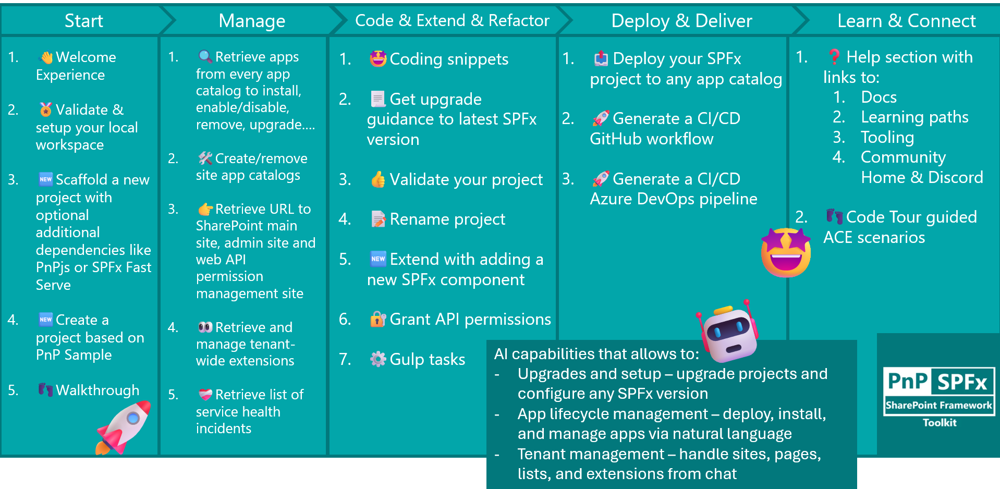
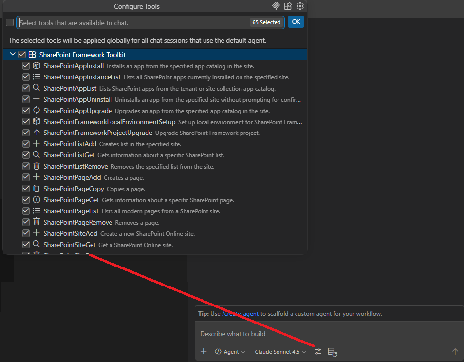
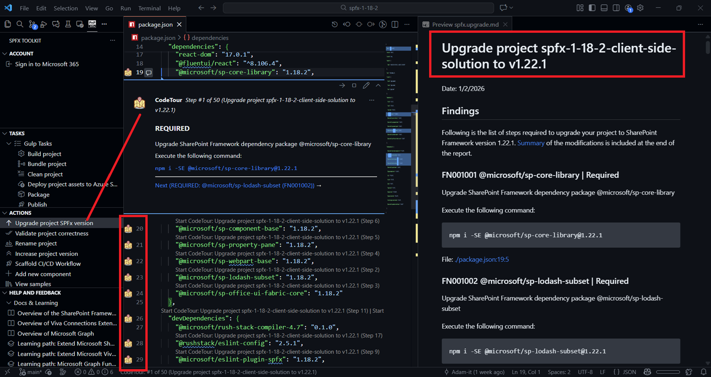
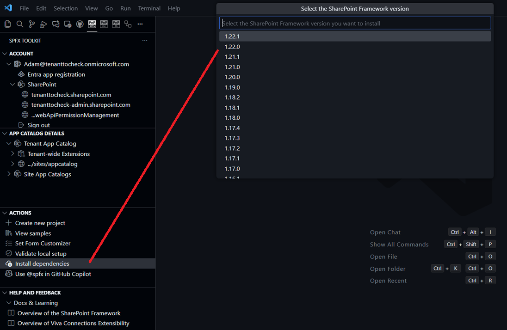
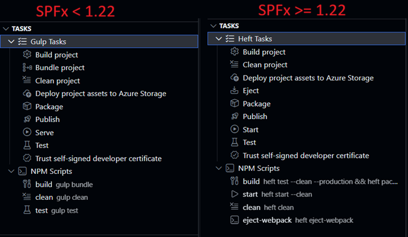
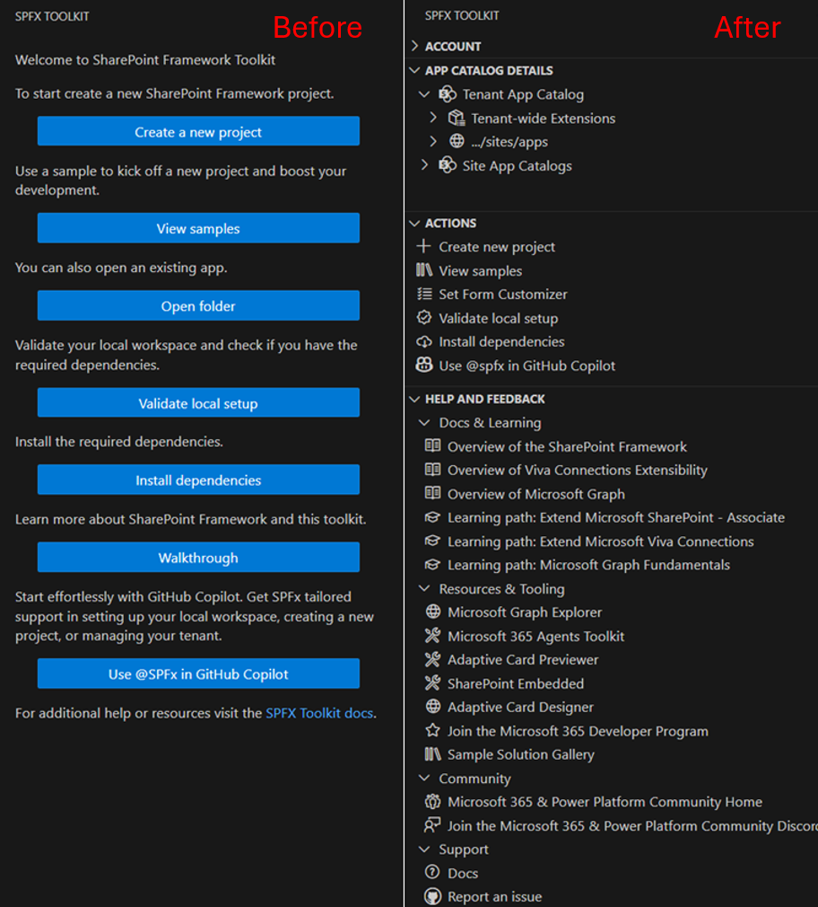
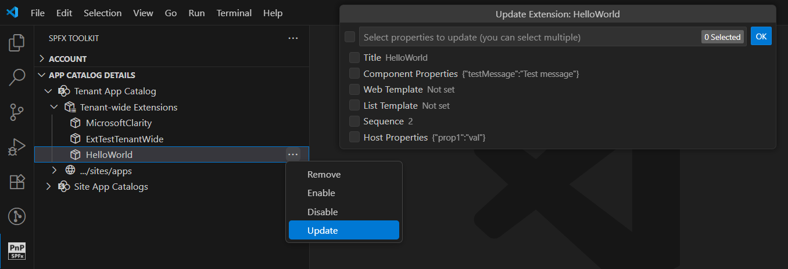
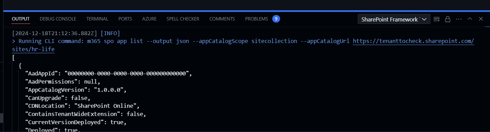
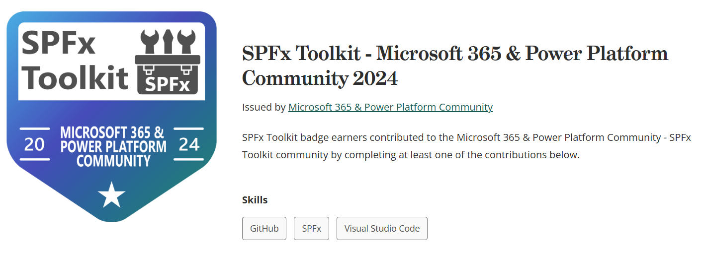

## 🗒️ Quick intro

[SharePoint Framework Toolkit](https://marketplace.visualstudio.com/items?itemName=m365pnp.viva-connections-toolkit) is a Visual Studio Code extension that aims to boost your productivity in developing and managing [SharePoint Framework solutions](https://learn.microsoft.com/sharepoint/dev/spfx/sharepoint-framework-overview) helping at every stage of your development flow, from setting up your development workspace to deploying a solution straight to your tenant without the need to leave VS Code, it even allows you to create a CI/CD pipeline to introduce automated deployment of your app and also comes along with AI capabilities which will allow you to manage your SharePoint Online tenant straight from GitHub Copilot chat extension.

Just check out the features list 👇 it's a looot 🤯.

Let's have a closer look at what was done this year.

## Language Model Tools - AI that actually does stuff

2025 was the year we went all-in on Language Model Tools. If you are not familiar with them, they are basically a way for GitHub Copilot to actually interact with your SharePoint tenant and SPFx projects instead of just answering questions.

The big difference from chat commands is that these tools work in the background. You don't need to remember to type `/something` - you just have a normal conversation with Copilot like "hey, upgrade my SPFx project" and it figures out which tools to use and does it. It's pretty much magic when it works.

We started rolling these out in June with the 4.8.0 release and kept adding more throughout the year. By December we had a pretty comprehensive set covering most of what you'd want to do.

**Project stuff**

The SPFx project upgrade tool was probably the most requested feature. Now Copilot can actually upgrade your project, not just tell you how to do it. It analyzes what you have and makes the changes. There is also a setup tool that helps you configure your local environment for any SPFx version.

**SharePoint management**

You can work with sites - create new ones, remove them, check if they exist. For pages, list them, get details, create new ones, copy them to other sites, or delete them. "Show me all pages on this site" just works now.

**Lists and apps**

Lists got basic CRUD operations - create them, get info about them, remove them. For apps we went deeper - you can list everything from tenant and site collection app catalogs, install to specific sites, upgrade, uninstall, and check what apps are actually running on a specific site (not just what's in the catalog).

**What changed with chat commands**

The chat participant got streamlined. We deprecated the `/code` command since Language Model Tools handle that better now. The `/manage` command (which we'd renamed to `/info`) was also removed - if you need to retrieve Microsoft 365 tenant data using natural language, we now recommend using the [CLI for Microsoft 365 MCP server](https://pnp.github.io/cli-microsoft365/user-guide/using-cli-mcp-server/) instead.

The `/new` command is still around and useful for getting guidance on creating new solutions or finding samples from the PnP gallery. But the bigger shift is towards Language Model Tools working in agent mode where you just talk to Copilot naturally and it figures out which tools to use. You stop thinking about what command to use and just ask for what you want.

## Supporting all SharePoint Framework versions

December's 4.16 release was probably the biggest shift we made this year. We moved from "supporting the latest SPFx version" to "supporting ALL SPFx versions" - old, new, and everything in between.

**Any version, any time**

The real game-changer is environment setup. When you install dependencies or validate your setup, SPFx Toolkit now asks which SPFx version you are targeting. Based on that, it validates your Node.js version and installs the right dependencies for that specific version.

We also updated how Node.js validation works. Previously, if your Node.js version wasn't compatible with the selected SPFx version, the extension would just stop with a warning message. Now SPFx Toolkit supports NVM and NVS for automatically managing Node.js versions. If you use one of those Node Version Managers, you can configure it in the SPFx Toolkit settings, and the extension will automatically switch to the correct Node.js version for the SharePoint Framework version you're working with. No more manually checking compatibility matrices or getting cryptic build errors because you had Node 18 when you needed Node 16.

**Why this matters**

Real projects don't all run on the latest version. You might maintain a production app on SPFx 1.18 while building a new feature on 1.22. Before this, you had to manually manage all the version juggling. Now SPFx Toolkit handles it.

The upgrade workflow also got smarter. You can generate markdown reports, create code tours that walk you through the changes step-by-step, or use GitHub Copilot to perform the upgrade and validate it works.

**SPFx 1.22 and the Heft transition**

SharePoint Framework 1.22 replaced Gulp with Heft as the build toolchain. The Task View now adapts based on your project - it shows Heft tasks for SPFx 1.22+ and Gulp tasks for older versions. We also integrated npm scripts into the same view, so everything you need to run is in one place.

**Other workflow improvements**

We consolidated gulp tasks - combined bundle local/production into single prompts, same for package-solution. Added a "Publish" task that does bundle + package in one shot. Small things that add up when you are running builds dozens of times a day.

## Managing your SharePoint tenant from VS Code

Beyond just helping you build SPFx solutions, 2025 saw major improvements in actually managing your SharePoint environment without leaving VS Code.

**Using SPFx Toolkit without a project**

The biggest change came with the welcome experience refactor in August. Previously, you could only access tenant management features when you had an SPFx project folder open in VS Code. Sign-in, app catalog management, and deployment actions were all locked behind having a project workspace.

Now you can open VS Code, install SPFx Toolkit, and immediately sign in to manage your tenant - no project required. The extension shows your account view, app catalogs, tenant-wide extensions, and all the management actions whether you are working on code or just need to check something in production. This turned SPFx Toolkit from purely a development tool into a full SharePoint tenant management interface that happens to also build SPFx projects.

**Tenant-wide extensions**

August's 4.9 release added full lifecycle management for tenant-wide deployed extensions. You can now enable or disable extensions across your tenant, update them to new versions, or remove them entirely. Before this, you had to either use PowerShell scripts or jump into the SharePoint admin center.

**App catalog management**

We added the ability to create and manage app catalogs directly from the extension. You can add a tenant app catalog if you don't have one yet, create site collection app catalogs for specific sites, or remove catalogs you no longer need.

The app deployment story got a lot more flexible. Instead of just deploying to the catalog, you can now install apps to specific sites, upgrade apps that are already deployed, and uninstall them when you are done. The October release added copy and move operations - so if you built something in a dev site catalog and want to move it to production, you can do that with a couple clicks.

**Form customizer setup**

Setting form customizers used to be a multi-step process in SharePoint admin. Now there is a dedicated action that handles the list association for you. Provide the site URL, list title, content type, and the form GUIDs for new, edit, and view forms, and SPFx Toolkit does the rest.

**Everything works with Language Model Tools too**

All these management capabilities are available through Language Model Tools. You can tell Copilot "install this app to the marketing site" or "list all apps in the site collection catalog" and it just works. The tools handle both tenant-level and site-level catalogs, can check which apps are actually deployed where, and perform upgrades or uninstalls.

This was probably the biggest shift in the extension's scope - from being mostly a developer tool to being a full tenant management interface. You still write code in VS Code, but now you can ship it and manage it in production without switching contexts.

## Other improvements worth mentioning

Throughout the year we added several smaller features that make daily work smoother. You can now pick your preferred package manager - npm, yarn, or pnpm - and SPFx Toolkit will use it consistently across all actions. We added a built-in feedback form so you can share suggestions directly from the extension without hunting for GitHub issues. Progress notifications got smarter too - they now include links to the output window, so when something runs you can jump straight to the logs to see what's happening under the hood.

## CLI for Microsoft 365 

It's no secret that SPFx Toolkit uses [CLI for Microsoft 365](https://pnp.github.io/cli-microsoft365/) under the hood to perform some of its functionalities and we understand that some prefer terminal over UI. That is why to make the transfer between the terminal and SPFx Toolkit UI easier we present all CLI for Microsoft 365 commands along with all options used in the extension output logs. Thanks to that you may easily check what SPFx Toolkit is using and simply copy paste the same command to your terminal which may give you a head start in using CLI for Microsoft 365 or in creating your new script to automate parts of your development or work.

## Work done in numbers

This year was very busy and we managed to deliver a lot of new functionalities and improvements. Here are some numbers that will give you a better understanding of the work done:

- 150 PRs merged
- 110 issues closed
- 12 releases

All this would not have been possible without some amazing people who stood out and helped us create the best SPFx tooling in the world. Here are some of the most active contributors:

- [Adam Wójcik](https://github.com/Adam-it)
- [Ervin Gayle](https://github.com/ervingayle)
- [Harshith Sai V](https://github.com/harshithsaiv)
- [Luccas Castro](https://github.com/DevPio)
- [Nico De Cleyre](https://github.com/nicodecleyre)
- [Nirav Raval](https://github.com/nirav-raval)
- [Nishkalank Bezawada](https://github.com/NishkalankBezawada)
- [Saurabh Tripathi](https://github.com/Saurabh7019)

In order to give back all the love and help we got from our contributors this year SPFx Toolkit started giving away a brand [Credly badge](https://www.credly.com/org/m365pnp/badge/spfx-toolkit-microsoft-365-power-platform-community) which proves that you are a contributor to the SPFx Toolkit project. This badge is a great way to show your involvement in the project and to show your skills to the world.

## 🗺️ Future roadmap

This year was very busy but we don't even think about slowing down. We have a lot of plans for the next year. Here are some of the things we are planning to do:

- Support SharePoint Framework 1.23 and the new SPFx CLI. SPFx 1.23 replaces the Yeoman generator with a brand new SPFx CLI that modernizes the project creation and scaffolding experience. We will integrate this new CLI into SPFx Toolkit so you can create and manage projects using the latest tooling without leaving VS Code. The scaffolding form will adapt to use the new CLI while keeping the same familiar experience you are used to.
- Add the ability to sign in to multiple tenants at once which will allow you to manage app catalogs and apps from multiple environments and easily deploy your current solution to every tenant you are signed in to.
- Allow managing multiple projects at once. Currently, SPFx Toolkit allows you to manage a single SharePoint Framework solution that may have multiple components like web parts or extensions or ACEs but basically it all bundles and builds to a single sppkg package. The aim for next year is to allow you to manage multiple solutions at once that all build to a separate sppkg packages. We are even thinking of adding additional support for npm workspaces which will allow you to share npm packages from a single `node_modules` folder in all of the SPFx projects that are in the same catalog/workspace.

Besides the above, we are also considering extending the scope of the extension to bring new areas that will allow you to manage list formatting and SharePoint List Webhooks as well as MS Graph Subscription Webhooks. Let us know what you think about those ideas and if you have any other suggestions.

## 👍 Power of the community

This extension would not have been possible if it wasn't for the awesome work done by the [Microsoft 365 & Power Platform Community](https://pnp.github.io/). Each sample gallery: SPFx web parts & extensions, and ACE samples & scenarios are all populated with the contributions done by the community. Many of the functionalities of the extension like upgrading, validating, and deploying your SPFx project, would not have been possible if it wasn’t for the [CLI for Microsoft 365](https://pnp.github.io/cli-microsoft365/) tool. I would like to sincerely thank all of our awesome contributors! Creating this extension would not have been possible if it weren’t for the enormous work done by the community. You all rock 🤩.

If you would like to participate, the community welcomes everybody who wants to build and share feedback around Microsoft 365 & Power Platform. Join one of our [community calls](https://pnp.github.io/#community) to get started and be sure to visit 👉 https://aka.ms/community/home.

## 🙋 Wanna help out?

Of course, we are open to contributions. If you would like to participate do not hesitate to visit our [GitHub repo](https://github.com/pnp/vscode-viva) and start a discussion or engage in one of the many issues we have. We have many issues that are just ready to be taken. Please follow our [contribution guidelines](https://github.com/pnp/vscode-viva/blob/main/contributing.md) before you start.
Feedback (positive or negative) is also more than welcome.

## 🔗 Resources

- [Download SharePoint Framework Toolkit at VS Code Marketplace](https://marketplace.visualstudio.com/items?itemName=m365pnp.viva-connections-toolkit)
- [SPFx Toolkit GitHub repo](https://github.com/pnp/vscode-viva)
- [Microsoft 365 & Power Platform Community](https://pnp.github.io/#home)
- [Join the Microsoft 365 & Power Platform Community Discord Server](https://discord.gg/YtYrav2VGW)
- [Wiki]( https://github.com/pnp/vscode-viva/wiki)
- [Join the Microsoft 365 Developer Program]( https://developer.microsoft.com/en-us/microsoft-365/dev-program)
- [CLI for Microsoft 365](https://pnp.github.io/cli-microsoft365/)
- [Sample Solution Gallery]( https://adoption.microsoft.com/en-us/sample-solution-gallery/)
