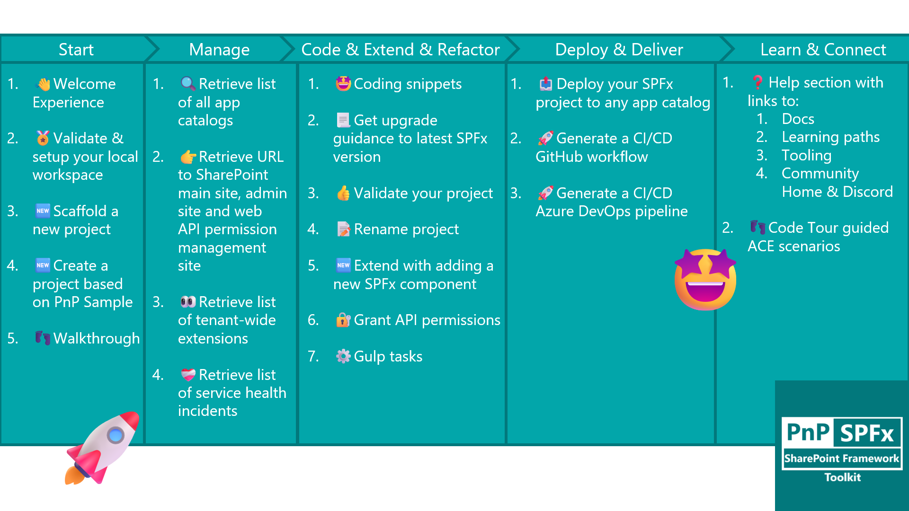
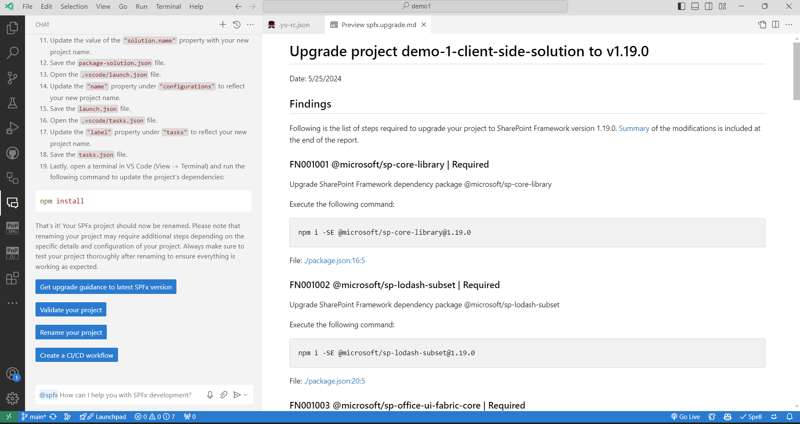
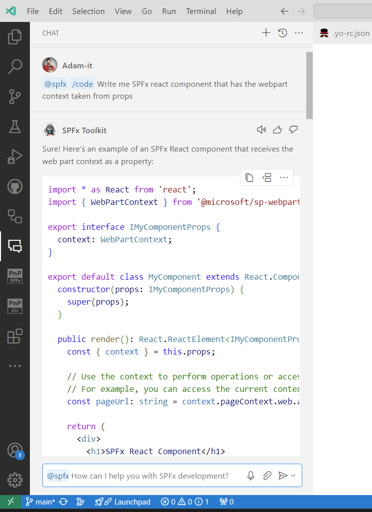
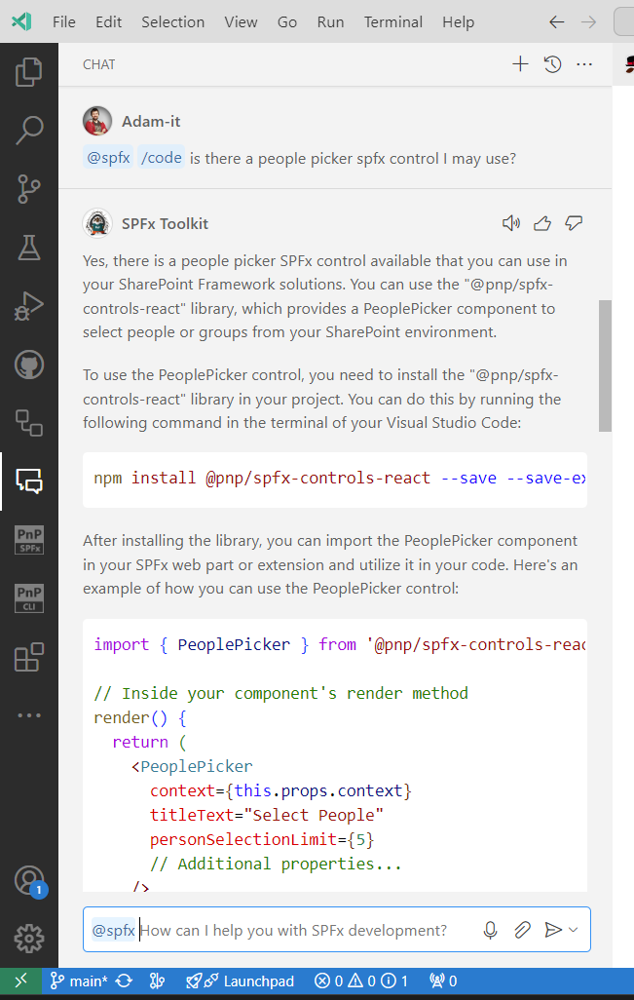
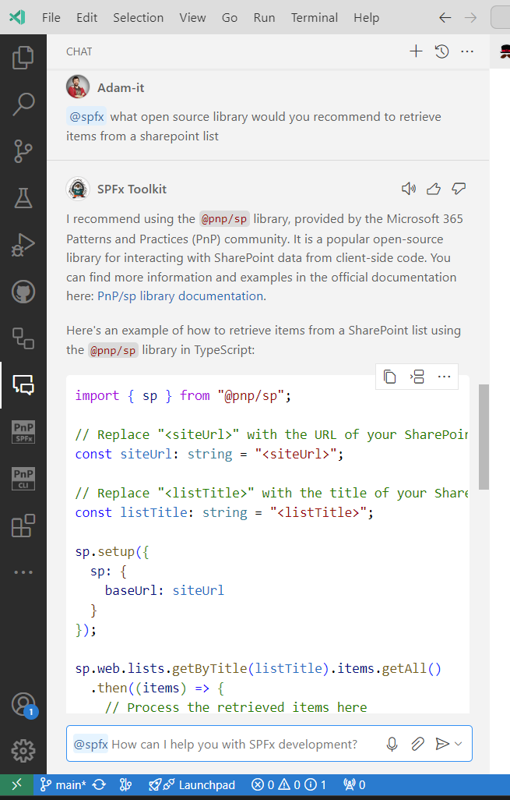
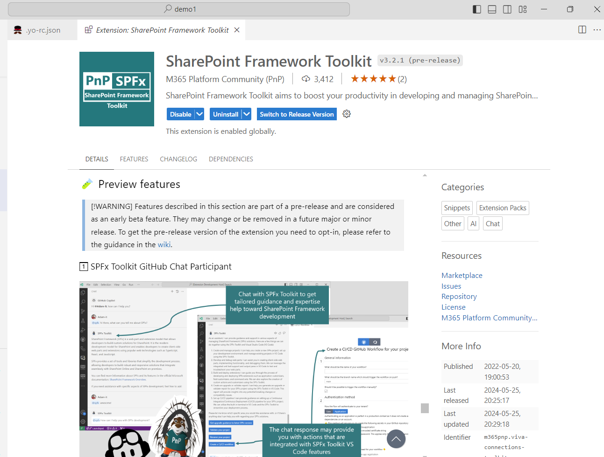

## 🗒️ Quick intro

[SharePoint Framework Toolkit](https://marketplace.visualstudio.com/items?itemName=m365pnp.viva-connections-toolkit) is a Visual Studio Code extension that aims to boost your productivity in developing and managing [SharePoint Framework solutions](https://learn.microsoft.com/sharepoint/dev/spfx/sharepoint-framework-overview?WT.mc_id=m365-15744-cxa) helping at every stage of your development flow, from setting up your development workspace to deploying a solution straight to your tenant without the need to leave VS Code, it even allows you to create a CI/CD pipeline to introduce automate deployment of your app 🚀. 

Just check out the features list 👇 it's a looot 🤯.

And now it just got a bit smarter 🤩. In the latest pre-release (v3.2.1) we integrated it with GitHub Copilot Chat so that now you may use it as your SPFx assistant in chat that is tailored to provide you guidance and help with developing SharePoint Framework solutions to extend SharePoint, Microsoft Teams, Microsoft Viva Connections, Outlook, and Microsoft365.com.
This is just a first step taken in this awesome new area and your tests and feedback are super important so that we may improve and move in the right direction 🚀. The team is doing all it's best to be at the very edge of the technology stack to provide you with best-in-class tooling to make your SharePoint Framework Development seamless and painless 😍... and yes we do not sleep 😴😉.

Sounds cool 😎? Let’s have a deeper dive and check it in a bit more detail 👇

## 🧠💬 SPFx Toolkit in GitHub Copilot Chat

Now with the latest pre-release of SPFx Toolkit (please also check other requirements described in the next chapter) you may now use @spfx as your dedicated SharePoint Framework Copilot 🤩 the same way you would be using GitHub Copilot in Chat. Just check it out 👇

As you may see it is context-aware. It provides you help tailored towards SharePoint Framework development and is part of SPFx Toolkit VS Code extension which means it may provide you clickable actions (buttons) in the response to run a dedicated functionality from the VS Code extension.

Besides standard chit-chat 😉 it comes along with 4 dedicated commands that you may use:

- `/setup` - that is dedicated to providing information on how to setup your local workspace for SharePoint Framework development
- `/new` - that may be used to get guidance on how to create a new solution or find and reuse an existing sample from the PnP SPFx sample gallery
- `/code` - that is fine-tuned to provide help in coding your SharePoint Framework project
- `/action` - that will provide you additional boosters like validating the correctness of your SPFx project, scaffolding a CI/CD workflow, or renaming your project, and many more.

The chat extension is fine-tuned using official Microsoft docs but also is aware of the Microsoft 365 and Power Platform activities and initiatives. Check out how it responds to the prompt suggesting using PnP SPFx React controls

or here, where it suggested to use PnP JS functionality
 

It's still in its early beta days and there are many things that might go wrong but we are already excited for this new opportunity and can't wait to see what you will be able to build with it🤩. Happy Coding!

## 🧪 It's triple BETA so how may I get it

This feature leverages the GitHub Copilot Extensions which was announced just now during Microsoft Build. Although it is GA it is still available after fulfilling the following requirements:

- Use the [Visual Studio Code Insiders](https://code.visualstudio.com/insiders/) release
- Use the pre-release version of the [GitHub Copilot Chat](https://marketplace.visualstudio.com/items?itemName=GitHub.copilot-chat) extension
- Use pre-release of [SPFx Toolkit](https://marketplace.visualstudio.com/items?itemName=m365pnp.viva-connections-toolkit)

Please refer to our [additional guidance to find out more](https://github.com/pnp/vscode-viva/wiki/8.-Preview-features)

## 🙏 Feedback

We've just taken our first steps in this exciting new area to provide you best-in-class features that will help you create solutions using SharePoint Framework Development. We are simple developers who try to be at the very edge to provide you with the tooling you need to make your developer life easier. To help us in this journey your feedback is super important so that we are sure we are moving in the right direction. As this feature is in its early beta days and there are many things that still need to be fine-tuned we would really appreciate it if you could share with us your experience and feedback about this functionality leaving it in the [related GitHub Discussion](https://github.com/pnp/vscode-viva/discussions/241)

## 🗺️ Future roadmap

We don't plan to stop, we are already thinking of more awesome features we plan to deliver with v4 release. If you want to check what we are planning or add your own idea please [join the discussion](https://github.com/pnp/vscode-viva/discussions/159). Feedback is appreciated 👍.

## 👍 Power of the community

This extension would not have been possible if it weren’t for the awesome work done by the [Microsoft 365 & Power Platform Community](https://pnp.github.io/). Each sample gallery: SPFx web parts & extensions, and ACE samples & scenarios are all populated with the contributions done by the community. Many of the functionalities of the extension like upgrading, validating, and deploying your SPFx project, would not have been possible if it wasn’t for the [CLI for Microsoft 365](https://pnp.github.io/cli-microsoft365/) tool. I would like to sincerely thank all of our awesome contributors! Creating this extension would not have been possible if it weren’t for the enormous work done by the community. You all rock 🤩.

If you would like to participate, the community welcomes everybody who wants to build and share feedback around Microsoft 365 & Power Platform. Join one of our [community calls](https://pnp.github.io/#community) to get started and be sure to visit 👉 https://aka.ms/community/home.

## 🙋 Wanna help out?

Of course, we are open to contributions. If you would like to participate do not hesitate to visit our [GitHub repo](https://github.com/pnp/vscode-viva) and start a discussion or engage in one of the many issues we have. We have many issues that are just ready to be taken. Please follow our [contribution guidelines](https://github.com/pnp/vscode-viva/blob/main/contributing.md) before you start.
Feedback (positive or negative) is also more than welcome.

## 🔗 Resources

- [Download Viva Connections Toolkit at VS Code Marketplace](https://marketplace.visualstudio.com/items?itemName=m365pnp.viva-connections-toolkit)
- [Viva Connections Toolkit GitHub repo](https://github.com/pnp/vscode-viva)
- [Microsoft 365 & Power Platform Community](https://pnp.github.io/#home)
- [Join the Microsoft 365 & Power Platform Community Discord Server]( https://aka.ms/community/discord)
- [Wiki]( https://github.com/pnp/vscode-viva/wiki)
- [Join the Microsoft 365 Developer Program]( https://developer.microsoft.com/en-us/microsoft-365/dev-program)
- [CLI for Microsoft 365](https://pnp.github.io/cli-microsoft365/)
- [Sample Solution Gallery]( https://adoption.microsoft.com/en-us/sample-solution-gallery/)
