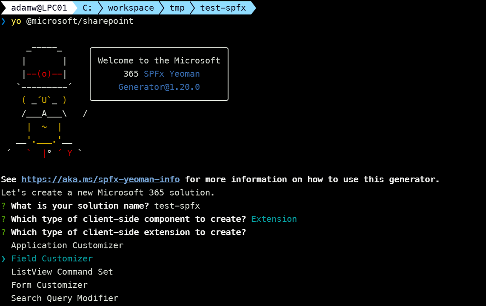

## What is SharePoint Framework?

There is no point in rephrasing what is best described in the [official Microsoft docs](https://learn.microsoft.com/en-us/sharepoint/dev/spfx/sharepoint-framework-overview), but I think it is just worth mentioning that SharePoint Framework is the way to go when you want to extend SharePoint Online and Microsoft Viva Connections with your custom solutions and one of the possibilities that should be considered when you plan to extend Microsoft Teams, Outlook, and Microsoft365.com. Of course, it has its drawbacks, like being a few years behind when it comes to the version of React we may use or Node.js we have to use for development. But in my opinion, it is still the easiest and fastest way to extend some parts of Microsoft 365. Also, since it was released in 2017, it now proved to be the extensibility method that should be used when it comes to SharePoint. So if you've been around for some time as a SharePoint Dev it seems to be finally a relief from refactoring everything and changing patterns every 3 years 😍.

## Start your learning without leaving VS Code 

When you're learning something new, especially when it's connected to coding you're constantly switching between your learning resources like documentation or tutorials or videos and your IDE, which in the case of SharePoint Framework most of the time it happens to be Visual Studio Code. That's why you may benefit from the [SharePoint Framework Toolkit](https://marketplace.visualstudio.com/items?itemName=m365pnp.viva-connections-toolkit) extension. Besides the fact that it has almost everything you need at every step of your development flow, like many features that will support you in creating a new solution, coding, creating CI/CD pipeline for it, deploying and managing, and it even comes with a dedicated AI assistant exposed as GitHub Copilot chat participant, it was created in mind to help and speed up your learning process of SPFx. Let's go over a few examples of how it can help you with that.

### Guided learning process from the very first install

As soon as you install SPFx Toolkit extension it will welcome you with a quite comprehensive walkthrough which will provide you with the necessary introduction to SharePoint Framework and the extension itself. It will guide you through the process of setting up your workspace, creating your very first SPFx project, and explaining the basics of the development toolchain, like explaning gulp tasks.

### With SPFx Toolkit you are never learning alone

One of the biggest benefits of a copilot is having a buddy to which you may ask the dummiest questions possible and not be afraid of being judged or that you are wasting somebody's time. With SPFx Toolkit you have a dedicated AI assistant that was grounded for SharePoint Framework questions and it is right there waiting for you from the very beginning visible in the welcome experience of the extension. Starting GitHub Copilot Chat and typing @spfx will redirect your conversation from the regular GitHub copilot to the SPFx dedicated one. It will help you with the most common questions and problems you may have when learning SharePoint Framework.

### Setup your local workspace with a single click

Before create anything first you need to be sure you have everything properly set up in your local workspace. With SharePoint Framework it is easy to make mistakes already at the beginning. One of the common mistakes I noticed is using an unsupported version of Node.js, so using the latest version of Node instead of the one currently recommended by Microsoft for SPFx. With SPFx Toolkit you may just forget about all of that and just use `Check dependencies` feature. First, it will validate if you are using the proper version of node and if so it will then validate if you have installed the correct versions of Yeoman, Gulp, and Yeoman SharePoint generator, and if not it will offer you to install option to get them with a single click.

Also, did I already mention that SPFx Toolkit has an AI assistant? 😉. Yep, setting up your local workspace and explaining what you need is one of its tasks. there is even a dedicated chat command you may use in the chat which is `@spfx /setup`

### Guided scaffolding process

After you have everything up and ready it's time for your first SPFx project. Using the Yeoman generator is so far the most common approach but if you are new to SharePoint Framework it doesn't provide much guidance during the scaffolding process. It's hard to say how many steps there are and what information will be required, and also if you are not familiar with all possible project or component types it may be hard to decide which one is perfect for your case. 

That is why SPFx Toolkit created a UI layer on top of the Yeoman SharePoint generator. It will guide you through the process of creating a new SPFx project, also providing you with basic information about each project type and component type, and framework type you may choose from. It will also validate your inputs and at the end of the scaffolding form you even have the possibility to select additional dependencies you may want to add to your project which are commonly used libraries or tools in SPFx development, like [PnPjs](https://pnp.github.io/pnpjs/) or [SPFx Fast Serve](https://github.com/s-KaiNet/spfx-fast-serve).

As mentioned before with SPFx Toolkit you are never alone. SPFx Toolkit AI assistant is here and it has a dedicated `@spfx /new` chat command which will guide the conversation to help you pick the right project type and component type for your case. After it gets all the necessary information it will present you the yo command you need to run in the terminal to scaffold your project and a dedicated button directly in the chat that will do that for you and reopen VS Code in your newly created SPFx project running `npm install` for you. Simply explain what you want to build or customize in natural language and it will guide you through the process.

### Why would you start from scratch?

When learning something new it's always good to start from a working example or a template solution that is close to what you want to build. The Microsoft 365 and Power Platform Community maintain a [SPFx sample gallery](https://pnp.github.io/sp-dev-fx-webparts/) where you may find a lot of ready-to-use solutions that you may use as a starting point for your project. But with SPFx Toolkit it is even easier. It has a sample gallery built in VS Code that allows you to browse and search over almost 450 SPFx samples.

It allows you to view sample details, those are the same information you would find in the project readme file, and when you are sure you found the right sample you may just click the `Use` button and it downloads it and creates a new project based on it with a new name you may provide during the process.

### SPFx Snippets and development support

I won't get into any details here as we may create a dedicated blog post about each view and part of SPFx Toolkit which is visible in the context of a SharePoint Framework solution but I think it's just worth mentioning that after you have your project created, SPFx Toolkit has a lot of functionalities that will help you manage your solutions on your tenant, speed up your development process presenting you all the gulp tasks you may use and also providing you additional actions for the most common scenarios you may face during development like project renaming or upgrading to the latest version of SPFx etc.
You may read more about it in the SPFx Toolkit Wiki: [Managing your solutions](https://github.com/pnp/vscode-viva/wiki/5.3-Login-to-your-tenant-&-retrieve-environment-details), [Gulp Tasks](https://github.com/pnp/vscode-viva/wiki/5.4-Gulp-tasks), [Actions](https://github.com/pnp/vscode-viva/wiki/5.5-Actions).

Also, SPFx Toolkit comes along with coding snippets which are your coding templates that will help you for example scaffold a new react component for your SharePoint Framework project.

Or also in simpler scenarios like extending `package-solution.json` file with `webApiPermissionRequests` information.

### All the links you need in one place

Last but not least, when it comes to learning something new it's always hard to find the right and the most up-to-date resources, documentation, or even additional tooling that might be helpful. That is exactly why SPFx Toolkit has the `Help and Feedback` view that provides youwith  all the necessary links to the official Microsoft documentation and learning paths and event tooling.

## Summary

Everyone has their own way of learning but if you are a person that likes to have everything in one place and you don't like to switch between your IDE and your learning resources or simply you love to start your work and learning from VS Code then this extension is for you.

## 👍 Power of the community

This extension would not have been possible if it hadn’t been for the awesome work done by the [Microsoft 365 & Power Platform Community](https://pnp.github.io/). Each sample gallery: SPFx web parts & extensions, and ACE samples & scenarios are all populated with the contributions done by the community. Many of the functionalities of the extension like upgrading, validating, and deploying your SPFx project, would not have been possible if it wasn’t for the [CLI for Microsoft 365](https://pnp.github.io/cli-microsoft365/) tool. I would like to thank all of our awesome contributors sincerely! Creating this extension would not have been possible if it weren’t for the enormous work done by the community. You all rock 🤩.

If you would like to participate, the community welcomes everybody who wants to build and share feedback around Microsoft 365 & Power Platform. Join one of our [community calls](https://pnp.github.io/#community) to get started and be sure to visit 👉 https://aka.ms/community/home.

## 🔗 Resources

- [Download SharePoint Framework Toolkit at VS Code Marketplace](https://marketplace.visualstudio.com/items?itemName=m365pnp.viva-connections-toolkit)
- [SPFx Toolkit GitHub repo](https://github.com/pnp/vscode-viva)
- [Microsoft 365 & Power Platform Community](https://pnp.github.io/#home)
- [Join the Microsoft 365 & Power Platform Community Discord Server](https://discord.gg/YtYrav2VGW)
- [SPFx Toolkit Wiki]( https://github.com/pnp/vscode-viva/wiki)
- [Join the Microsoft 365 Developer Program]( https://developer.microsoft.com/en-us/microsoft-365/dev-program)
