## 🗒️ Quick intro

[SharePoint Framework Toolkit](https://marketplace.visualstudio.com/items?itemName=m365pnp.viva-connections-toolkit) is a Visual Studio Code extension that aims to boost your productivity in developing and managing [SharePoint Framework solutions](https://learn.microsoft.com/sharepoint/dev/spfx/sharepoint-framework-overview?WT.mc_id=m365-15744-cxa) helping at every stage of your development flow, from setting up your development workspace to deploying a solution straight to your tenant without the need to leave VS Code, it even allows you to create a CI/CD pipeline to introduce automate deployment of your app 🚀. 

Just check out the features list 👇

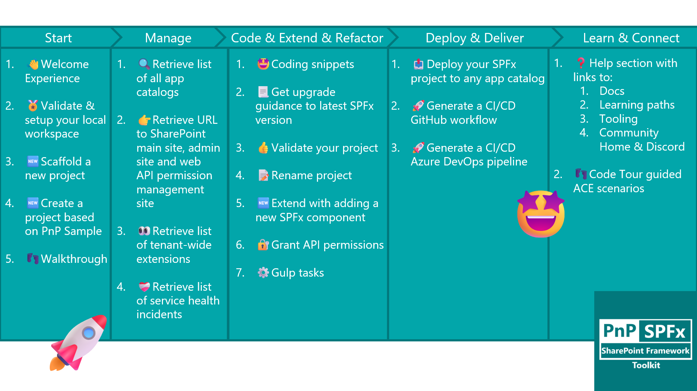

All of that is possible due to the awesome work done by the [PnP community](https://pnp.github.io/) which is visible in many functionalities of this extension: sample gallery filled with [PnP samples](https://pnp.github.io/#samples), upgrading SPFx project using [CLI for Microsoft 365](https://pnp.github.io/cli-microsoft365/), and many more. 

It does not matter if you are starting your journey with SPFx development and Viva solutions or if you are already experienced in this area, this VS Code extension will have the features you need to kick off your work to the next level 💪.

We are pleased to announce that we finally finished working on the v3 version which includes a number of awesome game-changer features that make building and managing SharePoint Framework solutions a lot easier.

Among many things that were done, those are the updates that stand out most 👇:

- 👉 Introduction of a totally new scaffolding experience with the possibility to install additional dependencies when creating a new project
- 👉 Generate Azure DevOps pipeline for your SPFx project with the possibility to generate a certificate and app registration needed for the flow in a single go!
- 👉 Updated account tree view with additional links to SharePoint admin site, web API permission management page, and health incident list
- 👉 Updated app catalog tree view adding tenant-wide extensions list
- 👉 Repolished sample gallery with more filtering options and details view
- 👉 Seamless integration with Teams Toolkit
- 👉 Configuration settings allowing to pick between NVM or NVS for Node.js management,
- 👉 Added an extension walkthrough that helps you get started with SharePoint Framework development and get to know all of the SharePoint Framework Toolkit features

Sounds cool 😎? Let’s have a deeper dive and check a couple of updates in a bit more detail 👇

## 🆕 New ways to start a new project

This feature was developed based on a lot of feedback given around the current scaffolding process. As of now Microsoft provides scaffolding over the SharePoint Yeoman generator that may be executed from the terminal. Although it serves its purpose, over time developers found this process confusing and not flexible. 

It's based on a Q&A approach where the Yeoman generator asks a couple of questions and based on our answers a new project is created. This process produces a lot of confusion especially for someone new to SharePoint Framework development as it is unclear how many steps there will be and what is the required information that will be needed to create for example an Application Customizer SPFx extension. Although the terminal UI is getting enhanced and currently is filled with colors, emojis, and graphs 😮, it is still mainly based on text which gives fewer opportunities to provide additional explanation and clarity to the process.

At the same time, the amount of options it gives lacks flexibility. Many developers provided feedback that the default project templates it produces could be updated or extended, for example with an additional template that by default uses react hooks, or the generator could provide more optional steps to install additional dependencies that are typically used in SharePoint Framework solutions, for example, MS Graph Toolkit 😢.

Although most of the feedback was acknowledged still there was little work done from Microsoft's side to improve this process mainly due to its priority and lack of resources, and that's where the community jumped in 💪! In this release of SharePoint Framework Toolkit, we rebuild this experience from the ground up, extending the VS Code UI with an additional view that presents you with a scaffolding form divided into 3 steps. 

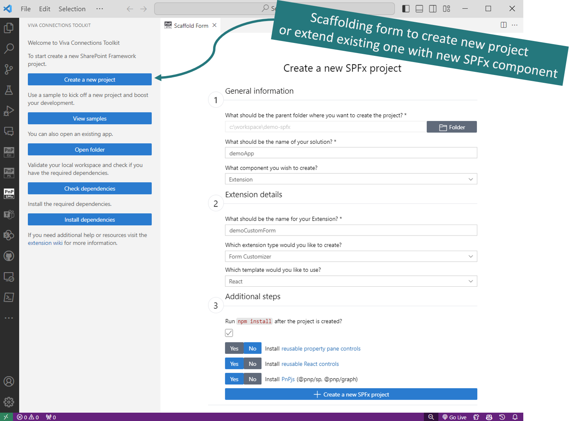

The form validates your inputs dynamically without the need of submit. The UI adapts based on the type of component you want to create (web part, extension, library, or ACE), so it is easy to see all the information which is required at a single glance 🤩. 

Fields in the first two steps of the form are required and mostly represent the SharePoint Yeoman generator steps. But the third step is a true game changer. It provides you an additional option to install one of the well-known and widely used npm packages provided by the Microsoft 365 and Power Platform Community. As of now the form allows you to install SPFx property pane controls and reusable React controls, and PnPjs 😍.

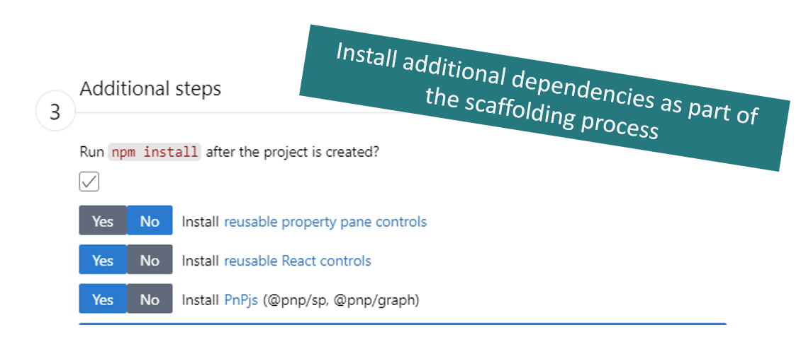

Check it out in action 👇

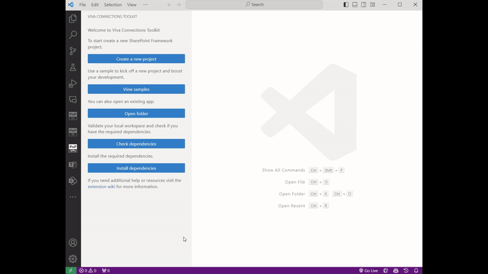

This is just a start and your feedback is a must before we enhance this even more 💬! With this new approach, we already see additional improvements we may provide like: allow to install more additional dependencies like MS Graph Toolkit or SPFx fast serve. Some of those options could be specific for a component type like some could be present only when you are creating a web part. And even we could provide additional setup besides just installing the npm package. The form UI itself could provide even more context and explanation giving examples or links to additional documentation. And many more, but before we start do visit our repo, start a discussion or an issue, or contact us however you want but don't be shy and do provide feedback 🙏.

BUT WAIT! Why would you start from scratch if you may kick of a new project based on one of the Microsoft 365 and Power Platform Community project samples all without leaving VS Code 🤯. SharePoint Framework Toolkit provides you with a built-in sample gallery, currently filled with 400+ samples 🤯 coming from the PnP web part, extensions, and ACEs sample repositories! 

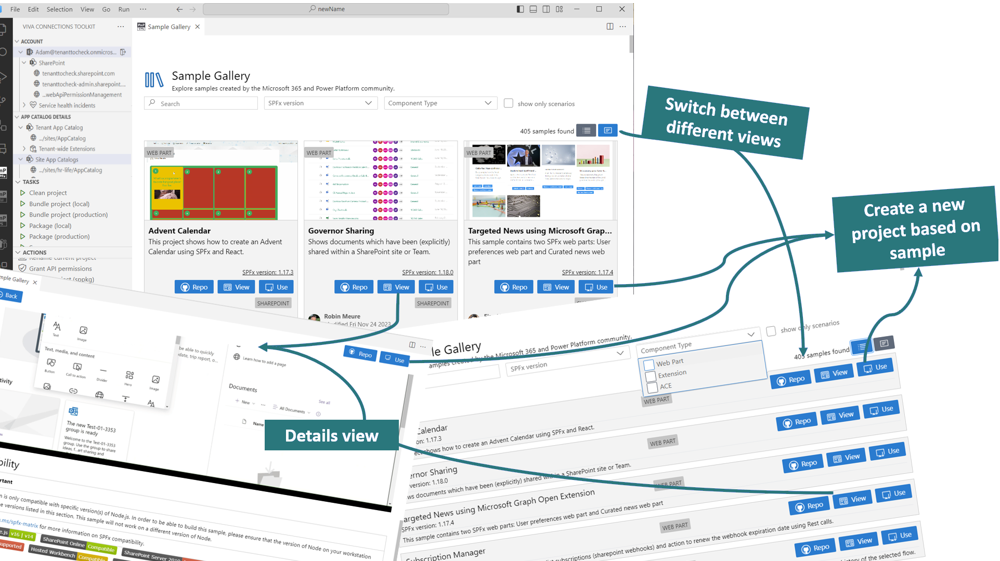

The sample gallery allows you to filter by name, description, tag, author, project type, and SharePoint Framework version. 

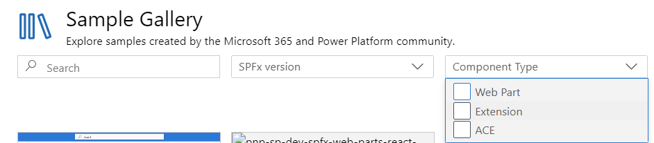

You may even enter the project details populated from the sample readme.md file all within VS Code. 

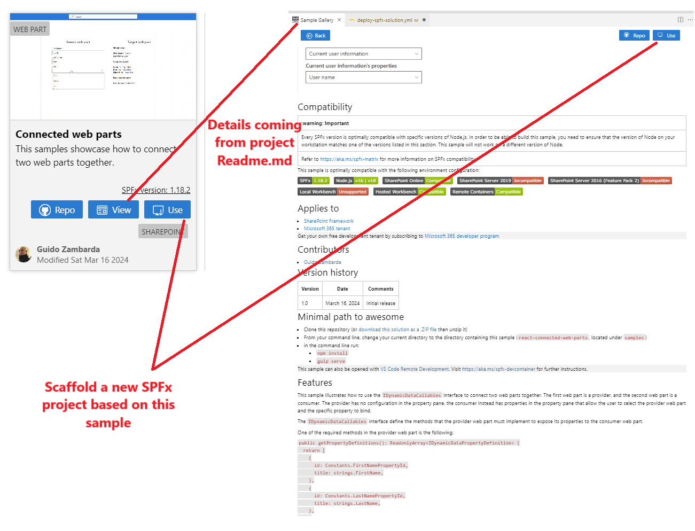

The view is fully responsive to any size of VS Code and allows you to view samples either using card view or a simple list without any media which produces less 'noise'. 

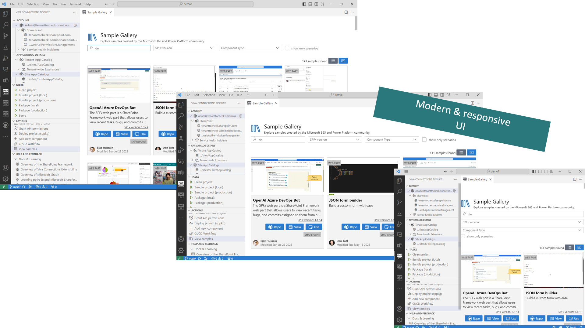

When creating a new project based on a sample, the SharePoint Framework Toolkit will allow you to provide a new name and will rename the sample project for you. And if you would like to use one of the samples but in the latest version of SPFx then don't worry. SPFx Toolkit has an upgrade action 🤩 which you may use after the project is created and will provide you step-by-step guidance on all of the steps you need to update in your project to make it valid with the latest version SharePoint Framework.

Check it out in action 👇

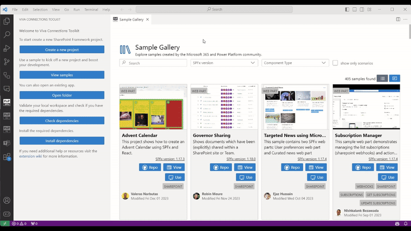

## 🚀 Generate a CI/CD workflow at the start of your work and do not leave it till the very end🤦‍♂️

'DevOps stuff is not easy' - that's the feedback I got from a developer and personal friend who explained to me why he leaves creating a CI/CD workflow for his SPFx project till the very end or when time is running short and money runs out, he does not create one at all. We asked around and it turns out that a task to create a CI/CD workflow is usually estimated in hours or even days 😮. The problem is lack of guidance which is specific for SharePoint Framework projects, and problematic setup which sometimes leads to solutions that are based on bad examples and as a result, we may find workflows with secrets or even passwords present in their YAML definition. 

With SharePoint Framework Toolkit you will be able to create a CI/CD workflow in minutes not hours! The VS Code extension will generate the YAML for your SPFx project. 

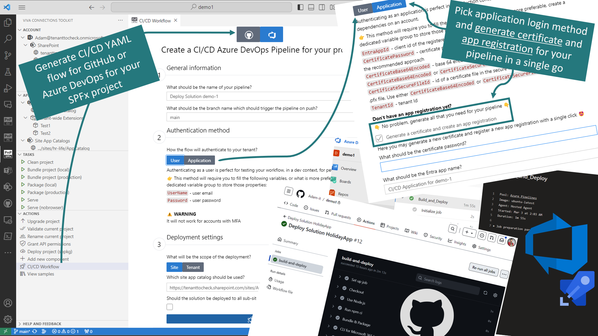

It provides you with step-by-step guidance on how set up the workflow the first time and even suggests the recommended login method for a production-ready solution. And when you just think that's all, we will surprise you with additional steps that will even allow you to generate a certificate and create an Entra App Registration using this certificate so that it may be used in the workflow to authenticate to your tenant as an app 🤯🤩. Oh and I almost forgot, till now it only supported GitHub actions but in this release, we extended the support with Azure DevOps pipelines 🚀. 

Let's do a quick overview.

The `CI/CD Workflow` action is available from the `Actions` view only when you are in the context of a SharePoint Framework project. Clicking on it will open up a form (again we extended VS Code with additional UI) that will guide you through all the information that is required to create a YAML workflow file. The form has 3 steps and all of the fields are already prefiled with default data based on your project so it is even possible not to change anything just hit on create and you will still get a perfectly working flow.

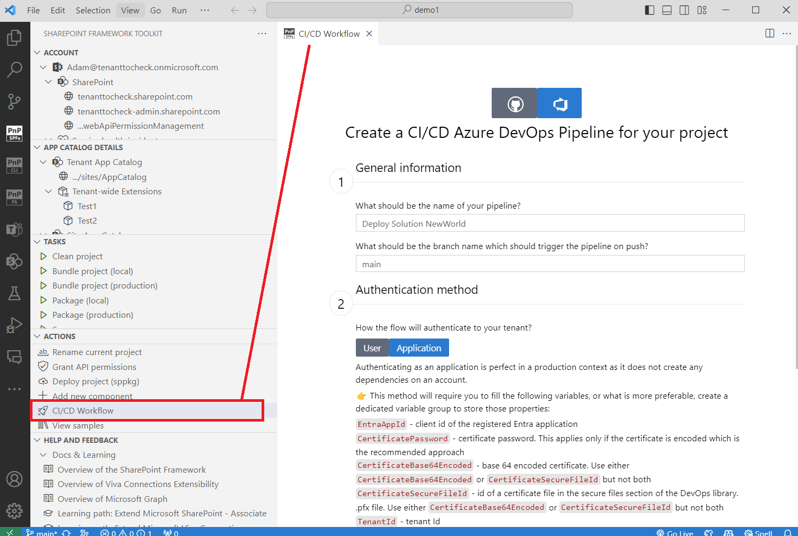

The first step is to pick if you will be generating the YAML workflow file for GitHub or Azure DevOps. Then you only need to provide some general details about the flow like pipeline name and the name of the branch that will trigger a new flow run. As you may see those are already filled out for you.

In the second step, you may pick between one of the supported login methods: user or application. Those are ways the pipeline will authenticate to your tenant to deploy the SPFx package. You may either select the user authentication method which is good enough for development and experimenting but is not recommended to be used in a production-ready pipeline. Mainly because this login method will not work with accounts that have MFA (Multi-Factor Authentication) turned on. As you may see the extension also provides you with this information in the form itself so that you are more likely to make the right decision especially when you are doing it for the first time.

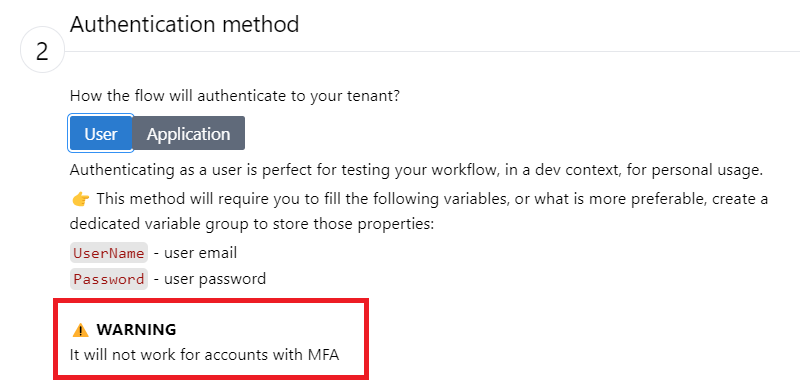

Alternatively you may pick the application login method which is recommended for a production-ready pipeline. It is a bit more complicated approach as it requires you to have a certificate and an Entra App Registration created with the needed permission to deploy the SPFx package and with the certificate added which the pipeline will use to authenticate to that app. So some additional work is required BUT all of that may be done with a single mark of a checkbox and by providing a password for your certificate 🤯.

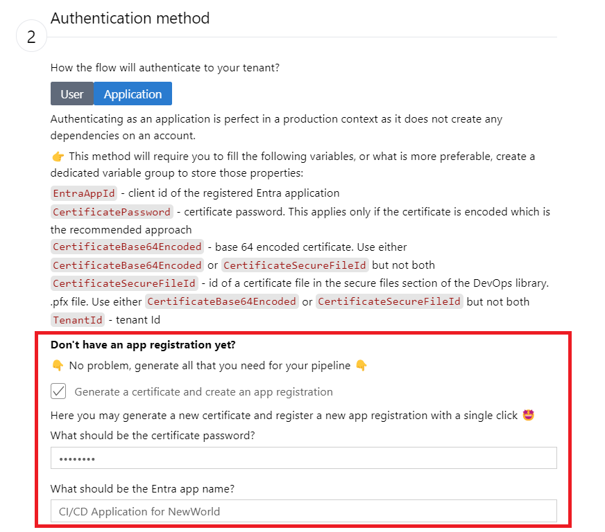

Depending on what you pick the YAML workflow will have variable placeholders with the required information for that specific login method. Again all of this information is presented in the form

In the third and last step, you need to decide if you will be deploying to a tenant or a site app catalog. If you pick the site-level app catalog you don't need to provide the URL manually as the SharePoint Framework Toolkit is already aware of your app catalogs so it will present you a dropdown to select one of the sites from the list. As a last option, you may mark if the package will be deployed to all sub-sites, for the site-level app catalog, or to the whole tenant, if you are deploying to the tenant app catalog.

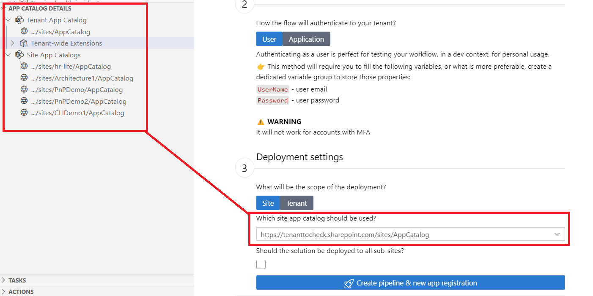

After that, you may hit the generate button and wait for the magic to happen. After the flow is generated you will get additional guidance on how to set up a new pipeline based on a YAML file in Azure DevOps after you push it to the repo. Also if you selected the application login method with generating the Entra App Registration, you will get additional details of your newly created application registration in Entra ID, together with a direct link to it and its details ready to be copied and used in the pipeline.

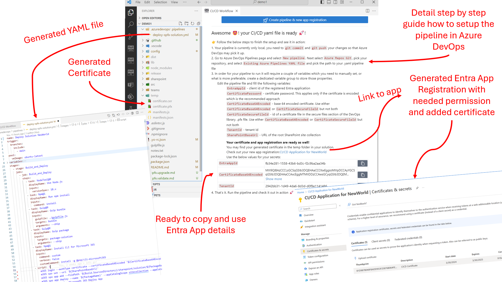

If you are wondering why those properties are not already filled in the pipeline variables for you, well although that is one of the options it is not the recommended way as Azure DevOps provides pipeline properties that may be defined in pipeline definition in Azure DevOps UI or you may create a dedicated variable group using Azure DevOps library which is the recommended approach.

Check it out in action 👇

Give this feature a try and see how easy it is to set up a CI/CD workflow for GitHub and now also for Azure DevOps. Continuous deployment makes your project management a lot easier allowing you to focus on coding and reducing the amount of manual steps you need to do every time you want to deploy a newer version of your package to the app catalog. Please provide feedback 💬🙏! And we don't plan to stop 😮. In future releases, we are already looking to extend the support for GitLab 🤩.

## 💪 More management capabilities

SharePoint Framework Toolkit is not only about coding and learning but it's also about helping you manage your SharePoint Framework solutions. In this release, we added additional features to the 'account' and 'app catalog' views.

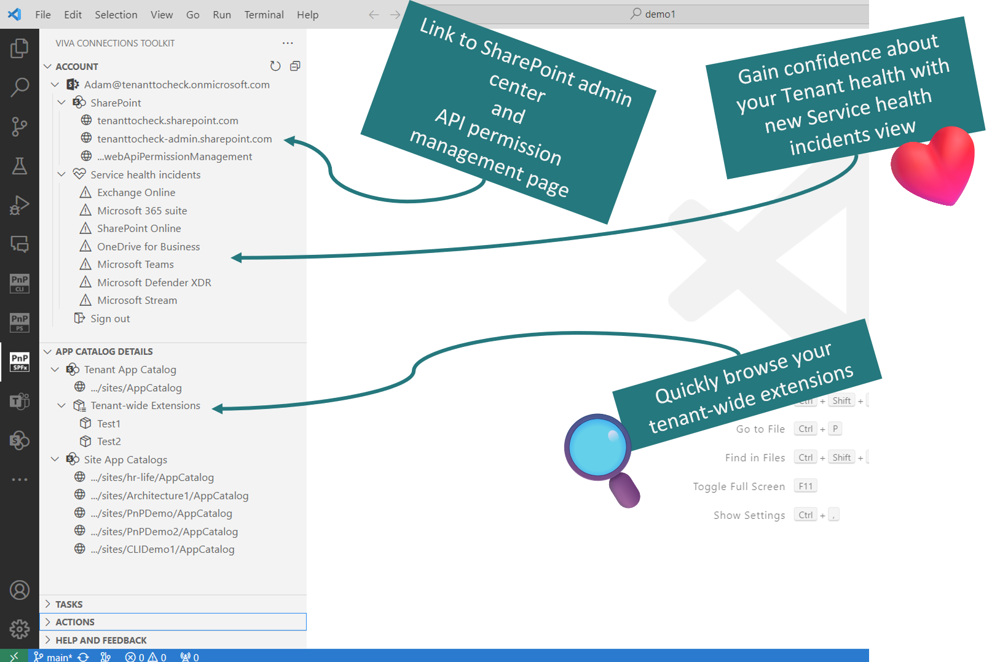

In the account view, we added more helpful links to your tenant like links to SharePoint admin site and Web API permission management site. We also added the list of currently active service health incidents for your tenant which may give you a quick answer as to why some features or APIs you are trying to use are not responding 😉

In the app catalog view, we added a list of the tenant-wide extensions currently installed on your tenant. Clicking on the item will redirect you to the list item in SharePoint tenant-wide extension list. This may give you a glance at the customization that applies to your whole tenant.

This is just the start. In next releases we plan to give you even more power and management features. For example, we are planning to provide you a list of all apps deployed to each of the app catalogs with the possibility to retract remove, or even 'move' the package to a different app catalog, like moving an app from a site-level to a tenant-level app catalog. But before we move forward please reach us out in any kind of way. Directly or by opening an issue in the repo or by creating a new GitHub discussion, whatever works for you, but don't be shy and let us know what you think 💬🙏

## 👣 Walkthrough - your easy start with SharePoint Framework Toolkit

SharePoint Framework Toolkit brings a totally new experience to VS Code extending it with additional UI like build-in sample gallery or scaffolding forms. It provides many features that help you at every stage of developing and managing your SharePoint Framework project. We understand it may be hard to get started with this VS Code extension and not everybody wants to go over the readme me from top to bottom 😉. That's why we introduced a VS Code walkthrough that provides you step-by-step guidance on how to set up a dev tenant and get started with SharePoint Framework development and what and how you may use the most important and helpful features of this Toolkit. 

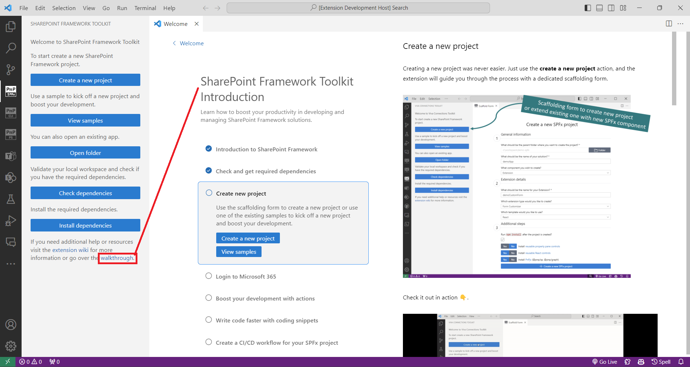

The walkthrough will start on the first run just after you install the VS Code extension but you may go back to it at any time using the 'walkthrough' link in the extension welcome experience or the help and feedback section.

## 🗺️ Future roadmap

We don't plan to stop, we are already thinking of v4 and new ways to extend features that were introduced in this release. If you want to check what we are planning or add your own idea please [join the discussion](https://github.com/pnp/vscode-viva/discussions/159). Feedback is appreciated 👍.

## 👍 Power of the community

This extension would not have been possible if it weren’t for the awesome work done by the [Microsoft 365 & Power Platform Community](https://pnp.github.io/). Each sample gallery: SPFx web parts & extensions, and ACE samples & scenarios are all populated with the contributions done by the community. Many of the functionalities of the extension like upgrading, validating, and deploying your SPFx project, would not have been possible if it wasn’t for the [CLI for Microsoft 365](https://pnp.github.io/cli-microsoft365/) tool. I would like to sincerely thank all of our awesome contributors! Creating this extension would not have been possible if it weren’t for the enormous work done by the community. You all rock 🤩.

If you would like to participate, the community welcomes everybody who wants to build and share feedback around Microsoft 365 & Power Platform. Join one of our [community calls](https://pnp.github.io/#community) to get started and be sure to visit 👉 https://aka.ms/community/home.

## 🙋 Wanna help out?

Of course, we are open to contributions. If you would like to participate do not hesitate to visit our [GitHub repo](https://github.com/pnp/vscode-viva) and start a discussion or engage in one of the many issues we have. Feedback (positive or negative) is also more than welcome.

## 🔗 Resources

- [Download Viva Connections Toolkit at VS Code Marketplace](https://marketplace.visualstudio.com/items?itemName=m365pnp.viva-connections-toolkit)
- [Viva Connections Toolkit GitHub repo](https://github.com/pnp/vscode-viva)
- [Microsoft 365 & Power Platform Community](https://pnp.github.io/#home)
- [Join the Microsoft 365 & Power Platform Community Discord Server]( https://aka.ms/community/discord)
- [Wiki]( https://github.com/pnp/vscode-viva/wiki)
- [Join the Microsoft 365 Developer Program]( https://developer.microsoft.com/en-us/microsoft-365/dev-program)
- [CLI for Microsoft 365](https://pnp.github.io/cli-microsoft365/)
- [Sample Solution Gallery]( https://adoption.microsoft.com/en-us/sample-solution-gallery/)
