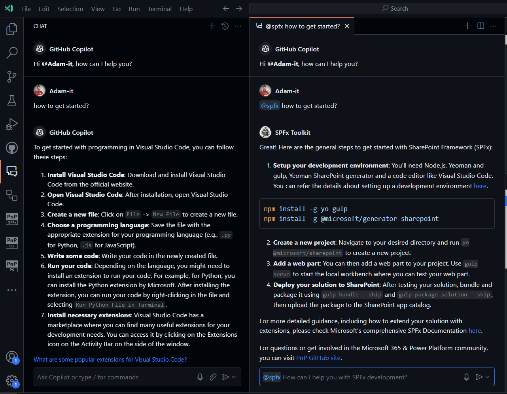
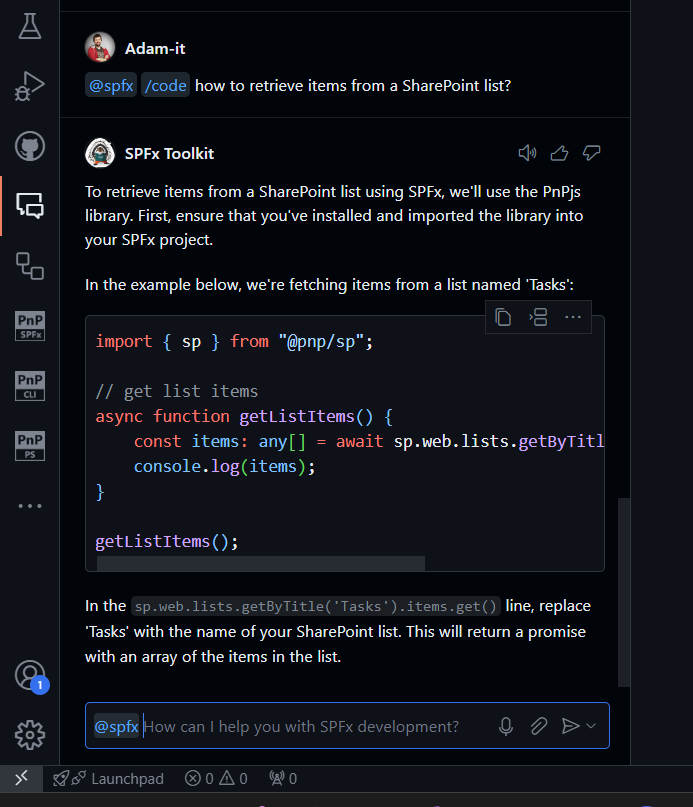
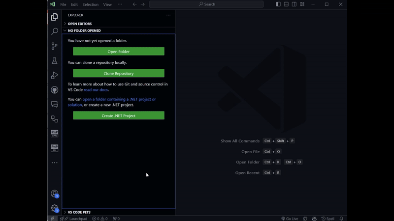
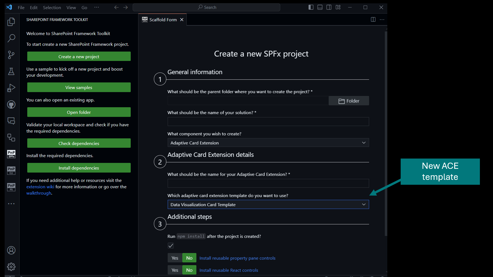

## 🗒️ Quick intro

[SharePoint Framework Toolkit](https://marketplace.visualstudio.com/items?itemName=m365pnp.viva-connections-toolkit) is a Visual Studio Code extension that aims to boost your productivity in developing and managing [SharePoint Framework solutions](https://learn.microsoft.com/sharepoint/dev/spfx/sharepoint-framework-overview?WT.mc_id=m365-15744-cxa) helping at every stage of your development flow, from setting up your development workspace to deploying a solution straight to your tenant without the need to leave VS Code, it even allows you to create a CI/CD pipeline to introduce automate deployment of your app 🚀 and now comes along with a dedicated @spfx Copilot Chat participant which is your AI assistant grounded for SharePoint Framework development.

Just check out the features list 👇 it's a looot 🤯.

Sounds cool 😎? Let's see some of the top features we added in the last couple of minor releases.

## 🧠💬 SPFx Toolkit is part of GitHub Copilot chat

In the age of AI, coding assistants are no new concept and since the early days of GitHub Copilot, it was already possible to give him the context it needs to prepare it to help us with SharePoint Framework development. But why would you make this additional effort every time just to use it for your case if you could have a dedicated chat participant which is already grounded with fine-tuned prompts and context for the task you need? This is exactly what @spfx toolkit chat participant is.

It is your dedicated AI Copilot that will help you with anything that is needed to develop your SharePoint Framework project. It has predefined commands that are tailored toward a specific activity for which you require guidance.

Currently, we support the following commands:
- `/setup` - that is dedicated to providing information on how to setup your local workspace for SharePoint Framework development
- `/new` - that may be used to get guidance on how to create a new solution or find and reuse an existing sample from the PnP SPFx sample gallery
- `/code` - that is fine-tuned to provide help in coding your SharePoint Framework project and provides additional boosters like validating the correctness of your SPFx project, scaffolding a CI/CD workflow, or renaming your project, and many more.

The @spfx chat participant is integrated with SPFx Toolkit and aware of its features. If it finds any actions or functionalities that are good for your prompt it may present them with as chat actions at the end of the response.
Check it out in action👇

Currently, we allow it only to be your chat buddy answering your SPFx-related questions and providing you with proper documentation, coding starting points, or shortcuts to actions that may solve your prompt. But we are already looking ahead and we are experimenting with features that will allow it to proactively run commands or actions based on your prompt. Interested? Stay tuned to find out more 😉.
It's still in its early beta days and many things might go wrong but we are already excited for this new opportunity and can't wait to see what you will be able to build with it🤩. Happy Coding!

**⚠️ This is still beta**

In order for this feature to work you need to meet the following requirements:
- Use the [Visual Studio Code Insiders](https://code.visualstudio.com/insiders/) release
- Use the pre-release version of the [GitHub Copilot Chat](https://marketplace.visualstudio.com/items?itemName=GitHub.copilot-chat) extension
- Use the latest version of [SPFx Toolkit](https://marketplace.visualstudio.com/items?itemName=m365pnp.viva-connections-toolkit)

[Check out our docs to find out more.](https://github.com/pnp/vscode-viva/wiki/8.-Preview-features)

## 👨‍💻 Added support for SharePoint Framework 1.19.0

SharePoint Framework Toolkit now supports the latest version of SPFx (which is 1.19.0).
This means it is now possible to generate upgrade guidance to the latest version and also get a validation report to check the correctness of your SharePoint Framework project.
We also extended the scaffolding form with a new ACE template data visualization card view that is intended to be used for charting scenarios.

## 🐞🔨 Bug fixes and housekeeping

In the last couple of weeks with the help of the community, we managed to improve and clean up our code base as well as fix a few minor bugs. As we move forward with adding new capabilities to the product it is very important to maintain clean and stable code. This would not have been possible without the help of some community champions who stepped in to help us out 👏.

## 👏 You ROCK 🤩

The last couple of releases would not have been possible without the help of some really awesome folks that stepped in and joined our journey in creating the best in class SharePoint Framework tooling in the world. We would like to express our huge gratitude and shout out to:

- [Dan Toft](https://github.com/Tanddant)
- [Nico De Cleyre](https://github.com/nicodecleyre)
- [Saurabh Tripathi](https://github.com/Saurabh7019)

## 🗺️ Future roadmap

We don't plan to stop, we are already thinking of more awesome features we plan to deliver with v4 release. If you want to check what we are planning or add your own idea please [join the discussion](https://github.com/pnp/vscode-viva/discussions/159). Feedback is appreciated 👍.

## 👍 Power of the community

This extension would not have been possible if it weren’t for the awesome work done by the [Microsoft 365 & Power Platform Community](https://pnp.github.io/). Each sample gallery: SPFx web parts & extensions, and ACE samples & scenarios are all populated with the contributions done by the community. Many of the functionalities of the extension like upgrading, validating, and deploying your SPFx project, would not have been possible if it wasn’t for the [CLI for Microsoft 365](https://pnp.github.io/cli-microsoft365/) tool. I would like to sincerely thank all of our awesome contributors! Creating this extension would not have been possible if it weren’t for the enormous work done by the community. You all rock 🤩.

If you would like to participate, the community welcomes everybody who wants to build and share feedback around Microsoft 365 & Power Platform. Join one of our [community calls](https://pnp.github.io/#community) to get started and be sure to visit 👉 https://aka.ms/community/home.

## 🙋 Wanna help out?

Of course, we are open to contributions. If you would like to participate do not hesitate to visit our [GitHub repo](https://github.com/pnp/vscode-viva) and start a discussion or engage in one of the many issues we have. We have many issues that are just ready to be taken. Please follow our [contribution guidelines](https://github.com/pnp/vscode-viva/blob/main/contributing.md) before you start.
Feedback (positive or negative) is also more than welcome.

## 🔗 Resources

- [Download SharePoint Framework Toolkit at VS Code Marketplace](https://marketplace.visualstudio.com/items?itemName=m365pnp.viva-connections-toolkit)
- [SPFx Toolkit GitHub repo](https://github.com/pnp/vscode-viva)
- [Microsoft 365 & Power Platform Community](https://pnp.github.io/#home)
- [Join the Microsoft 365 & Power Platform Community Discord Server]( https://aka.ms/community/discord)
- [Wiki]( https://github.com/pnp/vscode-viva/wiki)
- [Join the Microsoft 365 Developer Program]( https://developer.microsoft.com/en-us/microsoft-365/dev-program)
- [CLI for Microsoft 365](https://pnp.github.io/cli-microsoft365/)
- [Sample Solution Gallery]( https://adoption.microsoft.com/en-us/sample-solution-gallery/)
