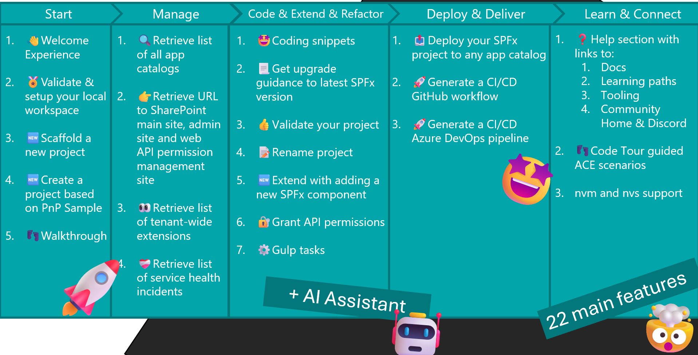
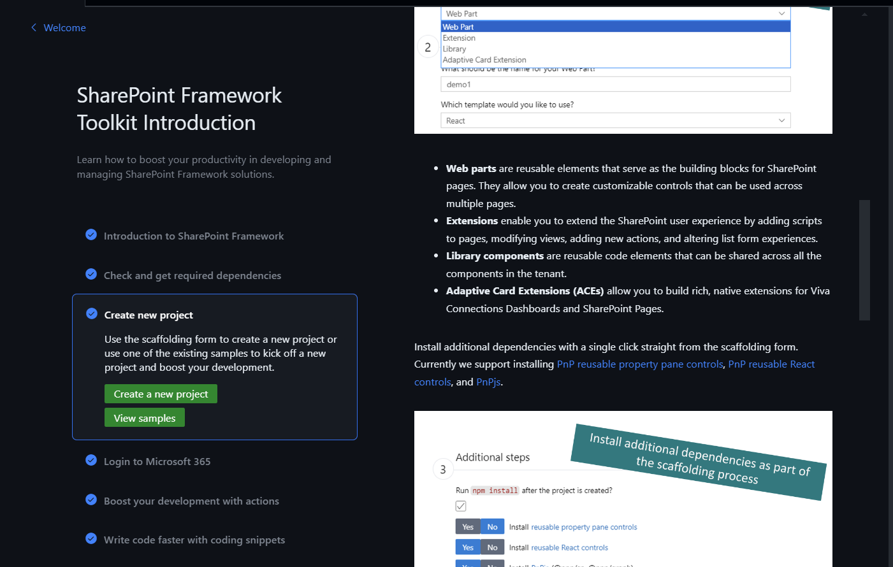
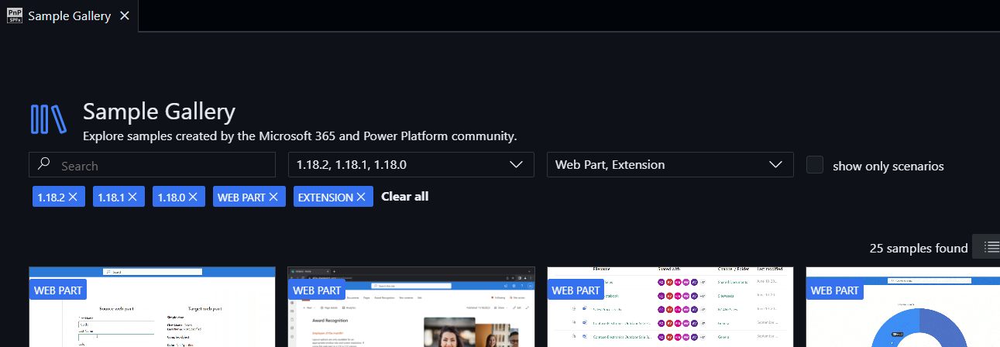

## 🗒️ Quick intro

[SharePoint Framework Toolkit](https://marketplace.visualstudio.com/items?itemName=m365pnp.viva-connections-toolkit) is a Visual Studio Code extension that aims to boost your productivity in developing and managing [SharePoint Framework solutions](https://learn.microsoft.com/sharepoint/dev/spfx/sharepoint-framework-overview?WT.mc_id=m365-15744-cxa) helping at every stage of your development flow, from setting up your development workspace to deploying a solution straight to your tenant without the need to leave VS Code, it even allows you to create a CI/CD pipeline to introduce automate deployment of your app 🚀 and now comes along with a dedicated @spfx Copilot Chat participant which is your AI assistant grounded for SharePoint Framework development.

Just check out the features list 👇 it's a looot 🤯.

Sounds cool 😎? Let's see some new enhancements we added in this minor release

## Learn SharePoint Framework

One of SharePoint Framework Toolkit main aims is to help you get started and learn SPFx. It is very important to make it as easy as possible for devs who are just starting their journey with SharePoint Framework Development. For that reason, the extension has a walkthrough which basically is a step-by-step guide that will introduce you to SharePoint Framework in general and to this toolkit capabilities. In this release, we spent some time improving this experience providing even more valuable learning information.

## Improved Sample Gallery

SharePoint Framework Toolkit Sample Gallery allows you to find a solution for your problem quickly. Why would you start from scratch if you may use one of 400+ samples as your starting point all ready to kick off your work? In this release, we added some fixes and improvements to this functionality, along with really great enhancements that allow you to see selected filters as tags and modify them with ease.

## 👏 You ROCK 🤩

This release would not have been possible without the help of some really awesome folks who stepped in and joined our journey in creating the best in class SharePoint Framework tooling in the world. We would like to express our huge gratitude and shout out to:

- [Saurabh Tripathi](https://github.com/Saurabh7019)
- [Luccas Castro](https://github.com/DevPio)

## 🗺️ Future roadmap

We don't plan to stop, we are already thinking of more awesome features we plan to deliver with v4 release. If you want to check what we are planning or add your own idea please [join the discussion](https://github.com/pnp/vscode-viva/discussions/159). Feedback is appreciated 👍.

## 👍 Power of the community

This extension would not have been possible if it weren’t for the awesome work done by the [Microsoft 365 & Power Platform Community](https://pnp.github.io/). Each sample gallery: SPFx web parts & extensions, and ACE samples & scenarios are all populated with the contributions done by the community. Many of the functionalities of the extension like upgrading, validating, and deploying your SPFx project, would not have been possible if it wasn’t for the [CLI for Microsoft 365](https://pnp.github.io/cli-microsoft365/) tool. I would like to sincerely thank all of our awesome contributors! Creating this extension would not have been possible if it weren’t for the enormous work done by the community. You all rock 🤩.

If you would like to participate, the community welcomes everybody who wants to build and share feedback around Microsoft 365 & Power Platform. Join one of our [community calls](https://pnp.github.io/#community) to get started and be sure to visit 👉 https://aka.ms/community/home.

## 🙋 Wanna help out?

Of course, we are open to contributions. If you would like to participate do not hesitate to visit our [GitHub repo](https://github.com/pnp/vscode-viva) and start a discussion or engage in one of the many issues we have. We have many issues that are just ready to be taken. Please follow our [contribution guidelines](https://github.com/pnp/vscode-viva/blob/main/contributing.md) before you start.
Feedback (positive or negative) is also more than welcome.

## 🔗 Resources

- [Download SharePoint Framework Toolkit at VS Code Marketplace](https://marketplace.visualstudio.com/items?itemName=m365pnp.viva-connections-toolkit)
- [SPFx Toolkit GitHub repo](https://github.com/pnp/vscode-viva)
- [Microsoft 365 & Power Platform Community](https://pnp.github.io/#home)
- [Join the Microsoft 365 & Power Platform Community Discord Server]( https://aka.ms/community/discord)
- [Wiki]( https://github.com/pnp/vscode-viva/wiki)
- [Join the Microsoft 365 Developer Program]( https://developer.microsoft.com/en-us/microsoft-365/dev-program)
- [CLI for Microsoft 365](https://pnp.github.io/cli-microsoft365/)
- [Sample Solution Gallery]( https://adoption.microsoft.com/en-us/sample-solution-gallery/)
