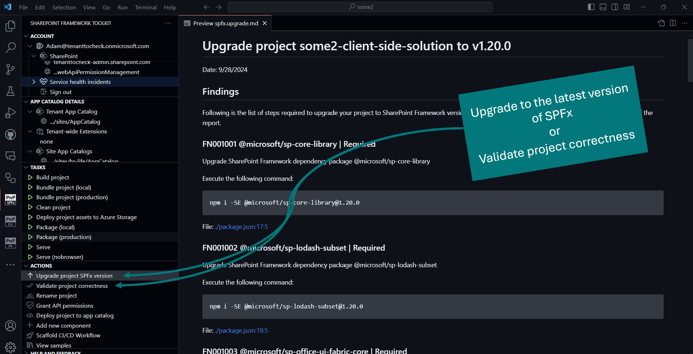
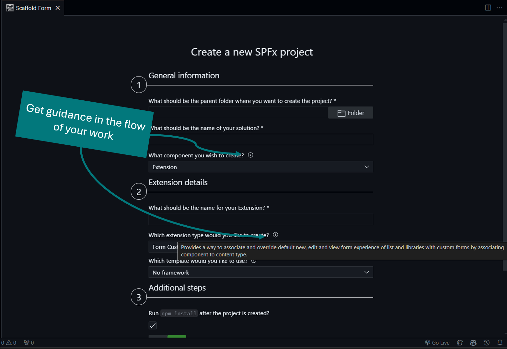
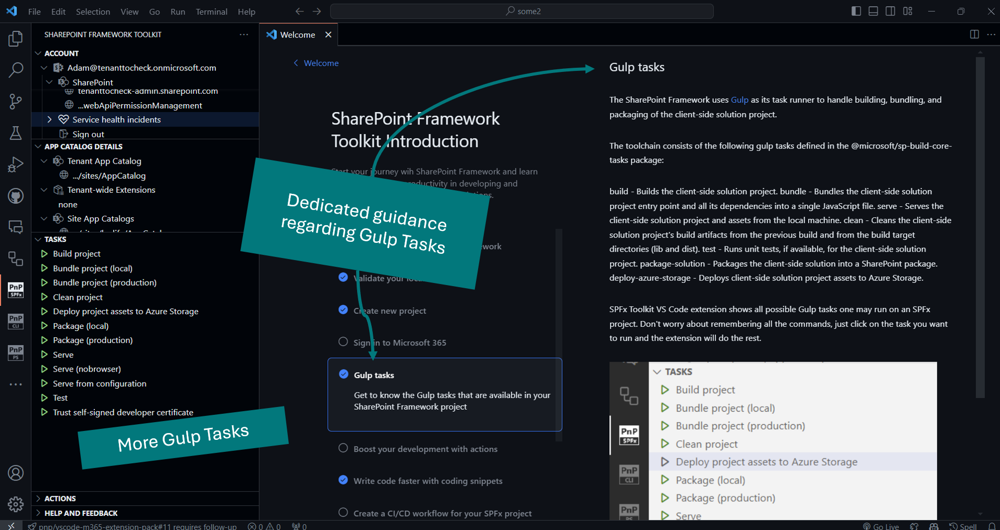

## 🗒️ Quick intro

[SharePoint Framework Toolkit](https://marketplace.visualstudio.com/items?itemName=m365pnp.viva-connections-toolkit) is a Visual Studio Code extension that aims to boost your productivity in developing and managing [SharePoint Framework solutions](https://learn.microsoft.com/sharepoint/dev/spfx/sharepoint-framework-overview?WT.mc_id=m365-15744-cxa) helping at every stage of your development flow, from setting up your development workspace to deploying a solution straight to your tenant without the need to leave VS Code, it even allows you to create a CI/CD pipeline to introduce automate deployment of your app 🚀 and now comes along with a dedicated @spfx Copilot Chat participant which is your AI assistant grounded for SharePoint Framework development.

Just check out the features list 👇 it's a looot 🤯.

Sounds cool 😎? Let's see some new enhancements we added in this major release

## Added support for SharePoint Framework 1.20.0

Since [SPFx 1.20.0](https://learn.microsoft.com/en-us/sharepoint/dev/spfx/release-1.20) is officially GA we updated the Upgrade and Validate actions to support it as well. Now it is possible to generate upgrade guidance from any version to 1.20.0. It is also possible to validate the correctness of your SharePoint Framework solution in this version as well.

Keeping up to date is the key to success and this VS Code extension will try to make this transition as easy as possible.

## More guidance

Learning SharePoint Framework is one of the key priorities of SPFx Toolkit. In this release, we added a couple of enhancements that will be extremely helpful for folks new to SPFx. The first tooltips added to the scaffolding form explain every possible selection. It will provide short guidance regarding any SPFx project type, extension or ACE type, and framework type. We also added a dedicated walkthrough step that will explain Gulp tasks, what they are, and how they should be used.

## Gulp Tasks

In this release, we extended the Gulp Task view with additional tasks which are related to SharePoint Framework solutions. This is extremly helpful for folks new to SPFx who are not familiar with the toolchain. 

## 👏 You ROCK 🤩

This release would not have been possible without the help of some really awesome folks who stepped in and joined our journey in creating the best-in-class SharePoint Framework tooling in the world. We would like to express our huge gratitude and shout out to:

- [Luccas Castro](https://github.com/DevPio)

## 🗺️ Future roadmap

We don't plan to stop, we are already thinking of more awesome features we plan to deliver with v5 release. If you want to check what we are planning check out our [issues from this milestone](https://github.com/pnp/vscode-viva/milestone/6). Feedback is appreciated 👍.

## 👍 Power of the community

This extension would not have been possible if it weren’t for the awesome work done by the [Microsoft 365 & Power Platform Community](https://pnp.github.io/). Each sample gallery: SPFx web parts & extensions, and ACE samples & scenarios are all populated with the contributions done by the community. Many of the functionalities of the extension like upgrading, validating, and deploying your SPFx project, would not have been possible if it wasn’t for the [CLI for Microsoft 365](https://pnp.github.io/cli-microsoft365/) tool. I would like to sincerely thank all of our awesome contributors! Creating this extension would not have been possible if it weren’t for the enormous work done by the community. You all rock 🤩.

If you would like to participate, the community welcomes everybody who wants to build and share feedback around Microsoft 365 & Power Platform. Join one of our [community calls](https://pnp.github.io/#community) to get started and be sure to visit 👉 https://aka.ms/community/home.

## 🙋 Wanna help out?

Of course, we are open to contributions. If you would like to participate do not hesitate to visit our [GitHub repo](https://github.com/pnp/vscode-viva) and start a discussion or engage in one of the many issues we have. We have many issues that are just ready to be taken. Please follow our [contribution guidelines](https://github.com/pnp/vscode-viva/blob/main/contributing.md) before you start.
Feedback (positive or negative) is also more than welcome.

## 🔗 Resources

- [Download SharePoint Framework Toolkit at VS Code Marketplace](https://marketplace.visualstudio.com/items?itemName=m365pnp.viva-connections-toolkit)
- [SPFx Toolkit GitHub repo](https://github.com/pnp/vscode-viva)
- [Microsoft 365 & Power Platform Community](https://pnp.github.io/#home)
- [Join the Microsoft 365 & Power Platform Community Discord Server]( https://aka.ms/community/discord)
- [Wiki]( https://github.com/pnp/vscode-viva/wiki)
- [Join the Microsoft 365 Developer Program]( https://developer.microsoft.com/en-us/microsoft-365/dev-program)
- [CLI for Microsoft 365](https://pnp.github.io/cli-microsoft365/)
- [Sample Solution Gallery]( https://adoption.microsoft.com/en-us/sample-solution-gallery/)
