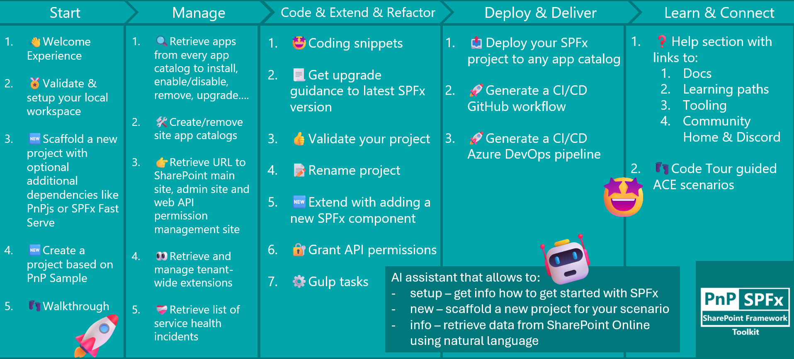
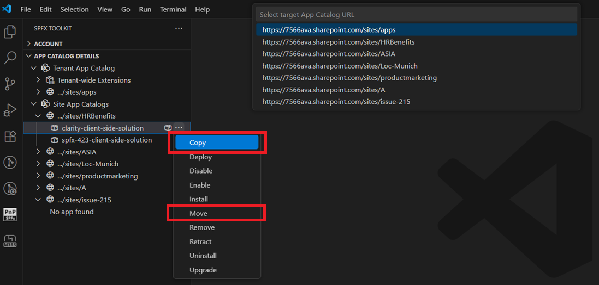
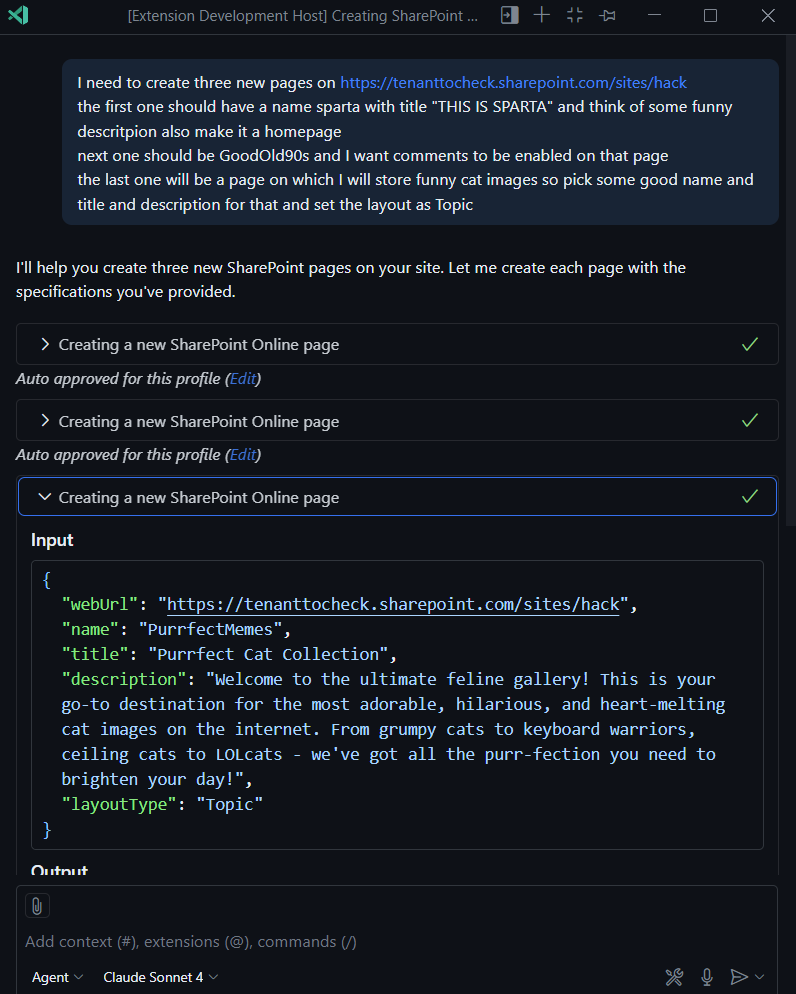
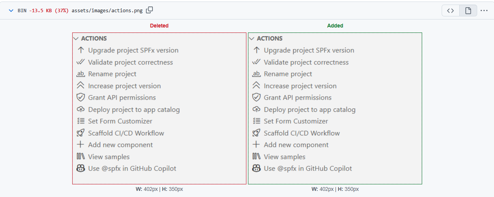
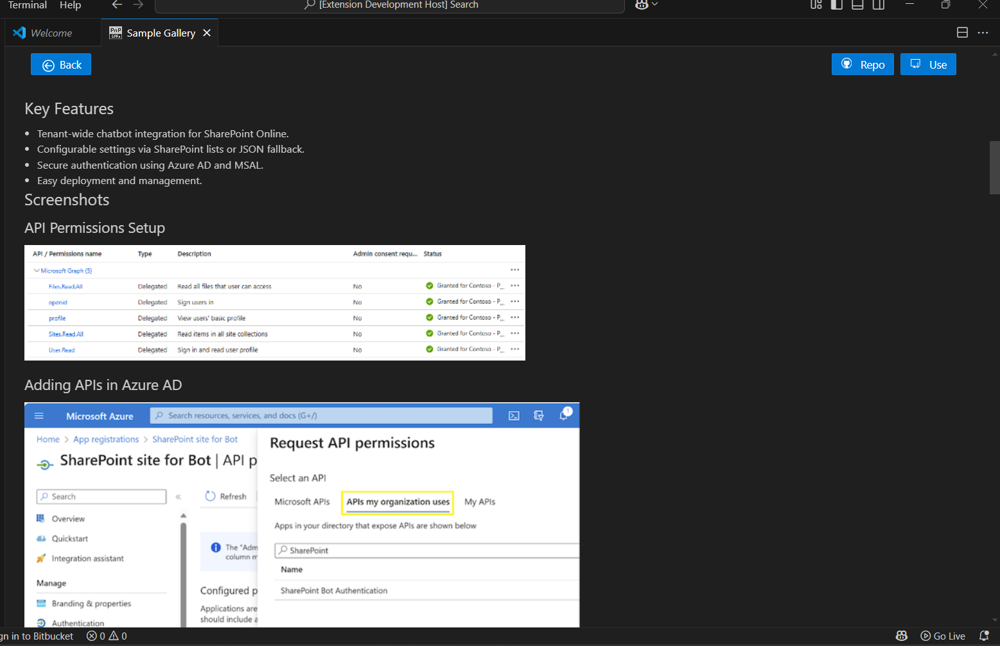
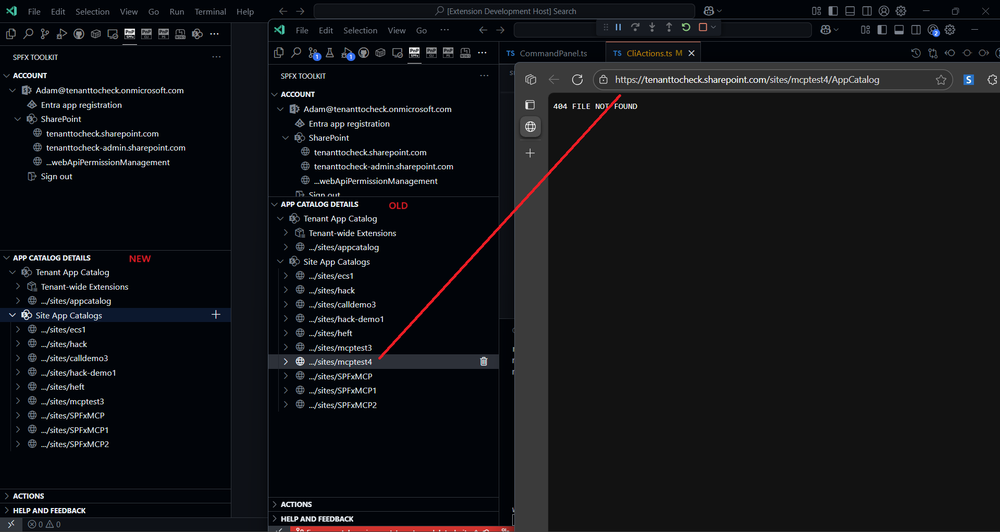

## 🗒️ Quick intro

[SharePoint Framework Toolkit](https://marketplace.visualstudio.com/items?itemName=m365pnp.viva-connections-toolkit) is a Visual Studio Code extension that aims to boost your productivity in developing and managing [SharePoint Framework solutions](https://learn.microsoft.com/sharepoint/dev/spfx/sharepoint-framework-overview?WT.mc_id=m365-15744-cxa) helping at every stage of your development flow, from setting up your development workspace to deploying a solution straight to your tenant without the need to leave VS Code, it even allows you to create a CI/CD pipeline to introduce automate deployment of your app and also comes along with AI capabilities which will allow you to manage your SharePoint Online tenant straight from GitHub Copilot chat extension.

Just check out the features list 👇 it's a looot 🤯.

Sounds cool 😎? Let's see some new enhancements we added in this minor release

## New app management actions: copy and move

Managing apps across multiple app catalogs just got significantly easier. We have added two powerful new actions that streamline common administrative workflows:

- Copy app: Duplicate an app from one app catalog to another, perfect for promoting solutions from development to production environments or distributing apps across multiple site collections
- Move app: Relocate an app entirely from one catalog to another when you need to reorganize your app distribution

These actions eliminate the tedious process of manually downloading apps, re-uploading them to different catalogs, and reconfiguring settings. Now you can manage your apps directly from the SPFx Toolkit interface.

## Enhanced Language Model Tool for SharePoint page creation

The `spo_page_add` Language Model Tool has been significantly updated to follow new standards and support more capabilities when creating SharePoint pages through GitHub Copilot in VS Code. The tool now includes updated and additional input parameters that were previously missing, making page creation through AI more powerful and reliable. When you ask Copilot to create a SharePoint page, the tool now provides more accurate results with better parameter handling.

## Performance improvements through image compression

Extension size matters, especially when it comes to download times and update speed. We have optimized the entire extension by compressing all images without any noticeable quality loss, reducing the overall package size significantly. This means faster installations, quicker updates, and a more responsive experience for everyone using the SPFx Toolkit. Since these same images are also used in our documentation, this optimization has reduced the load time and carbon footprint of our docs as well, meaning a win for both performance and the environment!

## Updated Adaptive Card Designer link

The Adaptive Card Designer has moved to its new official Microsoft home! We have updated all references throughout the extension from `https://adaptivecards.io/designer/` to the new URL `https://adaptivecards.microsoft.com/designer`. The old designer site now displays a migration banner, and our update ensures you are always directed to the current, officially supported designer with updated features and better integration with the Microsoft ecosystem.

## Sample gallery improvements

The sample gallery is one of the most beloved features of SPFx Toolkit, providing instant access to hundreds of community-contributed web parts, extensions, and Adaptive Card Extension samples. We have made several improvements to enhance the gallery experience:
- Images in sample details now display correctly when you click on a sample to view its details in VS Code. We added a small fix that dynamically updates image URLs to the correct paths, ensuring all screenshots and visual examples are visible when browsing through samples.
- We have also made the gallery more reliable by adding safeguards to address common errors that might occur when processing sample data, ensuring the gallery remains responsive and functional even when encountering unexpected data structures.

## App Catalog view no longer shows deleted sites

Clarity in your App Catalog view is essential for effective app management. Previously, deleted or archived sites could still appear in the catalog view, causing confusion when trying to manage your apps. This issue has been resolved by adding a new option to the underlying CLI for Microsoft 365 command that filters out app catalogs from archived or deleted sites. Now the view accurately reflects only your active app catalogs, making it easier to focus on what matters.

## Why version 4.12 and not 4.10?

You might notice that we jumped from version 4.9.8 to 4.12.0 in the VS Code Marketplace. This was not intentional! We encountered issues with the VS Code Marketplace that prevented us from publishing versions 4.10 and 4.11. The marketplace was experiencing problems where extensions were showing up as "no longer available" and publishing new versions was impacted. Rather than skip these version numbers entirely or cause confusion, we decided to move forward with 4.12. You can read more about the marketplace issues in [this GitHub issue](https://github.com/microsoft/vsmarketplace/issues/1454).

## 👏 You ROCK 🤩

This release would not have been possible without the help of some really awesome folks who stepped in and joined our journey in creating the best-in-class SharePoint Framework tooling in the world. We would like to express our huge gratitude and shout out to:

- [Adam Wójcik](https://github.com/Adam-it)
- [Luccas Castro](https://github.com/DevPio)
- [Nico De Cleyre](https://github.com/nicodecleyre)
- [Saurabh Tripathi](https://github.com/Saurabh7019)

## 🗺️ Future roadmap

We don't plan to stop, we are already thinking of more awesome features we plan to deliver in upcoming releases. Top of our mind currently is:

- Adding support for the upcoming SPFx 1.22
- Adding support for all SPFx versions, including older versions as well

. If you want to check what we are planning, check out our [issues from this milestone](https://github.com/pnp/vscode-viva/milestone/6). Feedback is appreciated 👍.

## 👍 Power of the community

This extension would not have been possible if it hadn’t been for the awesome work done by the [Microsoft 365 & Power Platform Community](https://pnp.github.io/). Each sample gallery: SPFx web parts & extensions, and ACE samples & scenarios, is populated with the contributions made by the community. Many of the functionalities of the extension, like upgrading, validating, and deploying your SPFx project, would not have been possible if it weren’t for the [CLI for Microsoft 365](https://pnp.github.io/cli-microsoft365/) tool. I would like to thank all of our awesome contributors sincerely! Creating this extension would not have been possible if it weren’t for the enormous work done by the community. You all rock 🤩.

If you would like to participate, the community welcomes everybody who wants to build and share feedback around Microsoft 365 & Power Platform. Join one of our [community calls](https://pnp.github.io/#community) to get started and be sure to visit 👉 https://aka.ms/community/home.

## 🙋 Wanna help out?

Of course, we are open to contributions. If you would like to participate, do not hesitate to visit our [GitHub repo](https://github.com/pnp/vscode-viva) and start a discussion or engage in one of the many issues we have. We have many issues that are just ready to be taken. Please follow our [contribution guidelines](https://github.com/pnp/vscode-viva/blob/main/contributing.md) before you start.
Feedback (positive or negative) is also more than welcome.

## 🔗 Resources

- [SPFx Toolkit Docs](https://pnp.github.io/vscode-viva/)
- [Download SharePoint Framework Toolkit at VS Code Marketplace](https://marketplace.visualstudio.com/items?itemName=m365pnp.viva-connections-toolkit)
- [SPFx Toolkit GitHub repo](https://github.com/pnp/vscode-viva)
- [Microsoft 365 & Power Platform Community](https://pnp.github.io/#home)
- [Join the Microsoft 365 & Power Platform Community Discord Server](https://discord.gg/YtYrav2VGW)
- [Join the Microsoft 365 Developer Program](https://developer.microsoft.com/en-us/microsoft-365/dev-program)
- [CLI for Microsoft 365](https://pnp.github.io/cli-microsoft365/)
- [Sample Solution Gallery]( https://adoption.microsoft.com/en-us/sample-solution-gallery/)
