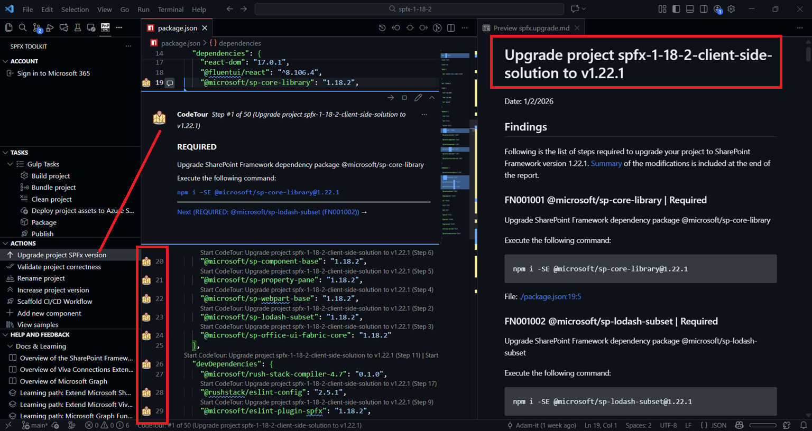
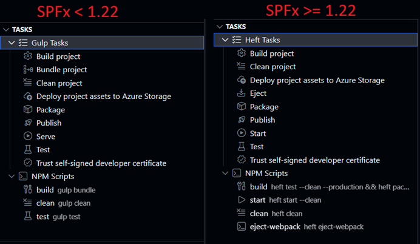
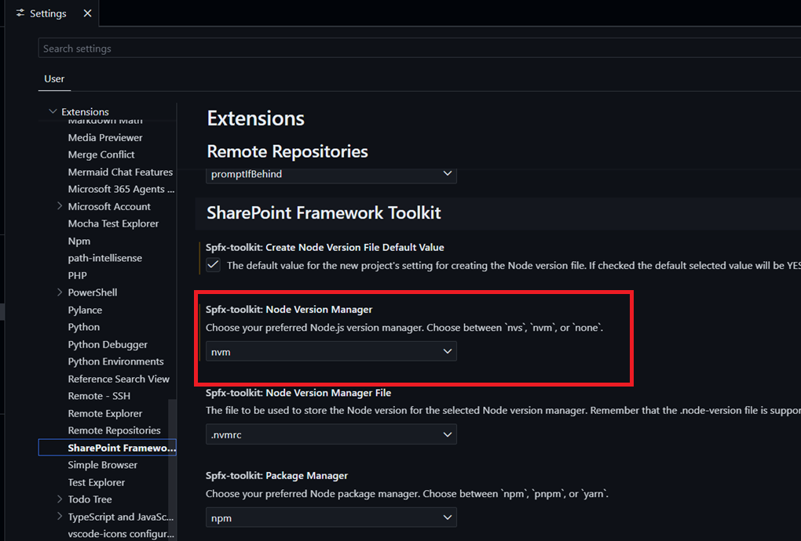
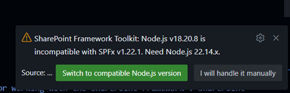
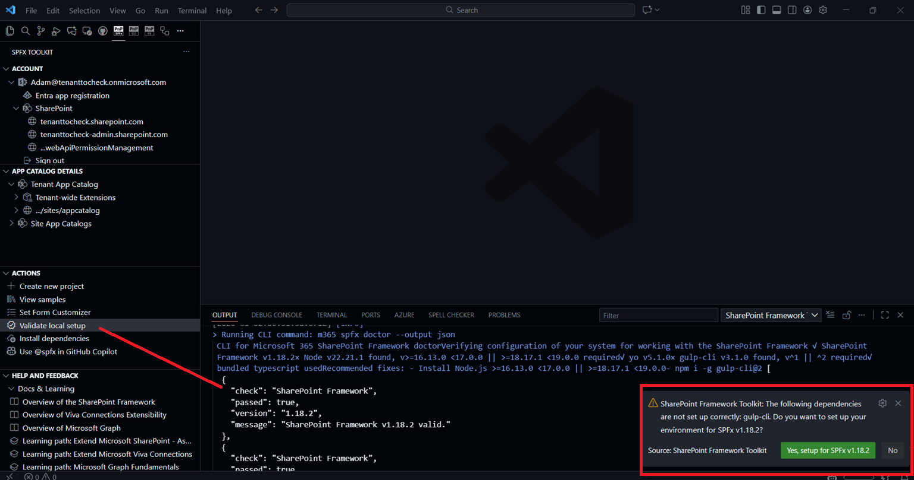
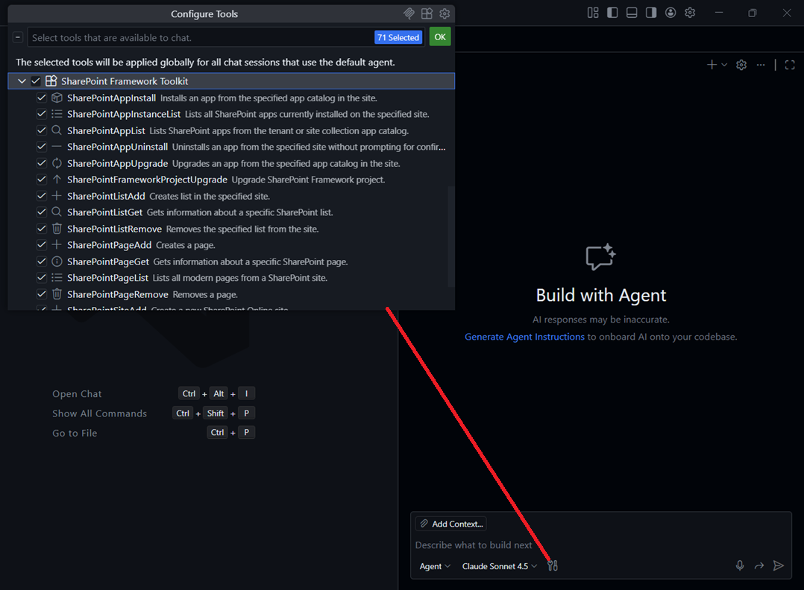

## 🗒️ Quick intro

[SharePoint Framework Toolkit](https://marketplace.visualstudio.com/items?itemName=m365pnp.viva-connections-toolkit) is a Visual Studio Code extension that aims to boost your productivity in developing and managing [SharePoint Framework solutions](https://learn.microsoft.com/sharepoint/dev/spfx/sharepoint-framework-overview?WT.mc_id=m365-15744-cxa) helping at every stage of your development flow, from setting up your development workspace to deploying a solution straight to your tenant without the need to leave VS Code, it even allows you to create a CI/CD pipeline to introduce automate deployment of your app and also comes along with AI capabilities which will allow you to manage your SharePoint Online tenant straight from GitHub Copilot chat extension.

Just check out the features list 👇 it's a looot 🤯.

Sounds cool 😎? Let's see some new enhancements we added in this minor release

## SharePoint Framework v1.22 support and integrated Heft Toolchain

One of the main reasons of this release is to introduce support for the latest SharePoint Framework version 1.22 which introduces Heft instead of Gulp as pluggable build system for developing SPFx solutions. This means SPFx Toolkit will now help you setup and validate your local environment for SPFx v1.22 development. 

It is capable of creating upgrade guidance from any SPFx version to SPFx v1.22 and v1.22.1, as well as validating your solutions correctness for SPFx v1.22 development.
The upgrade guidance support two modes in which you may either generate a markdown report of the steps you need to take to upgrade your solution, or the extenion may generate a code-tour for your project providing you step by step upgrade guidance directly in your code, or both.

Third option is allows you to use GitHub Copilot in agent mode to perform the upgrade for your and validate if it is working and perform additional fixups if needed.

As this release of SharePoint Framework primary addresss the refactor of build toolchain, SPFx Toolkit also got updated in order to now show Heft tasks, instead of Gulp, in the SPFx Toolkit Task View, in order to make the transition easier for developers.

## Rebuild Task View with Heft and NPM scripts support

With the introduction of Heft as the new build toolchain for SharePoint Framework, we decided to refactor the Task View of SPFx Toolkit to now support both Heft tasks and NPM scripts. 

From now on for older SharePoint Framework solutions, so before v1.22, you will see Gulp tasks as before, while for SPFx v1.22+ solutions you will see Heft tasks instead. 
Additionally, if your solution contains custom NPM scripts defined in the package.json file, those will be also shown in the Task View, regardless of the SPFx version used.

## First steps in supporting all SharePoint Framework versions

With this release, we are taking the first steps in supporting all SharePoint Framework versions in SPFx Toolkit. First things we managed to addrress is setting up and vlidating your local environment for any SPFx version. 

After clicking on the 'Install dependencies' action you will now get prompted to select the SPFx version you want to setup your environment for. Based on your selection, the extension will first validate your Node.js version and install all required dependencies for that specific SPFx version.

We also updated the way we handle Node.js validation. Previously, if the Node.js version was not valid for the selected SPFx version we, the extension would just stopped with a warning message. From now on, SPFx Toolkit supports NVM and NVS for setting up Node.js version automatically for you.

If you use one of those Node Version Managers you may set this in the SPFx Toolkit settings and then SPFx Toolkit will use the selected Node Version Manager to setup the correct Node.js version for you automatically for the specified SharePoint Framework version.

Validate local setup action was also updated to support all SPFx versions. After using this action, SPFx Toolkit will first check which version of Yeomand SPFx generator you have and then validate your local setup towards that specific version. If you SPFx Toolkit will not find any generator installed it will setup your environment for the currently latest version of SharePoint Framework.

## More AI capabilities to manage your SharePoint Online tenant

SPFx Toolkit is gaining more and more AI capabilities which it exposes as Language Model Tools that may be used in GitHub Copilot chat in agent mode. In this release we added the following tools:

- App instance list - Lists all SharePoint apps currently installed on the specified site
- App uninstall - Uninstalls an app from the specified site
- App upgrade - Upgrades an app from the specified app catalog in the site
- Page add - Creates a page on the specified site
- Page get - Gets information about a specific SharePoint page
- Page list - Lists all modern pages from a SharePoint site
- Page remove - Removes a page from a SharePoint site

## 👏 You ROCK 🤩

This release would not have been possible without the help of some really awesome folks who stepped in and joined our journey in creating the best-in-class SharePoint Framework tooling in the world. We would like to express our huge gratitude and shout out to:

- [Adam Wójcik](https://github.com/Adam-it)
- [Harshith Sai V](https://github.com/harshithsaiv)
- [Nico De Cleyre](https://github.com/nicodecleyre)
- [Nirav Raval](https://github.com/nirav-raval)
- [Saurabh Tripathi](https://github.com/Saurabh7019)

## 🗺️ Future roadmap

We don't plan to stop, we are already thinking of more awesome features we plan to deliver in upcoming releases. Top of our mind currently is:

- Adding support for all SPFx versions, including older versions as well
- More AI capabilities to help you manage your SharePoint Online tenant even better

. If you want to check what we are planning, check out our [issues from this milestone](https://github.com/pnp/vscode-viva/milestone/6). Feedback is appreciated 👍.

## 👍 Power of the community

This extension would not have been possible if it hadn’t been for the awesome work done by the [Microsoft 365 & Power Platform Community](https://pnp.github.io/). Each sample gallery: SPFx web parts & extensions, and ACE samples & scenarios, is populated with the contributions made by the community. Many of the functionalities of the extension, like upgrading, validating, and deploying your SPFx project, would not have been possible if it weren’t for the [CLI for Microsoft 365](https://pnp.github.io/cli-microsoft365/) tool. I would like to thank all of our awesome contributors sincerely! Creating this extension would not have been possible if it weren’t for the enormous work done by the community. You all rock 🤩.

If you would like to participate, the community welcomes everybody who wants to build and share feedback around Microsoft 365 & Power Platform. Join one of our [community calls](https://pnp.github.io/#community) to get started and be sure to visit 👉 https://aka.ms/community/home.

## 🙋 Wanna help out?

Of course, we are open to contributions. If you would like to participate, do not hesitate to visit our [GitHub repo](https://github.com/pnp/vscode-viva) and start a discussion or engage in one of the many issues we have. We have many issues that are just ready to be taken. Please follow our [contribution guidelines](https://github.com/pnp/vscode-viva/blob/main/contributing.md) before you start.
Feedback (positive or negative) is also more than welcome.

## 🔗 Resources

- [SPFx Toolkit Docs](https://aka.ms/spfx/toolkit)
- [Download SharePoint Framework Toolkit at VS Code Marketplace](https://marketplace.visualstudio.com/items?itemName=m365pnp.viva-connections-toolkit)
- [SPFx Toolkit GitHub repo](https://github.com/pnp/vscode-viva)
- [Microsoft 365 & Power Platform Community](https://pnp.github.io/#home)
- [Join the Microsoft 365 & Power Platform Community Discord Server](https://discord.gg/YtYrav2VGW)
- [Join the Microsoft 365 Developer Program](https://developer.microsoft.com/en-us/microsoft-365/dev-program)
