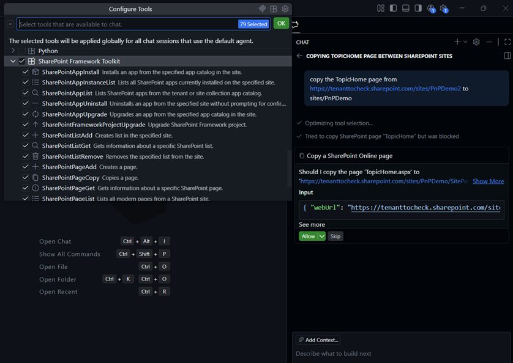

## 🗒️ Quick intro

[SharePoint Framework Toolkit](https://marketplace.visualstudio.com/items?itemName=m365pnp.viva-connections-toolkit) is a Visual Studio Code extension that aims to boost your productivity in developing and managing [SharePoint Framework solutions](https://learn.microsoft.com/sharepoint/dev/spfx/sharepoint-framework-overview?WT.mc_id=m365-15744-cxa) helping at every stage of your development flow, from setting up your development workspace to deploying a solution straight to your tenant without the need to leave VS Code, it even allows you to create a CI/CD pipeline to introduce automated deployment of your app and also comes along with AI capabilities which will allow you to manage your SharePoint Online tenant straight from GitHub Copilot chat extension.

Just check out the features list 👇 it's a looot 🤯.

Sounds cool 😎? Let's see some new enhancements we added in this minor release

## SharePoint Framework v1.22.2 support and integrated Heft Toolchain

In this release of SPFx Toolkit we've added support for the currently latest release of SharePoint Framework, which is v1.22.2, to actions that will allow you to validate and setup your local environment for SPFx development, and also to the project validate and upgrade action which will allow you to upgrade your SPFx projects to the any version of the framework, now including 1.22.2. 

The aim is to continue to add support for the latest SPFx releases as soon as they are released, so that SPFx Toolkit may be your go-to tool for managing your SPFx projects, no matter which version of the framework you are using.

To check out more about the related actions, read the following:
- [Validate and setup your local environment for SPFx development](https://pnp.github.io/vscode-viva/features/setup)
- [Upgrade your SPFx project](https://pnp.github.io/vscode-viva/features/actions/#upgrade-project)
- [Validate your SPFx project](https://pnp.github.io/vscode-viva/features/actions/#validate-current-project)

## More AI capabilities to manage your SharePoint Online tenant - Copy SharePoint Online page Language Model Tool

In this release, we have added a new Language Model tool to the SPFx Toolkit arsenal of AI capabilities, which allows you to copy SharePoint Online pages. You can use this tool to copy pages from one site to another, or even within the same site. The tool will copy the page structure, web parts, and content, making it easy for you to create new pages based on existing ones. 

Interested in more AI capabilities? Check out SPFx Toolkit [GitHub Copilot capabilities](https://pnp.github.io/vscode-viva/features/github-copilot-capabilities/) from our docs.

Check out one of SPFx Toolkit scenarios that showcase how to [manage SharePoint pages using SPFx Toolkit language model tools in GitHub Copilot Chat](https://pnp.github.io/vscode-viva/scenarios/manage-sp-pages-lm-tools/)

## 👏 You ROCK 🤩

This release would not have been possible without the help of some really awesome folks who stepped in and joined our journey in creating the best-in-class SharePoint Framework tooling in the world. We would like to express our huge gratitude and shout out to:

- [Adam Wójcik](https://github.com/Adam-it)
- [Nico De Cleyre](https://github.com/nicodecleyre)
- [Nirav Raval](https://github.com/nirav-raval)
- [Saurabh Tripathi](https://github.com/Saurabh7019)

## 🗺️ Future roadmap

We don't plan to stop, we are already thinking of more awesome features we plan to deliver in upcoming releases. Top of our mind currently is:

- Adoption for the upcoming SharePoint Framework 1.23 release
- Adding support for all SPFx versions, including older versions as well
- More AI capabilities to help you manage your SharePoint Online tenant even better

If you want to check what we are planning, check out our [issues](https://github.com/pnp/vscode-viva/issues). Feedback is appreciated 👍.

## 👍 Power of the community

This extension would not have been possible if it hadn’t been for the awesome work done by the [Microsoft 365 & Power Platform Community](https://pnp.github.io/). Each sample gallery: SPFx web parts & extensions, and ACE samples & scenarios, is populated with the contributions made by the community. Many of the functionalities of the extension, like upgrading, validating, and deploying your SPFx project, would not have been possible if it weren’t for the [CLI for Microsoft 365](https://pnp.github.io/cli-microsoft365/) tool. I would like to thank all of our awesome contributors sincerely! Creating this extension would not have been possible if it weren’t for the enormous work done by the community. You all rock 🤩.

If you would like to participate, the community welcomes everybody who wants to build and share feedback around Microsoft 365 & Power Platform. Join one of our [community calls](https://pnp.github.io/#community) to get started, and be sure to visit 👉 https://aka.ms/community/home.

## 🙋 Wanna help out?

Of course, we are open to contributions. If you would like to participate, do not hesitate to visit our [GitHub repo](https://github.com/pnp/vscode-viva) and start a discussion or engage in one of the many issues we have. We have many issues that are just ready to be taken. Please follow our [contribution guidelines](https://github.com/pnp/vscode-viva/blob/main/contributing.md) before you start.
Feedback (positive or negative) is also more than welcome.

## 🔗 Resources

- [SPFx Toolkit Docs](https://aka.ms/spfx/toolkit)
- [Download SharePoint Framework Toolkit at VS Code Marketplace](https://marketplace.visualstudio.com/items?itemName=m365pnp.viva-connections-toolkit)
- [SPFx Toolkit GitHub repo](https://github.com/pnp/vscode-viva)
- [SharePoint Framework v1.22.1 release notes](https://learn.microsoft.com/en-us/sharepoint/dev/spfx/release-1.22.2)
- [Microsoft 365 & Power Platform Community](https://pnp.github.io/#home)
- [Join the Microsoft 365 & Power Platform Community Discord Server](https://discord.gg/YtYrav2VGW)
- [Join the Microsoft 365 Developer Program](https://developer.microsoft.com/en-us/microsoft-365/dev-program)
