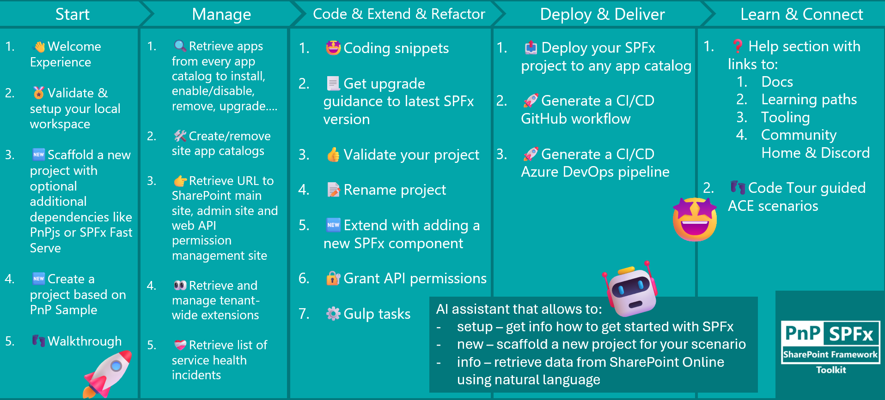
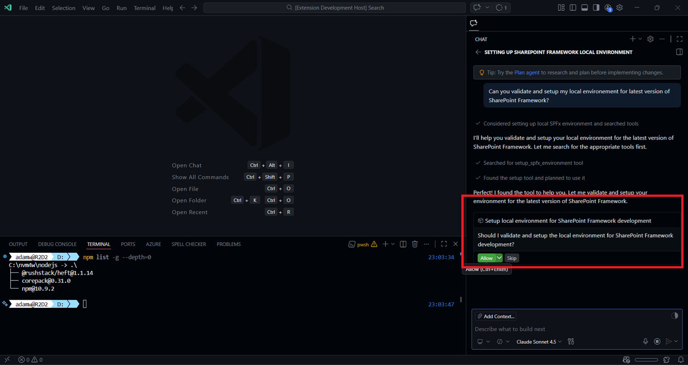
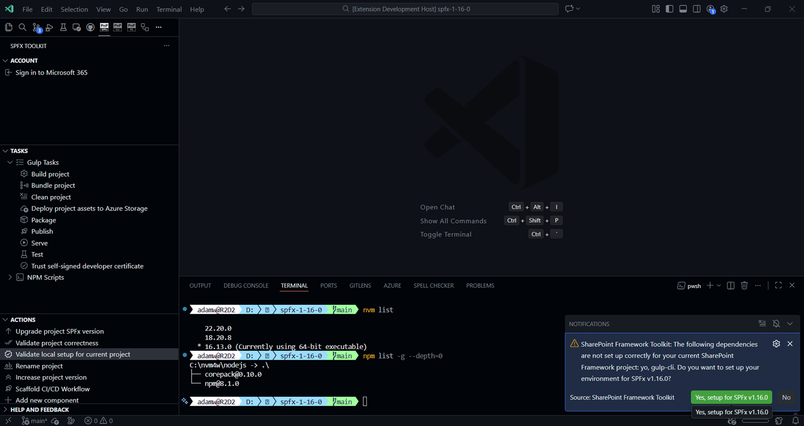

## 🗒️ Quick intro

[SharePoint Framework Toolkit](https://marketplace.visualstudio.com/items?itemName=m365pnp.viva-connections-toolkit) is a Visual Studio Code extension that aims to boost your productivity in developing and managing [SharePoint Framework solutions](https://learn.microsoft.com/sharepoint/dev/spfx/sharepoint-framework-overview?WT.mc_id=m365-15744-cxa) helping at every stage of your development flow, from setting up your development workspace to deploying a solution straight to your tenant without the need to leave VS Code, it even allows you to create a CI/CD pipeline to introduce automated deployment of your app and also comes along with AI capabilities which will allow you to manage your SharePoint Online tenant straight from GitHub Copilot chat extension.

Just check out the features list 👇 it's a looot 🤯.

Sounds cool 😎? Let's see some new enhancements we added in this minor release

## Improved token refresh handling

In this release, we've updated the way SPFx Toolkit handles token refresh, which extends the time the user is signed in to the SharePoint Online tenant. This means less interruptions and a smoother developer experience when working with your tenant resources directly from VS Code.

## New SPFx setup Language Model Tool

We've refactored the `/setup` chat command into a proper Language Model Tool called `SharePointFrameworkLocalEnvironmentSetup`. This tool can be used by GitHub Copilot in agent mode to validate and help you set up your local environment for any version of SharePoint Framework development. It will check your Node.js version and global npm packages, and if they don't fulfill the requirements for the specified SPFx version, it will guide you through the necessary steps to get your environment ready.

Interested in more AI capabilities? Check out SPFx Toolkit [GitHub Copilot capabilities](https://pnp.github.io/vscode-viva/features/github-copilot-capabilities/) from our docs.

## Validate local setup for current project action

We've added a new action that allows you to validate the local setup for the currently open SPFx project, ensuring all necessary global dependencies are in place. This action will determine the SharePoint Framework version used in your project and validate your local environment against that specific version. If any dependencies are missing or incompatible, the extension will prompt you to set up your environment automatically.

To check out more about the action, read the [docs](https://pnp.github.io/vscode-viva/features/actions/#validate-local-setup-for-current-project).

## Scaffolding form update

We've updated the scaffolding form to communicate that it currently supports only the latest version of SharePoint Framework. If you need to create a project with an older version, you can use the SharePoint Yeoman generator directly in the terminal. Additionally, the SPFx Fast Serve option has been removed from the scaffolding form.

## 👏 You ROCK 🤩

This release would not have been possible without the help of some really awesome folks who stepped in and joined our journey in creating the best-in-class SharePoint Framework tooling in the world. We would like to express our huge gratitude and shout out to:

- [Adam Wójcik](https://github.com/Adam-it)
- [Nico De Cleyre](https://github.com/nicodecleyre)
- [Nirav Raval](https://github.com/nirav-raval)
- [Saurabh Tripathi](https://github.com/Saurabh7019)

## 🗺️ Future roadmap

We don't plan to stop, we are already thinking of more awesome features we plan to deliver in upcoming releases. Top of our mind currently is:

- Adoption for the upcoming SharePoint Framework 1.23 release
- Adding support for all SPFx versions, including older versions as well
- More AI capabilities to help you manage your SharePoint Online tenant even better

If you want to check what we are planning, check out our [issues](https://github.com/pnp/vscode-viva/issues). Feedback is appreciated 👍.

## 👍 Power of the community

This extension would not have been possible if it hadn’t been for the awesome work done by the [Microsoft 365 & Power Platform Community](https://pnp.github.io/). Each sample gallery: SPFx web parts & extensions, and ACE samples & scenarios, is populated with the contributions made by the community. Many of the functionalities of the extension, like upgrading, validating, and deploying your SPFx project, would not have been possible if it weren’t for the [CLI for Microsoft 365](https://pnp.github.io/cli-microsoft365/) tool. I would like to thank all of our awesome contributors sincerely! Creating this extension would not have been possible if it weren’t for the enormous work done by the community. You all rock 🤩.

If you would like to participate, the community welcomes everybody who wants to build and share feedback around Microsoft 365 & Power Platform. Join one of our [community calls](https://pnp.github.io/#community) to get started, and be sure to visit 👉 https://aka.ms/community/home.

## 🙋 Wanna help out?

Of course, we are open to contributions. If you would like to participate, do not hesitate to visit our [GitHub repo](https://github.com/pnp/vscode-viva) and start a discussion or engage in one of the many issues we have. We have many issues that are just ready to be taken. Please follow our [contribution guidelines](https://github.com/pnp/vscode-viva/blob/main/contributing.md) before you start.
Feedback (positive or negative) is also more than welcome.

## 🔗 Resources

- [SPFx Toolkit Docs](https://aka.ms/spfx/toolkit)
- [Download SharePoint Framework Toolkit at VS Code Marketplace](https://marketplace.visualstudio.com/items?itemName=m365pnp.viva-connections-toolkit)
- [SPFx Toolkit GitHub repo](https://github.com/pnp/vscode-viva)
- [Microsoft 365 & Power Platform Community](https://pnp.github.io/#home)
- [Join the Microsoft 365 & Power Platform Community Discord Server](https://discord.gg/YtYrav2VGW)
- [Join the Microsoft 365 Developer Program](https://developer.microsoft.com/en-us/microsoft-365/dev-program)
