## 🗒️ Quick intro

[SharePoint Framework Toolkit](https://marketplace.visualstudio.com/items?itemName=m365pnp.viva-connections-toolkit) is a Visual Studio Code extension that aims to boost your productivity in developing and managing [SharePoint Framework solutions](https://learn.microsoft.com/sharepoint/dev/spfx/sharepoint-framework-overview?WT.mc_id=m365-15744-cxa) helping at every stage of your development flow, from setting up your development workspace to deploying a solution straight to your tenant without the need to leave VS Code, it even allows you to create a CI/CD pipeline to introduce automate deployment of your app 🚀 and now comes along with a dedicated @spfx Copilot Chat participant which is your AI assistant grounded for SharePoint Framework development.

Just check out the features list 👇 it's a looot 🤯.

Sounds cool 😎? Let's see some new enhancements we added in this major release

## Fine-tuned SPFx GitHub Copilot chat participant

In the era of LLMs it's not something strange to use Copilot as you AI coding buddy. The problem with Copilot is that it just cannot be specialist in everything right? That is why we developed and SPFx Toolkit chat participant which you may use together with standard Copilot in the same chat experiance. Using SPFx toolkit as you Copilot when coding SharePoint Framework solutions gives you a head start because it is already grounded and tailored towards SPFx development. That means less context passing and shorter and quicker and more accurate prompts. 

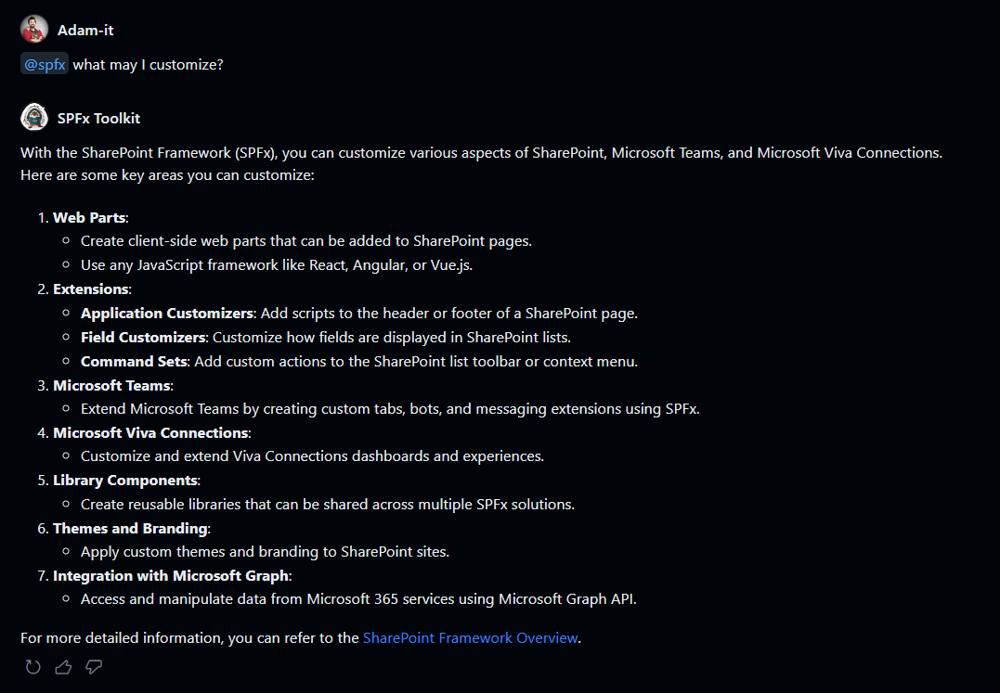

But it's not only about grounding. SPFx Toolkit Copilot chat participant gives you unique commands which are preconfigured towards a specific scenario:

- /setup - that is dedicated to providing information on how to setup your local workspace for SharePoint Framework development
- /new - that may be used to get guidance on how to create a new solution or find and reuse an existing sample from the PnP SPFx sample gallery
- /code - that is fine-tuned to provide help in coding your SharePoint Framework project and provides additional boosters like validating the correctness of your SPFx project, scaffolding a CI/CD workflow, or renaming your project, and many more.

And if you just thought that was all it also gives you actions which show up directly in chat 😍.

In this release we refactores and shifted the `/setup` and the `/new` commands and we also updated the default LLM model that is used under the hood to `gpt-4o`.

The repolished `/setup` command now gives you a totally new experiance allowing you to start your journey with SharePoint Framework development. It will give you very accurate answers how to get started with SPFx development and how to prep your local workspace to be ready to go 🚀

Check out the below examples:

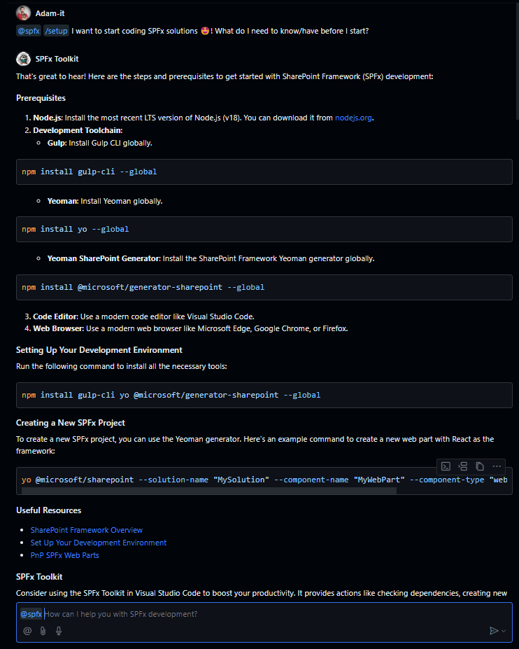

When asked about validating if your local workspace is ready to start coding, so basically asking if you have everything properly installed, you will get an action which will run the SPFx Toolkit validata action that scans your local workspace and checks if you have all required dependecies properly set and if not it will install them for you 😮.

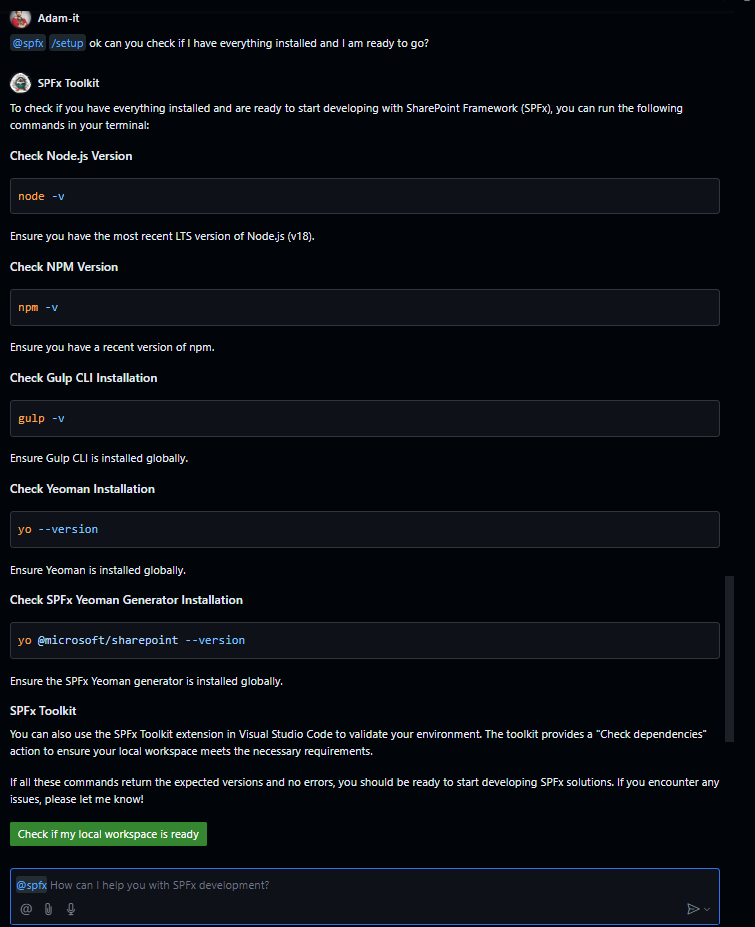

The refactored `/new` command gives you a totally new way to create a new project. You may start without any knowladge explaining to SPFx Copilot what would you like to customize and it will find and suggest the best project type for your case. It will ask additional questions to get all the needed details for the SPFx generator command and when it will have everything that is needed it will present this command directly in the chat giving you an action that will execute this command, therefore create a new project and it will reopen VS Code in this newly scaffolded solution and run `npm install`

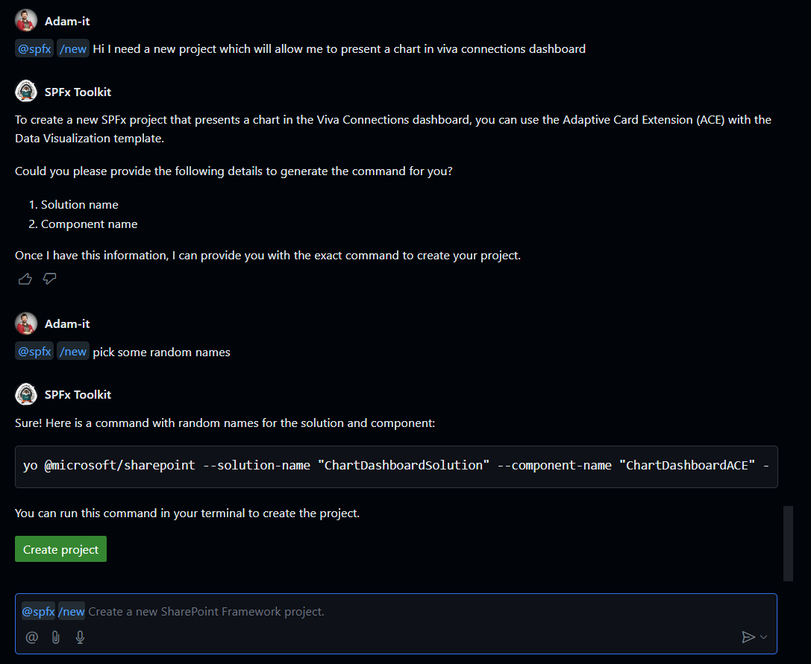

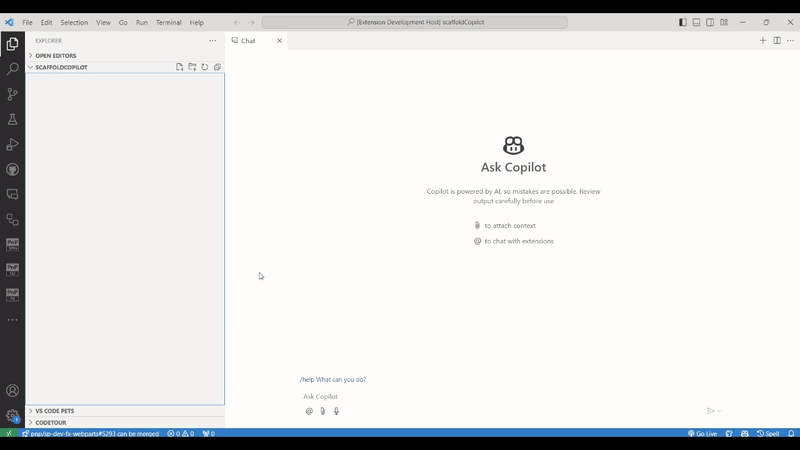

You may also be very accurate what you want and SPFx will understand your needs and will setup the correct SPFx generator command for your prompt. BTW you may also ask it about a sample for your case and SPFx Copilot chat participant will give you an action to open up the sample gallery 🤯

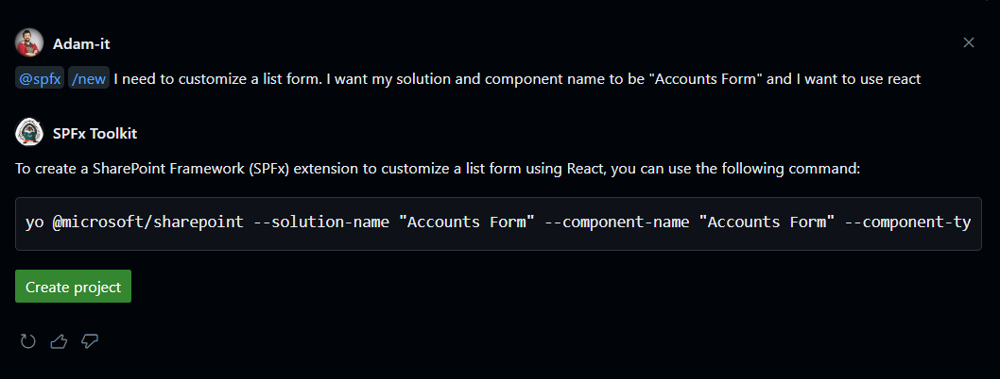

This is just a start and we are already looking ahead how we may upgrade the `/code` chat command to give better coding suggestions for your prompts and also we are exploring additional features that (we hope) will bring you a totally new way to get more information about your tenant 🤩.

## More management capabilities 

Staing in flow of your work is extremly important and context switching is just an waste of time. That is why in this release we extended the management capabiltieis of this extension. Now after successfull signing in to your tenant you will not only see all app catalogs you have on your tenant but also all solutions deployed to every app catalog providing you quick links to redirect to them. But wait there is more! We also give you actions for each SPFx app to `deploy`, `retract`, `enable`, `disable` and even `remove` a soltion directly from VS Code 🤯

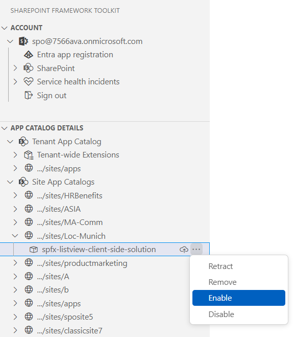

We are already looking forward and brainstorming on additional actions and features in this area which will extend and give you new ways to manage your SPFx solutions on your Microsoft 365 tenant without leaving VS Code and without redirecting to each app catalog 😍.

## Scaffold your SPFx project along with NVM or NVS config files

Let's be honest the default SPFx generator is not enough. After your create a new project you spend additional time to install additional dependecies to your solution not to mention additional configuration which may waste a lot of time especcially if you are doing it for the very first time. That is why SPFx Toolkit Scaffolding for has the additional dependecies section where you may quickly select the optional packages and settings you want to be added to your newly scaffolded project.

In this release we added a new option which will alow you to create a Node version manager configuration file for your project. 

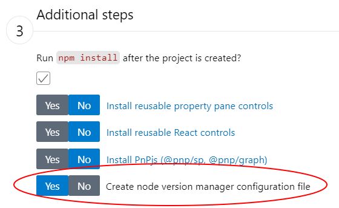

SPFx Toolkit supports NVM and NVS so we given you new settings which allow you to define which Node version configuration file you want to be created. It may be either `.nvmrc` for nvm and nvs but also for nvs it is possible to create `.node-version` config file. You may define that using the new extension setting.

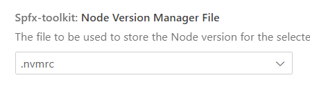

And you may even set it to be created always by default.

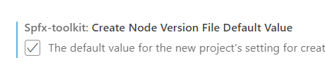

## Cards on the table 🃏 - how does it work

It is no secret that SPFx toolkit in some functionalities uses the power of [CLI for Microsoft 365](https://pnp.github.io/cli-microsoft365/). In fact we totally understand the fact that for some the terminal may be enough support for developing SPFx solution and additional UI or chat layer is not required. That is why in this release we corrected all of our CLI action logs to present the full command along with all the options passed directly in the output view for this extension

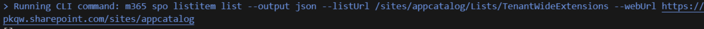

So if the terminal is your thing it is now extremly easy to transfer between SPFx Toolkit and CLI for Microsoft 365 to get similar results when needed.

## 👏 You ROCK 🤩

This release would not have been possible without the help of some really awesome folks who stepped in and joined our journey in creating the best-in-class SharePoint Framework tooling in the world. We would like to express our huge gratitude and shout out to:

- [Guido Zambarda](https://github.com/GuidoZam)
- [Luccas Castro](https://github.com/DevPio)
- [Saurabh Tripathi](https://github.com/Saurabh7019)

## 🗺️ Future roadmap

We don't plan to stop, we are already thinking of more awesome features we plan to deliver with v5 release. If you want to check what we are planning check out our [issues from this milestone](https://github.com/pnp/vscode-viva/milestone/6). Feedback is appreciated 👍.

## 👍 Power of the community

This extension would not have been possible if it weren’t for the awesome work done by the [Microsoft 365 & Power Platform Community](https://pnp.github.io/). Each sample gallery: SPFx web parts & extensions, and ACE samples & scenarios are all populated with the contributions done by the community. Many of the functionalities of the extension like upgrading, validating, and deploying your SPFx project, would not have been possible if it wasn’t for the [CLI for Microsoft 365](https://pnp.github.io/cli-microsoft365/) tool. I would like to sincerely thank all of our awesome contributors! Creating this extension would not have been possible if it weren’t for the enormous work done by the community. You all rock 🤩.

If you would like to participate, the community welcomes everybody who wants to build and share feedback around Microsoft 365 & Power Platform. Join one of our [community calls](https://pnp.github.io/#community) to get started and be sure to visit 👉 https://aka.ms/community/home.

## 🙋 Wanna help out?

Of course, we are open to contributions. If you would like to participate do not hesitate to visit our [GitHub repo](https://github.com/pnp/vscode-viva) and start a discussion or engage in one of the many issues we have. We have many issues that are just ready to be taken. Please follow our [contribution guidelines](https://github.com/pnp/vscode-viva/blob/main/contributing.md) before you start.
Feedback (positive or negative) is also more than welcome.

## 🔗 Resources

- [Download SharePoint Framework Toolkit at VS Code Marketplace](https://marketplace.visualstudio.com/items?itemName=m365pnp.viva-connections-toolkit)
- [SPFx Toolkit GitHub repo](https://github.com/pnp/vscode-viva)
- [Microsoft 365 & Power Platform Community](https://pnp.github.io/#home)
- [Join the Microsoft 365 & Power Platform Community Discord Server]( https://aka.ms/community/discord)
- [Wiki]( https://github.com/pnp/vscode-viva/wiki)
- [Join the Microsoft 365 Developer Program]( https://developer.microsoft.com/en-us/microsoft-365/dev-program)
- [CLI for Microsoft 365](https://pnp.github.io/cli-microsoft365/)
- [Sample Solution Gallery]( https://adoption.microsoft.com/en-us/sample-solution-gallery/)
