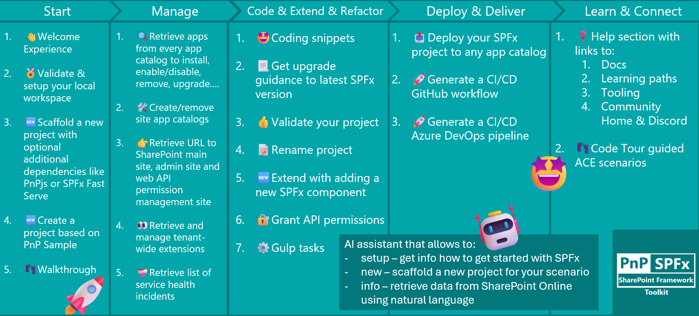

## 🗒️ Quick intro

[SharePoint Framework Toolkit](https://marketplace.visualstudio.com/items?itemName=m365pnp.viva-connections-toolkit) is a Visual Studio Code extension that aims to boost your productivity in developing and managing [SharePoint Framework solutions](https://learn.microsoft.com/sharepoint/dev/spfx/sharepoint-framework-overview?WT.mc_id=m365-15744-cxa) helping at every stage of your development flow, from setting up your development workspace to deploying a solution straight to your tenant without the need to leave VS Code, it even allows you to create a CI/CD pipeline to introduce automated deployment of your app and also comes along with AI capabilities which will allow you to manage your SharePoint Online tenant straight from GitHub Copilot chat extension.

Just check out the features list 👇 it's a looot 🤯.

Sounds cool 😎? Let's see some new enhancements we added in this minor release

## Added support for SPFx 1.23.2

The main highlight of this release is the support for SharePoint Framework 1.23.2. We've updated the compatibility matrix and bumped the underlying CLI for Microsoft 365 dependency so that SPFx Toolkit is fully aware of the newest SharePoint Framework version.

In practice, this means the [validate and upgrade actions](https://pnp.github.io/vscode-viva/features/actions/) now recognize SPFx 1.23.2 projects, so you may generate an accurate upgrade report from any older SPFx version to 1.23.2 and validate the structure and dependencies of your project without leaving VS Code.

On top of that, the [local environment setup](https://pnp.github.io/vscode-viva/features/setup/), the validate local setup actions and the SPFx status bar indicator all know exactly which Node.js version and which global npm packages are required to develop with SPFx 1.23.2. If your machine doesn't match those requirements, the extension will walk you through getting it ready.

## Updated link to SPFx Local Workbench

A small but very welcome fix contributed by the community. The link to the SPFx Local Workbench that SPFx Toolkit was using stopped working, which was a bit annoying when you just wanted to quickly jump into the workbench and test your web part. The link is now updated and pointing to the correct location, so the local workbench experience works as expected again.

## Reduced vulnerabilities

Security is one of our top priorities, and in this release, we continued that investment by updating the extension dependencies to reduce the number of reported vulnerabilities. It's not the most spectacular item on the changelog, but it's an important one - we want you to have full confidence in the tooling you use daily so that you may focus on coding and not on your dependency tree.

## 👏 You ROCK 🤩

This release would not have been possible without the help of some really awesome folks who stepped in and joined our journey in creating the best-in-class SharePoint Framework tooling in the world. We would like to express our huge gratitude and shout out to:

- [Nirav Raval](https://github.com/nirav-raval)
- [Adam Wójcik](https://github.com/Adam-it)

## 🗺️ Future roadmap

We don't plan to stop, we are already thinking of more awesome features we plan to deliver in upcoming releases. Top of our mind currently is:

- Security - we are currently investing many different activities to make SPFx Toolkit even more secure to give you the confidence you need to focus on coding and not on vulnerabilities
- Adding support for all SPFx versions, including older versions as well
- More AI capabilities to help you manage your SharePoint Online tenant even better

If you want to check what we are planning, check out our [issues](https://github.com/pnp/vscode-viva/issues). Feedback is appreciated 👍.

## 👍 Power of the community

This extension would not have been possible if it hadn’t been for the awesome work done by the [Microsoft 365 & Power Platform Community](https://pnp.github.io/). Each sample gallery: SPFx web parts & extensions, and ACE samples & scenarios, is populated with the contributions made by the community. Many of the functionalities of the extension, like upgrading, validating, and deploying your SPFx project, would not have been possible if it weren’t for the [CLI for Microsoft 365](https://pnp.github.io/cli-microsoft365/) tool. I would like to thank all of our awesome contributors sincerely! Creating this extension would not have been possible if it weren’t for the enormous work done by the community. You all rock 🤩.

If you would like to participate, the community welcomes everybody who wants to build and share feedback around Microsoft 365 & Power Platform. Join one of our [community calls](https://pnp.github.io/#community) to get started, and be sure to visit 👉 https://aka.ms/community/home.

## 🙋 Wanna help out?

Of course, we are open to contributions. If you would like to participate, do not hesitate to visit our [GitHub repo](https://github.com/pnp/vscode-viva) and start a discussion or engage in one of the many issues we have. We have many issues that are just ready to be taken. Please follow our [contribution guidelines](https://github.com/pnp/vscode-viva/blob/main/contributing.md) before you start.
Feedback (positive or negative) is also more than welcome.

## 🔗 Resources

- [SPFx Toolkit Docs](https://aka.ms/spfx/toolkit)
- [Download SharePoint Framework Toolkit at VS Code Marketplace](https://marketplace.visualstudio.com/items?itemName=m365pnp.viva-connections-toolkit)
- [Download SharePoint Framework Toolkit at Open VSX Registry](https://open-vsx.org/extension/m365pnp/viva-connections-toolkit)
- [SPFx Toolkit GitHub repo](https://github.com/pnp/vscode-viva)
- [Microsoft 365 & Power Platform Community](https://pnp.github.io/#home)
- [Join the Microsoft 365 & Power Platform Community Discord Server](https://discord.gg/YtYrav2VGW)
- [Join the Microsoft 365 Developer Program](https://developer.microsoft.com/en-us/microsoft-365/dev-program)
