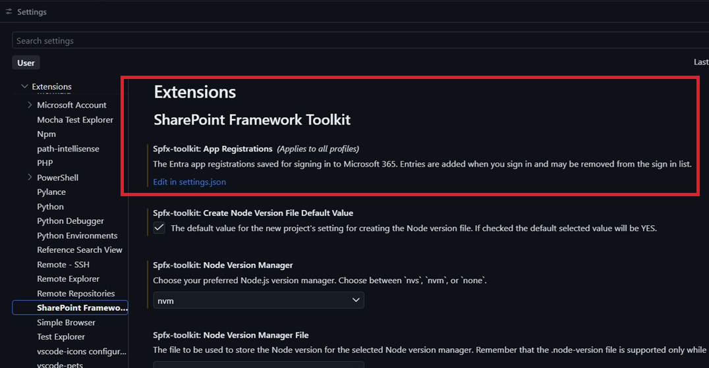
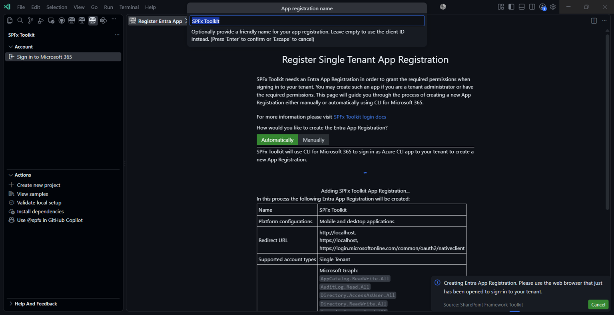
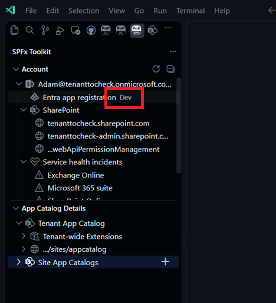
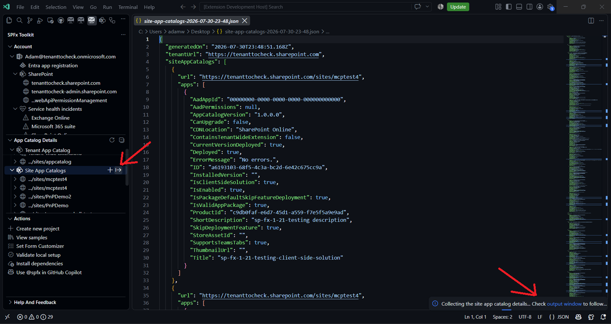
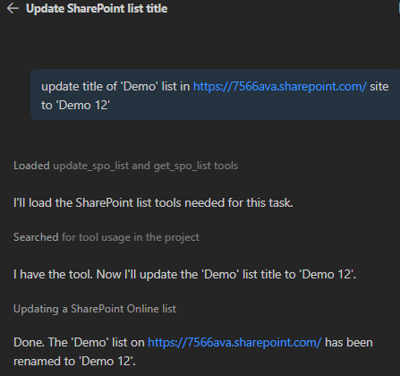

## 🗒️ Quick intro

[SharePoint Framework Toolkit](https://marketplace.visualstudio.com/items?itemName=m365pnp.viva-connections-toolkit) is a Visual Studio Code extension that aims to boost your productivity in developing and managing [SharePoint Framework solutions](https://learn.microsoft.com/sharepoint/dev/spfx/sharepoint-framework-overview?WT.mc_id=m365-15744-cxa) helping at every stage of your development flow, from setting up your development workspace to deploying a solution straight to your tenant without the need to leave VS Code, it even allows you to create a CI/CD pipeline to introduce automated deployment of your app and also comes along with AI capabilities which will allow you to manage your SharePoint Online tenant straight from GitHub Copilot chat extension.

Sounds cool 😎? Let's see some new enhancements we added in this minor release

## Sign in with multiple app registrations

This one is a long-awaited feature 🥳. Many of you work with more than one Microsoft 365 tenant, be it a customer tenant, a dev tenant or a test tenant, and until now, switching between them meant re-providing the app registration details each time. Not anymore.

SPFx Toolkit now allows you to save multiple app registrations in the extension settings, each with a friendly name. 

When creating a new app registration you may provide a friendly name for it, and when signing in, you simply pick the app registration you want to use from the list of saved ones. 

The name of the app registration you are currently signed in with is also visible in the view, so you always know which tenant you are working with. 

If you no longer need one of the saved app registrations, you may just as easily remove it.

Already have an app registration set up? No worries, we added a migration flow that will move your existing app registration to the new setting, so you don't need to configure anything from scratch.

## CI/CD workflow support for multiple SPFx versions

Generating a GitHub Actions workflow or Azure DevOps pipeline for your SPFx project is one of the features that saves you quite some time. With SPFx 1.22 moving from gulp to heft, the generated workflows did not keep up and still used gulp for newer projects.

In this release, we updated the CLI for Microsoft 365 dependency to the latest version, which aligns all the CI/CD command fixes. Now the [CI/CD action](https://pnp.github.io/vscode-viva/features/actions/) generates a workflow or pipeline that matches the SPFx version of your project, using heft (`npm run build`) for newer versions of SPFx and gulp for older ones.

## Export site level app catalogs with apps

Ever needed a quick overview of all site level app catalogs in your tenant and the apps deployed to them? We added a new export button to the site level app catalogs node in the tenant view. With a single click, you may export all site level app catalogs together with their apps to a JSON report, which you may later use for auditing, documentation or any further processing.

## New AI capabilities to manage SharePoint lists

We continue to extend the Language Model Tools that allow you to manage your SharePoint Online tenant straight from GitHub Copilot chat. In this release, we added two new tools:

- `list_spo_list` - retrieves the lists and libraries available on a specific site
- `update_spo_list` - updates the properties of a list or library on a specific site. It supports the same properties that are available in the `add_spo_list` tool
 

Together with the already existing tools, this means you may now create, list, update and remove lists simply by chatting with GitHub Copilot 🤖.

## Other improvements

On top of the above, this release also brings a few smaller but valuable changes:

- **Updated sign in confirmation page** - the page you see after successfully signing in got a refresh
- **Removed yarn package manager** - we streamlined the supported package managers and removed yarn
- **Added telemetry** - helps us understand which features are used the most, so that we may focus our efforts where they matter. You may learn more in our [docs](https://spfxtoolkit.community.ms/about/telemetry/)
- **Critical bug fix** - v4.22.0 resolves a critical bug found right after the v4.21.0 release

## 👏 You ROCK 🤩

This release would not have been possible without the help of some really awesome folks who stepped in and joined our journey in creating the best-in-class SharePoint Framework tooling in the world. We would like to express our huge gratitude and shout out to:

- [Saurabh Tripathi](https://github.com/Saurabh7019)
- [Nico De Cleyre](https://github.com/nicodecleyre)
- [Adam Wójcik](https://github.com/Adam-it)

## 🗺️ Future roadmap

We don't plan to stop, we are already thinking of more awesome features we plan to deliver in upcoming releases. Top of our mind currently is:

- Add support for SPFx 1.24
- More AI capabilities to help you manage your SharePoint Online tenant even better

If you want to check what we are planning, check out our [issues](https://github.com/pnp/vscode-viva/issues). Feedback is appreciated 👍.

## 👍 Power of the community

This extension would not have been possible if it hadn’t been for the awesome work done by the [Microsoft 365 & Power Platform Community](https://pnp.github.io/). Each sample gallery: SPFx web parts & extensions, and ACE samples & scenarios, is populated with the contributions made by the community. Many of the functionalities of the extension, like upgrading, validating, and deploying your SPFx project, would not have been possible if it weren’t for the [CLI for Microsoft 365](https://pnp.github.io/cli-microsoft365/) tool. I would like to thank all of our awesome contributors sincerely! Creating this extension would not have been possible if it weren’t for the enormous work done by the community. You all rock 🤩.

If you would like to participate, the community welcomes everybody who wants to build and share feedback around Microsoft 365 & Power Platform. Join one of our [community calls](https://pnp.github.io/#community) to get started, and be sure to visit 👉 https://aka.ms/community/home.

## 🙋 Wanna help out?

Of course, we are open to contributions. If you would like to participate, do not hesitate to visit our [GitHub repo](https://github.com/pnp/vscode-viva) and start a discussion or engage in one of the many issues we have. We have many issues that are just ready to be taken. Please follow our [contribution guidelines](https://github.com/pnp/vscode-viva/blob/main/contributing.md) before you start.
Feedback (positive or negative) is also more than welcome.

## 🔗 Resources

- [SPFx Toolkit Docs](https://aka.ms/spfx/toolkit)
- [Download SharePoint Framework Toolkit at VS Code Marketplace](https://marketplace.visualstudio.com/items?itemName=m365pnp.viva-connections-toolkit)
- [Download SharePoint Framework Toolkit at Open VSX Registry](https://open-vsx.org/extension/m365pnp/viva-connections-toolkit)
- [SPFx Toolkit GitHub repo](https://github.com/pnp/vscode-viva)
- [Microsoft 365 & Power Platform Community](https://pnp.github.io/#home)
- [Join the Microsoft 365 & Power Platform Community Discord Server](https://discord.gg/YtYrav2VGW)
- [Join the Microsoft 365 Developer Program](https://developer.microsoft.com/en-us/microsoft-365/dev-program)
