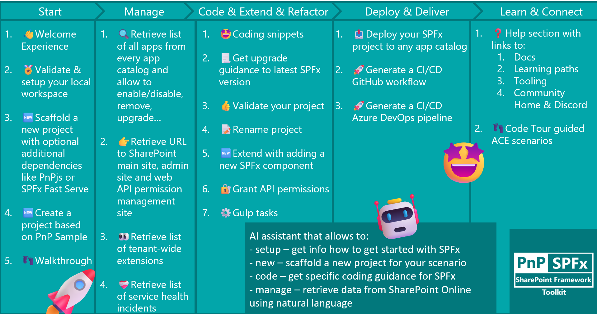
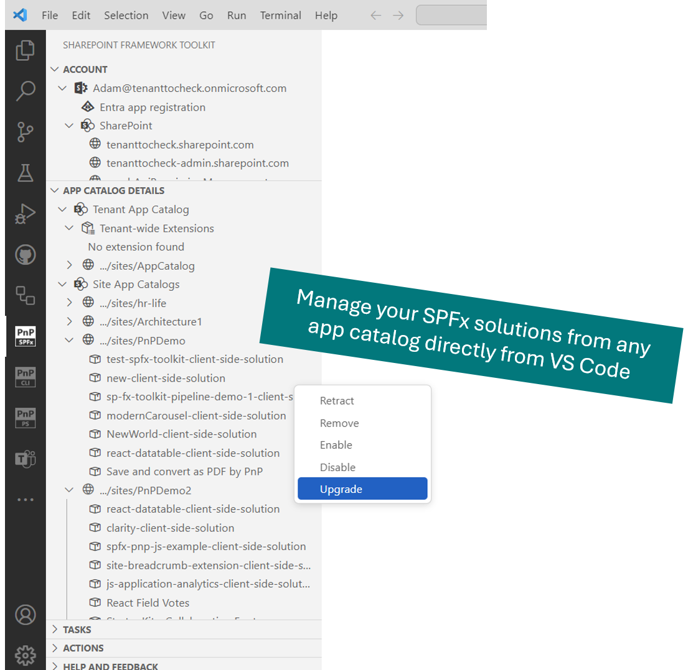
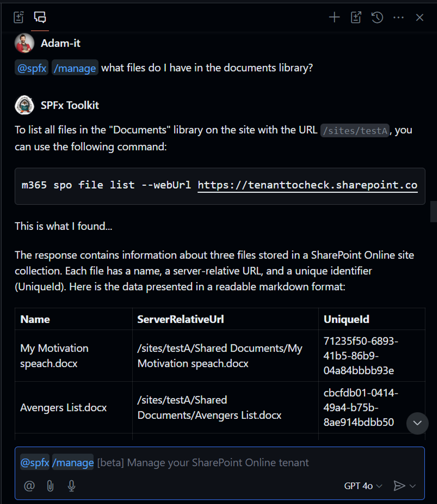
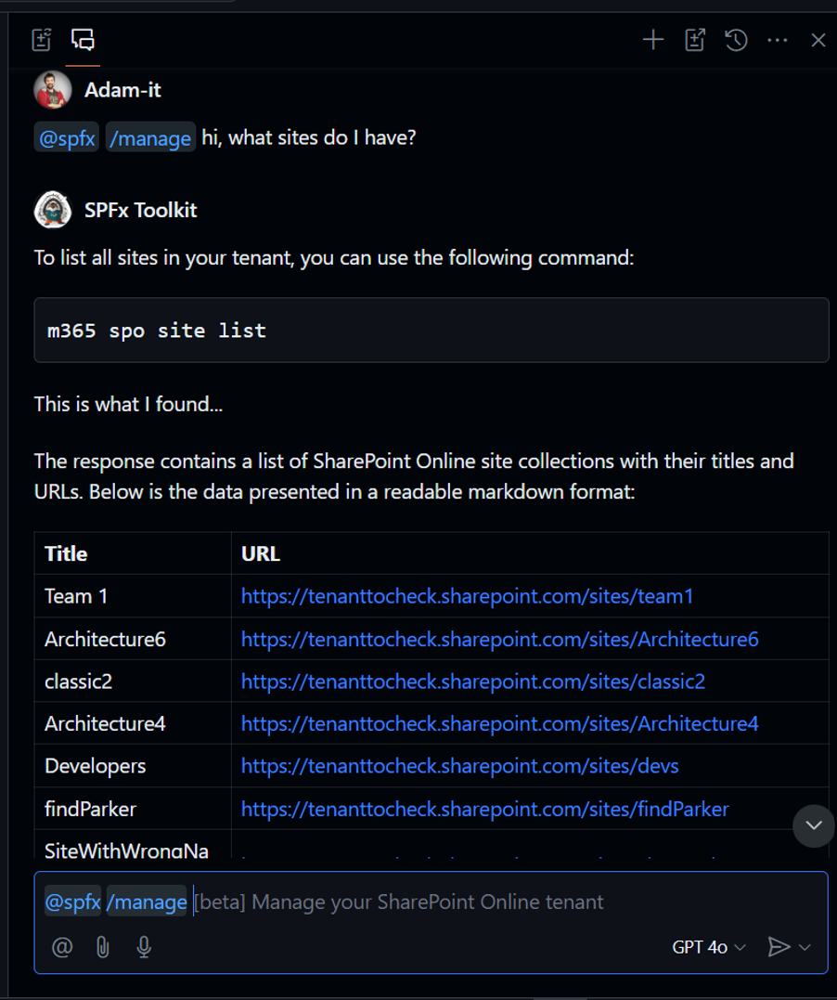
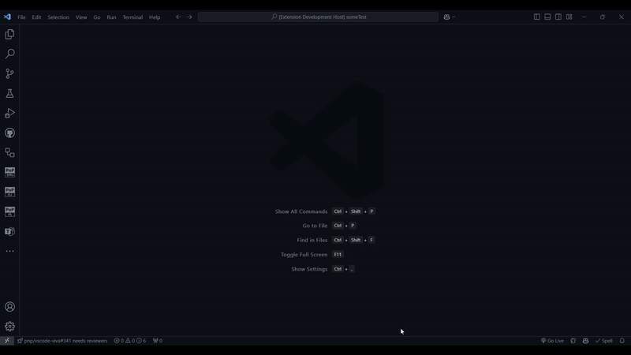
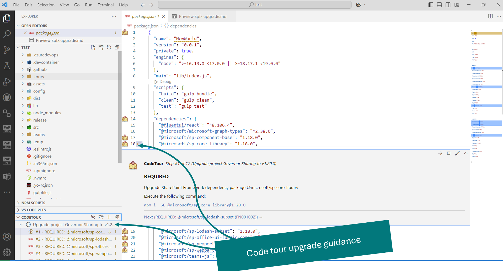
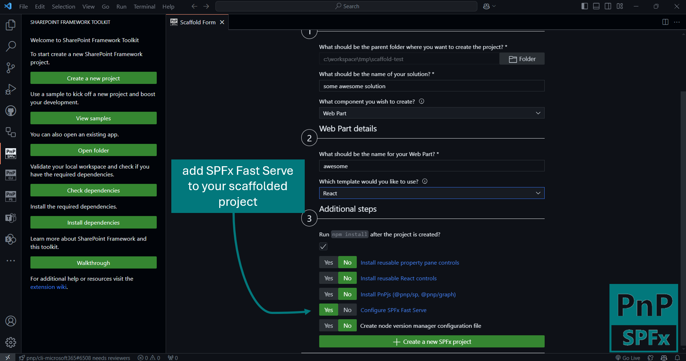

## 🗒️ Quick intro

[SharePoint Framework Toolkit](https://marketplace.visualstudio.com/items?itemName=m365pnp.viva-connections-toolkit) is a Visual Studio Code extension that aims to boost your productivity in developing and managing [SharePoint Framework solutions](https://learn.microsoft.com/sharepoint/dev/spfx/sharepoint-framework-overview?WT.mc_id=m365-15744-cxa) helping at every stage of your development flow, from setting up your development workspace to deploying a solution straight to your tenant without the need to leave VS Code, it even allows you to create a CI/CD pipeline to introduce automate deployment of your app and also comes along with a dedicated @spfx Copilot Chat participant who is your AI assistant grounded for SharePoint Framework development and now even has a new `/manage` chat command that will allow you to retrieve data from you SharePoint Online tenant using natural language.

Just check out the features list 👇 it's a looot 🤯.

Sounds cool 😎? Let's see some new enhancements we added in this minor release

## Even more management capabilities in the SPFx apps list view

One of SPFx Toolkit's main features is that it allows you to retrieve information about your tenant and manage your apps and app catalogs. In this minor release, we improved this area as well!

We added a brand new `Upgrade` action that will allow you to upgrade the selected SPFx app to the latest version on the Site. When this action is selected on an app from the tenant-level app catalog, SPFx Toolkit will prompt you to provide the relative Site URL in which you want to upgrade the app.

We also updated the remove action which will now prompt you for confirmation before removing the app from the app catalog.

We don't plan to stop here. We are already exploring even more manage capabilities which will allow you to get even more control over your apps and app catalogs on your tenant!

## `/manage` your SharePoint Online tenant using GitHub Copilot Chat within VS Code

In this release, we extended the SPFx Toolkit GitHub Copilot Chat Participant with a brand new `/manage` command which will allow you to retrieve information from your SharePoint Online tenant using natural language 🤯. 

This Command will only work if you are signed in to your tenant. Under the hood, it uses CLI for Microsoft 365 commands that provide 100+ commands that will allow you to either `list` or `get` different resources or information from SharePoint Online. SPFx Toolkit now understands those commands and knows how to use them. You may ask different questions about your SPO data and SPFx Toolkit will find the best CLI for Microsoft 365 command for your case, it will prefill the required options based on your tenant or will ask for missing information and will under the hood execute the command and then it will present and explain the response of the command all in a human understandable way

With this kind of capability, you may quickly check or retrieve information from your SharePoint Online tenant that might be helpful for your current development like:

- check if some list or specific list item exists
- lookup permissions set on a site or a file or something else
- check columns added to a specific content type and generate an interface based on the response using the `/code` chat command
- and many more...

Check it out in action 👇

We are only starting. In the near future, we are already thinking about how to extend this chat command to support also retrieving information from Teams and OneDrive and soon also allow you to perform create/update/remove operation types.

## Code tour for Upgrade and Validate actions

Till now SPFx Toolkit allowed you to create an upgrade or validation report for your SPFx project which created a `.md` report file with all the necessary steps you needed to perform to either upgrade your solution to the latest version of SPFx or make it valid. In this release, we enhanced this functionality allowing you to not only generate a report file but also a code tour that will show you the steps directly in code in line that needs to be updated.

SPFx Toolkit comes along with Code Tour extension so your VS Code instance will already have everything you need to keep you up and running with this new enhancement.

We also added two new settings to SPFx Toolkit that will allow you to set if you either want to create a report file or code tour guidance or both when performing the upgrade and validating action.

## Added SPFx Fast Serve optional dependency to the scaffolding form

SPFx Toolkit provides you with different ways to create a new project. For example, you may create one based on an existing sample, or use the `/new` GitHub Copilot Chat command to describe your case and SPFx Toolkit will pick and create the best project type for your scenario. You also have the scaffolding form which is the UI layer for the SPFx yeoman generator and will provide you with a readable and guided way of creating a new project.

Besides regular scaffolding, you may also pick additional dependecies that may be already installed and precofigured in your project, like SPFx reusable controls or PnPjs. In this release, we added the possibility to install and configure [SPFx Fast Serve](https://github.com/s-KaiNet/spfx-fast-serve) to your newly scaffolded project. This step will not install the global package for you but will add the fast-serve helpers and perform the required changes on your project to get you up and running.

We are thinking of even more improvements in this area as well, like giving you the possiblity to create your own custom additional steps that will be tailored for your specific scenarios.

## Improved sign-in experience

In this minor release, we also improved the sign-in process. We don't use the device code flow anymore and we also added caching for the Client ID and Tenant ID so that if you need to resign-in those fields will be auto-pouplated with values that were used in the last successful sign-in.

## 👏 You ROCK 🤩

This release would not have been possible without the help of some really awesome folks who stepped in and joined our journey in creating the best-in-class SharePoint Framework tooling in the world. We would like to express our huge gratitude and shout out to:

- [Saurabh Tripathi](https://github.com/Saurabh7019)
- [Nico De Cleyre](https://github.com/nicodecleyre)

## 🗺️ Future roadmap

We don't plan to stop, we are already thinking of more awesome features we plan to deliver with v5 release. If you want to check what we are planning check out our [issues from this milestone](https://github.com/pnp/vscode-viva/milestone/6). Feedback is appreciated 👍.

## 👍 Power of the community

This extension would not have been possible if it weren’t for the awesome work done by the [Microsoft 365 & Power Platform Community](https://pnp.github.io/). Each sample gallery: SPFx web parts & extensions, and ACE samples & scenarios are all populated with the contributions done by the community. Many of the functionalities of the extension like upgrading, validating, and deploying your SPFx project, would not have been possible if it wasn’t for the [CLI for Microsoft 365](https://pnp.github.io/cli-microsoft365/) tool. I would like to sincerely thank all of our awesome contributors! Creating this extension would not have been possible if it weren’t for the enormous work done by the community. You all rock 🤩.

If you would like to participate, the community welcomes everybody who wants to build and share feedback around Microsoft 365 & Power Platform. Join one of our [community calls](https://pnp.github.io/#community) to get started and be sure to visit 👉 https://aka.ms/community/home.

## 🙋 Wanna help out?

Of course, we are open to contributions. If you would like to participate do not hesitate to visit our [GitHub repo](https://github.com/pnp/vscode-viva) and start a discussion or engage in one of the many issues we have. We have many issues that are just ready to be taken. Please follow our [contribution guidelines](https://github.com/pnp/vscode-viva/blob/main/contributing.md) before you start.
Feedback (positive or negative) is also more than welcome.

## 🔗 Resources

- [Download SharePoint Framework Toolkit at VS Code Marketplace](https://marketplace.visualstudio.com/items?itemName=m365pnp.viva-connections-toolkit)
- [SPFx Toolkit GitHub repo](https://github.com/pnp/vscode-viva)
- [Microsoft 365 & Power Platform Community](https://pnp.github.io/#home)
- [Join the Microsoft 365 & Power Platform Community Discord Server](https://discord.gg/YtYrav2VGW)
- [Wiki]( https://github.com/pnp/vscode-viva/wiki)
- [Join the Microsoft 365 Developer Program]( https://developer.microsoft.com/en-us/microsoft-365/dev-program)
- [CLI for Microsoft 365](https://pnp.github.io/cli-microsoft365/)
- [Sample Solution Gallery]( https://adoption.microsoft.com/en-us/sample-solution-gallery/)
