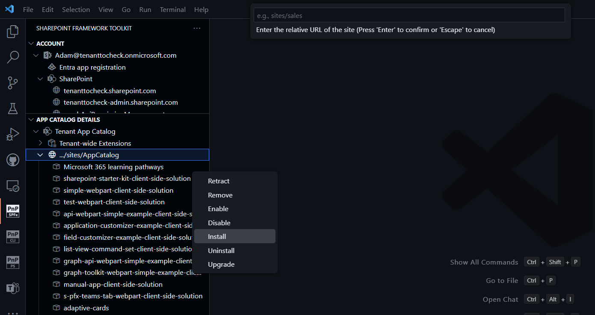
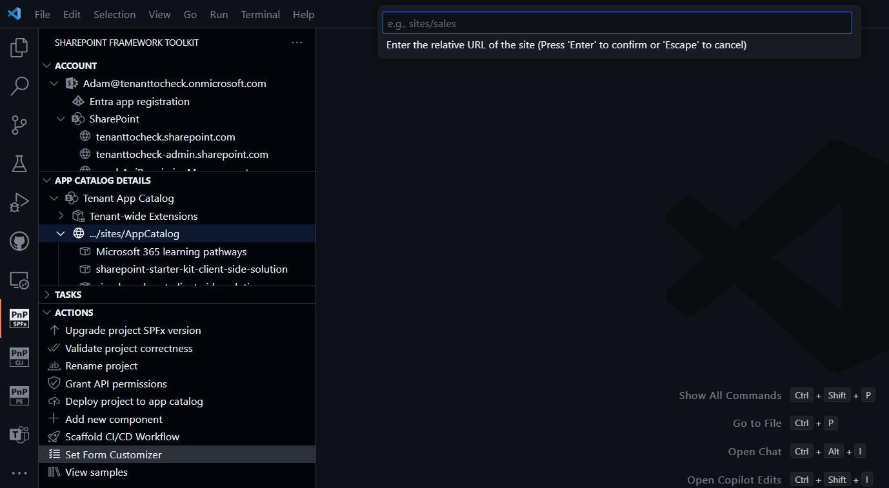
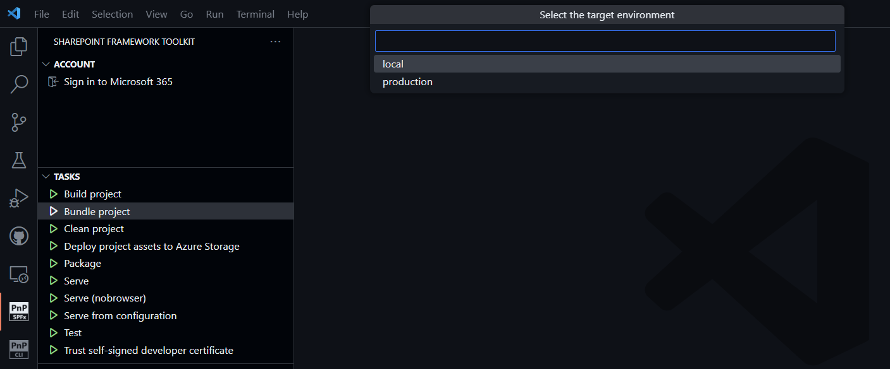
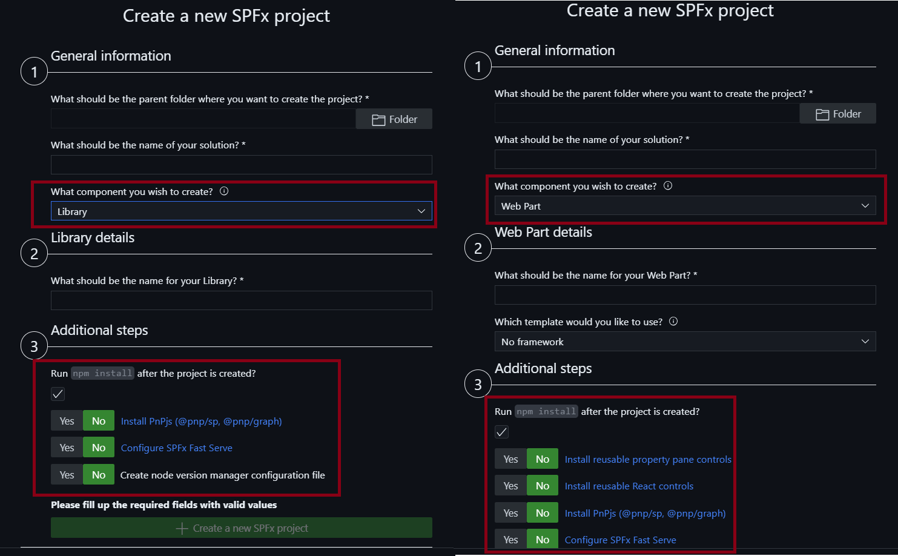
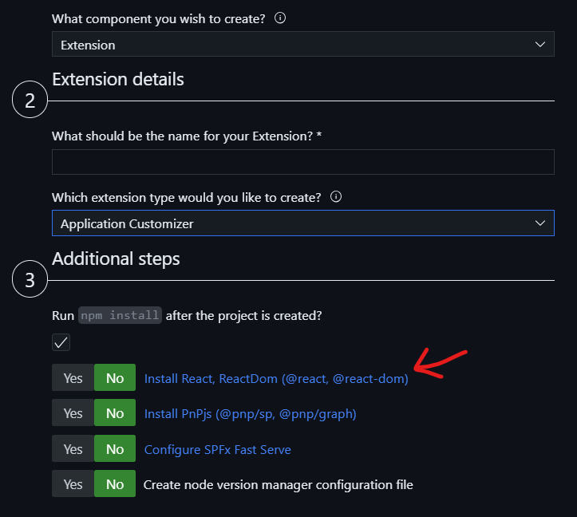
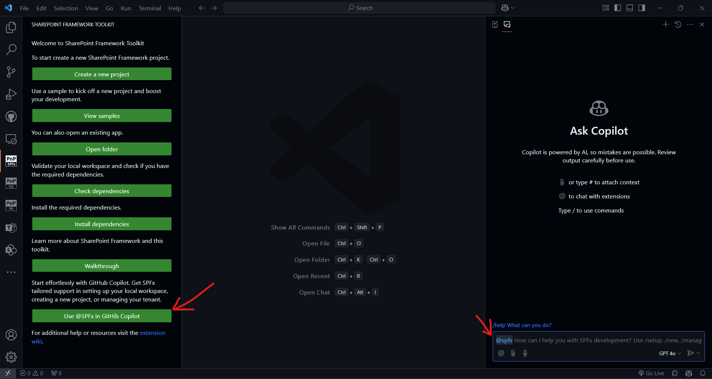

## 🗒️ Quick intro

[SharePoint Framework Toolkit](https://marketplace.visualstudio.com/items?itemName=m365pnp.viva-connections-toolkit) is a Visual Studio Code extension that aims to boost your productivity in developing and managing [SharePoint Framework solutions](https://learn.microsoft.com/sharepoint/dev/spfx/sharepoint-framework-overview?WT.mc_id=m365-15744-cxa) helping at every stage of your development flow, from setting up your development workspace to deploying a solution straight to your tenant without the need to leave VS Code, it even allows you to create a CI/CD pipeline to introduce automate deployment of your app and also comes along with a dedicated @spfx Copilot Chat participant who is your AI assistant grounded for SharePoint Framework development and now even has a new `/manage` chat command that will allow you to retrieve data from you SharePoint Online tenant using natural language.

Just check out the features list 👇 it's a looot 🤯.

Sounds cool 😎? Let's see some new enhancements we added in this minor release

## More management capabilities - install and uninstall SPFx packages directly from VS Code

In the last couple of releases, we've been improving the management capabilities of the SPFx Toolkit and in this release, we added the ability to install and uninstall SPFx apps to any site directly from VS Code. This will allow you to manage your SPFx packages directly in the flow of your development process. With this capability now you can bundle, package, deploy, and now even install your app to a specific site all from VS Code.

To read more about SPFx Toolkit management capabilities check out our [wiki page about it](https://github.com/pnp/vscode-viva/wiki/5.3-Login-to-your-tenant-&-retrieve-environment-details#environment-details-and-manage-capabilities).

## Update new, edit, and view form to your SPFx form customizer using the new SPFx Toolkit Action

SPFx Toolkit actions are awesome boosters that will allow you to solve common developer or developer-related scenarios that you might have in seconds. To name a few, actions allow you to generate upgrade or validation reports of your project, generate a CI/CD pipeline for your project, rename your project, and now even set the form customizer of any form and any list on your tenant. Simply select the action, provide the site URL, list title, content type title, and then the GUIDs for each type of form you would like to modify and SPFx Toolkit will do the rest.

To read more about it, check out our [wiki](https://github.com/pnp/vscode-viva/wiki/5.5-Actions#set-form-customizer).

## Simplified gulp bundle and package-solution usage

In this release, we rethinked and refactored the gulp task section to make it smaller and more functional. In order to do that, we unified the bundle of local and production tasks into a single item and we did the same with package-solution tasks. Now those tasks will show an additional prompt to select the environment you want to bundle or package your solution for.

## Refactored SPFx scaffolding form to filter additional dependencies based on the selected project type

Improving current functionalities was a big part of this release and among a few things we improved we also refactored the SPFx scaffolding form to filter additional dependencies based on the selected project type or extension type. This will help you pick the right dependencies or additional setup that is valid for the project type you selected. Till now all additional dependencies were shown for all project types which was a bit confusing and could lead to making bad choices like installing PnP Reusable Property Pane Controls for an SPFx Command Set project, which makes no sense.

Besides that, we added a new additional dependency which is available only for Application Customizers and allows you to install React and ReactDom. This was done in order to address the feed we noticed that a lot of the time the application customizers project was created to present some kind of additional UI in a popup or modal.

## Improvements done to SPFx Toolkit GitHub Copilot Chat participant

SPFx Toolkit comes along with a dedicated @spfx Copilot Chat participant who is your AI assistant grounded for SharePoint Framework development. In this, we added minor tweaks that allow better error handling by providing you with a better response to what might have gone wrong. We also added a new option in the welcome view so that it will be easier for you to start a conversation with the SPFx Toolkit GitHub Copilot Chat participant from the very beginning.

Visit our wiki to learn more about the [SPFx Toolkit GitHub Copilot Chat participant](https://github.com/pnp/vscode-viva/wiki/8.-SPFx-Toolkit-GitHub-Chat-Participant) and its capabilities.

## 👏 You ROCK 🤩

This release would not have been possible without the help of some really awesome folks who stepped in and joined our journey in creating the best-in-class SharePoint Framework tooling in the world. We would like to express our huge gratitude and shout out to:

- [Nishkalank Bezawada](https://github.com/NishkalankBezawada)
- [Ervin Gayle](https://github.com/ervingayle)
- [Saurabh Tripathi](https://github.com/Saurabh7019)
- [Nico De Cleyre](https://github.com/nicodecleyre)

## 🗺️ Future roadmap

We don't plan to stop, we are already thinking of more awesome features we plan to deliver with v5 release. If you want to check what we are planning check out our [issues from this milestone](https://github.com/pnp/vscode-viva/milestone/6). Feedback is appreciated 👍.

## 👍 Power of the community

This extension would not have been possible if it hadn’t been for the awesome work done by the [Microsoft 365 & Power Platform Community](https://pnp.github.io/). Each sample gallery: SPFx web parts & extensions, and ACE samples & scenarios are all populated with the contributions done by the community. Many of the functionalities of the extension like upgrading, validating, and deploying your SPFx project, would not have been possible if it wasn’t for the [CLI for Microsoft 365](https://pnp.github.io/cli-microsoft365/) tool. I would like to thank all of our awesome contributors sincerely! Creating this extension would not have been possible if it weren’t for the enormous work done by the community. You all rock 🤩.

If you would like to participate, the community welcomes everybody who wants to build and share feedback around Microsoft 365 & Power Platform. Join one of our [community calls](https://pnp.github.io/#community) to get started and be sure to visit 👉 https://aka.ms/community/home.

## 🙋 Wanna help out?

Of course, we are open to contributions. If you would like to participate do not hesitate to visit our [GitHub repo](https://github.com/pnp/vscode-viva) and start a discussion or engage in one of the many issues we have. We have many issues that are just ready to be taken. Please follow our [contribution guidelines](https://github.com/pnp/vscode-viva/blob/main/contributing.md) before you start.
Feedback (positive or negative) is also more than welcome.

## 🔗 Resources

- [Download SharePoint Framework Toolkit at VS Code Marketplace](https://marketplace.visualstudio.com/items?itemName=m365pnp.viva-connections-toolkit)
- [SPFx Toolkit GitHub repo](https://github.com/pnp/vscode-viva)
- [Microsoft 365 & Power Platform Community](https://pnp.github.io/#home)
- [Join the Microsoft 365 & Power Platform Community Discord Server](https://discord.gg/YtYrav2VGW)
- [SPFx Toolkit Wiki]( https://github.com/pnp/vscode-viva/wiki)
- [Join the Microsoft 365 Developer Program]( https://developer.microsoft.com/en-us/microsoft-365/dev-program)
- [CLI for Microsoft 365](https://pnp.github.io/cli-microsoft365/)
- [Sample Solution Gallery]( https://adoption.microsoft.com/en-us/sample-solution-gallery/)
