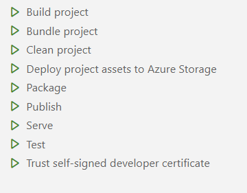
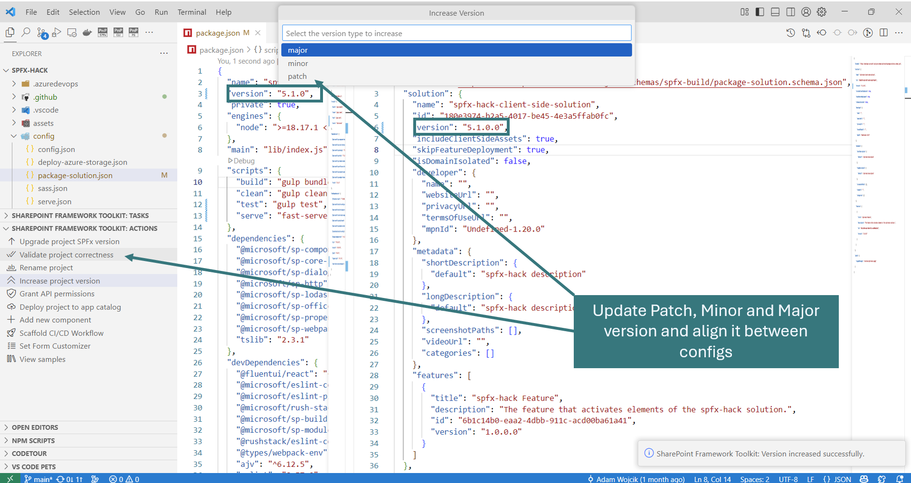
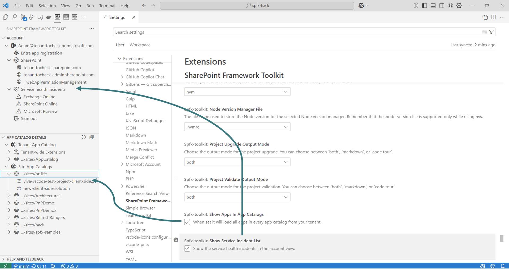

## 🗒️ Quick intro

[SharePoint Framework Toolkit](https://marketplace.visualstudio.com/items?itemName=m365pnp.viva-connections-toolkit) is a Visual Studio Code extension that aims to boost your productivity in developing and managing [SharePoint Framework solutions](https://learn.microsoft.com/sharepoint/dev/spfx/sharepoint-framework-overview?WT.mc_id=m365-15744-cxa) helping at every stage of your development flow, from setting up your development workspace to deploying a solution straight to your tenant without the need to leave VS Code, it even allows you to create a CI/CD pipeline to introduce automate deployment of your app and also comes along with a dedicated @spfx Copilot Chat participant who is your AI assistant grounded for SharePoint Framework development.

Just check out the features list 👇 it's a looot 🤯.

Sounds cool 😎? Let's see some new enhancements we added in this minor release

## Gulp task improvements

In this release, we did a bit of housekeeping in the gulp tasks structure. The first thing we updated is getting rid of all the separate serve tasks and combine them into a single `serve` task. When used, it will first scan your SPFx project for additional serve configuration and then show a prompt if you want to just run `serve` or maybe with no browser option, or maybe with one of the available configurations. This makes the list of gulp tasks smaller and cleaner. 

We also added a new `publish` task which is a combination of `gulp bundle` and `gulp package-solution` tasks. Combining those into a single tasks seems very natural and helpful, as usually we do both of them one by one, so why click twice if you can do it once 🙂.

## Increase and align Major, Minor, and Patch versioning of your SPFx solution

SPFx project structure is a bit strange. Versioning is one of those things. Like every other Node.js project, we have a `package.json` that has it's own versioning. Additionally, we also have the `package-solution.json` which is a SPFx config file in which we specify the version of the SPFx package, this is then present in the App Catalog. On top of that, if your SPFx project is part of the Teams Toolkit solution to extend a tab in Teams, you now also get an additional `packge.json` file which is part of the Teams Toolkit project. All this may produce a versioning hell, that is why in this release we added a feature that will bring a solution to this problem. 

This new action will allow you to increase the project major, minor, or patch version and will also align all the versions between all of those package json config files. This is a simple but perfect feature to increase productivity and save time.

## Refactored settings

In this release, we also refactored the extension settings, making them more usable. We modified the setting of show/hide tenant-wide extension list to show/hide all apps present for every app catalog you have on your tenant. This allows you to turn on and off the things you find useful and hide the things that distract you.

## 👏 You ROCK 🤩

This release would not have been possible without the help of some really awesome folks who stepped in and joined our journey in creating the best-in-class SharePoint Framework tooling in the world. We would like to express our huge gratitude and shout out to:

- [Nishkalank Bezawada](https://github.com/NishkalankBezawada)
- [Ervin Gayle](https://github.com/ervingayle)
- [Saurabh Tripathi](https://github.com/Saurabh7019)
- [Nico De Cleyre](https://github.com/nicodecleyre)

## 🗺️ Future roadmap

We don't plan to stop, we are already thinking of more awesome features we plan to deliver with v5 release. If you want to check what we are planning, check out our [issues from this milestone](https://github.com/pnp/vscode-viva/milestone/6). Feedback is appreciated 👍.

## 👍 Power of the community

This extension would not have been possible if it hadn’t been for the awesome work done by the [Microsoft 365 & Power Platform Community](https://pnp.github.io/). Each sample gallery: SPFx web parts & extensions, and ACE samples & scenarios, is populated with the contributions made by the community. Many of the functionalities of the extension, like upgrading, validating, and deploying your SPFx project, would not have been possible if it weren’t for the [CLI for Microsoft 365](https://pnp.github.io/cli-microsoft365/) tool. I would like to thank all of our awesome contributors sincerely! Creating this extension would not have been possible if it weren’t for the enormous work done by the community. You all rock 🤩.

If you would like to participate, the community welcomes everybody who wants to build and share feedback around Microsoft 365 & Power Platform. Join one of our [community calls](https://pnp.github.io/#community) to get started and be sure to visit 👉 https://aka.ms/community/home.

## 🙋 Wanna help out?

Of course, we are open to contributions. If you would like to participate, do not hesitate to visit our [GitHub repo](https://github.com/pnp/vscode-viva) and start a discussion or engage in one of the many issues we have. We have many issues that are just ready to be taken. Please follow our [contribution guidelines](https://github.com/pnp/vscode-viva/blob/main/contributing.md) before you start.
Feedback (positive or negative) is also more than welcome.

## 🔗 Resources

- [Download SharePoint Framework Toolkit at VS Code Marketplace](https://marketplace.visualstudio.com/items?itemName=m365pnp.viva-connections-toolkit)
- [SPFx Toolkit GitHub repo](https://github.com/pnp/vscode-viva)
- [Microsoft 365 & Power Platform Community](https://pnp.github.io/#home)
- [Join the Microsoft 365 & Power Platform Community Discord Server](https://discord.gg/YtYrav2VGW)
- [SPFx Toolkit Wiki]( https://github.com/pnp/vscode-viva/wiki)
- [Join the Microsoft 365 Developer Program]( https://developer.microsoft.com/en-us/microsoft-365/dev-program)
- [CLI for Microsoft 365](https://pnp.github.io/cli-microsoft365/)
- [Sample Solution Gallery]( https://adoption.microsoft.com/en-us/sample-solution-gallery/)
