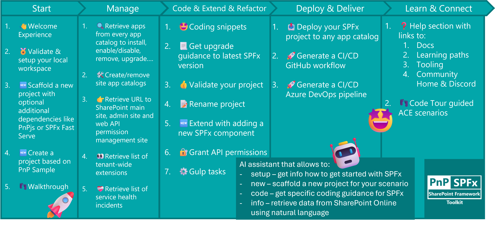

## 🗒️ Quick intro

[SharePoint Framework Toolkit](https://marketplace.visualstudio.com/items?itemName=m365pnp.viva-connections-toolkit) is a Visual Studio Code extension that aims to boost your productivity in developing and managing [SharePoint Framework solutions](https://learn.microsoft.com/sharepoint/dev/spfx/sharepoint-framework-overview?WT.mc_id=m365-15744-cxa) helping at every stage of your development flow, from setting up your development workspace to deploying a solution straight to your tenant without the need to leave VS Code, it even allows you to create a CI/CD pipeline to introduce automate deployment of your app and also comes along with AI capabilities which will allow you to manage your SharePoint Online tenant straight from GitHub Copilot chat extension.

Just check out the features list 👇 it's a looot 🤯.

Sounds cool 😎? Let's see some new enhancements we added in this minor release

##  Language model tools for GitHub Copilot agent mode

Every SPFx solution, sooner or later, will need some SharePoint resources like a site, page, list, content types, items etc.

Imagine being able to create them without stepping out of VS Code 🤯!

That is exactly why we took the first steps to make this happen with the help of GitHub Agent mode. SPFx Toolkit now comes along with language model tools that you may use directly from within GitHub Copilot chat extension in agent mode.

Based on your prompt, GitHub Copilot will figure out the best tool that it may use to fulfill your prompt.

You may even chain multiple operations within a single prompt, as the agent mode is capable of executing multiple tasks that are required by your prompt.

We are only getting started, but we already see a bright future and many possibilities to reshape how developers will be able to scaffold or prep their solutions. Sky is the limit 🚀!

## Support for installing the correct Node.js version

No more guessing which Node.js version you need. The toolkit now provides direct links and guidance for installing the correct version, including tips for using NVM or NVS based on your OS.

## Default action for SPFx App is now "Install"

What's the first thing you would do with a SPFx app present in the app catalog? Let me guess: install. Right?

That is exactly why we reordered actions present in each SPFx app instance, making the `install` action as default visible after you hover the SPFx app item on the list. The rest of the actions like: deploy, upgrade, enable, disable, etc. are present under `...`.

## `/manage` is now `/info`

The `/manage` chat command has been renamed to `/info` to better reflect its purpose: retrieving information from your SharePoint Online tenant.
Heads up: this change will also be reflected in the updated wiki guidance.

To read more about it, check out our [wiki](https://pnp.github.io/vscode-viva/guides/ai-capabilities/#info).

## Adds Gulp Operations to VS Code Extension Commands

You can now run all major gulp tasks directly from the command palette. This includes:

- build
- clean
- serve
- test
- trust-dev-cert
- deploy-azure-storage

No more jumping to the terminal, just run what you need, when you need it.

## Add tenant app catalog & add/remove site app catalog

Managing app catalogs is a crucial part of SharePoint development, and with this release, the SPFx Toolkit makes it easier than ever. Previously, setting up a tenant app catalog or managing site app catalogs required navigating through the SharePoint admin center, which could be time-consuming and sometimes confusing, especially if you’re working across multiple tenants or sites.

Now, you can perform these actions directly from within Visual Studio Code using the toolkit:

- **Add a tenant app catalog:** If your tenant doesn’t already have an app catalog, you can create one with just a few clicks where the toolkit will guide you through the process.
- **Add a site app catalog:** Need to scope app deployment to a specific site collection? You can now add a site app catalog to any eligible site directly from the toolkit. This is especially useful for scenarios where you want to test or deploy solutions without affecting the entire tenant.
- **Remove a site app catalog:** If you no longer need a site app catalog, you can disable it just as easily. Note that this does not actually delete the app catalog, but instead disables it, making all apps from that app catalog unavailable for installation on the related site. The toolkit ensures that the process is safe and provides confirmation prompts to prevent accidental actions.

All these actions are available from the command palette and the toolkit’s UI, so you never have to leave your development environment. This streamlines your workflow, reduces context switching, and helps you stay focused on building great solutions.

## Align gulp task icons

We’ve aligned the icons for gulp tasks across the tree view and command palette for a more consistent visual experience.

## Smarter app install handling

We’ve improved how SPFx Toolkit handles app installations, especially when things don’t go as planned. If you try to install an app that’s already installed, the toolkit now detects it and suggests the next best step:
- Upgrade if it’s the same app but a newer version
- Remove if it’s a different app with the same version number

This update also introduces progress notifications for SPFx actions, so you’ll always know what’s happening behind the scenes.

## Housekeeping

Alongside our major improvements, we’ve made a few smaller refinements to keep everything running smoothly:
- Teams Toolkit → Microsoft 365 Agents Toolkit: All references have been updated, including code, documentation, and UI elements.
- Updated wiki link: The documentation wiki now points [to the new site]((https://pnp.github.io/vscode-viva/)). Don’t forget to update your bookmarks!
- Dependency updates: Most extension dependencies have been upgraded to their latest stable versions, including cleaned-up packages, precise version management, and an updated TypeScript v5.
- Bug fix for form customizer on root site: An issue preventing form customizer setup on the root site has been resolved, along with improved URL validation.
- Shortened command category names: The prefix “SharePoint Framework Toolkit” has been replaced with the more concise “SPFx Toolkit” for a cleaner and faster experience.
- Improved app management UI: Context menu actions that are only relevant there have been hidden from the command palette to reduce clutter.

## 👏 You ROCK 🤩

This release would not have been possible without the help of some really awesome folks who stepped in and joined our journey in creating the best-in-class SharePoint Framework tooling in the world. We would like to express our huge gratitude and shout out to:

- [Nirav Raval](https://github.com/nirav-raval)
- [Nishkalank Bezawada](https://github.com/NishkalankBezawada)
- [Adam Wójcik](https://github.com/Adam-it)
- [Saurabh Tripathi](https://github.com/Saurabh7019)
- [Nico De Cleyre](https://github.com/nicodecleyre)

## 🗺️ Future roadmap

We don't plan to stop, we are already thinking of more awesome features we plan to deliver with v5 release. If you want to check what we are planning, check out our [issues from this milestone](https://github.com/pnp/vscode-viva/milestone/6). Feedback is appreciated 👍.

## 👍 Power of the community

This extension would not have been possible if it hadn’t been for the awesome work done by the [Microsoft 365 & Power Platform Community](https://pnp.github.io/). Each sample gallery: SPFx web parts & extensions, and ACE samples & scenarios, is populated with the contributions made by the community. Many of the functionalities of the extension, like upgrading, validating, and deploying your SPFx project, would not have been possible if it weren’t for the [CLI for Microsoft 365](https://pnp.github.io/cli-microsoft365/) tool. I would like to thank all of our awesome contributors sincerely! Creating this extension would not have been possible if it weren’t for the enormous work done by the community. You all rock 🤩.

If you would like to participate, the community welcomes everybody who wants to build and share feedback around Microsoft 365 & Power Platform. Join one of our [community calls](https://pnp.github.io/#community) to get started and be sure to visit 👉 https://aka.ms/community/home.

## 🙋 Wanna help out?

Of course, we are open to contributions. If you would like to participate, do not hesitate to visit our [GitHub repo](https://github.com/pnp/vscode-viva) and start a discussion or engage in one of the many issues we have. We have many issues that are just ready to be taken. Please follow our [contribution guidelines](https://github.com/pnp/vscode-viva/blob/main/contributing.md) before you start.
Feedback (positive or negative) is also more than welcome.

## 🔗 Resources

- [Download SharePoint Framework Toolkit at VS Code Marketplace](https://marketplace.visualstudio.com/items?itemName=m365pnp.viva-connections-toolkit)
- [SPFx Toolkit GitHub repo](https://github.com/pnp/vscode-viva)
- [Microsoft 365 & Power Platform Community](https://pnp.github.io/#home)
- [Join the Microsoft 365 & Power Platform Community Discord Server](https://discord.gg/YtYrav2VGW)
- [SPFx Toolkit Wiki](https://pnp.github.io/vscode-viva/)
- [Join the Microsoft 365 Developer Program](https://developer.microsoft.com/en-us/microsoft-365/dev-program)
- [CLI for Microsoft 365](https://pnp.github.io/cli-microsoft365/)
- [Sample Solution Gallery]( https://adoption.microsoft.com/en-us/sample-solution-gallery/)
