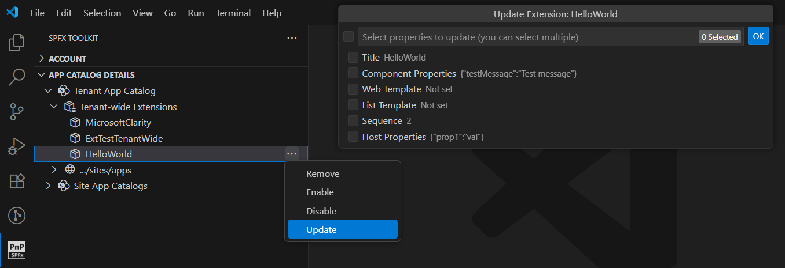

## 🗒️ Quick intro

[SharePoint Framework Toolkit](https://marketplace.visualstudio.com/items?itemName=m365pnp.viva-connections-toolkit) is a Visual Studio Code extension that aims to boost your productivity in developing and managing [SharePoint Framework solutions](https://learn.microsoft.com/sharepoint/dev/spfx/sharepoint-framework-overview?WT.mc_id=m365-15744-cxa) helping at every stage of your development flow, from setting up your development workspace to deploying a solution straight to your tenant without the need to leave VS Code, it even allows you to create a CI/CD pipeline to introduce automate deployment of your app and also comes along with AI capabilities which will allow you to manage your SharePoint Online tenant straight from GitHub Copilot chat extension.

Just check out the features list 👇 it's a looot 🤯.

Sounds cool 😎? Let's see some new enhancements we added in this minor release

## Welcome experience refactor

We have completely reimagined the Welcome experience in SPFx Toolkit to make it more useful, even when you are not in the context of an SPFx project.

Previously, the welcome screen looked and behaved very differently depending on whether you were inside or outside an SPFx project. 
When outside a project, it only offered a few actions like creating a new project, viewing samples, validating your local workspace, or installing dependencies. Most of the powerful capabilities such as signing in, building, deploying, and managing apps and extensions were only available inside a project.

Now, the welcome experience is more consistent across both scenarios. When inside an SPFx project, nothing changes. You still get the familiar views and actions you know. When you are outside an SPFx project, the welcome screen now shows:

- Account view - sign in, view admin links, and Service health incidents
- App Catalog view (once signed in) - manage your apps and tenant-wide extensions
- Tailored Actions view - only relevant actions
- Help and feedback view - always accessible

This refactor means you can now sign in, explore, and manage your tenant resources without opening an SPFx project folder. 

## New LLM tool for SPFx project upgrades

Every SPFx project eventually needs an upgrade to keep up with the latest features, security fixes, and tooling changes.

Now you can perform the entire upgrade process directly inside VS Code, without any manual steps.

That's exactly what our new SPFx Project Upgrade LLM Tool does!

Just ask GitHub Copilot Agent mode to upgrade your project.

From there, the tool:

- Analyzes your project to detect its current SPFx version
- Asks for confirmation before making changes
- Applies the necessary updates to packages, configuration files, and tooling
- Builds the project and checks for errors, guiding you through any required fixes

When you run the upgrade action again after a successful update, the tool confirms your project is on the latest version, highlights key modern features already included, and can optionally run a build to verify everything works as expected.

## Tenant-wide extensions - management capabilities

Managing tenant-wide extensions is an important part of SharePoint Framework administration, but it typically involves navigating the hidden list in the tenant app catalog and using the SharePoint UI to make changes.

The SPFx Toolkit now simplifies this process by bringing these capabilities directly into VS Code.

With this update, you can:

- Update extension details including Title, Component Properties, Web Template, List Template, Sequence, and Host Properties
  - The update action pre-fills input fields with the current values for quick edits
- Enable or disable extensions
- Remove extensions
  - Removing a tenant-wide extension does not remove the app itself, as it may contain other components
  
This enhancement makes it easier to view, edit, and manage your tenant-wide extensions from within your development environment.

## Set your preferred shell type for SPFx project upgrade

We have added a new setting in SPFx Toolkit that allows you to choose the shell type used when running the SPFx project upgrade action.

Previously, the upgrade process always defaulted to using `bash`, regardless of your local environment or personal preference. 

Now, you can select from `bash`, `PowerShell`, or `cmd` directly in the settings. This preference is then passed to the `Upgrade project SPFx version` action, ensuring the upgrade suggestions are generated in your chosen shell environment.

## `/code` removed - stay tuned for what's coming

The `/code` chat command has been removed. It offered limited value, worked only in ask mode, and required manual copy/paste of suggestions. With LLM Tools and MCP server capabilities advancing quickly, we are exploring ways to deliver richer, more context-aware coding experiences. Stay tuned for guidance and new capabilities in upcoming releases.

## Housekeeping

Alongside our major improvements, we have made a few smaller refinements to keep everything running smoothly:
- Updated Node.js version in workflows: All GitHub workflow files have been updated from Node.js v20 to v22 to stay current with the latest runtime and features.
- Integration tests for Gulp Tasks section: We have added a set of integration tests to validate the behavior of the Gulp Tasks section. These tests ensure that tasks have correct names, display the appropriate prompts, and trigger the terminal with the expected Gulp commands, without checking the actual build outcome.
- Integration tests for Help and Feedback section: A new suite of tests now verifies that all links in the Help and Feedback section are present, correctly named, and open the right destinations when clicked.
- Improved docs visibility: Updated the VS Code Marketplace homepage link and README to make documentation easier to find.

## 👏 You ROCK 🤩

This release would not have been possible without the help of some really awesome folks who stepped in and joined our journey in creating the best-in-class SharePoint Framework tooling in the world. We would like to express our huge gratitude and shout out to:

- [Nirav Raval](https://github.com/nirav-raval)
- [Adam Wójcik](https://github.com/Adam-it)
- [Nico De Cleyre](https://github.com/nicodecleyre)
- [Saurabh Tripathi](https://github.com/Saurabh7019)

## 🗺️ Future roadmap

We don't plan to stop, we are already thinking of more awesome features we plan to deliver with v5 release. If you want to check what we are planning, check out our [issues from this milestone](https://github.com/pnp/vscode-viva/milestone/6). Feedback is appreciated 👍.

## 👍 Power of the community

This extension would not have been possible if it hadn’t been for the awesome work done by the [Microsoft 365 & Power Platform Community](https://pnp.github.io/). Each sample gallery: SPFx web parts & extensions, and ACE samples & scenarios, is populated with the contributions made by the community. Many of the functionalities of the extension, like upgrading, validating, and deploying your SPFx project, would not have been possible if it weren’t for the [CLI for Microsoft 365](https://pnp.github.io/cli-microsoft365/) tool. I would like to thank all of our awesome contributors sincerely! Creating this extension would not have been possible if it weren’t for the enormous work done by the community. You all rock 🤩.

If you would like to participate, the community welcomes everybody who wants to build and share feedback around Microsoft 365 & Power Platform. Join one of our [community calls](https://pnp.github.io/#community) to get started and be sure to visit 👉 https://aka.ms/community/home.

## 🙋 Wanna help out?

Of course, we are open to contributions. If you would like to participate, do not hesitate to visit our [GitHub repo](https://github.com/pnp/vscode-viva) and start a discussion or engage in one of the many issues we have. We have many issues that are just ready to be taken. Please follow our [contribution guidelines](https://github.com/pnp/vscode-viva/blob/main/contributing.md) before you start.
Feedback (positive or negative) is also more than welcome.

## 🔗 Resources

- [Download SharePoint Framework Toolkit at VS Code Marketplace](https://marketplace.visualstudio.com/items?itemName=m365pnp.viva-connections-toolkit)
- [SPFx Toolkit GitHub repo](https://github.com/pnp/vscode-viva)
- [Microsoft 365 & Power Platform Community](https://pnp.github.io/#home)
- [Join the Microsoft 365 & Power Platform Community Discord Server](https://discord.gg/YtYrav2VGW)
- [SPFx Toolkit Wiki](https://pnp.github.io/vscode-viva/)
- [Join the Microsoft 365 Developer Program](https://developer.microsoft.com/en-us/microsoft-365/dev-program)
- [CLI for Microsoft 365](https://pnp.github.io/cli-microsoft365/)
- [Sample Solution Gallery]( https://adoption.microsoft.com/en-us/sample-solution-gallery/)
