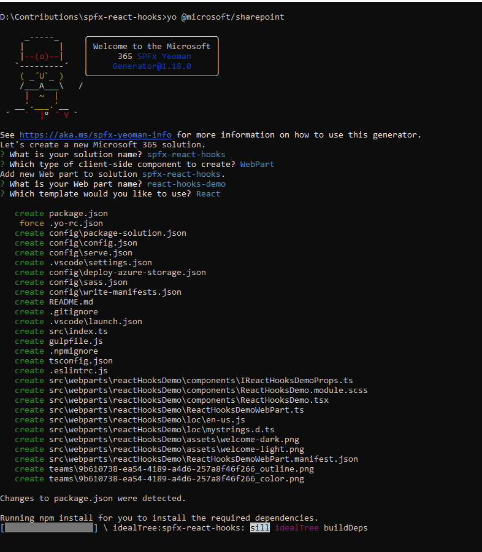

SPFx typically generates class component web parts by default. In this guide, we'll begin by exploring the process of transforming these class components into functional components. Once we've made this conversion, we can then delve into utilizing React hooks to enhance the functionality of our SharePoint Framework web parts.

## Why Choose SPFx with React?

Before we dive into the details, let's understand why SPFx with React is an excellent choice for building modern SharePoint web parts:

Responsive and Interactive UI: React allows you to create responsive and interactive user interfaces effortlessly. This is essential for delivering a seamless user experience in SharePoint.

Component Reusability: React's component-based architecture promotes code reusability. You can build self-contained components that can be used across different parts of your SharePoint site.

State Management with Hooks: React hooks, such as useState and useEffect, simplify state management and lifecycle management, making your code cleaner and more maintainable.

## Understanding React Hooks

` `Before hooks, state management was primarily handled in class components, making code harder to read and maintain. With hooks, functional components can now manage their state, effects, context, and more, making them more concise and easier to reason about.

## Implementation

**1. Create a SPFx project**

  - To create a new webpart, refer to [this](https://learn.microsoft.com/sharepoint/dev/spfx/web-parts/get-started/build-a-hello-world-web-part) article.

  - It will inquire with a series of questions, as depicted below:

  

**2. Convert a class component to a functional component**
   - Modify the declaration from a class to an object.
   - Delete the render() method
   - Exclude the usage of the 'this' keyword, considering it's a function component.
   - Export the object.

Let's see an example that illustrates the process of converting a class component into a functional component..

```tsx
//Class component
import * as React from 'react';
import styles from './ReactHooksDemo.module.scss';
import type { IReactHooksDemoProps } from './IReactHooksDemoProps';

export default class ReactHooksDemo extends React.Component<IReactHooksDemoProps, {}> {
  public render(): React.ReactElement<IReactHooksDemoProps> {
    const {
      hasTeamsContext,
    } = this.props;

    return (
        <section className={`${styles.reactHooksDemo} ${hasTeamsContext ? styles.teams : ''}`}>
        <div className={styles.welcome}>
          <h2>SPFx React Hook Example</h2>
        </div>
      </section>
    );
  }
}
```
To

```tsx
//Function component
import * as React from 'react';
import styles from './ReactHooksDemo.module.scss';
import type { IReactHooksDemoProps } from './IReactHooksDemoProps';

const ReactHooksDemo: React.FunctionComponent<IReactHooksDemoProps> = (props: IReactHooksDemoProps) => {

  const {
    hasTeamsContext,
  } = props;

  return (
    <section className={`${styles.reactHooksDemo} ${hasTeamsContext ? styles.teams : ''}`}>
      <div className={styles.welcome}>
        <h2>SPFx React Hook Example</h2>
      </div>
    </section>
  );
}

export default ReactHooksDemo;
```

**3. Explore usestate**
   - Utilizing state in a class component involves constructing a state object, which is subsequently modified through this.setState("new state"). However, when working with a functional component, we can employ React hooks, such as the useState() hook, to simplify the creation of a state variable and its associated update function. For more details, refer to [this](https://legacy.reactjs.org/docs/hooks-state.html).

```tsx
//Function component
import * as React from 'react';
import styles from './ReactHooksDemo.module.scss';
import type { IReactHooksDemoProps } from './IReactHooksDemoProps';

const ReactHooksDemo: React.FunctionComponent<IReactHooksDemoProps> = (props: IReactHooksDemoProps) => {

  const {
    hasTeamsContext,
  } = props;

  const [count, setCount] = useState(0);

  const incrementCount = () => {
    setCount(count + 1);
  };

  return (
    <section className={`${styles.reactHooksDemo} ${hasTeamsContext ? styles.teams : ''}`}>
      <div className={styles.welcome}>
        <h2>SPFx React Hook Example</h2>
        <p>Count: {count}</p>
        <button onClick={incrementCount}>Increment</button>
      </div>
    </section>
  );
}

export default ReactHooksDemo;
```
**4. Explore SPFx lifecycle in functional component**
   - **componentDidMount**: This lifecycle method is used for performing actions after the component is initially rendered. In a functional component, you can achieve this using the useEffect hook with an empty dependency array ([]).
   - **componentDidUpdate**:  To replicate the behavior of componentDidUpdate, you can include the specific state or prop variables in the dependency array of useEffect. This will make the effect run whenever those dependencies change.
   - **componentWillUnmount**:  To handle cleanup when the component is unmounted, return a function from the useEffect hook. This function will be called when the component is about to be removed from the DOM.

Let's delve into an example that demonstrates the SharePoint Framework's lifecycle using React hooks.

```tsx
//SPFx life cycle
import * as React from 'react';
import styles from './ReactHooksDemo.module.scss';
import type { IReactHooksDemoProps } from './IReactHooksDemoProps';

const ReactHooksDemo: React.FunctionComponent<IReactHooksDemoProps> = (props: IReactHooksDemoProps) => {

  const {
    hasTeamsContext,
  } = props;

  const [count, setCount] = useState(0);

  const incrementCount = () => {
    console.log("Increment button clicked");
    setCount(count + 1);
  };

  //componentDidMount
  useEffect(() => {
    console.log("componentDidMount called.");
  }, []);

  //componentDidUpdate
  useEffect(() => {
    console.log("componentDidUpdate called.");
  }, [count]);

  //componentWillUnmount
  useEffect(() => {
    return () => {
      console.log("componentWillUnmount called.");
    };
  }, [count]);

  return (
    <section className={`${styles.reactHooksDemo} ${hasTeamsContext ? styles.teams : ''}`}>
      <div className={styles.welcome}>
        <h2>SPFx React Hook Example</h2>
        <p>Count: {count}</p>
        <button onClick={incrementCount}>Increment</button>
      </div>
    </section>
  );
}
export default ReactHooksDemo;
```
## Conclusion
Building modern SharePoint web parts with React functional components and hooks offers a more efficient and maintainable development experience. React's component-based architecture, combined with hooks like useState and useEffect, empowers developers to create rich and interactive web parts that seamlessly integrate with SharePoint Online.
